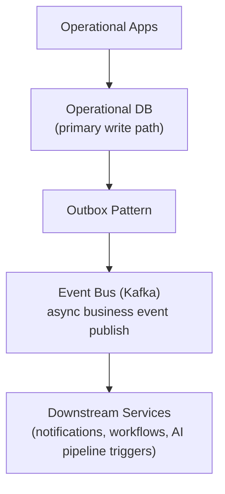
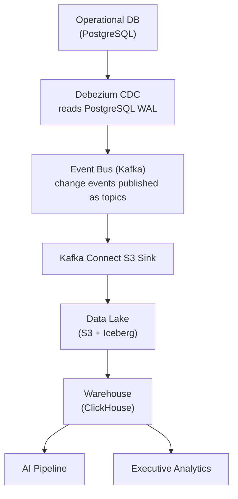

# 9. Data Architecture

## Table of Contents

- [9.1 Data Philosophy](#91-data-philosophy)
- [9.2 Core Data Domains](#92-core-data-domains)
- [9.3 Data Storage Architecture](#93-data-storage-architecture)
- [9.4 Data Flow](#94-data-flow)
- [9.5 Reporting and Analytics Architecture](#95-reporting-and-analytics-architecture)

---

## 9.1 Data Philosophy

The platform must become :

> The canonical operational dataset for construction lifecycle

Everything becomes structured operational data.

---

## 9.2 Core Data Domains

Master Data :

- Company
- Project
- Building
- Floor
- Room
- Unit
- Vendor
- Employee
- Equipment
- Material
- Customer
- Lead
- Opportunity
- Contact

Transactional Data :

- Purchase orders
- Vendor invoices
- Client billing
- AR receipts
- Payments
- Deliveries
- Site reports
- Inspections
- Progress updates
- Timesheets

Event Data :

- Material delivered
- Concrete poured
- Inspection failed
- Budget exceeded
- Worker checked in

Unstructured Data :

- Drawings
- PDFs
- Photos
- Videos
- Voice notes
- Contracts
- BIM files

AI Data :

- Embeddings
- Knowledge graph
- Semantic chunks
- Model features
- Predictions
- Risk signals

---

## 9.3 Data Storage Architecture

| Data Type | Storage |
| --- | --- |
| Relational transactions | PostgreSQL |
| Time-series telemetry | TimescaleDB |
| Search/index | OpenSearch |
| Blob storage | S3-compatible |
| Data lake format | Apache Iceberg (on S3) |
| Analytics warehouse | ClickHouse |
| Graph relations | Neo4j |
| Cache | Redis |
| Vector embeddings | pgvector (MVP) → Weaviate (at scale) |
| Streaming events | Kafka |

---

## 9.4 Data Flow

### Path 1 — Business Event Flow (Outbox Pattern)

### Path 2 — Data Replication to Data Lake (Debezium CDC)

Note : These are two independent data paths.

Path 1 (Outbox Pattern) publishes domain business events for real-time service
coordination. Debezium does NOT consume from Kafka — it reads directly from
the PostgreSQL WAL (Write-Ahead Log).

Path 2 (Debezium CDC) replicates row-level DB changes to the Data Lake independently
of whether a business event was published. This ensures full data fidelity in the lake
even for direct DB writes that bypass the business event bus.

Event Bus does NOT sit between App and Operational DB.
Writes go to DB first (Path 1). Path 2 operates as a separate CDC stream.

---

## 9.5 Reporting and Analytics Architecture

### Report Types

| Report | Frequency | Primary Consumer | Data Source |
| --- | --- | --- | --- |
| Daily site report | Daily | Site Engineer, PM | PostgreSQL (same-day ops) |
| Project cost summary | On-demand / weekly | PM, Finance | ClickHouse |
| Procurement status | On-demand | Procurement Officer | PostgreSQL |
| Executive portfolio dashboard | Real-time | Executive | ClickHouse + Redis cache |
| Cash flow forecast | Daily | Finance | ClickHouse + AI Pipeline |
| Safety compliance report | Weekly | Safety Officer | PostgreSQL |
| AI risk report | Continuous | Executive, PM | AI Pipeline output |

### Analytics Stack

- ClickHouse — OLAP queries for aggregation-heavy reports (cost, schedule, procurement)
- Redis — caches pre-computed dashboard metrics (TTL: 5 minutes for executive dashboard)
- OpenSearch — full-text search across site reports, inspections, documents
- Apache Iceberg — historical data lake for trend analysis beyond 90 days

### Dashboard Access

- Role-based dashboard views: each role (defined in 06-rbac-permission-matrix section 6.2) sees only the modules and metrics relevant to their function
- No external BI tool in MVP — dashboards are built directly in the Next.js frontend, querying the Analytics Service
- Post-MVP: evaluate embedded BI (e.g., Apache Superset self-hosted) for custom report builder capability

### Data Retention

- Operational DB (PostgreSQL): hot data, 2 years rolling
- Data Lake (S3 + Iceberg): cold archive, 10 years
- Time-series telemetry (TimescaleDB): 90 days hot, then compressed to Iceberg

---

## References

| ID | Title | Source |
| --- | --- | --- |
| [IEEE 830] | IEEE Recommended Practice for Software Requirements Specifications | IEEE Std 830-1998 |
| [PostgreSQL] | PostgreSQL Documentation | [postgresql.org/docs](https://www.postgresql.org/docs/) |
| [TimescaleDB] | TimescaleDB Documentation | [docs.timescale.com](https://docs.timescale.com/) |
| [Kafka] | Apache Kafka Documentation | [kafka.apache.org/documentation](https://kafka.apache.org/documentation/) |
| [Avro] | Apache Avro Specification | [avro.apache.org/docs/current/spec.html](https://avro.apache.org/docs/current/spec.html) |
| [Iceberg] | Apache Iceberg Table Specification | [iceberg.apache.org/spec](https://iceberg.apache.org/spec/) |
| [Neo4j] | Neo4j Graph Database Documentation | [neo4j.com/docs](https://neo4j.com/docs/) |
| [pgvector] | pgvector: Vector Similarity Search for Postgres | [github.com/pgvector/pgvector](https://github.com/pgvector/pgvector) |
| [MinIO] | MinIO Object Storage Documentation | [min.io/docs/minio/linux/index.html](https://min.io/docs/minio/linux/index.html) |

> 📎 See also: [04-tech-stack](04-tech-stack.md) · [10-construction-ontology](10-construction-ontology.md) · [11-database-schema](11-database-schema.md) · [15-event-driven-workflow](15-event-driven-workflow.md)
