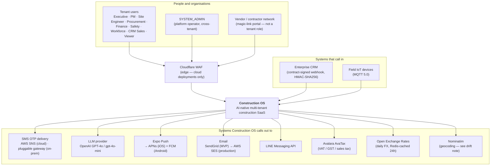
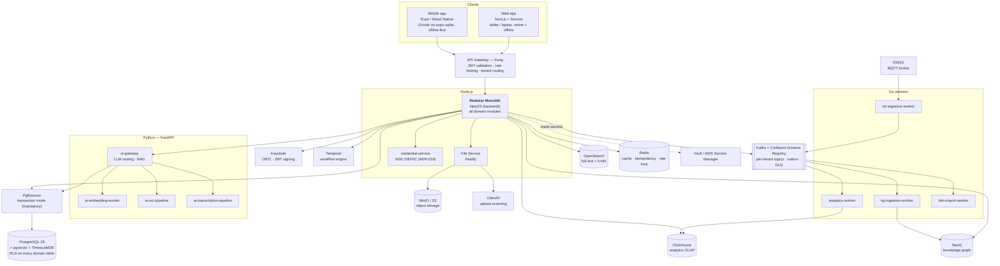

# Construction OS — Architecture

The maintained architecture views, the runtime topology, and the Architecture Decision Record index.

> **Authority.** `docs/specifications/` is the source of truth for every architecture decision;
> `context/00_master_construction_os.md` is the compiled execution view of those decisions. This
> folder holds the **diagrams** and the **ADRs** — it does not make decisions of its own. Where a
> diagram here disagrees with a spec, the spec wins and the diagram is the bug.

---

## C4 architecture views

Architecture is documented with the [C4 model](https://c4model.com/) (Context → Container →
Component → Code), per
[`specifications/03-system-design.md` §3.4](../specifications/03-system-design.md#34-c4-architecture-views).
Level 4 (Code) is not hand-drawn — it is read from the source.

**A structural change — a new container, a new external dependency — updates the relevant view in the
same PR.** That is the §3.4 gate, not a convention.

### Checking a diagram before you commit it

`@mermaid-js/mermaid-cli` is a root devDependency. It renders every ```mermaid block in a file and
fails on a syntax error, so a broken diagram is caught before it reaches a reviewer:

```bash
pnpm exec mmdc -i docs/architecture/README.md -o /tmp/check.md
```

It writes an `.svg` per chart next to the output file; the SVGs are throwaway — **do not commit
them**, the Markdown block is the source. This is a **local authoring tool, not a CI gate**
(product-owner decision 2026-08-07): it pulls puppeteer's Chromium, which is why `puppeteer: true`
sits in `pnpm-workspace.yaml` → `allowBuilds`.

Verified 2026-08-07: all 13 mermaid charts across the 10 Markdown files in this repo render clean.

> **These diagram sources moved here on 2026-08-07.** §3.4 requires that "diagram sources live in
> `architecture/`" and that they are "referenced from `architecture/README.md`"; until then both
> diagrams lived inside the spec file itself and this README was an empty file, so neither half of
> that gate was met. §3.4 now links here and the views below are the maintained originals. They are
> also **expanded** past what §3.4 carried: the containers and external systems added are listed
> under [What the moved diagrams gained](#what-the-moved-diagrams-gained), each with the source that
> establishes it.
>
> Line breaks inside node labels use `<br/>`. The other mermaid diagrams under
> `docs/specifications/` use `\n`, which only newer mermaid renders inside a quoted string; `<br/>`
> is supported everywhere. Deliberate — not a stray inconsistency to "fix" back.

### Level 1 — System Context



On-premise deployments have no Cloudflare edge — Kong provides rate limiting and the customer
supplies a WAF meeting OWASP CRS paranoia level 2
([`05-security-compliance.md` §5.5](../specifications/05-security-compliance.md),
[`08-enterprise-deployment.md` §8.7](../specifications/08-enterprise-deployment.md)).

### Level 2 — Container



**PgBouncer is not optional.** QM-18 prohibits connecting to PostgreSQL `5432` directly, prohibits
session mode and prohibits statement mode — transaction mode only, because `SET LOCAL
app.current_tenant_id` (the RLS mechanism) is transaction-scoped.

### Level 3 — Component

The component inventory of the monolith is the Core / Domain / Intelligence service decomposition in
[`03-system-design.md` §3.2](../specifications/03-system-design.md#32-service-decomposition). Each is
a NestJS **module**, not a separately deployed process. The concrete wiring — which module owns which
table, which consumer reads which topic, and the authentication flow — is in
[service-interaction.md](service-interaction.md).

### What the moved diagrams gained

Everything below is present in the running system and established by the source named; nothing here
was inferred from the diagram itself.

| Added to             | Element                                    | Established by                                                                    |
| -------------------- | ------------------------------------------ | --------------------------------------------------------------------------------- |
| Container            | PgBouncer                                  | QM-18 (mandatory pooler, transaction mode); `docker-compose.yml`                  |
| Container            | Temporal                                   | 00_master § WORKFLOW ENGINE SPEC; ADR-006                                         |
| Container            | Confluent Schema Registry                  | 00_master § Phase 8; QM-9 (`BACKWARD_TRANSITIVE`)                                 |
| Container            | Neo4j · OpenSearch · MinIO · ClamAV        | 00_master § Phase 9 / § Phase 13; `docker-compose.yml`                            |
| Container            | Vault / AWS Secrets Manager                | QM-4; ADR-013                                                                     |
| Container            | credential-service                         | ADR-019 (CredentialService promoted to MVP); on disk at `services/`               |
| Container            | iot-ingestion-worker                       | 00_master § EMQX rule ("EMQX → IoT Ingestion Worker → Kafka"); spec §33.8         |
| Container            | bim-import-worker · ai-transcription-pipeline | on disk at `services/`; drawn in [service-interaction.md](service-interaction.md) |
| Context              | Expo Push · SendGrid → AWS SES · LINE      | 00_master § Phase 20 (channels)                                                   |
| Context              | Avalara AvaTax                             | 00_master § Phase 5 / § Phase 7 (tax calculation)                                 |
| Context              | Open Exchange Rates                        | 00_master § FINANCIAL PRECISION SPEC                                              |
| Context              | Cloudflare WAF                             | QM-4; spec §5.5 + §8.7 (cloud deployments only)                                   |
| Context              | SYSTEM_ADMIN as a distinct actor           | spec §6.2 (cross-tenant, never provisioned to a tenant)                           |
| Context              | Nominatim                                  | [ADR-086](adr/086-self-hosted-nominatim-geocoding.md); `backend/src/modules/geo/geo.service.ts` |

---

## Runtime topology and cross-service rules

[**service-interaction.md**](service-interaction.md) is the deeper, maintained view: runtime
topology, data-store ownership, the Kafka topic → consumer mapping, cross-service call rules, the
authentication flow, and its own **Known gaps** section ("do not read this diagram as 'all of it
works'"). Read it before wiring anything cross-module.

---

## Known drift (recorded, not resolved here)

Both entries that stood here on 2026-08-07 have been resolved:

- **Four deployables missing from the Deployable Units table** — `credential-service`,
  `ai-transcription-pipeline`, `bim-import-worker` and `iot-ingestion-worker` existed under
  `services/` but were absent from `32-implementation-specifications.md` §32.2 and, following it,
  from `00_master_construction_os.md` § DEPLOYABLE UNITS. Both are now updated. Note that
  `ai-transcription-pipeline`'s _capability_ is specified (ADR-052) while its directory name was not.
- **Nominatim was unspecified** — now recorded as
  [ADR-086](adr/086-self-hosted-nominatim-geocoding.md), which documents the decision that had
  already shipped rather than making a new one.

`service-interaction.md` keeps its own **Known gaps** section for runtime behaviour that does not
work as drawn; that is a different list and still applies.

---

## Architecture Decision Records — [`adr/`](adr/)

86 ADRs plus the template. Format and process: QM-11. Before writing `(see ADR-NNN)` anywhere,
verify the file exists — Rule 29.

| ADR                                                                                                  | Title                                                                                     |
| ---------------------------------------------------------------------------------------------------- | ----------------------------------------------------------------------------------------- |
| [000](adr/000-template.md)                                                                           | Template                                                                                  |
| [001](adr/001-modular-monolith.md)                                                                   | Modular Monolith Architecture                                                             |
| [002](adr/002-schema-per-tenant.md)                                                                  | Tiered Tenant Isolation (superseded by ADR-008)                                           |
| [003](adr/003-keycloak-auth.md)                                                                      | Keycloak for Identity and Authorization                                                   |
| [004](adr/004-kafka-event-bus.md)                                                                    | Apache Kafka as Internal Event Bus                                                        |
| [005](adr/005-clickhouse-analytics.md)                                                               | ClickHouse for OLAP Analytics                                                             |
| [006](adr/006-temporal-workflows.md)                                                                 | Temporal for Long-running Workflows                                                       |
| [007](adr/007-k6-load-testing.md)                                                                    | k6 for Load Testing                                                                       |
| [008](adr/008-shared-db-tenant-id-rls.md)                                                            | Tenant Isolation — Shared DB + tenant_id + PostgreSQL RLS                                 |
| [009](adr/009-runtime-mapping.md)                                                                    | Runtime Mapping (Node.js / Go / Python per Service)                                       |
| [010](adr/010-kong-gateway.md)                                                                       | Kong Gateway for API Rate Limiting and Request Management                                 |
| [011](adr/011-codeql-semgrep-replace-sonarqube.md)                                                   | CodeQL + Semgrep CE + jscpd replace SonarQube                                             |
| [012](adr/012-argocd.md)                                                                             | ArgoCD for GitOps Continuous Delivery                                                     |
| [013](adr/013-secrets-management.md)                                                                 | Secrets management and delivery                                                           |
| [014](adr/014-cos-role-enum.md)                                                                      | CosRole Enum — Role Definitions and Implementation Sub-Roles                               |
| [015](adr/015-database-retry-helpers.md)                                                             | Database Retry Helper Pattern for Prisma Transient Errors                                 |
| [016](adr/016-unified-web-pwa-app.md)                                                                | Unified Next.js + PWA Web App (`apps/web/`)                                               |
| [017](adr/017-keycloak-dual-auth-path.md)                                                            | Keycloak Dual Authentication Path (Path A OTP, Path B OIDC)                               |
| [018](adr/018-prisma-as-orm.md)                                                                      | Prisma as ORM                                                                             |
| [019](adr/019-credentialservice-did-vc-mvp.md)                                                       | CredentialService (W3C DID/VC) promoted to MVP                                            |
| [020](adr/020-staging-branch-e2e-gate.md)                                                            | Staging branch as the E2E gate before production                                          |
| [021](adr/021-shared-go-coslib-module.md)                                                            | One shared Go module (`libs/go`)                                                          |
| [022](adr/022-procurement-tenant-wide-list-endpoints.md)                                             | Procurement tenant-wide list endpoints under `/api/v1/procurement/*`                      |
| [023](adr/023-finance-canonical-paths-ap-queue.md)                                                   | Finance canonical `/api/v1/finance/*` paths + AP queue                                    |
| [024](adr/024-ar-billing-cashflow-mvp.md)                                                            | AR Client Billing, AR Receipts, direct-method Cash Flow Forecast                          |
| [025](adr/025-site-ops-canonical-paths-inspection-approval.md)                                       | Site-ops canonical `/site/*` paths and inspection approval                                |
| [026](adr/026-task-completion-gates.md)                                                              | Task completion gates and the BOQ-dependency interpretation                               |
| [027](adr/027-safety-module-permits-compliance.md)                                                   | Safety module — incidents, permit approval, compliance                                    |
| [028](adr/028-tenant-settings.md)                                                                    | Tenant settings store                                                                     |
| [029](adr/029-crm-module-mvp.md)                                                                     | CRM module brought into MVP (Lead → Opportunity → Customer)                               |
| [030](adr/030-vendor-portal-mvp.md)                                                                  | Vendor Portal brought into MVP (two-tier external access)                                 |
| [031](adr/031-tenant-context-resolution-and-app-user-rls.md)                                         | Tenant context after auth + dedicated `app_user` role for RLS                             |
| [032](adr/032-timescaledb-colocated-then-split.md)                                                   | TimescaleDB co-located on primary PostgreSQL, split on volume trigger                     |
| [033](adr/033-ci-build-gate.md)                                                                      | CI Build Gate — `turbo run build` on every PR                                             |
| [034](adr/034-graceful-shutdown-resource-lifecycle.md)                                               | Graceful shutdown — close every long-lived handle                                         |
| [035](adr/035-app-layer-secret-encryption.md)                                                        | Application-layer encryption for secrets at rest (TOTP seeds)                             |
| [036](adr/036-compose-profiles-local-app-services.md)                                                | Docker Compose `apps` profile for local application services                              |
| [037](adr/037-kg-uniqueness-constraints-neo4j-community.md)                                          | KG composite UNIQUE constraints (Neo4j Community compatible)                              |
| [038](adr/038-mlflow-evidently-replace-wandb.md)                                                     | Replace Weights & Biases with MLflow + Evidently AI                                       |
| [039](adr/039-production-onprem-k8s-distro.md)                                                       | Production on-premise Kubernetes distribution (RKE2 profile:cis)                          |
| [040](adr/040-onprem-sms-gateway.md)                                                                 | On-premise SMS gateway for OTP delivery                                                   |
| [041](adr/041-prisma-7-driver-adapters.md)                                                           | Prisma 7 upgrade — node-postgres driver adapter                                           |
| [042](adr/042-nestjs-11-fastify-5.md)                                                                | NestJS 11 + Fastify 5 upgrade                                                              |
| [043](adr/043-next-16-react-19.md)                                                                   | Next.js 16 + React 19 upgrade (web)                                                       |
| [044](adr/044-otel-sdk-node-0219.md)                                                                 | OpenTelemetry JS SDK upgrade                                                              |
| [045](adr/045-wave-f-stateful-infra-upgrades.md)                                                     | Wave F — stateful infrastructure major upgrades                                           |
| [046](adr/046-expo-56-mobile.md)                                                                     | Expo SDK 56 mobile upgrade                                                                |
| [047](adr/047-serwist-turbopack-pwa.md)                                                              | Replace next-pwa with Serwist (Turbopack-compatible PWA)                                  |
| [048](adr/048-drizzle-expo-sqlite-offline-db.md)                                                     | Replace WatermelonDB with Drizzle ORM on expo-sqlite                                      |
| [049](adr/049-unleash-feature-flags.md)                                                              | Unleash feature flags, server-evaluated delivery                                          |
| [050](adr/050-mobile-path-b-login.md)                                                                | Mobile supports Path B (email/password) login via Keycloak OIDC                           |
| [051](adr/051-mobile-expo-crypto-uuid.md)                                                            | expo-crypto for client-generated UUIDs (offline sync idempotency)                         |
| [052](adr/052-mobile-voice-note-transcription.md)                                                    | Mobile voice-note capture → File Service → AI transcription                               |
| [053](adr/053-mobile-gesture-handler-taskcard.md)                                                    | react-native-gesture-handler for the TaskCard swipe                                       |
| [054](adr/054-device-trust.md)                                                                       | Device trust via hardware-bound keypair + server-side registry                            |
| [055](adr/055-universal-loading-component.md)                                                        | Universal loading component (`<LoadingState />`)                                          |
| [056](adr/056-photo-annotation.md)                                                                   | Photo annotation — engines, stroke model, conflict strategy                               |
| [057](adr/057-construction-full-flow-scope-additions.md)                                             | Construction full-flow scope additions                                                    |
| [058](adr/058-client-contract-signing-mechanism.md)                                                  | Client contract signing (PKI/VC e-signature, bilateral)                                   |
| [059](adr/059-variation-order-claims.md)                                                             | Variation Order / Change Order / Claims (post-MVP)                                        |
| [060](adr/060-inventory-warehouse-wms.md)                                                            | Inventory / Warehouse Management (post-MVP)                                               |
| [061](adr/061-rakaklang-central-pricing.md)                                                          | ราคากลาง central pricing as a BOQ price source (post-MVP)                                 |
| [062](adr/062-egp-public-procurement.md)                                                             | e-GP public procurement integration (post-MVP)                                            |
| [063](adr/063-bank-guarantees-bonds.md)                                                              | Bank guarantees / bonds (post-MVP)                                                        |
| [064](adr/064-building-permit-license.md)                                                            | Building permit & license management (post-MVP)                                           |
| [065](adr/065-project-risk-register.md)                                                              | Project risk register (post-MVP)                                                          |
| [066](adr/066-site-instruction-minutes-correspondence.md)                                            | Site instruction / meeting minutes / correspondence log (post-MVP)                        |
| [067](adr/067-mfa-enforcement-keycloak-native.md)                                                    | MFA enforcement — Keycloak-native OTP + backend `acr` gate                                |
| [068](adr/068-cross-platform-ui-logic-package.md)                                                    | `@cos/ui-logic` — zero-dependency package shared by web and mobile                        |
| [069](adr/069-issue-human-readable-numbering.md)                                                     | Human-readable issue numbers (`ISS-<year>-<seq>`)                                         |
| [070](adr/070-project-phases.md)                                                                     | Project phases (execution-stage tracking)                                                 |
| [071](adr/071-site-engineer-home-visual-exception.md)                                                | §32.7 visual exception for the SITE_ENGINEER mobile home                                  |
| [072](adr/072-project-work-hours.md)                                                                 | Project standard working hours                                                            |
| [073](adr/073-voice-command-intents.md)                                                              | Voice-command intents for the SITE_ENGINEER home FAB                                      |
| [074](adr/074-mobile-mfa-enrollment-keycloak-aia.md)                                                 | Mobile MFA enrollment via Keycloak Application-Initiated Action                           |
| [075](adr/075-tail-based-trace-sampling.md)                                                          | Trace sampling is tail-based at the Collector only                                        |
| [076](adr/076-client-side-form-validation.md)                                                        | Client-side form validation via zod/mini + react-hook-form                                |
| [077](adr/077-authoritative-role-and-active-check-per-request.md)                                    | Resolve `is_active` and effective role from the DB on every request                       |
| [078](adr/078-pdpa-data-export-and-step-up-otp.md)                                                   | PDPA data export via async job, gated by step-up OTP                                      |
| [079](adr/079-platform-wide-consent.md)                                                              | Platform-wide PDPA consent — per-purpose records                                          |
| [080](adr/080-geoip-enrichment-and-behavioral-context.md)                                            | Network-origin enrichment — self-hosted GeoLite2, derived at read time                    |
| [081](adr/081-device-trust-model.md)                                                                 | DeviceTrustModel — promoted only by beating a rule-based baseline                         |
| [082](adr/082-device-attestation-v2-accepted.md)                                                     | Device attestation v2 (Play Integrity / App Attest) accepted                              |
| [083](adr/083-security-patch-level-source.md)                                                        | Where the Security Patch Level row gets its value                                         |
| [084](adr/084-session-and-timestamp-transparency-screens.md)                                         | Session-metadata and timestamp transparency screens                                       |
| [085](adr/085-mockup-deviations-navigation-rows-and-implemented-structure.md)                        | Mockup authority — style yes, composition no                                              |
| [086](adr/086-self-hosted-nominatim-geocoding.md)                                                    | Self-hosted Nominatim for reverse geocoding                                               |

> 📎 [`specifications/03-system-design.md`](../specifications/03-system-design.md) (system design and
> the C4 gate) · [`specifications/04-tech-stack.md`](../specifications/04-tech-stack.md) (versions) ·
> [`context/00_master_construction_os.md`](../../context/00_master_construction_os.md) (compiled
> execution view: deployable units, event contracts, phase commands).
