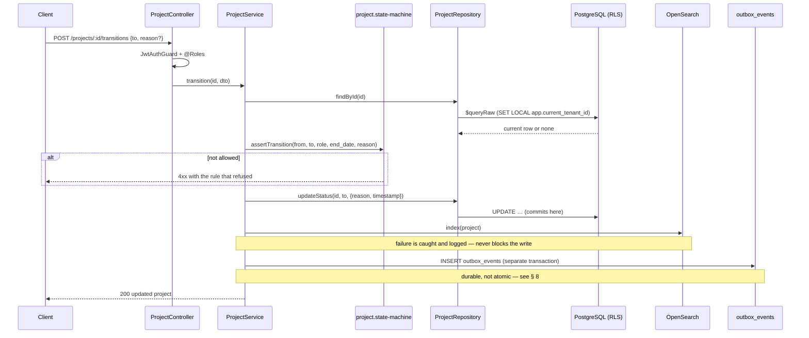

# Phase 3 — Project Service

> Compiled from `context/00_master_construction_os.md` § PHASE 3 — PROJECT SERVICE COMMAND and the
> specification sections cited inline. `docs/specifications/` wins on any conflict; see
> [README § Authority](README.md).

---

## 1. Overview & goals

The project domain service — the first phase that produces business behaviour, and the entity every
later domain hangs off (`00_master` § Phase Register: objective "project domain service", effort
**M**, deps `Ph2, Ph8`, risk `R-02`).

Phase 3 owns three things that are easy to conflate:

1. **The project record and its lifecycle** — a five-state machine whose transitions are role-gated
   and reason-bearing.
2. **The physical hierarchy** — building → floor → room, plus structures and units. Reference data:
   no events, no state machine, read by anyone in the tenant.
3. **Membership** — who is on a project, which is what scopes most later authorisation.

Exit condition: "project APIs pass the isolation-test suite; RLS enforced"
(`00_master` § Phase Register, Phase 3 exit).

---

## 2. Scope

### In scope

- `projects`, `project_members`, `project_documents`
- Spatial hierarchy: `buildings`, `floors`, `rooms`, `structures`, `units`
- `assets` — the handover/warranty domain
- The project status state machine and its transition endpoint
- Full-text search over `project_name` / `project_code`
- Four Kafka events on the project lifecycle

### Out of scope

- Tasks — Phase 6, although `projects.tasks` lands in this schema and carries the nullable
  `floor_id` / `room_id` FKs this phase's hierarchy exists to support
- BOQ quantities from BIM — Phase 4 re-enters the same `BIMIntegration` interface at a second entry
  point (`00_master` § PHASE 3 COMMAND → BIMIntegration)
- The Neo4j mirror of the spatial hierarchy — Phase 13
- CRM and BIM **behaviour** — this phase generates stubs only, implemented when a tenant triggers them

---

## 3. Architecture

The `project` module is one of the 23 backend modules in the C4 Level 3 view
([`architecture/README.md`](../README.md) § Level 3 — Component). It is a NestJS module
inside the modular monolith, not a separate deployable.

Internally it is not one service but nine, each with the same controller → service → repository
triple:

```text
modules/project/
  project.{controller,service,repository,module,state-machine}.ts   — the project record + lifecycle
  buildings/ floors/ rooms/ structures/ units/                      — spatial hierarchy (reference data)
  assets/                                                           — handover / warranty
  phases/                                                           — ADR-070, added 2026-07-26
  risks/                                                            — ADR-065, added 2026-07-26
  ep/{crm,bim}-integration.stub.ts                                  — enterprise-platform stubs
  shared/parent-existence.ts                                        — the nested-route guard
```

`shared/parent-existence.ts` is the piece worth naming: every nested create/list route
(`/projects/:projectId/buildings`, `/buildings/:buildingId/floors`, …) must prove the parent exists
**within the caller's tenant** before it acts, or a cross-tenant id would produce a 404-vs-403 oracle.
It is factored out once rather than repeated in nine repositories.

---

## 4. Data model

Twelve tables in the `projects` schema. Nine are named in the Phase 3 command; `project_phases`
(ADR-070) and `project_risk` (ADR-065) arrived later; `tasks` belongs to Phase 6 but is hosted here.

| Table               | Source                  | Note                                                            |
| ------------------- | ----------------------- | --------------------------------------------------------------- |
| `projects`          | Phase 3 command         | `UNIQUE (tenant_id, project_code)`, `INDEX (tenant_id, status)` |
| `project_members`   | Phase 3 command         | `UNIQUE (project_id, user_id)`; `role` reuses the Phase 2 enum  |
| `project_documents` | Phase 3 command         | `file_id` is a loose reference — **no FK** to File Service      |
| `buildings`         | §10.2 / §11.2           | `INDEX (tenant_id, project_id)`                                 |
| `floors`            | §11.2                   | child of `buildings`                                            |
| `rooms`             | §11.2                   | child of `floors`                                               |
| `structures`        | §11.2                   | `ENUM('column','beam','slab','wall')`                           |
| `units`             | §11.2, added 2026-07-05 | `project_id` derived from the parent building                   |
| `assets`            | §11.2                   | handover date, warranty expiry, maintenance status              |
| `project_phases`    | §11 (ADR-070)           | `uq_project_phases_seq` on `(tenant_id, project_id, seq)`       |
| `project_risk`      | ADR-065                 | 5×5 likelihood × impact scoring                                 |
| `tasks`             | Phase 6                 | nullable `floor_id` / `room_id` — the LOCATED_IN edge in the KG |

**These tables are not Prisma models, and that is deliberate.** `backend/prisma/schema.prisma`
declares only `schemas = ["platform", "files"]` and holds 17 models, none of them a project entity.
Domain schemas are raw-SQL migrations reached through `$queryRaw` on `TenantPrismaService` —
`11-database-schema` states the convention explicitly at §11.6 ("raw SQL, like the other domain
schemas — not Prisma-modelled"). All 13 domain repositories in `project`, `boq`, `procurement`,
`site-ops` and `finance` follow it without exception.

**A history note that explains a confusing migration.** `20260531000003_project_service` creates
`projects`, `project_members` and `project_documents` **unqualified**, and its own header says why:
they were "originally created in public schema (ADR-008)" and "moved to projects.\* schema by
migration 20260605000004 (ADR-008 refactor)". Reading the Phase 3 migration alone suggests the tables
are in `public`; they are not.

Fields added after the phase command, each with an establishing record:

| Field                                | Establishing record | Migration        |
| ------------------------------------ | ------------------- | ---------------- |
| `projects.estimated_completion_date` | —                   | `20260723000001` |
| `projects.work_hours_start` / `_end` | ADR-072             | `20260726000003` |

---

## 5. API contract

All routes carry the `api/v1` global prefix. Every one of the 9 core endpoints and all 6 nested CRUD
groups named in the phase command exists.

| Endpoint                                                            | Specified | Built | RBAC                                                             |
| ------------------------------------------------------------------- | --------- | ----- | ---------------------------------------------------------------- |
| `POST /projects`                                                    | ✅        | ✅    | `PROJECT_MANAGER`, `TENANT_ADMIN`                                |
| `GET /projects`                                                     | ✅        | ✅    | any authenticated tenant user                                    |
| `GET /projects/:id`                                                 | ✅        | ✅    | any authenticated tenant user                                    |
| `PATCH /projects/:id`                                               | ✅        | ✅    | `PROJECT_MANAGER`, `TENANT_ADMIN`                                |
| `POST /projects/:id/transitions`                                    | ✅        | ✅    | per-transition — see § 9                                         |
| `POST /projects/:id/members`                                        | ✅        | ✅    | `PROJECT_MANAGER`, `TENANT_ADMIN`                                |
| `DELETE /projects/:id/members/:userId`                              | ✅        | ✅    | `PROJECT_MANAGER`, `TENANT_ADMIN`                                |
| `GET /projects/:id/members`                                         | ✅        | ✅    | any authenticated tenant user                                    |
| `GET /projects/:id/documents`                                       | ✅        | ✅    | any authenticated tenant user                                    |
| `GET /projects/mine`                                                | —         | ✅    | JWT-scoped, no role gate                                         |
| `GET /projects/user/:userId`                                        | —         | ✅    | `TENANT_ADMIN`                                                   |
| 5 routes × buildings / floors / rooms / structures / units / assets | ✅        | ✅    | read: any tenant user · write: `PROJECT_MANAGER`, `TENANT_ADMIN` |
| 3 routes — `project_phases`                                         | ADR-070   | ✅    | write: `PROJECT_MANAGER`, `TENANT_ADMIN`                         |
| 4 routes — `project_risk`                                           | ADR-065   | ✅    | raise: `+SITE_ENGINEER`                                          |

`GET /projects/mine` is referenced by ADR-055 (the universal loading component counts it as one of its
load steps). `GET /projects/user/:userId` appeared in no specification, ADR or master command until 2026-08-22,
when the product owner had both written into `14-api-architecture` §14.4 — see § 14 OQ-21.

Route-ordering detail worth keeping: `mine` and `user/:userId` are declared **before** `@Get(':id')`
so the literal segments are not captured as a UUID param. Both carry that reason as a code comment.

OpenAPI: `@ApiOperation` / `@ApiTags` decorators are present on all 9 controllers.

---

## 6. Events

Producer, via `EventOutboxService` (ADR-094) — never an inline Kafka publish:

| Event type                                    | Payload                                          | Trigger                   |
| --------------------------------------------- | ------------------------------------------------ | ------------------------- |
| `construction.project.created.v1`             | project fields                                   | `POST /projects`          |
| `construction.project.updated.v1`             | changed fields                                   | `PATCH /projects/:id`     |
| `construction.project.status_changed.v1`      | `{ project_id, from_status, to_status, reason }` | any transition            |
| `construction.project.archived.v1`            | `{ project_id }`                                 | transition to `COMPLETED` |
| `construction.project.risk_raised.v1`         | ADR-065                                          | risk created              |
| `construction.project.risk_status_changed.v1` | ADR-065                                          | risk status change        |

The four command-named events all exist, carrying the `construction.` domain prefix and `.v1` suffix
that §32.4's `{domain}.{entity}.{action}.v{N}` rule requires — the phase command writes them
unprefixed (`project.created`), which is the shorthand, not the wire name.

**`archived` is derived, not independent.** The command lists it as a separate event; the
implementation emits it as a second event _inside_ the `COMPLETED` transition, with the comment
"COMPLETED projects are considered archived for downstream consumers". There is no separate archive
operation, so a consumer sees `status_changed` and `archived` as a pair.

Consumer: `RisksConsumer` subscribes to `ai.risk_prediction.generated.v1` and turns a confident delay
forecast into an `AI_SUGGESTED` risk for human triage — see § 14 OQ-20 for why that is a finding.

---

## 7. Sequence / flows

The status transition, which is where this phase's rules concentrate:



Reference-data writes (buildings, floors, rooms, structures, units, assets) are the same shape minus
the state machine, the search index and the events: guard → parent-existence check → `$queryRaw`.

---

## 8. Failure modes & rollback

| Failure                                                             | Behaviour today                                            | Consequence                                        |
| ------------------------------------------------------------------- | ---------------------------------------------------------- | -------------------------------------------------- |
| Illegal transition requested                                        | `project.state-machine` refuses before any write           | No partial state; the refusal names the rule       |
| Transition missing a required reason                                | Refused — `ON_HOLD` and `CANCELLED` both demand one        | —                                                  |
| `ACTIVE → COMPLETED` with a future `end_date`                       | Refused                                                    | —                                                  |
| **OpenSearch index write fails**                                    | Caught, logged `opensearch.index.failed`, request succeeds | **Search index silently drifts from the database** |
| **Process dies after the UPDATE commits, before the outbox INSERT** | Event is lost                                              | Downstream never learns of the change              |
| Broker / Schema Registry down                                       | Outbox row persists; `OutboxPoller` retries until it lands | Recovered automatically                            |
| Cross-tenant id on a nested route                                   | `parent-existence` refuses using the tenant-scoped query   | No 404-vs-403 oracle                               |

Two of these deserve more than a table row.

**The search index had no reconciliation path — fixed 2026-08-22.** `indexProject` swallowed its
error by design, and the comment was right that "search index failure must not block the primary write
path". What was missing was the other half: no reindex job, backfill script or repair runbook existed
anywhere in `backend/src`, `scripts/` or `services/`, so a single OpenSearch blip removed a project
from search results permanently, with nothing but a `warn` line to say so. Indexing now happens in
`SearchIndexerConsumer` off the events this service already publishes, where a failure is retried
three times and then dead-lettered, and a topic replay rebuilds the index. See § 14 OQ-22.

**The outbox is durable, not atomic.** This is not specific to Phase 3 — it is the cross-cutting
property recorded in [phase-08 § 4](phase-08-event-infrastructure.md) and
[OQ-18](README.md#open-questions-register), which is now closed by amending the two specification
sentences that claimed otherwise. Phase 3 is simply the phase where it is most visible,
because a lost `status_changed` leaves Finance and Analytics reading a stale status with no signal
that they are wrong.

**Rollback:** every migration listed in § 4 has a paired rollback under `backend/prisma/rollbacks/`,
enforced by `scripts/ci/check-migration-rollbacks.mjs` (§9.7.1, §30.12).

---

## 9. Security

**Tenant isolation** is the phase's stated exit condition. Every repository reaches the database
through `TenantPrismaService.run()`, which issues `SET LOCAL app.current_tenant_id` inside the
transaction; RLS policies do the enforcing (ADR-008, `11-database-schema` §11 preamble). See
[README § Tenant isolation](README.md#tenant-isolation) for the full mechanism — it is not restated
per phase.

**Role gates**, counted from the decorators across the nine controllers:

| Guard                                                  | Count | Where                                      |
| ------------------------------------------------------ | ----- | ------------------------------------------ |
| `@UseGuards(JwtAuthGuard)`                             | 9     | one per controller                         |
| `@Roles(PROJECT_MANAGER, TENANT_ADMIN)`                | 27    | every write route across the hierarchy     |
| `@Roles(TENANT_ADMIN)`                                 | 1     | `GET /projects/user/:userId`               |
| `@Roles(PROJECT_MANAGER, SITE_ENGINEER, TENANT_ADMIN)` | 1     | raising a project risk (ADR-065 ownership) |

**Transition-level roles** are enforced in the state machine rather than the decorator, because they
differ per target state:

| Transition           | Required role                       |
| -------------------- | ----------------------------------- |
| `DRAFT → ACTIVE`     | `PROJECT_MANAGER` or `TENANT_ADMIN` |
| `ACTIVE → ON_HOLD`   | `PROJECT_MANAGER` or `TENANT_ADMIN` |
| `ON_HOLD → ACTIVE`   | `PROJECT_MANAGER` or `TENANT_ADMIN` |
| `ACTIVE → COMPLETED` | `TENANT_ADMIN` only                 |
| `* → CANCELLED`      | `TENANT_ADMIN` only                 |

The implementation matches the command exactly, including `COMPLETED` and `CANCELLED` as terminal
states with empty transition lists.

**SQL injection**: repositories use `$queryRaw` as a parameterised tagged template. The Phase 3
repository header states the rule — "never raw string interpolation".

---

## 10. Observability

Structured logging via `createLogger` in all nine services plus both integration stubs and the risk
consumer. The transition path logs `project.transition` with `project_id`, `from`, `to`, `actor_id`
and `correlation_id` — the correlation id is what ties the API call to the outbox row and the
eventual Kafka delivery.

Baseline metrics, tracing and the alert catalogue are cross-cutting; see
[README § Observability baseline](README.md#observability-baseline) and
`31-monitoring-observability`.

---

## 11. Testing & acceptance

31 spec files under `backend/src/modules/project`, covering controller, service and repository for
each of the nine sub-domains plus `project.state-machine.spec.ts`, `parent-existence.spec.ts`,
`ai-risk-mapping.spec.ts` and `risks.consumer.spec.ts`.

The phase command asks for two categories specifically:

| Required                                   | Present                                                        |
| ------------------------------------------ | -------------------------------------------------------------- |
| Unit tests: state machine, business rules  | `project.state-machine.spec.ts` + per-service specs            |
| Integration tests: full CRUD + transitions | see `30-testing-strategy` § integration suite — not per-module |

Acceptance is the Phase Register exit: "project APIs pass the isolation-test suite; RLS enforced."

---

## 12. Implementation status

Verified on **2026-08-22** against this working tree (Rule 36 — commands run, output summarised).

| Generate item                                     | Status     | Evidence                                                                                                   |
| ------------------------------------------------- | ---------- | ---------------------------------------------------------------------------------------------------------- |
| PostgreSQL migrations for all entities            | ✅ present | 12 migrations reference `projects.*`; 6 carry `project` in the name, from `20260531000003_project_service` |
| NestJS module / service / repository / controller | ✅ present | `project.{module,service,repository,controller}.ts` + 8 sub-domains                                        |
| DTOs — create, update, transition                 | ✅ present | `dto/create-project.dto.ts`, `update-project.dto.ts`, `transition-project.dto.ts`                          |
| State machine guard                               | ✅ present | `project.state-machine.ts` — transition map matches the command exactly                                    |
| OpenAPI 3.1 documented endpoints                  | ✅ present | `@ApiOperation`/`@ApiTags` on all 9 controllers                                                            |
| Cursor-based pagination utility                   | ✅ present | `shared/pagination/cursor.ts` (`encodeCursor` / `decodeCursor`)                                            |
| Full-text search via OpenSearch                   | ✅ present | `indexProject` + `searchProjects` in `project.service.ts`                                                  |
| Unit tests — state machine, business rules        | ✅ present | 31 `*.spec.ts` in the module                                                                               |
| Kafka producer — `project.created`                | ✅ present | `construction.project.created.v1`                                                                          |
| Kafka producer — `project.updated`                | ✅ present | `construction.project.updated.v1`                                                                          |
| Kafka producer — `project.status_changed`         | ✅ present | `construction.project.status_changed.v1`                                                                   |
| Kafka producer — `project.archived`               | ✅ present | `construction.project.archived.v1` — emitted inside the `COMPLETED` transition                             |
| CRM stub — Salesforce / HubSpot / Pipedrive       | ✅ present | `ep/crm-integration.stub.ts` names all three adapters                                                      |
| BIM stub — IFC import                             | ✅ present | `ep/bim-integration.stub.ts`                                                                               |
| `docs/i18n/localization-gaps.md`                  | ✅ present | required by the Phase 3 constraint block                                                                   |

**Beyond the Phase 3 list.** Each addition is attributable:

- `phases/` — ADR-070, `11-database-schema` §11 (`projects.project_phases`)
- `risks/` — ADR-065, four endpoints and two events, pulled forward by product-owner decision
- `GET /projects/mine` — ADR-055
- `GET /projects/user/:userId` — `14-api-architecture` §14.4, added 2026-08-22 (§ 14 OQ-21)
- `projects.tasks` — Phase 6, hosted in this schema

---

## 13. Dependencies & risks

**Dependencies:** `Ph2, Ph8` (`00_master` § Phase Register, Phase 3). Phase 2 supplies the role enum
that `project_members.role` reuses and the tenant context RLS depends on; Phase 8 supplies the outbox
and event SDK this phase publishes through.

**Risks:** `R-02`. Scoring, owner and mitigation live in `00_master` § Risk Register — not restated
here.

---

## 14. Open questions / NOT SPECIFIED

| #     | Question                                                                                                                                                                                                                                                                                                                                                                                                                                                                                                                                                                                                                                                                                                                                                                                                                                                                                                  | Status                                                                              |
| ----- | --------------------------------------------------------------------------------------------------------------------------------------------------------------------------------------------------------------------------------------------------------------------------------------------------------------------------------------------------------------------------------------------------------------------------------------------------------------------------------------------------------------------------------------------------------------------------------------------------------------------------------------------------------------------------------------------------------------------------------------------------------------------------------------------------------------------------------------------------------------------------------------------------------- | ----------------------------------------------------------------------------------- |
| OQ-19 | **Can a `COMPLETED` project be cancelled?** The command's `States:` block lists exactly three paths into `CANCELLED` — from `DRAFT`, `ACTIVE` and `ON_HOLD` — while its `Transition rules:` block says `ANY → CANCELLED`. The two disagree about `COMPLETED`. The implementation follows the `States:` block (`COMPLETED: []`), which is also what "Do NOT invent additional states or transitions" points to, but the command contradicts itself in the same code block.                                                                                                                                                                                                                                                                                                                                                                                                                                 | Closed 2026-08-22 — resolution in the [register](README.md#open-questions-register) |
| OQ-20 | **ADR-065's implementation note is stale, and `21-mvp-scope` §21 with it.** The note says the AI-suggested feed "remain[s] a follow-up", but `RisksConsumer` is built, registered as a provider in `project.module.ts`, subscribes to `ai.risk_prediction.generated.v1` and has `ai-risk-mapping.ts` plus two spec files behind it. §21's row still reads "**Designed — ADR-065** … still post-MVP" for a register that is fully built.                                                                                                                                                                                                                                                                                                                                                                                                                                                                   | Closed 2026-08-22 — resolution in the [register](README.md#open-questions-register) |
| OQ-21 | **Closed 2026-08-22 — documented rather than removed.** The endpoint had no establishing record: it is on the API surface with OpenAPI annotations and a `TENANT_ADMIN` gate, and appeared in no specification, ADR or phase command. Product-owner decision: write it into the spec. `14-api-architecture` §14.4 now lists both `GET /projects/mine` (JWT-scoped, any role) and `GET /projects/user/{user_id}` (`TENANT_ADMIN`), with the reason they are separate endpoints rather than one taking an optional `?user_id` — the authorisation differs, and a query parameter that silently changes whom you are asking about is the shape that ships without a guard. The use case is offboarding: before deactivating a user, a tenant admin has to know what they are still on.                                                                                                                       | Closed 2026-08-22                                                                   |
| OQ-22 | **Closed 2026-08-22 — indexing moved onto the outbox.** `indexProject` caught and logged, correctly refusing to fail the business write, but there was nowhere for the failure to go: no reindex job, backfill script or repair runbook existed in `backend/src`, `scripts/` or `services/`, so one index failure removed a project from search permanently. `SearchIndexerConsumer` (`modules/search`) now consumes `construction.project.created/updated/status_changed.v1` and re-reads the CURRENT row before indexing it, so a failure gets KafkaConsumer's three retries and then the DLQ, and replaying the topic rebuilds the index. The inline call is gone, guarded by a test that fails against the old code. The write path no longer waits on OpenSearch; `searchProjects` already falls back to the paged database list. Building this surfaced [OQ-45](README.md#open-questions-register). | Closed 2026-08-22                                                                   |
