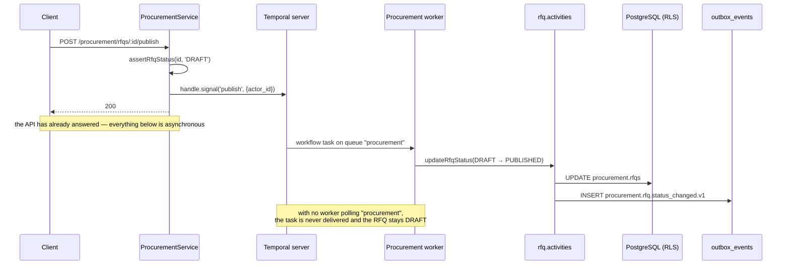

# Phase 5 — Procurement Service

> Compiled from `context/00_master_construction_os.md` § PHASE 5 — PROCUREMENT SERVICE COMMAND and
> the specification sections cited inline. `docs/specifications/` wins on any conflict; see
> [README § Authority](README.md).

---

## 1. Overview & goals

The procure-to-pay domain: purchase request → RFQ → quotation → purchase order → delivery → invoice
(`00_master` § Phase Register: objective "procurement (PR → RFQ → PO) domain", deps `Ph3, Ph4, Ph8`,
risks `R-02, R-09`).

What makes this phase structurally different from every other domain phase: **its state machines do
not live in the service.** RFQ and PO transitions are Temporal workflows. The NestJS service
validates the request and then _signals_ a running workflow; the workflow's activities perform the
database write and emit the event. That choice buys durable timers (an RFQ deadline that fires days
later), retries, and compensation on cancellation — and it makes the Temporal worker a hard runtime
dependency, which § 8 and OQ-25 are about.

Exit condition: "procurement state machine emits verified typed events; RLS enforced"
(`00_master` § Phase Register, Phase 5 exit).

---

## 2. Scope

### In scope

- Nine entities in the `procurement` schema, plus `wht_rules` and `vendor_score_weights`
- RFQ and PO Temporal workflows, their activities, and a dedicated worker
- Quotation comparison and selection
- Vendor scoring — the three DECIDED criteria
- The Vendor Portal (ADR-030): magic-link Tier-1 and session-based Tier-2 external access
- Six Kafka events across the lifecycle

### Out of scope

Explicitly, by the command's own "Do not invent" block:

- Approval hierarchy — use the `PROC_MANAGER` role from Phase 2, nothing deeper
- Accounting posting rules — Finance, Phase 7
- Tax computation — Avalara AvaTax through an interface; a stub here
- Vendor scoring **inputs** — the adapter combines criterion values; deriving `quality` and `price`
  from data is escalated, not invented (see § 14)

---

## 3. Architecture

```text
modules/procurement/
  procurement.{controller,service,repository,module}.ts
  procurement.rows.ts              — row types for the raw-SQL layer
  vendor-scoring.ts                — the DECIDED 3-criteria weighted sum
  vendor-classification.ts
  ep/avalara-tax.stub.ts           — tax + withholding hook
  workflows/
    rfq.workflow.ts   rfq.activities.ts
    po.workflow.ts    po.activities.ts
    activity-helpers.ts            — pooled Prisma clients for the worker's lifetime
    worker.ts                      — standalone Temporal worker entrypoint

modules/vendor-portal/
  vendor-portal.controller.ts      — /vendor/* plus the RFQ invitation route
```

The split into two modules follows the auth boundary, not the domain: everything under `/vendor/*` is
authenticated by `VendorAuthGuard` against a `VENDOR_PORTAL` principal, which is **not** a `CosRole`
(`05-security-compliance` §5.4.3). `POST /procurement/rfqs/:rfqId/invitations` lives in the
vendor-portal module because it is what mints a magic link, even though its path is procurement's.

**Workflow / activity separation** is a Temporal requirement the code states up front: workflow
functions must be deterministic and do no I/O; every database write and Kafka publish happens in an
activity.

---

## 4. Data model

Eleven tables in the `procurement` schema plus three for the portal.

| Table                                   | Source                          | Note                                                                                                  |
| --------------------------------------- | ------------------------------- | ----------------------------------------------------------------------------------------------------- |
| `vendors`                               | Phase 5 command                 | `UNIQUE (tenant_id, vendor_code)`; `tax_id` stored as-is, **not validated** — multi-country by design |
| `purchase_requests`                     | Phase 5 command                 | `UNIQUE (tenant_id, pr_number)`                                                                       |
| `rfqs`                                  | Phase 5 command                 | carries `temporal_workflow_id`                                                                        |
| `quotations`                            | Phase 5 command                 | `is_selected` set by comparison                                                                       |
| `purchase_orders`                       | Phase 5 command                 | 10-state enum; `UNIQUE (tenant_id, po_number)`; `temporal_workflow_id`                                |
| `po_line_items`                         | Phase 5 command                 | `line_total = ROUND(quantity × unit_price, 4)`; optional `boq_item_id` link                           |
| `deliveries`                            | Phase 5 command                 | —                                                                                                     |
| `delivery_items`                        | §17.4 (not the Phase 5 command) | the quantities summed to decide whether a PO line is fulfilled                                        |
| `invoices`                              | Phase 5 command                 | `file_id` references File Service                                                                     |
| `vendor_score_weights`                  | command Decisions               | `(tenant_id, criteria_name, weight DECIMAL(5,2))`                                                     |
| `wht_rules`                             | command Decisions / §13.3       | TENANT_ADMIN-configured jurisdictions                                                                 |
| `platform.vendor_identities`            | ADR-030                         | cross-tenant, **no RLS**                                                                              |
| `platform.vendor_trading_relationships` | ADR-030                         | cross-tenant, no RLS                                                                                  |
| `procurement.rfq_invitations`           | ADR-030                         | RLS; magic-link `token_hash`                                                                          |

The two `platform.*` portal tables are deliberately outside RLS because a vendor identity spans
tenants — one company quoting to several customers. That is the reason the portal's own authorisation
carries `x-vendor-tenant-id` explicitly rather than inferring scope.

Money follows [README § Financial precision](README.md#financial-precision); the arithmetic is
`@cos/financial`, shared with Phase 4.

---

## 5. API contract

Every endpoint in the command exists. The canonical prefix rule from ADR-022 holds throughout —
`/api/v1/procurement/*` for the entire module, vendors included, with no project-scoped list routes
(per-project views use `?project_id=`).

| Group             | Specified | Built | Notes                                                         |
| ----------------- | --------- | ----- | ------------------------------------------------------------- |
| Vendors           | 5         | 6     | extra: `GET /procurement/vendors/directory`                   |
| Purchase requests | 2         | 2     | —                                                             |
| RFQs              | 7         | 7     | publish · close · cancel · award as separate POST routes      |
| Purchase orders   | 10        | 10    | submit · approve · reject · acknowledge · mark-paid · dispute |
| Deliveries        | 2         | 2     | —                                                             |
| Vendor invoices   | 3         | 6     | extra: `dispute`, `GET /:invoiceId`, `note`                   |
| Vendor Portal     | 5         | 7     | extra: `GET /vendor/quotations`, `GET /vendor/rfqs`           |
| Vendor scoring    | —         | 1     | `GET /procurement/vendors/:vendorId/score`                    |

RBAC, counted from the decorators:

| Guard set                                                   | Count |
| ----------------------------------------------------------- | ----- |
| `@Roles(...READ_ROLES)`                                     | 14    |
| `@Roles(PROCUREMENT_OFFICER, PROC_MANAGER, TENANT_ADMIN)`   | 11    |
| `@Roles(FINANCE, TENANT_ADMIN)`                             | 5     |
| `@Roles(PROJECT_MANAGER, FINANCE, EXECUTIVE, TENANT_ADMIN)` | 2     |
| `@Roles(PROC_MANAGER, TENANT_ADMIN)`                        | 1     |
| `@UseGuards(VendorAuthGuard)`                               | 1     |

The invoice-approval routes sitting behind `FINANCE` rather than a procurement role is the command's
"do not invent an approval hierarchy" rule honoured — approval authority comes from the Phase 2 role
set, not from a new procurement-specific ladder.

---

## 6. Events

| Event type                               | Specified | Built |
| ---------------------------------------- | --------- | ----- |
| `procurement.rfq.created.v1`             | ✅        | ✅    |
| `procurement.rfq.status_changed.v1`      | ✅        | ✅    |
| `procurement.po.created.v1`              | ✅        | ✅    |
| `procurement.po.status_changed.v1`       | ✅        | ✅    |
| `procurement.delivery.received.v1`       | ✅        | ✅    |
| `procurement.invoice.received.v1`        | ✅        | ✅    |
| `procurement.po.approval_requested.v1`   | —         | ✅    |
| `procurement.vendor_invoice.approved.v1` | —         | ✅    |

The status-change events are emitted **from workflow activities**, not from the service. That is the
detail that connects this section to § 8: if the worker is not running, the API still returns 200 and
no event is ever emitted — which is exactly what happened until OQ-32 closed on 2026-08-22, and
exactly what would happen again if the `cos-temporal-worker` Deployment were scaled to zero.

---

## 7. Sequence / flows

Publishing an RFQ — the shape every procurement transition shares:



`PUBLISHED → CLOSED` additionally fires on a **Temporal timer** at the RFQ deadline
(`32-implementation-specifications` §32 workflow table: "Deadline expiry (Temporal timer) or manual"),
which is the same dependency in a form no API call can work around.

---

## 8. Failure modes & rollback

| Failure                                   | Behaviour today                                                    |
| ----------------------------------------- | ------------------------------------------------------------------ |
| Transition requested from the wrong state | `assertRfqStatus` / PO equivalent refuses before signalling        |
| Award naming a quotation outside the RFQ  | 404 before the signal                                              |
| Activity fails transiently                | Temporal retries — 3 attempts, 5 s initial, ×2 backoff             |
| RFQ cancelled                             | Compensation events to Finance, per the command                    |
| **No Temporal worker running**            | **Every RFQ and PO transition silently does nothing** — § 14 OQ-25 |
| Outbox insert lost                        | durable, not atomic — [OQ-18](README.md#open-questions-register)   |

**The worker gap is the one to read carefully.** The chain was verified link by link:

1. `POST /rfqs/:id/publish` only calls `handle.signal(publishRfqSignal, …)` — the service performs no
   status write of its own.
2. The status write and the Kafka event live in `rfq.activities` / `po.activities`.
3. Activities execute only when a worker polls the `procurement` task queue.
4. `worker.ts` exports `runProcurementWorker()` and self-starts under `require.main === module` — a
   standalone process.
5. **Nothing starts that process.** No `package.json` script, no `docker-compose.yml` service, no
   Dockerfile, no CI step, and none of the 11 Helm charts under `infrastructure/helm/`.
   `infrastructure/temporal/` holds only the Temporal server's dynamic config.
6. `32-implementation-specifications` §32.2 — the canonical deployable table — has no procurement
   worker row either.

The Temporal **server** is in `docker-compose.yml` under the `full` profile, so the signal is accepted
and the workflow is recorded as running. The client gets 200. The RFQ stays `DRAFT`.

**Why the test suite does not catch it:** `rfq.workflow.spec.ts` and `po.workflow.spec.ts` use
`@temporalio/testing`'s `TestWorkflowEnvironment`, which starts its own in-process worker. The
workflows are correct and proven; what is missing is the process that runs them outside a test.

This is a static finding — the chain is read from code and configuration, not observed on a running
deployment. It is stated as such in OQ-25.

**Rollback:** all four procurement migrations have paired rollbacks, enforced by
`scripts/ci/check-migration-rollbacks.mjs`.

---

## 9. Security

Tenant isolation via RLS as everywhere ([README § Tenant isolation](README.md#tenant-isolation)) — with
one deliberate exception: `platform.vendor_identities` and `platform.vendor_trading_relationships`
are cross-tenant and carry no RLS, because a vendor identity is shared across the tenants it trades
with. Scope for those is carried explicitly by `x-vendor-tenant-id` on the Tier-2 session.

**The Vendor Portal is the platform's only externally-authenticated surface.** Two tiers
(ADR-030, `05-security-compliance` §5.4.3):

- **Tier 1** — a magic link. HMAC token, no account, opens exactly one invited RFQ and submits one
  quotation.
- **Tier 2** — a vendor session returned by that submission: Bearer token plus `x-vendor-tenant-id`,
  scoped to the vendor's own POs and invoices.

`VENDOR_PORTAL` is a principal type, not a `CosRole` — so no vendor can be granted an internal role by
misconfiguration, and `RolesGuard` cannot accidentally admit one.

`tax_id` is stored without validation, by design, because formats differ per country. That is a
documented decision, not an oversight — but it does mean the column is free text from an untrusted
party on the portal path.

---

## 10. Observability

`createLogger('procurement-worker')` in the worker; structured logs on every transition in the service
(`rfq.published`, `rfq.closed`, `rfq.cancelled`, `rfq.awarded`) carrying `rfq_id` and `actor_id`.

Given § 8, the highest-value alert this phase could carry is on Temporal task-queue backlog for the
`procurement` queue — a queue with no poller is exactly what that metric shows. Nothing in
`infrastructure/monitoring/` defines it today.

---

## 11. Testing & acceptance

17 spec files across `procurement` and `vendor-portal`, including `rfq.workflow.spec.ts` and
`po.workflow.spec.ts` running against `TestWorkflowEnvironment` — the Temporal test server the command
asks for.

Acceptance is the Phase Register exit: "procurement state machine emits verified typed events; RLS
enforced." Worth noting against OQ-25: the state machine emits verified typed events **in the test
environment**, which is what the exit criterion can observe.

---

## 12. Implementation status

Verified on **2026-08-22** against this working tree (Rule 36 — commands run, output summarised).

| Generate item                                     | Status     | Evidence                                                                                                           |
| ------------------------------------------------- | ---------- | ------------------------------------------------------------------------------------------------------------------ |
| Migrations for all entities                       | ✅ present | 4 migrations; all 9 command entities + `wht_rules`, `vendor_score_weights`, `delivery_items`                       |
| NestJS module / service / repository / controller | ✅ present | `procurement.*.ts` + `vendor-portal`                                                                               |
| Temporal workflow definitions — RFQ, PO           | ✅ present | `rfq.workflow.ts`, `po.workflow.ts` — signals, queries, timers                                                     |
| Temporal worker setup and registration            | ✅ present | `workflows/worker.ts`, launched by `workers/main.ts` in the `cos-temporal-worker` chart (OQ-32, closed 2026-08-22) |
| Quotation comparison service                      | ✅ present | `compareQuotations` — sorts by `total_amount` ASC, marks `is_selected` on the lowest                               |
| DTOs with validation                              | ✅ present | 8 DTOs                                                                                                             |
| OpenAPI 3.1                                       | ✅ present | `docs/api/procurement.openapi.yaml` + controller decorators                                                        |
| All specified API routes                          | ✅ present | see § 5 — every group complete, several extras                                                                     |
| Decimal.js for financial calculations             | ✅ present | via `@cos/financial`                                                                                               |
| Unit tests — workflow transitions, financials     | ✅ present | 17 spec files incl. both workflow suites                                                                           |
| Integration tests with Temporal test server       | ✅ present | `TestWorkflowEnvironment` in both workflow specs                                                                   |
| 6 Kafka event producers                           | ✅ present | all 6, plus 2 extras — § 6                                                                                         |
| VendorScoring — 3 criteria, configurable weights  | ✅ present | `vendor-scoring.ts`; grades A ≥ 90, B ≥ 75, C ≥ 60, D ≥ 45, F < 45                                                 |
| WithholdingTaxRules                               | ✅ present | `ep/avalara-tax.stub.ts` — WHT hook inside the AvaTax flow                                                         |
| Vendor Portal (ADR-030)                           | ✅ present | `vendor-portal` module, 3 tables, `VendorAuthGuard`                                                                |

---

## 13. Dependencies & risks

**Dependencies:** `Ph3, Ph4, Ph8`. Phase 3 supplies `project_id`, Phase 4 the `boq_item_id` a PO line
may link to, Phase 8 the outbox. **Temporal is a fourth dependency the register does not name** — it
is a runtime prerequisite for this phase's core behaviour, not merely for a background job.

**Risks:** `R-02`, `R-09` — `00_master` § Risk Register.

---

## 14. Open questions / NOT SPECIFIED

| #     | Question                                                                                                                                                                                                                                                                                                                                                                                                                                                                                                                                                                                                                                                                                                                                                                                                                                                                                                                                                                                                                                                                                                                         | Status            |
| ----- | -------------------------------------------------------------------------------------------------------------------------------------------------------------------------------------------------------------------------------------------------------------------------------------------------------------------------------------------------------------------------------------------------------------------------------------------------------------------------------------------------------------------------------------------------------------------------------------------------------------------------------------------------------------------------------------------------------------------------------------------------------------------------------------------------------------------------------------------------------------------------------------------------------------------------------------------------------------------------------------------------------------------------------------------------------------------------------------------------------------------------------- | ----------------- |
| OQ-25 | **Nothing starts the procurement Temporal worker, and the whole procurement state machine runs inside it.** The service only signals; activities own the status writes and the events. `worker.ts` is a standalone entrypoint with no `package.json` script, no Compose service, no Dockerfile, no CI step, no Helm chart, and no row in `32-implementation-specifications` §32.2's deployable table. The workflow unit tests pass because `TestWorkflowEnvironment` starts its own worker. **Failure scenario:** in any deployed environment, `POST /procurement/rfqs/:id/publish` returns 200 and the RFQ stays `DRAFT` forever; no `rfq.status_changed` event is emitted; the deadline timer never fires. Verified statically, not observed on a running deployment. **Closed 2026-08-22 by [OQ-32](README.md#open-questions-register)** — `workers/main.ts` polls this queue in the `cos-temporal-worker` Deployment, and a second defect surfaced while verifying: `workflowsPath` was `require.resolve('./')` against a directory with no `index`, so the worker could not have started even if something had launched it. | Closed 2026-08-22 |
| OQ-26 | **Closed 2026-08-23 — stale entry, not an unspecified one.** `vendor-scoring.ts` still carried a note escalating the derivations as UNSPECIFIED while `ProcurementRepository` had implemented all three and the endpoint was serving grades. Now in `00_master` § PHASE 5 Decisions: OTD = deliveries within `delivery_date + 2 days`, quality = 1 − disputed/total invoices, price = mean of (lowest quote on that RFQ ÷ this vendor's quote) × 100, weights re-normalised over the criteria that have data, no data at all → grade null rather than F. `quality` is flagged in both places as a proxy for billing disputes rather than goods condition.                                                                                                                                                                                                                                                                                                                                                                                                                                                                        | Closed 2026-08-23 |
| OQ-27 | **Closed 2026-08-23 — defined in §11.2 and `00_master`.** `procurement.delivery_items` is what fulfilment is computed from, and its only description was a passing sentence in `17-offline-mobile-sync` §17.4. Read from the live DDL: `ON DELETE RESTRICT` to `po_line_items`, so a PO line with receipts against it cannot be deleted under them, and `UNIQUE (delivery_id, line_id)`, which doubles as the idempotency key that stops a replayed offline sync item closing a purchase order on goods that arrived once. No `created_by` / `deleted_at` / `created_at` — the concrete case §11.4 now cites for why neither is universal.                                                                                                                                                                                                                                                                                                                                                                                                                                                                                       | Closed 2026-08-23 |
