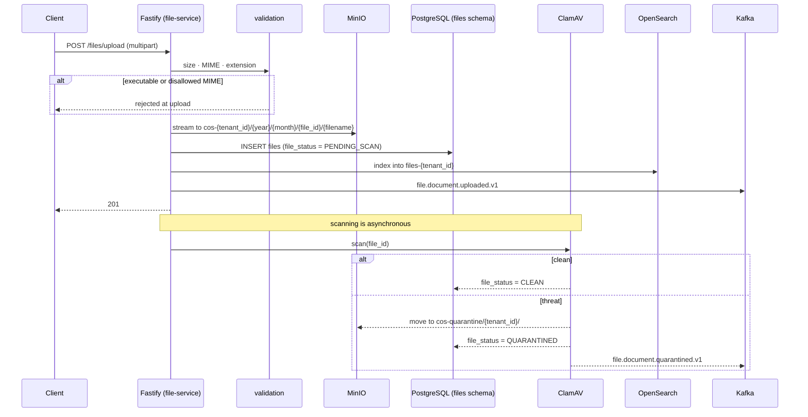

# Phase 9 — File + Document System

> Compiled from `context/00_master_construction_os.md` § PHASE 9 — FILE + DOCUMENT SYSTEM COMMAND and
> the specification sections cited inline. `docs/specifications/` wins on any conflict; see
> [README § Authority](README.md).

---

## 1. Overview & goals

The File Service — the platform's only binary store, and the only phase that is **not** part of the
NestJS monolith. It is a standalone Fastify deployable (`services/file-service/`), chosen for
multipart upload throughput per the Technology Decision Map.

Everything that holds a photo, drawing, contract PDF or bulk archive goes through it. Site
Operations, Procurement and Finance all reference files by `file_id` and never touch storage
themselves.

---

## 2. Scope

### In scope

- Multipart upload, validation, MinIO storage, signed download URLs
- ClamAV scanning with quarantine
- Soft delete, retention policies, legal hold
- ZIP bulk-upload extraction
- OpenSearch indexing per tenant
- Two Kafka events

### Out of scope

- DWG → DXF conversion — Phase B of the CAD decision, deferred pending read-fidelity validation
- Client-side DXF rendering — a web concern served from the existing signed URL
- Direct client-to-MinIO upload — explicitly forbidden; the service streams

---

## 3. Architecture

```text
services/file-service/src/
  main.ts                       — Fastify app
  routes/files.routes.ts
  middleware/validation.ts      — size, MIME, extension
  plugins/                      — auth, jwt-verify, metrics, security, swagger, trace
  services/  minio · opensearch · kafka · db · antivirus · scan-runner · zip-extraction
  util/stored-key.ts  util/category.ts
  cleanup/     worker.ts · workflows/file-cleanup.workflow.ts · file-cleanup.activities.ts
  extraction/  worker.ts · workflows/zip-extraction.workflow.ts · zip-extraction.activities.ts
                extraction-client.ts
```

Three processes are designed here, not one: the Fastify API, a **cleanup worker** (hard delete after
the retention window) and an **extraction worker** (ZIP unpacking). Until [OQ-32](README.md#open-questions-register)
closed on 2026-08-22 only the API was launched; the chart now ships a second Deployment
(`worker-deployment.yaml`) that runs both workers — see § 8.

---

## 4. Data model

Four tables in the `files` schema — the two from the command plus two added later.

| Table                | Source                                     | Note                                                                                                                                                                                         |
| -------------------- | ------------------------------------------ | -------------------------------------------------------------------------------------------------------------------------------------------------------------------------------------------- |
| `files`              | Phase 9 command                            | `file_status ENUM('PENDING_SCAN','CLEAN','QUARANTINED')`; `deleted_at` soft delete; indexes on `(tenant_id, uploaded_by)` and `(tenant_id, file_status)`; `sha256` added by `20260721000004` |
| `file_metadata`      | Phase 9 command                            | `entity_type` / `entity_id` — the back-reference every other domain relies on; `INDEX (entity_type, entity_id)`                                                                              |
| `photo_annotations`  | ADR-056                                    | the stroke list whose conflict rule Phase 6 owns                                                                                                                                             |
| `retention_policies` | `20260706000003_file_retention_legal_hold` | per-tenant, per-category retention + legal hold                                                                                                                                              |

**These are the only domain tables that are Prisma-modelled.** `schema.prisma` declares
`schemas = ["platform", "files"]`, so `StoredFile`, `FileMetadata` and `PhotoAnnotation` are real
Prisma models while every other domain is raw SQL — the exception that makes the
[Phase 3 § 4](phase-03-project-service.md) convention worth stating.

`file_metadata.entity_id` is the mechanism behind [Phase 6 § 4](phase-06-site-operations.md): a photo
taken offline against a client-generated issue UUID attaches once both sync, because the file points
at the issue rather than the issue holding a file column.

---

## 5. API contract

All six command endpoints exist, plus four the command does not list.

| Endpoint                                     | Specified                                 | Built |
| -------------------------------------------- | ----------------------------------------- | ----- |
| `POST /files/upload`                         | ✅                                        | ✅    |
| `GET /files/:fileId/url`                     | ✅                                        | ✅    |
| `GET /files/:fileId`                         | ✅                                        | ✅    |
| `DELETE /files/:fileId`                      | ✅                                        | ✅    |
| `GET /files`                                 | ✅                                        | ✅    |
| `GET /files/by-entity/:entityType/:entityId` | ✅                                        | ✅    |
| `POST`/`DELETE /files/:fileId/legal-hold`    | ADR / retention workstream                | ✅    |
| `GET /files/retention-policies`              | retention workstream                      | ✅    |
| `POST /files/admin/:fileId/recover`          | quarantine recovery — `SYSTEM_ADMIN` only | ✅    |
| `GET /health/live`, `/health/ready`          | —                                         | ✅    |

The quarantine-recovery route matches the command's rule that recovery is a `SYSTEM_ADMIN`-only action
through the platform admin API.

---

## 6. Events

| Event                          | Payload                                                     | Built |
| ------------------------------ | ----------------------------------------------------------- | ----- |
| `file.document.uploaded.v1`    | `{ file_id, tenant_id, entity_type, entity_id, mime_type }` | ✅    |
| `file.document.quarantined.v1` | `{ file_id, tenant_id, threat_type }`                       | ✅    |

Both specified events exist and no others.

---

## 7. Sequence / flows

Upload, where validation, storage, scanning and indexing interleave:



Deletion is two-stage by design: `DELETE` sets `deleted_at`, and a Temporal scheduled workflow hard-
deletes 30 days later. That second stage is the one § 8 is about.

---

## 8. Failure modes & rollback

| Failure                                 | Behaviour today                                                                                                                    |
| --------------------------------------- | ---------------------------------------------------------------------------------------------------------------------------------- |
| Executable or disallowed MIME uploaded  | Blocked at upload by `middleware/validation.ts`                                                                                    |
| Oversized file                          | Blocked — per-category limits (20 MB images … 1 GB video)                                                                          |
| Infected file                           | Quarantined to a separate bucket, event emitted, `SYSTEM_ADMIN` notified                                                           |
| Zip bomb / path traversal in an archive | Guards specified in the extraction workflow — decompression-ratio, entry-count, path checks                                        |
| **Soft-deleted file reaching 30 days**  | Hard-deleted by the cleanup workflow; its worker ships in `cos-file-service`'s `worker-deployment.yaml` (OQ-32, closed 2026-08-22) |
| **ZIP uploaded for bulk extraction**    | Extracted in the sandbox workflow, on the same Deployment (OQ-32, closed 2026-08-22)                                               |

**The worker gap here is the same one Phase 5 has, and the two are one problem.** Verified across the
whole repository: **five** production `Worker.create` call sites exist, one per workflow family —

| Worker file                                                              | Exported runner                   |
| ------------------------------------------------------------------------ | --------------------------------- |
| `backend/src/modules/procurement/workflows/worker.ts`                    | `runProcurementWorker`            |
| `backend/src/modules/tenant/workflows/enterprise-provisioning.worker.ts` | `runEnterpriseProvisioningWorker` |
| `backend/src/modules/identity/data-export/workflows/worker.ts`           | `runDataExportWorker`             |
| `services/file-service/src/cleanup/worker.ts`                            | `runFileCleanupWorker`            |
| `services/file-service/src/extraction/worker.ts`                         | `runZipExtractionWorker`          |

Every other occurrence is a test. Each file self-starts under `require.main === module`, and **no
other file in the repository references any of the five runners** — no script, Dockerfile, Compose
service, CI step or Helm chart, and no row in `32-implementation-specifications` §32.2's deployable
table. The file-service Dockerfile runs `main.js` and nothing else; the Helm chart sets no command or
args.

For this phase the consequence is not a stalled state machine but a **retention obligation that never
executes**: soft-deleted files stay in MinIO indefinitely, which is precisely what the
`retention_policies` / legal-hold design exists to control, and what a PDPA erasure request depends on.

**Rollback:** the four file migrations have paired rollbacks, enforced by
`scripts/ci/check-migration-rollbacks.mjs`.

---

## 9. Security

**Tenant isolation is at the bucket, not the row.** One MinIO bucket per tenant (`cos-{tenant_id}`),
enforced by bucket-level policy — a different mechanism from the RLS every PostgreSQL-backed phase
uses, and the reason a file-service compromise has a different blast radius than a backend one.

**No direct client upload.** The service streams to MinIO itself, so no client ever holds a write
credential for a bucket.

Signed URLs are read-only and expire in **1 hour** by default
(`SIGNED_URL_TTL_SECONDS`), so a leaked URL is bounded.

Executables are blocked at upload rather than at download, and ClamAV runs on every file before it is
marked `CLEAN` — a file is only servable after it has been scanned.

`sha256` on `files` (added `20260721000004`) is what lets Finance write a contract document hash to
the WORM audit store — see [Phase 7 § 9](phase-07-finance-service.md).

---

## 10. Observability

`plugins/metrics.ts` and `plugins/trace.ts` are first-class plugins in this service rather than
cross-cutting middleware, and `/health/live` + `/health/ready` are distinct — the readiness probe is
what should fail when MinIO or PostgreSQL is unreachable.

The metric this phase lacks, given § 8, is the count and age of files past their hard-delete date.

---

## 11. Testing & acceptance

19 test files under `services/file-service`.

The command asks for unit tests on validation, MIME checking and signed-URL generation, and
integration tests on the full upload → MinIO → metadata → signed URL flow.

---

## 12. Implementation status

Verified on **2026-08-22** against this working tree (Rule 36 — commands run, output summarised).

| Generate item                            | Status     | Evidence                                                                                        |
| ---------------------------------------- | ---------- | ----------------------------------------------------------------------------------------------- |
| Fastify app with multipart plugin        | ✅ present | `fastify 5.9.0`, `@fastify/multipart ^10.0.0`                                                   |
| MinIO client integration                 | ✅ present | `minio ^7.1.0`; `services/file-service/src/services/minio.service.ts`                           |
| File validation middleware               | ✅ present | `middleware/validation.ts` — size, MIME, extension                                              |
| Antivirus hook (ClamAV)                  | ✅ present | `clamscan ^2.1.3`; `services/file-service/src/services/antivirus.service.ts` + `scan-runner.ts` |
| Signed URL generation                    | ✅ present | `presignedGetObject`, TTL 3600 s configurable                                                   |
| OpenSearch indexing on upload            | ✅ present | index `files-{tenantId}`                                                                        |
| PostgreSQL migrations                    | ✅ present | 4 migrations; `files.files`, `file_metadata`, `photo_annotations`, `retention_policies`         |
| OpenAPI 3.1                              | ✅ present | `plugins/swagger.ts`                                                                            |
| Unit + integration tests                 | ✅ present | 19 test files                                                                                   |
| `file.document.uploaded.v1`              | ✅ present | —                                                                                               |
| `file.document.quarantined.v1`           | ✅ present | —                                                                                               |
| Bucket / key layout                      | ✅ present | `cos-{tenant_id}` + `{year}/{month}/{file_id}/{filename}`                                       |
| ZIP sandboxed extraction workflow        | ✅ present | workflow + activities + worker, launched by `worker-deployment.yaml` (OQ-32)                    |
| Retention / hard-delete cleanup workflow | ✅ present | same Deployment, second task queue (OQ-32)                                                      |

**On the antivirus deferral.** The command says "ClamAV integration — deferred to Phase 9 spec; do not
implement until spec defines it". It is implemented: the dependency is installed, the service and
scan-runner exist, and quarantine has its own bucket, event and recovery route. Treating that as
complete rather than as a violation follows the rest of the same command block, which specifies the
quarantine bucket, the 30-day retention and the recovery path in full — the deferral applied before
that block was written.

---

## 13. Dependencies & risks

**Dependencies:** the command places no phase dependency on this service, but Phases 3, 5, 6 and 7 all
reference `file_id`, and Phase 6's photo flow does not work without it.

Runtime dependencies beyond PostgreSQL: MinIO, ClamAV, OpenSearch, Kafka and **Temporal** — the last
of which is why OQ-32 applied here.

---

## 14. Open questions / NOT SPECIFIED

| #     | Question                                                                                                                                                                                                                                                                                                                                                                                                                                                                                                                                                                                                                                                                                                                                                                                                                                                                                                                                                                                                                                                     | Status                                                                              |
| ----- | ------------------------------------------------------------------------------------------------------------------------------------------------------------------------------------------------------------------------------------------------------------------------------------------------------------------------------------------------------------------------------------------------------------------------------------------------------------------------------------------------------------------------------------------------------------------------------------------------------------------------------------------------------------------------------------------------------------------------------------------------------------------------------------------------------------------------------------------------------------------------------------------------------------------------------------------------------------------------------------------------------------------------------------------------------------ | ----------------------------------------------------------------------------------- |
| OQ-32 | **Five Temporal workers are written; nothing launches any of them.** One worker file exists per workflow family — procurement, enterprise provisioning, PDPA data export, file cleanup, file zip-extraction — each a standalone `require.main === module` entrypoint exporting a `run*Worker()`. No other file in the repository references any of those five runners: no `package.json` script, Dockerfile, Compose service, CI step or Helm chart, and none is listed in `32-implementation-specifications` §32.2. Meanwhile the Temporal **server** is in `docker-compose.yml`, so every workflow these services start is accepted and recorded as running while no worker polls its task queue. This supersedes the phase-local framing in [OQ-25](README.md#open-questions-register). Verified statically across the repository. **Closed 2026-08-22** — two Deployments now run all five queues: `cos-temporal-worker` for the backend’s three, a second Deployment in the `cos-file-service` chart for its two, wired into ArgoCD, Compose and §32.2. | Closed 2026-08-22                                                                   |
| OQ-33 | **The ClamAV deferral in the Phase 9 command is stale.** "Do not implement until spec defines it" sits in the same command block that already specifies the quarantine bucket, 30-day retention, the event and the `SYSTEM_ADMIN` recovery path. The implementation follows the specification, not the deferral. The sentence should be removed so a future reader does not treat working antivirus as scope creep.                                                                                                                                                                                                                                                                                                                                                                                                                                                                                                                                                                                                                                          | Closed 2026-08-22 — resolution in the [register](README.md#open-questions-register) |
