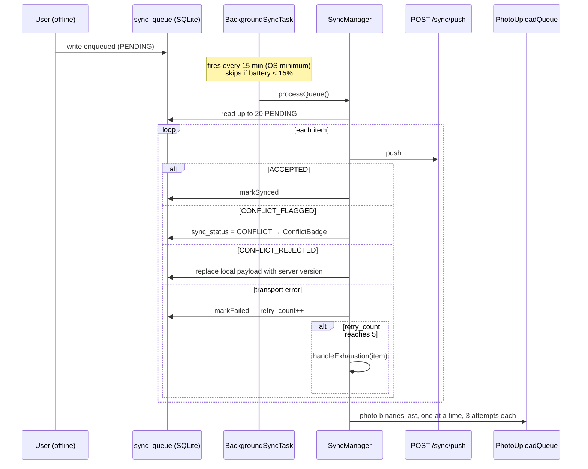

# Phase 10 — Mobile Offline Engine

> Compiled from `context/00_master_construction_os.md` § PHASE 10 — MOBILE OFFLINE ENGINE COMMAND and
> the specification sections cited inline. `docs/specifications/` wins on any conflict; see
> [README § Authority](README.md).

---

## 1. Overview & goals

The offline-first client layer — **two** clients, not one, and the server-side sync transport they
both speak to.

The platform decision is final and exclusive (`00_master` § PHASE 10, product-owner confirmed): a
**smartphone** uses React Native, online and offline; a **tablet or laptop** uses the Next.js web app,
online and offline. There is no overlap — each device has exactly one platform — and **every role is
served on both**. The React Native app is not a field-worker app with a few screens; it carries the
full role set.

This phase is where Phase 6's conflict rules acquire a transport, and where the platform's most
demanding constraint lives: a write made in a basement with no signal must still be correct when it
arrives hours later, possibly twice.

---

## 2. Scope

### In scope

- Server sync transport: `GET /sync/delta`, `POST /sync/push`, `POST /sync/resolve`
- React Native: Drizzle on `expo-sqlite`, `sync_queue`, `SyncManager`, background fetch, photo queue
- Web: Serwist service worker, IndexedDB via `idb`, Background Sync API
- Role-based navigation for all twelve roles on both clients
- The CRM module, retrofitted here with no dedicated phase (ADR-029)

### Out of scope

- Conflict **rules** — Phase 6 owns those; this phase carries them
- File storage — Phase 9; the photo queue uploads to it

---

## 3. Architecture

Three codebases participate:

```text
backend/src/modules/sync/          — the transport
  sync.controller.ts   @Controller('sync') → GET delta · POST push · POST resolve
  sync.service.ts      per-entity push cases; task MAX_WINS as GREATEST()
  sync-auth.guard.ts   entity type comes from the body/query, not the route
  sync-authz.ts
  tombstone-prune.service.ts · tombstone-retention.ts

apps/mobile/src/
  db/database.ts · db/schema.ts · db/sync-queue.ts · db/photoRepo.ts
  sync/SyncManager.ts · runPushSync.ts · BackgroundSyncTask.ts · PhotoUploadQueue.ts

apps/web/
  next.config.mjs                        withSerwist
  src/app/layout.tsx                     <SerwistProvider swUrl="/serwist/sw.js" />
  src/app/serwist/[path]/route.ts        createSerwistRoute
```

**Deletions travel as tombstones.** `platform.sync_tombstones` plus `tombstone-prune.service.ts` and
`tombstone-retention.ts` are how `/sync/delta` reports a deletion — a client that has been offline
past the retention window is told to full-resync instead, which is why the delta response carries
`retention_days` when that happens.

---

## 4. Data model

**Server:** no domain tables. `platform.sync_tombstones` is the only addition; everything else is the
domain schemas Phases 3–9 own.

**Mobile (SQLite):**

| Table                | Purpose                                                                                                             |
| -------------------- | ------------------------------------------------------------------------------------------------------------------- |
| `sync_queue`         | `entity_type`, `entity_id`, `operation`, `payload`, `status`, `retry_count`, `client_submitted_at`, `error_message` |
| `local_site_reports` | offline subset of the server row, with `sync_status PENDING \| SYNCED \| CONFLICT`                                  |
| `local_issues`       | same shape                                                                                                          |
| `local_photos`       | `local_path` (expo-file-system URI), `upload_status`, `server_file_id`, `upload_retry_count`                        |

The mobile schema is applied by **versioned runtime DDL** (ADR-048) rather than by a migration tool —
`db/database.ts` carries an explicit column-add list, so an app upgrade can extend the local schema
without losing the queue.

**Web:** IndexedDB via `idb`, typed and versioned.

---

## 5. API contract

| Endpoint             | Purpose                                                                            |
| -------------------- | ---------------------------------------------------------------------------------- |
| `GET /sync/delta`    | `?since=` + `entity_types[]`; returns `{updated, deleted, server_timestamp}`       |
| `POST /sync/push`    | one queued mutation; returns `{resolved_payload, conflict_status, server_version}` |
| `POST /sync/resolve` | manual conflict resolution                                                         |

`sync.service.ts` notes that its switch **is** the offline contract: "The set of cases above IS the
client's offline contract". The cases are `task`, `site_report`, `issue`, `attendance`, `safety`,
`material`, `inspection`, `delivery`, `purchase-request`, `photo_annotation` — and the absence of any
financial case is what enforces §17.4's online-required rule (see
[Phase 6 § 7](phase-06-site-operations.md)).

`entity_types` is validated against an explicit allow-list rather than an object lookup — the code
records why: `?entity_types=constructor` (or `toString`, `hasOwnProperty`, `__proto__`) would
otherwise pass a naive whitelist check.

---

## 6. Events

This phase produces no domain events of its own. §17.2 specifies one — `platform.sync.exhausted` —
which is **not implemented on either side**; see § 14 OQ-38.

---

## 7. Sequence / flows



Photos are uploaded **after** the mutation queue, and skipped entirely when the queue pass was
interrupted — the code's reason: the uploads would fail for the same reason, "and each failure spends
one of a photo's three attempts."

---

## 8. Failure modes & rollback

| Failure                                                            | Behaviour today                                                            |
| ------------------------------------------------------------------ | -------------------------------------------------------------------------- |
| Replayed create after a timeout                                    | Idempotent on the client-generated id (`ON CONFLICT DO NOTHING`)           |
| `processQueue` re-entered while one is in flight                   | Guarded — a `SYNCING` row seen at start blocks re-entry                    |
| Client offline past the tombstone retention                        | `/sync/delta` returns `full_resync_required` + `retention_days`            |
| Battery below 15%                                                  | Background sync skipped                                                    |
| Photo upload fails 3×                                              | `UPLOAD_FAILED`, preserved on device                                       |
| Conflict flagged                                                   | Local `sync_status = CONFLICT`, surfaced by `ConflictBadge`                |
| Conflict rejected                                                  | Server version replaces local; added to the conflict list the badge counts |
| **Any of the four escalating entity types exhausts its 5 retries** | **Nothing happens** — § 14 OQ-38                                           |

**The exhaustion path is the one to read.** `SyncManager.handleExhaustion` implements §17.2's
three-way split correctly in structure: `EXHAUSTED_NOTIFY_TYPES` (safety incidents, workforce
attendance, inspection results, material consumption) call `onExhausted`; `DISCARD_NOTIFY_TYPES`
(task progress, site-report drafts) notify the user; `SILENT_DISCARD_TYPES` preserve quietly. The
structure is right and the wiring is missing — see OQ-38.

Note what _does_ work: nothing is deleted from the device on exhaustion. The record survives; what is
absent is the escalation.

---

## 9. Security

`sync-auth.guard.ts` and `sync-authz.ts` exist because this transport breaks the usual pattern: the
entity type arrives in the **body or query**, not in the route, so `RolesGuard` cannot resolve
permissions from a route decorator. `roles.guard.ts` carries a matching special case.

Object-level authorisation was a security-review finding (F7): `/sync/push` carries a caller-chosen
`file_id` for photo annotations, so `annotation.service.ts` authorises the file before any write.

The `entity_types` allow-list on `/sync/delta` is prototype-pollution-aware, as noted in § 5.

Tenant isolation still runs through RLS; the task push path spells `tenant_id` alongside it as
defence in depth ([Phase 6 § 9](phase-06-site-operations.md)).

---

## 10. Observability

The `SyncPill` is the user-facing signal, driven by `syncStore.status` / `errorMessage`. The code
records that before 2026-08-19 **nothing ever wrote those fields**, so the pill's ERROR state was
unreachable — the same class of gap as OQ-38, found and fixed one layer up.

Server-side, sync is ordinary API traffic; nothing distinguishes a delta storm from normal load.

---

## 11. Testing & acceptance

| Surface        | Tests                               |
| -------------- | ----------------------------------- |
| `modules/sync` | 6 spec files                        |
| `apps/mobile`  | 200 spec files + 5 Detox E2E suites |
| `apps/web`     | 5 spec files                        |

Every mobile screen is required to expose the testIDs the Detox specs consume.

---

## 12. Implementation status

Verified on **2026-08-22** against this working tree (Rule 36 — commands run, output summarised).

| Generate item                                           | Status        | Evidence                                                                                             |
| ------------------------------------------------------- | ------------- | ---------------------------------------------------------------------------------------------------- |
| `GET /sync/delta` · `POST /sync/push` · `/sync/resolve` | ✅ present    | `@Controller('sync')` with all three                                                                 |
| Drizzle on `expo-sqlite`                                | ✅ present    | `drizzle-orm ^0.45.2`, `expo-sqlite ~56.0.5` (ADR-048)                                               |
| `sync_queue` local schema                               | ✅ present    | `db/sync-queue.ts` — all specified columns                                                           |
| `local_photos` with upload state                        | ✅ present    | `db/database.ts`, `db/photoRepo.ts`                                                                  |
| `SyncManager` — processQueue / markSynced / markFailed  | ✅ present    | `sync/SyncManager.ts`, `db/sync-queue.ts`                                                            |
| Retry limit 5 → `handleExhaustion`                      | ✅ present    | `MAX_RETRIES = 5`                                                                                    |
| Batch size 20                                           | ✅ present    | `BATCH_SIZE = 20`                                                                                    |
| Background fetch, 15 min, battery ≥ 15%                 | ✅ present    | `MIN_INTERVAL_SECONDS = 15 * 60`, `MIN_BATTERY_LEVEL = 0.15`                                         |
| Photo queue — 1 at a time, 3 retries                    | ✅ present    | `PhotoUploadQueue.ts`                                                                                |
| Client conflict handling — 3 statuses                   | ✅ present    | `onRejected` + local `sync_status`                                                                   |
| **`platform.sync.exhausted` escalation**                | ❌ **absent** | `onExhausted` is declared and never supplied — OQ-38                                                 |
| **Tenant-admin review queue (platform schema)**         | ✅ present    | `platform.sync_exhaustions`, `@Controller('sync/exhaustions')`, `platform.sync.exhausted.v1` (OQ-38) |
| Serwist config with runtime caching                     | ✅ present    | `withSerwist` in `next.config.mjs`                                                                   |
| `createSerwistRoute` with `useNativeEsbuild: false`     | ✅ present    | `process.platform === 'win32'` — the MUST was inverted in §32.7, not the code (OQ-39)                |
| `SerwistProvider` in the App Router root layout         | ✅ present    | `app/layout.tsx`                                                                                     |
| IndexedDB via `idb`, typed and versioned                | ✅ present    | `idb ^8.0.0`                                                                                         |
| CRM module (ADR-029)                                    | ✅ present    | `modules/crm/` + `crm.leads`, `crm.opportunities`, `crm.contacts`                                    |
| Detox E2E with testIDs                                  | ✅ present    | 5 E2E suites                                                                                         |

---

## 13. Dependencies & risks

**Dependencies:** Phases 2, 3, 6, 9 — the transport is meaningless without the domains it carries and
the File Service the photo queue targets.

`apps/mobile` is its own pnpm workspace with a hoisted `nodeLinker` (Metro requires it), so its
dependencies resolve into `apps/mobile/pnpm-lock.yaml` — Rule 28's "nearest lockfile above" case.

---

## 14. Open questions / NOT SPECIFIED

| #     | Question                                                                                                                                                                                                                                                                                                                                                                                                                                                                                                                                                                                                                                                                                                                                                                                                                                                                                                                | Status                                                                              |
| ----- | ----------------------------------------------------------------------------------------------------------------------------------------------------------------------------------------------------------------------------------------------------------------------------------------------------------------------------------------------------------------------------------------------------------------------------------------------------------------------------------------------------------------------------------------------------------------------------------------------------------------------------------------------------------------------------------------------------------------------------------------------------------------------------------------------------------------------------------------------------------------------------------------------------------------------- | ----------------------------------------------------------------------------------- |
| OQ-38 | **A safety incident that fails to sync five times escalates to nobody.** §17.2 requires four entity types — `safety_incidents`, `workforce_attendance`, `inspection_results`, `material_consumption` — to publish `platform.sync.exhausted`, land in a server-side tenant-admin review queue, and alert the PM (and Safety Officer for incidents). `SyncManager.handleExhaustion` routes those types to `this.callbacks.onExhausted`, but `runPushSync.ts` — the only production construction of `SyncManager` — supplies just `onRejected` and `onUserNotify`. **`onExhausted` has no provider anywhere outside the tests.** On the server there is no `platform.sync.exhausted` producer or consumer, no review-queue table, and no TENANT_ADMIN endpoint. The record is preserved on the device, so nothing is lost — but nobody is told, and the person who filed the incident has no way to know it never arrived. | Closed 2026-08-22 — resolution in the [register](README.md#open-questions-register) |
| OQ-39 | **`useNativeEsbuild` is set to exactly what the specification forbids, and the specification is the stale one.** `32-implementation-specifications` §32.7 says "`createSerwistRoute` **MUST** pass `useNativeEsbuild: false`", giving as its reason that native `esbuild` "is not a dependency here (only `esbuild-wasm` is)". That premise no longer holds: `apps/web/package.json` now pins `esbuild: 0.28.1` alongside `esbuild-wasm: 0.28.1`, and `pnpm-workspace.yaml` carries `esbuild: true` under `allowBuilds` so its postinstall links the platform binary. The route sets `useNativeEsbuild: process.platform === 'win32'` with a comment explaining the reversal — the wasm build rejects a Windows working directory. The code is coherent; §32.7 should be updated to match, or the reversal should be re-argued.                                                                                         | Closed 2026-08-22 — resolution in the [register](README.md#open-questions-register) |
