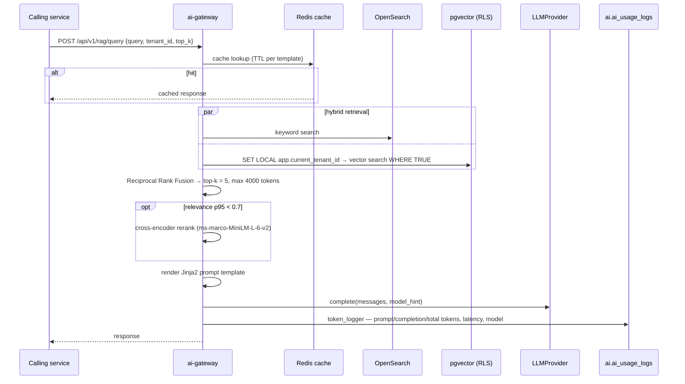

# Phase 11 — AI Foundation

> Compiled from `context/00_master_construction_os.md` § PHASE 11 — AI FOUNDATION COMMAND and the
> specification sections cited inline. `docs/specifications/` wins on any conflict; see
> [README § Authority](README.md).

---

## 1. Overview & goals

The AI layer's plumbing: a single gateway every LLM call passes through, an embedding worker, an OCR
pipeline, and the interfaces that keep the provider swappable.

One principle governs the phase: **never call a provider SDK directly.** Every LLM call goes through
`LLMProvider`, every embedding through `EmbeddingProvider`, every chain through
`LangChainProviderConfig`. The swap path — Claude, Azure OpenAI, or self-hosted Ollama — is a DI token
change, not a refactor.

The services are **Python/FastAPI**, not NestJS, which makes this the phase where the platform stops
being a single-language system.

---

## 2. Scope

### In scope

- Three FastAPI services: `ai-gateway`, `ai-embedding-worker`, `ai-ocr-pipeline`
- Provider interfaces plus stubs that raise rather than guess
- Two-tier model routing, token accounting, Redis response cache
- Hybrid RAG — OpenSearch keyword + pgvector, fused by Reciprocal Rank Fusion
- Prompt templates as versioned Jinja2 files, never strings in source
- `ModelRegistry` and `FeatureStore` interfaces for Phase 23

### Out of scope

- **Mode C, Autonomous** — specified in §22.3, explicitly not implemented in Phases 11–12
- Full MLOps — Phase 23; this phase generates only the interfaces
- Report generation itself — Phase 12

---

## 3. Architecture

```text
services/ai-gateway/
  main.py  auth.py  metering.py  metrics.py  otel.py  flags.py
  providers/  llm_provider · embedding_provider · alternative_llm_provider
              cross_encoder_reranking · weather_provider · langchain_config
  interfaces/ model_registry · feature_store        — Phase 23 seams
  rag/retrieval.py                                   — hybrid + RRF
  middleware/token_logger.py                         — every call, no exceptions
  cache/redis_cache.py
  config/routing.yaml        ai/chains/rag.yaml
  intent/ · digital_twin/                            — Phase 12 / Phase 24 tenants of this service

services/ai-embedding-worker/providers/embedding_provider.py
services/ai-ocr-pipeline/providers/cloud_ocr_provider.py
services/ai-transcription-pipeline/                  — §32.2 row, not a Phase 11 deliverable
ai/prompts/*.j2                                      — repo-root, version-controlled
```

**Chain configs are service-local, prompts are repo-root**, and that asymmetry is a recorded decision:
chains resolve via `providers.langchain_config.CHAINS_DIR` (override `AI_CHAINS_DIR`) under
`services/ai-gateway/ai/chains/`, explicitly **not** repo-root `ai/chains/` (product-owner decision
2026-07-21). Prompts stay at `ai/prompts/` so every service can read them.

---

## 4. Data model

| Table                  | Schema | Note                                                                                                                                     |
| ---------------------- | ------ | ---------------------------------------------------------------------------------------------------------------------------------------- |
| `ai_usage_logs`        | `ai`   | per-call `prompt_tokens` / `completion_tokens` / `total_tokens`, `latency_ms`, `model_used` as a string; `INDEX (tenant_id, created_at)` |
| `document_embeddings`  | `ai`   | `embedding VECTOR(1536)`, `content_hash` SHA-256, `chunk_index`                                                                          |
| `ai_generated_reports` | `ai`   | Phase 12                                                                                                                                 |

**The vector store's isolation is worth reading closely.** `document_embeddings` carries an HNSW index
over `embedding vector_cosine_ops` spanning **all tenants** in the shared tier, plus a
`(tenant_id, source_type, created_at DESC)` index to narrow the candidate set before the ANN scan. The
migration header records the mechanism: `PgVectorBackend.search` issues `WHERE TRUE` and relies
entirely on `set_config('app.current_tenant_id', …, true)` plus a row-security policy to scope rows —
so **RLS is the isolation control here, not a query predicate.** That is a deliberate design (§22.3
"Vector Store Tenant Isolation") and it means a missing `SET LOCAL` would not narrow results, it would
widen them.

`content_hash` gives per-tenant dedup: §22.3 Enforcement Rule 4 notes that two tenants storing
identical text is not a collision to be merged.

---

## 5. API contract

| Endpoint                           | Service             |
| ---------------------------------- | ------------------- |
| `POST /api/v1/ai/completions`      | ai-gateway          |
| `POST /api/v1/rag/query`           | ai-gateway          |
| `POST /api/v1/embeddings/generate` | ai-embedding-worker |
| `POST /api/v1/ocr/process`         | ai-ocr-pipeline     |

---

## 6. Events

Consumed rather than produced: the embedding worker and OCR pipeline both subscribe to file-upload and
report-submission events. `file.document.uploaded.v1` (Phase 9) with a PDF or image MIME type is the
OCR trigger.

---

## 7. Sequence / flows

A RAG query, which is where most of the phase's moving parts meet:



Chunking: recursive character splitter, `chunk_size=500`, `overlap=100` for documents; a site report
is one chunk because it is typically under 500 tokens.

---

## 8. Failure modes & rollback

| Failure                                        | Behaviour today                                                                                |
| ---------------------------------------------- | ---------------------------------------------------------------------------------------------- |
| No real provider configured                    | `StubLLMProvider.complete` raises `NotImplementedError` — fail-fast, per Global Rule 25 Type A |
| Missing `SET LOCAL app.current_tenant_id`      | The vector search's `WHERE TRUE` would not be scoped — RLS is the only guard                   |
| Redis cache unavailable                        | Cache miss path                                                                                |
| **A `summarization` or `classification` call** | **Routed to `gpt-4o`, not `gpt-4o-mini`** — § 14 OQ-40                                         |

**Rollback:** `20260720000001_document_embeddings` and the `ai_usage_logs` migration both have paired
rollbacks, enforced by `scripts/ci/check-migration-rollbacks.mjs`.

---

## 9. Security

**Tenant isolation for vectors is RLS-only** — see § 4. This differs from every other domain, where a
`tenant_id` predicate accompanies RLS as defence in depth; here the query is deliberately `WHERE TRUE`
so that the HNSW index can be used. The consequence is worth stating plainly: on this table, RLS is
not a second line of defence, it is the only line.

**Prompts are never in source.** `ai/prompts/*.j2` are version-controlled files with typed Pydantic
variables, so a prompt change is reviewable as a diff and cannot smuggle instructions through a code
path.

**Autonomous mode's prohibition is not merely unimplemented.** §22.3 Mode C is specified with a hard
boundary — autonomous actions must never trigger financial transactions, approval-gated status
transitions, or data deletions. Nothing in Phases 11–12 implements Mode C, so the prohibition is
currently vacuous; it becomes load-bearing the moment anything does.

Token budgets are enforced per tenant (`metering.py`), which is also the abuse control on a
pay-per-call dependency.

---

## 10. Observability

`otel.py`, `metrics.py` and `middleware/token_logger.py` are first-class modules in the gateway. The
token logger is the phase's key instrument: it writes one `ai_usage_logs` row per call, which is
simultaneously the observability signal, the billing meter (§26.1 AI token metering) and the cost
control.

---

## 11. Testing & acceptance

| Service               | Tests |
| --------------------- | ----- |
| `ai-gateway`          | 36    |
| `ai-embedding-worker` | 9     |
| `ai-ocr-pipeline`     | 4     |

The command requires integration tests of the full RAG pipeline running on `StubLLMProvider`, so no
real API call is made in CI.

---

## 12. Implementation status

Verified on **2026-08-22** against this working tree (Rule 36 — commands run, output summarised).

| Generate item                                      | Status       | Evidence                                                      |
| -------------------------------------------------- | ------------ | ------------------------------------------------------------- |
| FastAPI app per AI service                         | ✅ present   | `ai-gateway`, `ai-embedding-worker`, `ai-ocr-pipeline`        |
| `LLMProvider` + `StubLLMProvider` raising          | ✅ present   | `providers/llm_provider.py:45` — `NotImplementedError`        |
| `EmbeddingProvider` stub + interface               | ✅ present   | in both gateway and worker                                    |
| `LangChainProviderConfig` stub + interface         | ✅ present   | `providers/langchain_config.py`, loads `ai/chains/*.yaml`     |
| **Routing table config, YAML, no hardcoded names** | ❌ **inert** | `config/routing.yaml` exists and **nothing loads it** — OQ-40 |
| pgvector schema, `vector(1536)`                    | ✅ present   | `ai.document_embeddings.embedding VECTOR(1536)` + HNSW        |
| Hybrid RAG retrieval, provider-agnostic            | ✅ present   | `rag/retrieval.py` — keyword + vector, RRF                    |
| Chunking utility                                   | ✅ present   | recursive splitter, 500/100                                   |
| OCR pipeline with pytesseract                      | ✅ present   | `ai-ocr-pipeline`                                             |
| Token usage logger on every LLM call               | ✅ present   | `middleware/token_logger.py`                                  |
| Prompt template loader (Jinja2)                    | ✅ present   | `ai/prompts/` — 5 `.j2` templates, versioned names            |
| Redis response cache                               | ✅ present   | `cache/redis_cache.py`                                        |
| `ai_usage_logs` migration                          | ✅ present   | `ai.ai_usage_logs`                                            |
| `ModelRegistry` / `FeatureStore` interfaces        | ✅ present   | `interfaces/model_registry.py`, `interfaces/feature_store.py` |
| `CloudOCRProvider` stub                            | ✅ present   | `ai-ocr-pipeline/providers/cloud_ocr_provider.py`             |
| `AlternativeLLMProvider` stub                      | ✅ present   | `ai-gateway/providers/alternative_llm_provider.py`            |
| Cross-encoder reranking                            | ✅ present   | `providers/cross_encoder_reranking.py`                        |
| Mode C, Autonomous                                 | ✅ correct   | not implemented — as the command requires                     |
| Unit + integration tests                           | ✅ present   | 49 test files across the three services                       |

---

## 13. Dependencies & risks

**Dependencies:** Phase 8 (events), Phase 9 (the files OCR and embedding consume). Runtime: OpenAI (or
a swapped provider), pgvector, OpenSearch, Redis.

**Risks:** `R-03` (AI/model risk) — `00_master` § Risk Register.

---

## 14. Open questions / NOT SPECIFIED

| #     | Question                                                                                                                                                                                                                                                                                                                                                                                                                                                                                                                                                                                                                                                                                                                                                                                                                                                                                                                                                                                                                                                        | Status                                                                              |
| ----- | --------------------------------------------------------------------------------------------------------------------------------------------------------------------------------------------------------------------------------------------------------------------------------------------------------------------------------------------------------------------------------------------------------------------------------------------------------------------------------------------------------------------------------------------------------------------------------------------------------------------------------------------------------------------------------------------------------------------------------------------------------------------------------------------------------------------------------------------------------------------------------------------------------------------------------------------------------------------------------------------------------------------------------------------------------------- | ----------------------------------------------------------------------------------- |
| OQ-40 | **The two-tier routing table exists as a file and is loaded by nothing; every call goes to `gpt-4o`.** The command requires model routing by `model_hint` through a "two-tier configurable routing table; store in env/YAML, **never hardcode model names**", with `FAST (gpt-4o-mini)` serving `summarization`, `classification` and `autocomplete`. `services/ai-gateway/config/routing.yaml` defines exactly that — and no Python file references it. The gateway routes through `model_for_hint()` in `providers/llm_provider.py`, which reads `MODEL_BY_HINT`, an **empty dict**, and therefore returns the module-level constant `DEFAULT_MODEL = "gpt-4o"` for every hint. `OPENAI_POWERFUL_MODEL` and `OPENAI_FAST_MODEL` appear nowhere outside the YAML — not in code, not in `.env.example`. **Failure scenario:** the FAST tier never activates, so summarisation and classification traffic bills at `gpt-4o` rates, and the model name the command forbids hardcoding is hardcoded. The deliverable is present as a file and absent as behaviour. | Closed 2026-08-22 — resolution in the [register](README.md#open-questions-register) |
