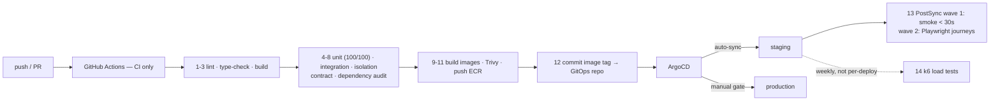

# Phase 17 — DevOps + Deployment

> Compiled from `context/00_master_construction_os.md` § PHASE 17 — DEVOPS + DEPLOYMENT COMMAND and
> the specification sections cited inline. `docs/specifications/` wins on any conflict; see
> [README § Authority](README.md).

---

## 1. Overview & goals

Getting thirteen deployables onto Kubernetes, repeatably, in four environments and two very different
hosting models.

AWS is the authoritative default (EKS + RDS + ElastiCache + MSK + S3), with every cloud-specific
resource marked `# CLOUD: AWS`. On-premise is not an afterthought here: **RKE2 with `profile:cis` is
required for all production on-prem clusters** (ADR-039, revised 2026-07-20), because COS has real
CIS/FIPS customers and k3s cannot produce a CIS self-assessment at all.

The pipeline split is strict: **GitHub Actions is CI only** — no `kubectl`, no `helm upgrade` — and
ArgoCD is CD, syncing from a GitOps repo.

---

## 2. Scope

### In scope

- Terraform for AWS: EKS, RDS, ElastiCache, MSK, S3, KMS
- Helm chart per service with dev/staging/prod values, HPA and PDB
- Dockerfile per service (multi-stage, non-root)
- PgBouncer manifests, cluster autoscaler, namespace resource quotas
- 14-step CI pipeline; ArgoCD GitOps CD with a manual production gate
- Rollback script

### Out of scope

- `apps/mobile` — Expo EAS Build; a Dockerfile is "not required **or permitted**"
- The S3 + Iceberg cold-storage path (Path 2) — architected here, deferred per §9.4, which is the
  same deferral [Phase 14 § 8](phase-14-analytics-dashboard.md) inherits

---

## 3. Architecture

```text
infrastructure/terraform/
  aws/  main.tf · kms.tf · variables.tf · outputs.tf
        modules/{eks,rds,elasticache,msk,s3}/
  cloudflare/                      — Phase 16
  modules/rds-tenant/              — Phase 25

infrastructure/kubernetes/
  argocd/argocd-apps.yaml · argocd/postsync-smoke-test.yaml
  pgbouncer/{deployment,service,configmap,pdb}.yaml
  autoscaler/cluster-autoscaler.yaml
  namespaces/resource-quotas.yaml
  cert-manager/ · sealed-secrets/ · security/ · kong/

infrastructure/helm/               — 11 charts, each with values{,-dev,-staging,-prod}.yaml
scripts/deploy/rollback.sh
.github/workflows/                 — 8 workflows
```

**Node pools are sized by workload shape, not uniformly**: `system-pool` 2 × t3.medium;
`app-pool` 3–10 × t3.xlarge; `ai-pool` 1–4 × t3.2xlarge; `analytics-pool` 1–3 × r5.xlarge
(memory-optimised for ClickHouse). Resource requests differ per runtime — NestJS 100m/256Mi, FastAPI
500m/1Gi, Go workers 200m/128Mi — which is the SERVICE → RUNTIME MAPPING made operational.

---

## 4. Data model

None. The data-relevant decisions here are placement and lifecycle:

| Tier                   | Store                                                                                    |
| ---------------------- | ---------------------------------------------------------------------------------------- |
| Hot (< 90 days)        | RDS multi-AZ, Redis, ClickHouse rolling window, TimescaleDB                              |
| Cold (> 90 days)       | S3 + Apache Iceberg via Debezium CDC → Kafka Connect S3 Sink (§9.4 Path 2, **deferred**) |
| Raw files after 1 year | MinIO lifecycle → S3 Glacier                                                             |

Partitioning: PostgreSQL by `tenant_id` + month on high-volume tables; ClickHouse by `tenant_id` +
`toYYYYMM(date)`; TimescaleDB chunks 1 day (equipment) and 1 week (workforce) — matching what
[Phase 21](phase-21-equipment-service.md) and [Phase 22](phase-22-workforce-service.md) create.

Multi-region is **active-passive**: primary `ap-southeast-7` (Bangkok), DR `ap-southeast-1`
(Singapore), Route 53 latency routing, triggered by the first tenant with a residency requirement.
Active-active is explicitly not planned.

---

## 5. API contract

None. The interfaces are the CI pipeline's 14 steps and ArgoCD's sync contract.

**PgBouncer is a hard constraint rather than a convenience**: `pool_mode = transaction` is REQUIRED,
session and statement modes PROHIBITED (QM-18, §7.9), and the application's `DATABASE_URL` must
resolve to the PgBouncer service — never to PostgreSQL port 5432. The committed ConfigMap matches the
baseline exactly: `default_pool_size=25`, `max_client_conn=1000`, `server_idle_timeout=600`.

---

## 6. Events

None.

---

## 7. Sequence / flows



Rolling deployment with max surge 1 / max unavailable 0; automatic rollback after three consecutive
liveness failures; canary via Argo Rollouts. ArgoCD self-heals — a manual `kubectl` change is reverted
within the 3-minute sync interval — and `argocd app rollback` is instant with no pipeline re-run.

---

## 8. Failure modes & rollback

| Failure                                            | Behaviour today                                                      |
| -------------------------------------------------- | -------------------------------------------------------------------- |
| Liveness probe fails 3× after deploy               | Automatic rollback                                                   |
| Someone runs `kubectl edit` in production          | ArgoCD reverts within ~3 minutes                                     |
| A bad image reaches production                     | `argocd app rollback <app> <revision>` — instant                     |
| Helm release needs reverting                       | `scripts/deploy/rollback.sh`                                         |
| A chart omits `seccompProfile` under `profile:cis` | **Pod rejected while the Deployment is admitted — a silent failure** |
| A chart probes a path the service does not serve   | CrashLoop in production; lint and dry-run do not catch it            |

**Both of those last two are recorded findings from the 2026-07-20 Linux POC, not hypotheticals.**
RKE2 `profile:cis` enforces PodSecurity `restricted`, and all eight charts then lacked
`seccompProfile` — Deployments were admitted, Pods were rejected, and nothing said so. All 11 charts
now set `seccompProfile.type=RuntimeDefault`, marked **DO NOT REMOVE**. Separately, four charts probed
`/health` or `/healthz` where the service serves `/health/live`.

**`cos-file-service` and `cos-web` probes remain UNVERIFIED** — the POC says so explicitly. Only a real
deploy catches this class of defect.

**FIPS status must be worded precisely.** The host OS is Ubuntu 24.04 with the community RKE2 build
(product-owner decision: no RHEL/SLES procurement), which is outside both FIPS certificates' tested
operating environments. The correct phrasing is "uses the FIPS 140-3 validated BoringCrypto module
(CMVP #4735) on a user-ported OE" — **never** "FIPS 140-3 validated".

---

## 9. Security

Secret management is conditional on deployment type (§5.2): AWS Secrets Manager + External Secrets
Operator in cloud; HashiCorp Vault 1.16+ with the Agent sidecar injector on-premise; sealed-secrets
across both for anything committed to git. **All secrets are committed as `SealedSecret`, never as a
plain `Secret`.**

Rotation: AWS SM rotation Lambda per resource type in cloud; Vault database secrets engine with 24-hour
dynamic-secret TTL on-premise. JWT signing keys rotate through the JWKS endpoint, which is what makes
that rotation zero-downtime.

Dockerfiles are multi-stage with a non-root user. Trivy scans every image; the dependency audit blocks
on High/Critical across `pnpm audit`, `pip-audit` and `govulncheck` — three ecosystems, because the
platform is four languages.

Kubernetes version is pinned **≤ 1.34** while CIS compliance is required, because kube-bench's
`cis-1.12` benchmark covers only 1.32–1.34.

---

## 10. Observability

Phase 15 supplies the stack; this phase supplies what it scrapes. The `kubernetes-pods` scrape job and
the `node-exporter` job come from here, and `ServiceDown` / `DiskUsageHigh` / `MemoryPressure` are
alerts on this phase's objects.

---

## 11. Testing & acceptance

The pipeline is the test surface. Eight workflow files: `ci.yml`, `ci-coverage-guard.yml`, `codeql.yml`,
`semgrep.yml`, `dast.yml`, `load-tests.yml`, `mutation-tests.yml`, `lighthouse.yml` — four more than
the command's step list names, each an additional gate.

Post-deploy verification is staged: ArgoCD PostSync wave 1 runs smoke tests (health/auth/core-read,
under 30 s), wave 2 runs Playwright critical journeys. Load tests are **weekly against staging, not
per-deploy** (§30.9).

---

## 12. Implementation status

Verified on **2026-08-22** against this working tree (Rule 36 — commands run, output summarised).

| Generate item                                      | Status     | Evidence                                                                  |
| -------------------------------------------------- | ---------- | ------------------------------------------------------------------------- |
| Terraform modules — EKS, RDS, ElastiCache, MSK, S3 | ✅ present | `terraform/aws/modules/{eks,rds,elasticache,msk,s3}/`, wired in `main.tf` |
| Helm chart per service                             | ✅ present | 11 charts                                                                 |
| `values-dev` / `-staging` / `-prod` per chart      | ✅ present | e.g. `cos-backend/` carries all three plus `values.yaml`                  |
| HPA per service                                    | ✅ present | 11 HPA templates                                                          |
| PodDisruptionBudget per service                    | ✅ present | 11 PDB templates                                                          |
| `seccompProfile` on all charts (POC fix)           | ✅ present | 11 charts set it — **DO NOT REMOVE**                                      |
| GitHub Actions workflows                           | ✅ present | 8 files                                                                   |
| Dockerfile per service                             | ✅ present | 12 Dockerfiles                                                            |
| `apps/mobile` has no Dockerfile                    | ✅ correct | absent, as the command requires                                           |
| PgBouncer manifests                                | ✅ present | deployment · service · configmap · pdb; `pool_mode = transaction`         |
| sealed-secrets examples                            | ✅ present | `sealed-secrets/cos-sealed-secrets.yml`                                   |
| Cluster Autoscaler manifests                       | ✅ present | `autoscaler/cluster-autoscaler.yaml`                                      |
| Resource quota per namespace                       | ✅ present | `namespaces/resource-quotas.yaml`                                         |
| Rollback script                                    | ✅ present | `scripts/deploy/rollback.sh`                                              |
| ArgoCD applications + PostSync smoke               | ✅ present | `argocd/argocd-apps.yaml`, `argocd/postsync-smoke-test.yaml`              |
| KMS CMK Terraform                                  | ✅ present | `terraform/aws/kms.tf` (Phase 16 deliverable, hosted here)                |
| S3 + Iceberg cold path (Path 2)                    | — deferred | §9.4 — architected, not built; consequence recorded in Phase 14           |

---

## 13. Dependencies & risks

**Dependencies:** every phase that produces a deployable. Phase 15's scrape configs assume this
phase's pod labels.

**Risks:** the two POC findings in § 8 are the live ones — `cos-file-service` and `cos-web` health
probes are still unverified against a real cluster.

---

## 14. Open questions / NOT SPECIFIED

**OQ-53 — closed 2026-08-23.** [PgBouncer could not start as committed](README.md#open-questions-register).
QM-18 makes it mandatory between every service and PostgreSQL and `db-failover.md` restarts it after
a failover, but the Deployment reads a `pgbouncer-secrets` Secret that exists nowhere in the
repository, and `auth_file = /etc/pgbouncer/userlist.txt` points into a ConfigMap mount whose only
key is `pgbouncer.ini` — so the auth file will not exist and PgBouncer can authenticate nobody.
Surfaced by wiring `cos-pgbouncer` into ArgoCD. Resolved with `auth_query` through a SECURITY
DEFINER function — no auth file to mount, and adding an application role needs no config change.
`pgbouncer_auth` can execute that one function and read nothing else, verified on a live database.
The `pgbouncer-secrets` Secret and the role's password remain ops.

No NEW open questions. One item carried from elsewhere lands here operationally:

- The unverified `cos-file-service` / `cos-web` probes are a **known** gap the POC recorded, not an
  open question — the answer is a real deploy, not a decision.

[OQ-32](README.md#open-questions-register) — the five Temporal workers that had no Helm chart, no
Compose service and no row in §32.2 — was fixed in this phase on 2026-08-22: two Deployments now
run all five queues, wired into ArgoCD, Compose and the deployable table.
