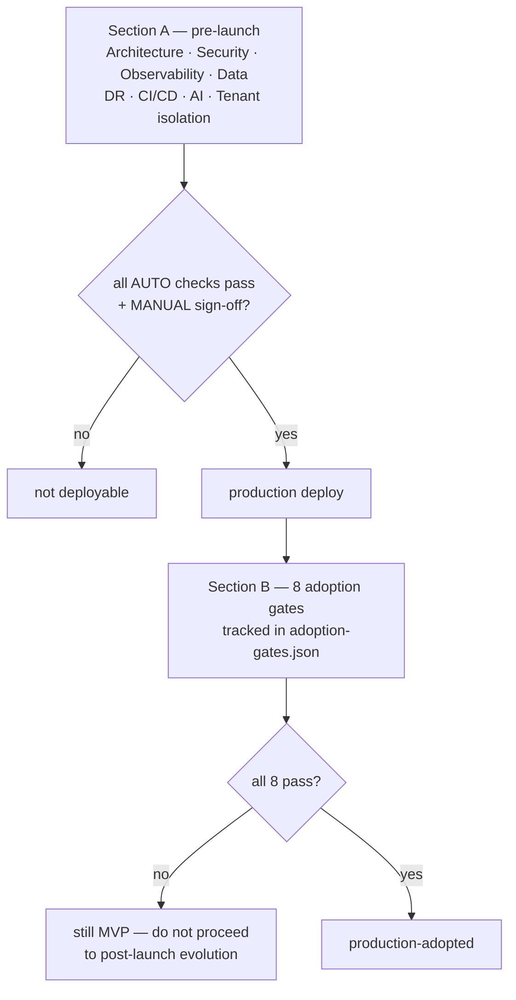

# Phase 19 — Final Production Readiness

> Compiled from `context/00_master_construction_os.md` § PHASE 19 — FINAL PRODUCTION READINESS COMMAND
> and the specification sections cited inline. `docs/specifications/` wins on any conflict; see
> [README § Authority](README.md).

---

## 1. Overview & goals

Two checklists that answer two different questions.

**Section A — pre-launch** asks whether the system is _deployable_: health probes, TLS, RLS, backups,
DR targets, ArgoCD gating, AI monitoring, tenant isolation. Each item is tagged `[AUTO]` (a script
verifies it) or `[MANUAL]` (a human must), and the distinction is honest — the checklist does not
pretend that "all services stateless" or "no direct cross-service DB queries" can be automated.

**Section B — post-launch adoption** asks something harder: whether the platform is _used_. Eight
gates, all binary, none technical — DAU non-zero for 30 consecutive days, three workflows in daily
use, real financial transactions, active mobile usage, at least one team operationally dependent, an
on-call rotation that has handled a real incident, and survival of an unplanned outage without data
loss. **If any gate fails, the platform is still MVP.**

That second checklist is the more unusual artifact, and it is the one that prevents "deployed" from
being mistaken for "done".

---

## 2. Scope

### In scope

- The two checklists and the scripts that automate Section A's `[AUTO]` items
- Runbooks: production readiness, deployment, rollback, incident response
- Architecture documentation and ADRs for each major technology choice
- The adoption-gate Grafana dashboard
- `cos-audit/` and `docs/evidence/slo-monthly-reviews/` as committed directories

### Out of scope

- Post-launch evolution phases — gated behind all eight Section B gates passing

---

## 3. Architecture

```text
scripts/readiness/
  run-all-checks.sh
  verify-production-readiness.sh
  check-{health,security,security-headers,data,cicd,observability}.sh
  check-{schema-registry,schema-contract,service-runtimes,openapi-freshness,i18n-completeness}.sh

docs/runbooks/          21 entries — production-readiness · deployment · rollback ·
                        incident-response · db-failover · disaster-recovery · on-call-rotation ·
                        postmortem-template · temporal-worker-restart · …
docs/evidence/slo-monthly-reviews/
cos-audit/              directory committed, *.log git-ignored
infrastructure/monitoring/grafana/dashboards/adoption-gates.json
```

Twelve readiness check scripts, one per checklist section plus five the command does not enumerate
(schema contract, service runtimes, OpenAPI freshness, i18n completeness, security headers) — each an
additional automated gate.

---

## 4. Data model

None. The data-relevant checks are backup and durability posture:

| Store      | Requirement                                                                                            |
| ---------- | ------------------------------------------------------------------------------------------------------ |
| PostgreSQL | daily automated backups, 30-day retention, PITR                                                        |
| Neo4j      | daily `neo4j-admin backup` → S3, 7-day retention — sufficient because the KG is rebuildable from Kafka |
| ClickHouse | daily `clickhouse-backup` → S3, 7-day retention — re-ingestible from Kafka                             |
| MinIO      | replication, 3 drives minimum                                                                          |
| Redis      | AOF persistence                                                                                        |
| Kafka      | replication factor 3, min ISR 2                                                                        |

The two derived stores get shorter retention **because they are derived** — the same reasoning
[Phase 13](phase-13-knowledge-graph.md) applies to the graph being non-authoritative. That is only
true while the events they rebuild from are still in Kafka, which
[Phase 14 § 8](phase-14-analytics-and-dashboard.md) notes is bounded by the retention window until the
Iceberg lake lands.

DR targets: **RTO 30 minutes, RPO 15 minutes**, achieved by automated failover — RDS Multi-AZ (~60 s),
Kubernetes liveness-triggered restarts, Route 53 health-check failover — explicitly "not manual
intervention".

---

## 5. API contract

None.

---

## 6. Events

None.

---

## 7. Sequence / flows



---

## 8. Failure modes & rollback

The runbook set is the failure-mode documentation for the whole platform, not just this phase:
`incident-response.md`, `rollback.md`, `db-failover.md`, `disaster-recovery.md`,
`kafka-partition-rebalance.md`, `keycloak-realm-recovery.md`, `postmortem-template.md`,
`on-call-rotation.md`.

**One checklist item is worth tracing end to end**, because it shows both what this gate catches and
what it cannot:

> `[AUTO] Temporal worker has at least 2 replicas in production`
> `→ kubectl get deployment temporal-worker -o jsonpath='{.spec.replicas}'`

The checklist names the Deployment `temporal-worker`, and no release of this repository ever
produces that name: Helm derives it from the release and chart, so ArgoCD deploys
`cos-temporal-worker-cos-temporal-worker`. A check written the way the checklist reads would have
returned 0 replicas forever — indistinguishable from the real absence it exists to catch, and
FAILING SILENTLY IN THE SAFE DIRECTION is the worse half: the gate would have reported a genuine
problem for the wrong reason and been "fixed" by someone renaming a Deployment.
`scripts/readiness/verify-production-readiness.sh` therefore selects by
`app.kubernetes.io/name=cos-temporal-worker` instead.

The Deployment itself now exists — [OQ-32](README.md#open-questions-register), closed 2026-08-22,
put all five queues behind two Deployments. What remains is that this script **has never been run
against a cluster where it could report anything**, so every AUTO item in Section A is unexercised.

---

## 9. Security

Section A's security block is a re-verification of Phase 16 in a running environment rather than in
the repository — TLS 1.3 measured with `nmap`, sealed-secrets confirmed by querying the cluster for
unsealed Secrets, Trivy CRITICAL count, OWASP ZAP baseline against staging.

Three items are `[MANUAL]` and none of them can be otherwise: RLS enabled on all tenant-scoped tables,
audit-log DENY UPDATE/DELETE, and **MFA enforced for `TENANT_ADMIN` and `FINANCE` in Keycloak**.

That last one is [OQ-10](README.md#open-questions-register): Layer 1 now exists in the realm file and
is CI-guarded, but `MFA_ENFORCE` still defaults to `false` and a running Keycloak does not pick up the
realm file on restart. A manual verifier signing this line off today would need to check the live
realm, not the repository.

The tenant-isolation block is three automated tests — cross-tenant access, RLS policies via a direct
DB connection, and Keycloak realm isolation.

---

## 10. Observability

The observability block verifies Phase 15 end to end from the outside: Prometheus targets up, Loki
receiving, Jaeger receiving, alert rules loaded, dashboards populated.

One item deserves attention against [OQ-43](README.md#open-questions-register):

> `[AUTO] DLQ depth alert verified (trigger test message to DLQ)`

This is the right shape of check — it does not ask whether the rule exists, it asks whether the alert
**fires**. Run today it would fail, because `kafka_dlq_depth` has no producer. Like the Temporal
replica check, the gate was designed correctly and the finding precedes its first real execution.

---

## 11. Testing & acceptance

Acceptance is the two checklists themselves. `run-all-checks.sh` writes sign-off logs into
`cos-audit/`, whose contents are git-ignored while the directory is committed (`.gitignore` lines
108–110) — required as the Stage 1→2 transition gate per §32.11.

`docs/evidence/slo-monthly-reviews/` receives `YYYY-MM.md` notes written by the Engineering Lead on the first
business day of each month, escalating to the product owner when the error budget falls below 20%
(§31.6).

---

## 12. Implementation status

Verified on **2026-08-22** against this working tree (Rule 36 — commands run, output summarised).

| Generate item                                   | Status      | Evidence                                                                                         |
| ----------------------------------------------- | ----------- | ------------------------------------------------------------------------------------------------ |
| `docs/runbooks/production-readiness.md`         | ✅ present  | —                                                                                                |
| `docs/runbooks/deployment.md`                   | ✅ present  | plus `deployment-windows.md`                                                                     |
| `docs/runbooks/rollback.md`                     | ✅ present  | —                                                                                                |
| `docs/runbooks/incident-response.md`            | ✅ present  | plus `postmortem-template.md`, `on-call-rotation.md`                                             |
| Architecture documentation                      | ✅ present  | `docs/architecture/README.md` incl. C4 L1–L3                                                     |
| ADR per major technology choice                 | ✅ present  | 96 ADR files                                                                                     |
| Readiness verification scripts                  | ✅ present  | `scripts/readiness/` — 12 scripts incl. `verify-production-readiness.sh` and `run-all-checks.sh` |
| Adoption gate dashboard                         | ✅ present  | `grafana/dashboards/adoption-gates.json`                                                         |
| `cos-audit/` committed, logs ignored            | ✅ present  | `.gitignore` 108–110, `.gitkeep` retained                                                        |
| `docs/evidence/slo-monthly-reviews/`            | ✅ present  | —                                                                                                |
| CI contains no `kubectl apply` / `helm upgrade` | ✅ verified | grep over `.github/workflows/` returns **0** matches                                             |

**One path in the command is stale.** The Section A legend points at
`scripts/readiness/verify-production-readiness.sh`, and the `cos-audit/` item at `run-all-checks.sh`; both live
under `scripts/readiness/`. The scripts exist — only the reference is off by a directory.

---

## 13. Dependencies & risks

**Dependencies:** every phase. This one verifies the others.

---

## 14. Open questions / NOT SPECIFIED

None new. This phase is where three existing entries would be caught by a gate that already exists:

- [OQ-32](README.md#open-questions-register) — the `temporal-worker` replica check at
  `verify-production-readiness.sh:101`. Note that three documents assume three different homes for
  the worker: this checklist expects a `temporal-worker` Deployment,
  `docs/runbooks/temporal-worker-restart.md` looks for it inside the `cos-backend` pod
  (`-l app.kubernetes.io/name=cos-backend`), and the code is a standalone `require.main === module`
  entrypoint the backend never imports. Whichever home is chosen, two of the three need updating.
- [OQ-43](README.md#open-questions-register) — the "DLQ depth alert verified" check.
- [OQ-10](README.md#open-questions-register) — the manual MFA sign-off line.
