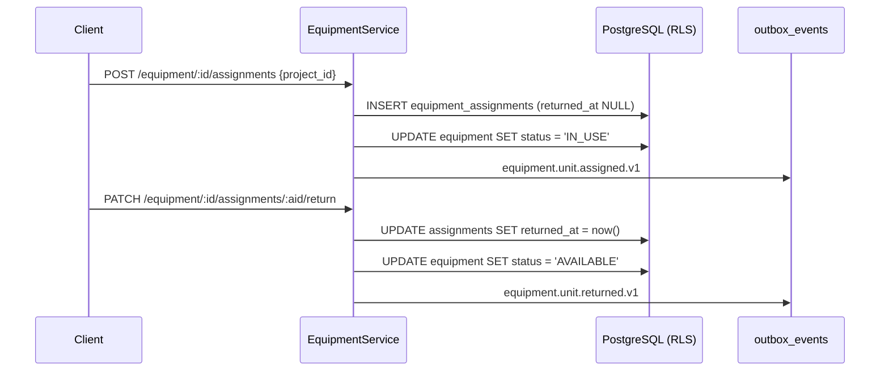

# Phase 21 — Equipment Service

> Compiled from `context/00_master_construction_os.md` § PHASE 21 — EQUIPMENT SERVICE COMMAND and the
> specification sections cited inline. `docs/specifications/` wins on any conflict; see
> [README § Authority](README.md).

---

## 1. Overview & goals

Equipment tracking — the units themselves, their assignment to projects, their maintenance and their
utilisation over time (`00_master` § Phase Register: objective "equipment domain", deps `Ph2, Ph3`,
risk `R-02`).

The one structural difference from the other domain phases: **utilisation is time-series data in a
TimescaleDB hypertable**, not an ordinary table. That choice is what makes the IoT pipeline a later
extension rather than a redesign — telemetry arrives in the same shape daily utilisation already
takes.

Exit condition: "equipment APIs pass the isolation-test suite"
(`00_master` § Phase Register, Phase 21 exit).

---

## 2. Scope

### In scope

- Equipment register, assignment to projects, maintenance log
- Daily utilisation recorded into a hypertable
- Three Kafka events on the assignment/maintenance lifecycle

### Out of scope

- IoT telemetry **behaviour** — a stub; the platform decision is resolved (EMQX) but no fleet is
  onboarded
- Digital-twin modelling — Phase 24

---

## 3. Architecture

```text
modules/equipment/
  equipment.{controller,service,repository,module}.ts
  dto/  create · assign · update-status · log-maintenance · record-utilization
  iot-integration.stub.ts
```

The IoT path, when it is activated, does not run through this module at all:

```text
IoT device → EMQX (MQTT 5.0, self-hosted) → IoT Ingestion Worker (Go) → Kafka (MSK) → TimescaleDB
```

**EMQX's native Kafka data-bridge is deliberately not used** — it is a paid Enterprise feature, so a
custom Go worker (`services/iot-ingestion-worker/`) forwards telemetry instead (§33.8,
`32-implementation-specifications` §32.2). Both EMQX and that worker already exist in the deployment
surface: EMQX in `docker-compose.yml`, the worker with its own Helm chart and values files.

That makes this phase's stub unusual among the extension points — the _infrastructure_ is built and
deployable; only the application-level `streamTelemetry` interface is unimplemented, and its trigger
is a business condition (a fleet with sensors being onboarded), not missing engineering.

---

## 4. Data model

Three relational tables plus one hypertable, in two schemas.

| Table                   | Schema                | Note                                                                                                             |
| ----------------------- | --------------------- | ---------------------------------------------------------------------------------------------------------------- |
| `equipment`             | `equipment`           | `UNIQUE (tenant_id, equipment_code)`; 7-value type enum; 4-value status enum                                     |
| `equipment_assignments` | `equipment`           | `returned_at` NULL means still on the project                                                                    |
| `equipment_maintenance` | `equipment`           | `SCHEDULED` / `UNSCHEDULED` / `REPAIR`; cost in `DECIMAL(19,4)`                                                  |
| `equipment_utilization` | `equipment_telemetry` | **TimescaleDB hypertable**, partitioned on `recorded_at`, 1-day chunks; `INDEX (equipment_id, recorded_at DESC)` |

The hypertable is created explicitly by the migration — `create_hypertable(...,
chunk_time_interval => INTERVAL '1 day', if_not_exists => TRUE)` — and the migration grants to
`app_user` like every other schema, so RLS and the non-superuser connection apply to time-series data
the same way they apply to relational rows.

Splitting telemetry into its own schema (`equipment_telemetry`) rather than keeping it in `equipment`
is what lets retention and chunk policies apply to the time-series data without touching the register.

---

## 5. API contract

All nine endpoints in the command exist, across two controllers.

| Endpoint                                       | Built |
| ---------------------------------------------- | ----- |
| `POST /equipment`                              | ✅    |
| `GET /equipment` (filter by status, type)      | ✅    |
| `GET /equipment/:id`                           | ✅    |
| `PATCH /equipment/:id/status`                  | ✅    |
| `POST /equipment/:id/assignments`              | ✅    |
| `PATCH /equipment/:id/assignments/:aid/return` | ✅    |
| `POST /equipment/:id/maintenance`              | ✅    |
| `POST /equipment/:id/utilization`              | ✅    |
| `GET /projects/:projectId/equipment`           | ✅    |

The project-scoped list lives on its own `@Controller('projects/:projectId/equipment')` rather than as
a nested route on the equipment controller — the same pattern Phase 3 uses for spatial hierarchy.

---

## 6. Events

| Event type                                | Payload                                     | Built |
| ----------------------------------------- | ------------------------------------------- | ----- |
| `equipment.unit.assigned.v1`              | `{ equipment_id, project_id, assigned_by }` | ✅    |
| `equipment.unit.returned.v1`              | `{ equipment_id, project_id }`              | ✅    |
| `equipment.unit.maintenance_scheduled.v1` | `{ equipment_id, scheduled_at }`            | ✅    |

All three specified events exist and no others. The names already carry the §32.4
`{domain}.{entity}.{action}.v{N}` form in the command itself — `equipment` domain, `unit` entity —
which is not true of the earlier phase commands.

---

## 7. Sequence / flows

Assignment and return, the phase's only stateful pair:



Utilisation is a plain append into the hypertable — no state, no event.

---

## 8. Failure modes & rollback

| Failure                                | Behaviour today                                                  |
| -------------------------------------- | ---------------------------------------------------------------- |
| Duplicate `equipment_code` in a tenant | Rejected by `UNIQUE (tenant_id, equipment_code)`                 |
| Assigning equipment already `IN_USE`   | Status-transition validation in the service                      |
| Utilisation written for a retired unit | Accepted — the hypertable has no status predicate                |
| Outbox insert lost                     | durable, not atomic — [OQ-18](README.md#open-questions-register) |

**Rollback:** the equipment migration has a paired rollback, enforced by
`scripts/ci/check-migration-rollbacks.mjs`. A hypertable rollback is not an ordinary `DROP TABLE`
concern here because the migration creates both the table and the hypertable conversion in one step.

---

## 9. Security

Tenant isolation via RLS on both schemas — [README § Tenant isolation](README.md#tenant-isolation).
The `equipment_telemetry` grant to `app_user` is what makes the hypertable subject to the same
non-superuser connection as everything else; a time-series table reached by a privileged connection
would be a silent hole in the isolation story.

When the IoT path activates, the trust boundary moves: telemetry originates from devices, not from
authenticated users, and EMQX becomes an authentication surface. Nothing in this phase's code covers
that yet — it belongs with the ingestion worker.

---

## 10. Observability

The hypertable is the observable asset: chunk growth and query latency on
`equipment_telemetry.equipment_utilization` are what indicate whether the time-series design is
holding. Cross-cutting baseline in
[README § Observability baseline](README.md#observability-baseline).

---

## 11. Testing & acceptance

3 spec files. The command asks for unit tests on status transitions and assignment logic.

Acceptance is the Phase Register exit: "equipment APIs pass the isolation-test suite."

---

## 12. Implementation status

Verified on **2026-08-22** against this working tree (Rule 36 — commands run, output summarised).

| Generate item                                     | Status     | Evidence                                                                   |
| ------------------------------------------------- | ---------- | -------------------------------------------------------------------------- |
| NestJS module / service / repository / controller | ✅ present | `equipment.{module,service,repository,controller}.ts`                      |
| TimescaleDB hypertable migration                  | ✅ present | `20260608000005_equipment_service:102` — `create_hypertable`, 1-day chunks |
| PostgreSQL migration for equipment entities       | ✅ present | all three relational tables in the same migration                          |
| OpenAPI 3.1                                       | ✅ present | controller decorators                                                      |
| Unit tests — status transitions, assignment       | ✅ present | 3 spec files                                                               |
| `equipment.unit.assigned.v1`                      | ✅ present | —                                                                          |
| `equipment.unit.returned.v1`                      | ✅ present | —                                                                          |
| `equipment.unit.maintenance_scheduled.v1`         | ✅ present | —                                                                          |
| IoT integration stub                              | ✅ present | `iot-integration.stub.ts` — EMQX pipeline documented, trigger stated       |

**Nothing in this phase's Generate list is missing or altered.** It is the most conformant phase in
the batch, which is worth recording as plainly as a discrepancy would be.

---

## 13. Dependencies & risks

**Dependencies:** `Ph2, Ph3` — Phase 3 supplies `project_id`. TimescaleDB is a runtime prerequisite;
the Phase 1 Compose stack already provides it (`timescale/timescaledb:latest-pg18`).

**Risks:** `R-02` — `00_master` § Risk Register.

---

## 14. Open questions / NOT SPECIFIED

None raised by this page. The one decision that could have been open — the IoT platform — is
explicitly RESOLVED in the command ("IoT platform RESOLVED — EMQX self-hosted on EKS"), with Azure IoT
Hub excluded and AWS IoT Core deferred, and both EMQX and the forwarding worker are already in the
deployment surface.
