# Phase 23 — MLOps Pipeline

> Compiled from `context/00_master_construction_os.md` § PHASE 23 — MLOPS PIPELINE COMMAND and the
> specification sections cited inline. `docs/specifications/` wins on any conflict; see
> [README § Authority](README.md).

---

## 1. Overview & goals

Continuous training and deployment for the five models §22.6 names — and, more importantly, the
**gates that decide when each may be trained at all.**

Every model in this phase has a trigger, and four of the five are data thresholds rather than dates:
90+ days of production data for delay forecasting, 10,000+ labelled photos for safety vision, 6+
months of graph relationships for graph ML, 50+ full-lifecycle projects for risk classification. The
fifth, `DeviceTrustModel`, has no count trigger at all and says why — its positive class is rare by
design, so a count would promote an untrained model.

Depends on Phase 11 (the interfaces) and Phase 14 (the analytics that feed training data).

---

## 2. Scope

### In scope

- Airflow DAGs (stubs with explicit TODOs), MLflow deployment, Feast configuration, Kubeflow pipeline
- Data-lake export: PostgreSQL/ClickHouse → MinIO Parquet
- Concrete `ModelRegistry` and `FeatureStore` behind Phase 11's interfaces
- Model stubs for all five §22.6 models

### Out of scope

- Training any model — every one is threshold-gated and no threshold is met
- `AutonomousWorkflowExecutor` — "Phase 23+ — do **NOT** activate in Phase 23 itself", stub only,
  governance review required

---

## 3. Architecture

```text
mlops/
  airflow/dags/   dag_export_training_data · dag_train_delay_model · dag_train_risk_classifier
                  dag_update_feature_store · dag_model_evaluation · dag_train_device_trust_model
  feast/features/ project_features · procurement_features · site_features
  data_export/export_to_parquet.py        — pandas + pyarrow
  interfaces/ · models/ · kubeflow/ · mlflow/
  requirements-{base,airflow,feast,mlflow,dev}.txt   — split per component
infrastructure/kubernetes/mlflow/deployment.yaml
```

**Feast's offline store is PostgreSQL, and the reasoning is recorded rather than assumed.** Both
ClickHouse and PostgreSQL are Feast _contrib_ stores (neither is core — core is
BigQuery/Snowflake/Redshift/Dask), and ClickHouse's own guidance is that a Feast "literal store"
underutilises it. PostgreSQL reuses the existing RDS (`feast_offline` schema) and is the more widely
used contrib path. Features that originate in ClickHouse analytics are **bridged** into
`feast_offline` by `dag-update-feature-store` (decision 2026-07-23).

Online store is Redis, for real-time inference.

Requirements are split into five files rather than one — Airflow, Feast and MLflow each pin
incompatible dependency sets, and a single file would force one of them to lose.

---

## 4. Data model

No platform tables. Two stores are added:

| Store           | Contents                                                                     |
| --------------- | ---------------------------------------------------------------------------- |
| MinIO data lake | `cos-datalake-{tenant_id}/{dataset}/dt={ds}/` — Parquet, partitioned by date |
| `feast_offline` | a schema on the existing RDS — Feast's contrib PostgreSQL offline store      |

Three Feast feature views: `project_features` (budget variance, days to deadline, open issues),
`procurement_features` (average delivery delay, RFQ-to-PO days, overdue invoices), `site_features`
(7-day manpower average, inspection failure rate, report submission rate).

The data-lake bucket is **per tenant**, which is the same isolation model
[Phase 9](phase-09-file-document-system.md) uses for files — bucket-level rather than row-level,
because there are no rows to apply RLS to.

---

## 5. API contract

None public. The interfaces are Phase 11's, now with concrete implementations:

- `ModelRegistry.registerModel(name, version, artifactPath) → ModelRef` — MLflow-backed
- `FeatureStore.getOnlineFeatures(entityRows) → FeatureVector[]` — Feast-backed
- `ExperimentMonitoring.logRun(experimentName, metrics, params) → RunRef` — MLflow, with Evidently AI
  for evaluation and drift

All three are **in-cluster with no external SaaS or API key** — the point of ADR-038's replacement of
W&B.

---

## 6. Events

None.

---

## 7. Sequence / flows

```mermaid
flowchart LR
    OP["PostgreSQL · ClickHouse"] --> EX["dag-export-training-data<br/>daily → Parquet"]
    EX --> DL["MinIO cos-datalake-{tenant}"]
    DL --> FE["dag-update-feature-store<br/>daily; bridges ClickHouse → feast_offline"]
    FE --> FS["Feast<br/>offline: PostgreSQL · online: Redis"]
    DL --> TR["dag-train-* (weekly)<br/>Cleaning → Features → Training"]
    FS --> TR
    TR --> ML["MLflow<br/>experiments · model registry"]
    ML --> EV["dag-model-evaluation<br/>holdout set → Evidently AI"]
    EV --> KF["Kubeflow<br/>evaluation + deployment"]
    KF --> GW["AI Gateway endpoint<br/>canary or blue-green"]
    GW --> PM["Prometheus model metrics"]
```



---

## 8. Failure modes & rollback

| Failure                                 | Behaviour today                                                                              |
| --------------------------------------- | -------------------------------------------------------------------------------------------- |
| A model is trained before its threshold | Prevented by policy, not by code — the DAGs are stubs with TODOs                             |
| `DeviceTrustModel` promoted on a count  | Explicitly forbidden — promotion requires beating the rule-based baseline on held-out PR-AUC |
| Model degrades after deployment         | Evidently AI drift monitoring; Prometheus model metrics                                      |
| A new model endpoint is bad             | Canary or blue-green at the AI Gateway                                                       |

**The `DeviceTrustModel` trigger is the most carefully reasoned decision in the phase**, and worth
preserving verbatim in effect: the positive class ("device later revoked as compromised") is rare by
design, so a count or calendar trigger "would promote an untrained model, and accuracy and ROC-AUC
both stay flattering under that imbalance". Day one is a deterministic rule-based scorer serving
behind the same interface, and it **is** the baseline the model must beat. While it serves, "the
surface must NOT be described as AI-derived" — which is exactly the caveat
[Phase 2](phase-02-auth-tenant-system.md) and the SMS OTP risk assessment both repeat about ADR-081.

---

## 9. Security

**Advisory only, and enforced by design rather than by policy.** `DeviceTrustModel` "never revokes a
device, never blocks a login" (§22.3 autonomous-mode prohibition, ADR-081). Its model card must record
the PR-AUC margin that authorised promotion (§22.9).

`AutonomousWorkflowExecutor` carries the same prohibition one level up: never trigger financial
transactions, human-approval workflows, or data deletions — stub only, governance review required
before activation. It is the concrete form of Phase 11's Mode C boundary.

Training data is tenant-partitioned at the bucket level. Nothing in this phase's DAGs crosses tenants,
and a model trained on one tenant's data serving another would be a data-protection issue, not just a
correctness one — worth an explicit statement in the model card when the first model is promoted.

---

## 10. Observability

Prometheus metrics on model performance close the loop, and Evidently AI supplies drift monitoring —
self-hosted, in-cluster, no API key.

The signal absent today is the one that matters most: nothing measures whether a data threshold has
been reached, so "is `DelayForecastModel` trainable yet?" is answered by inspection rather than by a
dashboard.

---

## 11. Testing & acceptance

`mlops/pytest.ini` configures the suite. The command asks for unit tests on DAG task functions with
mocked data sources, and an integration test of an end-to-end Airflow DAG run on test data.

---

## 12. Implementation status

Verified on **2026-08-22** against this working tree (Rule 36 — commands run, output summarised).

| Generate item                                  | Status               | Evidence                                                                 |
| ---------------------------------------------- | -------------------- | ------------------------------------------------------------------------ |
| Airflow DAG files — all 5                      | ✅ present           | `mlops/airflow/dags/` — the 5 named, plus `dag_train_device_trust_model` |
| MLflow deployment                              | ✅ present           | `infrastructure/kubernetes/mlflow/deployment.yaml`                       |
| Feast configuration + feature views            | ✅ present           | `mlops/feast/features/` — project, procurement, site                     |
| Kubeflow pipeline                              | ✅ present           | `mlops/kubeflow/`                                                        |
| MinIO data-lake bucket `cos-datalake-{tenant}` | ✅ present           | referenced by `dag_export_training_data.py`                              |
| PostgreSQL → Parquet export utility            | ✅ present           | `mlops/data_export/export_to_parquet.py` — pandas + pyarrow              |
| `ModelRegistry` / `FeatureStore` concretes     | ✅ present           | `mlops/interfaces/`, backing Phase 11's abstractions                     |
| Five §22.6 model stubs                         | ✅ present           | `mlops/models/`                                                          |
| `AutonomousWorkflowExecutor`                   | ✅ correctly stubbed | not activated, as the command requires                                   |
| Rule-based device-trust scorer serving day one | ✅ present           | `backend/src/modules/identity/device-trust/trust-score/`                 |
| Unit + integration tests                       | ✅ present           | `mlops/pytest.ini`                                                       |

The DAGs are stubs with explicit TODO markers — which is what the command asks for ("as stubs with
clear TODO markers"), not a shortfall.

---

## 13. Dependencies & risks

**Dependencies:** Phase 11 (interfaces), Phase 14 (ClickHouse training data), Phase 13 (graph-derived
features for `GraphMLModel`), Phase 17 (the MinIO data lake and its lifecycle).

**Risks:** `R-03` — `00_master` § Risk Register.

Note the dependency on Phase 14's deferred Iceberg lake: `dag-export-training-data` writes its own
Parquet to MinIO rather than reading a Bronze layer, so this phase does not block on §9.4's deferral —
but the two will need reconciling when Path 2 lands, or the platform will have two raw-data lakes.

---

## 14. Open questions / NOT SPECIFIED

None new. The thresholds that gate every model are stated in the command with their reasoning, and
`AutonomousWorkflowExecutor`'s non-activation is an instruction rather than an omission.
