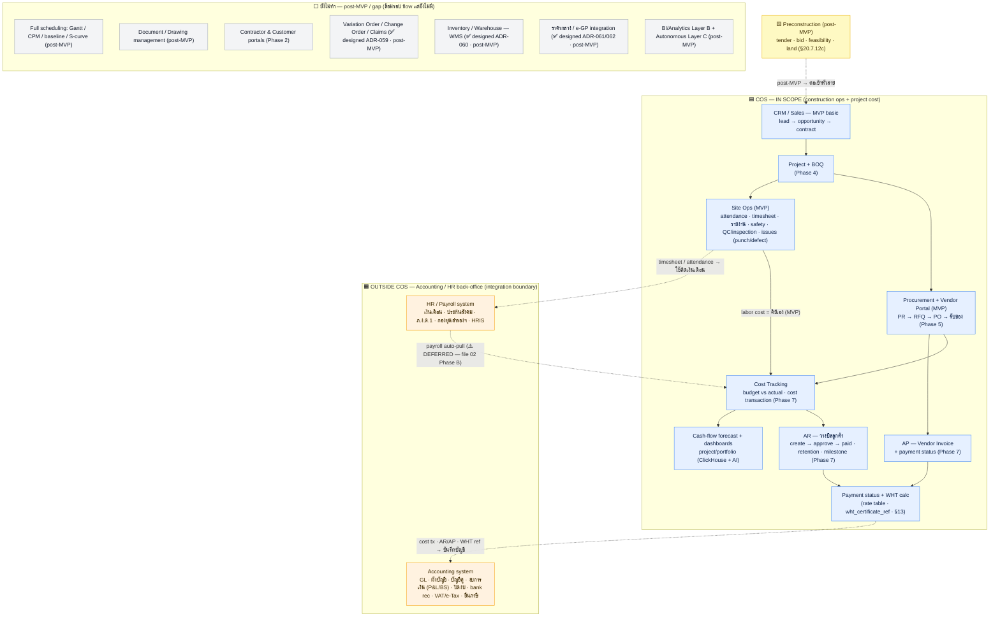

# COS Scope Boundary — Construction Operations vs Accounting / HR Back-Office

> **Question answered:** for a company's "full flow", how far does COS reach, where does it hand off to
> Accounting and HR/Payroll, and what back-office pieces does COS **not** cover today?
> **Method:** every "COS has / COS lacks" cell below is grounded in a **spec citation** (📊). Standard
> back-office functions a business needs are general domain knowledge (📋). Honesty flags: ⚠️.
> **Date:** 2026-07-14. **Not a spec** — nothing here overrides `docs/specifications/`.

**Legend:** ✅ in scope (built/spec'd) · ~ partial · ❌ out of current scope · 📊 spec-cited · 📋 judgment
· ⚠️ decision flag (per `CLAUDE.md`: UNSPECIFIED → escalate; deferred → planned later).

---

## 1. Flow diagram — what COS covers, and the integration boundary

COS owns the **construction operational flow + project cost + billing**, then hands data across a
boundary to dedicated **Accounting** and **HR/Payroll** systems. The dashed lines are the integration
boundary (data crosses; the module lives outside COS).

**Reading the boundary:**

- COS produces **transaction-level financial data** (cost transactions, AR invoices, AP vendor invoices,
  payment status, WHT amounts) — but **stops before the accounting ledger**. That data is meant to be
  posted into an external accounting system (📊 Phase 7: "PROJECT COST TRACKING, NOT a full accounting
  system … does NOT implement GL / chart of accounts / GL posting" — `context/00_master_construction_os.md:2597`).
- COS produces **attendance + timesheets** (📊 `21-mvp-scope.md:52,69`) — but **payroll runs outside**
  (📊 "Payroll integration is deferred — it requires access to HR systems" — `01_build_priority_execution.md:847`).
- External integration is via the **ERP adapter Strategy pattern** (SAP/Oracle/Dynamics stubs, per-tenant)
  — 📊 `13-product-architecture §13.3`. COS **integrates with** accounting/ERP, it does not replace it.

---

## 2. Full enterprise back-office — what's needed vs what COS has today

"Full flow" of a whole company needs the back-office domains below. COS covers the **operational + project-
cost + billing** band; the **statutory accounting** and **payroll/HR** bands are out of current scope.

### 2A. Accounting / Finance back-office

| Function (📋 needed for full flow) | COS today | Evidence / status |
| --- | --- | --- |
| Procurement PR→RFQ→PO→delivery | ✅ | 📊 Phase 5 |
| Project budget vs actual + cost transactions | ✅ | 📊 Phase 7 |
| AR — client billing (invoice→approve→paid) | ✅ | 📊 Phase 7 |
| AP — vendor invoice + payment status | ✅ | 📊 Phase 7 / ontology §AP |
| WHT (หัก ณ ที่จ่าย) **calculation** | ~ | 📊 rate table + `wht_certificate_ref` via Avalara hook (§13) — **calc only** |
| Cash-flow forecast / dashboards | ✅ (reporting) | 📊 `09-data-architecture` cash-flow forecast; `20-ux-flow` Exec/Finance |
| **General Ledger / บัญชีแยกประเภท** | ❌ | 📊 Phase 7 explicitly excludes; ⚠️ UNSPECIFIED → **escalate** |
| **Chart of accounts / double-entry** | ❌ | 📊 Phase 7 explicitly excludes; ⚠️ escalate |
| **Company financial statements (P&L / งบดุล) + period close** | ❌ | 📊 only *project-level* summary; company statements not specced |
| **VAT / e-Tax invoice (ใบกำกับภาษี)** | ❌ | 📊 only WHT rules exist; no VAT/e-Tax module found |
| **WHT filing (ภ.ง.ด.3/53) + หนังสือรับรองหัก ณ ที่จ่าย** | ❌ | 📊 calc yes (§13), submission/certificate output not specced |
| **Bank reconciliation / treasury / actual disbursement** | ❌ | 📊 payment *status* only; no bank-rec / cash execution |
| **Fixed assets + depreciation (สินทรัพย์ถาวร/ค่าเสื่อม)** | ❌ | 📊 no depreciation accounting found (asset/warranty tracking ≠ depreciation) |

> Full statutory GL/accounting eventually appears only far downstream in **V3-5 Financial (GL/AP/AR, NOI)**
> under the real-estate ecosystem expansion (📊 `28-ecosystem-expansion.md:537`) — **not** part of the core
> construction flow.

### 2B. HR / People back-office

| Function (📋 needed for full flow) | COS today | Evidence / status |
| --- | --- | --- |
| Site attendance (check-in/out) + timesheet | ✅ | 📊 MVP Workforce — `21-mvp-scope.md:52,69` |
| Manpower count for daily reports | ✅ | 📊 MVP Workforce |
| **Payroll (เงินเดือน) calculation + payslip** | ❌ | 📊 **deferred** — `01_build_priority_execution.md:847` |
| **Social security (ประกันสังคม) / ภ.ง.ด.1 / กองทุนสำรองเลี้ยงชีพ** | ❌ | not specced (part of payroll, deferred) |
| **HRIS: employee master lifecycle** | ❌ | not specced (only `Employee` master for site linkage) |
| **Recruiting / onboarding / offboarding** | ❌ | not specced |
| **Leave management (ลางาน) / benefits / สวัสดิการ** | ❌ | not specced |
| **Performance / training** | ❌ | not specced |

---

## 3. Direct answer

- **For the construction *operational* full flow** (ขาย → โครงการ → BOQ → จัดซื้อ → หน้างาน → ต้นทุน →
  วางบิล/เจ้าหนี้ → สถานะจ่ายเงิน) — **COS is enough; you do NOT need to build Accounting/HR inside it.**
- **For the whole-company back office** — you still need a **statutory Accounting/ERP** system (GL, งบการเงิน,
  ภาษี/e-Tax, bank rec) and a **Payroll/HR** system. COS's design intent is to **feed** those systems at
  the boundary (ERP adapter; payroll auto-pull later), **not replace** them.
- ⚠️ **Decisions, not assumptions:** building **GL/full accounting into COS = UNSPECIFIED → product-owner
  escalation** (spec forbids stubbing it); **Payroll = deferred**, planned for a later phase (file 02 Phase B).

---

## 4. Other systems still missing for full flow (beyond Accounting / HR)

> Placed here as §4 for sequential order (Sources moved to §5). Grouped by the spec's own status marker,
> not by opinion: 🅐 on the roadmap but unbuilt · 🅑 excluded initially · 🅒 not in the spec at all.
> **Correction to note:** **Vendor Portal** (RFQ/quotation/PO-status/invoice self-service) and
> **Quality Control** (site inspections) **are MVP** (📊 `21-mvp-scope.md:52-58`) — only **Contractor +
> Customer portals** are deferred to Phase 2.

### 🅐 On the roadmap, not yet built (post-MVP / deferred)

| System | Status | Evidence |
| --- | --- | --- |
| Preconstruction: tender & bid, feasibility, land acquisition | post-MVP — **tender & bid now designed (ADR-062)**; feasibility / land still roadmap | 📊 `20-ux-flow.md` §20.7.12c; §01 §1.2 |
| Full scheduling: Gantt / CPM / baseline / S-curve | core has task dates + `DEPENDS_ON` only; full engine post-MVP | 📊 `11-database-schema.md:309-322`; critical-path risk = AI Layer B (`21.4`, `22`) |
| Document / Drawing management (version, format-convert, viewer) | post-MVP | 📊 `13-product-architecture.md:51`; `03-system-design.md:60` |
| Contractor portal + Customer portal | Phase 2 | 📊 `28-ecosystem-expansion.md:81-82,232-233` |
| BI / Analytics deep (AI Layer B) + Autonomous agents (Layer C) | post-MVP | 📊 `21.4`, `22` |
| CRM advanced (kanban, dashboards, proposal) + CRM mobile | post-MVP | 📊 `21.6` |
| Workforce advanced (shift optimization, productivity analytics) | post-MVP | 📊 `21.2` |
| Safety AI (video/photo compliance detection) | post-MVP | 📊 `21.2` |
| Facility Mgmt / O&M work orders (preventive/corrective maintenance) | V2-3 | 📊 `28-ecosystem-expansion.md:374` |
| ERP integration live (SAP/Oracle/Dynamics) | stub until a tenant with that ERP onboards | 📊 `13.3` |

### 🅑 Excluded initially — and WHY (answer to "ทำไมถึงตัด")

Spec list: **Full BIM · IoT · Advanced digital twin · Full ERP replacement · Autonomous AI agents**
(📊 `21-mvp-scope.md` "Excluded Initially"). They are **not rejected — they are sequenced to later
Stages behind explicit prerequisites**, for two grounded reasons:

1. **MVP is scoped to immediate ROI.** 📊 §21.1: MVP solves *"Project cost + procurement + site
   visibility, because this creates immediate ROI."* The excluded items do not serve that first ROI loop.
2. **Each excluded item has hard prerequisites / triggers not yet met** (so building it in MVP is
   impossible or premature):
   - **Advanced digital twin → Phase 24 / Stage 5.** 📊 `33-digital-twin-iot.md:86` mandatory
     prerequisites: Phase 13 Knowledge Graph + Phase 21 Equipment + Phase 23 MLOps + BIM IFC parser +
     IoT provisioned + **sustainable revenue base**; planning gate needs *dominant market position +
     IoT hardware partner contracted + devices certified + ≥12 months runway* (`33:452-462`). None exist
     at MVP.
   - **IoT → trigger-activated.** 📊 fires only *"when equipment has an IoT sensor attached"*; needs a
     contracted hardware partner; platform RESOLVED (EMQX) but activation deferred
     (`context/00_master_construction_os.md:4784,4825-4828`). No sensors → nothing to ingest.
   - **Full BIM → phased in, not dropped.** 📊 IFC parser lands in Phase 3 (project-structure import)
     and Phase 4 (BIM→BOQ auto-population); only *Full* BIM (viewer/clash/model mgmt) is post-MVP
     (`context:1990,2114`).
   - **Full ERP replacement → architectural choice, not timing.** COS deliberately **integrates** via
     the ERP adapter Strategy pattern and does **not** replace the ledger (📊 `13.3`; Phase 7 forbids
     GL/ERP integration in the cost service, `context:2597`; positioning `29:74`). Rebuilding a full ERP
     would duplicate mature Thai accounting systems COS is designed to feed.
   - **Autonomous AI agents (Layer C)** depend on Layer A→B maturity + accumulated tenant data; post-MVP
     (📊 `21.4`, `22`).

### 🅒 Genuine gaps — decision made, now DESIGNED post-MVP (ADR-059..066)

> **Status update (2026-07-20):** these were "not in the spec at all" when this doc was first written. The
> product owner has since decided to add them; each is now **fully designed** (ADR + `docs/specifications/`
> schema §11 / API §14 / RBAC §06 / events §16 / UX §20) and recorded as post-MVP execution commands in
> `context/04` (workflow gaps → Phase 2, integrations → Phase 5). They remain **post-MVP (designed, not
> built)**. The original scan found the first three; a follow-up scan surfaced four more (rows 4–7).

| System | Status |
| --- | --- |
| Variation Order / Change Order / Claims | ✅ **Designed — ADR-059** (`VariationOrder` + `Claim`, finance; auto-adjust contract/budget/BOQ; AR chain) |
| Inventory / Warehouse full (stock movement, GRN, multi-warehouse) | ✅ **Designed — ADR-060** (`Warehouse`+`StockMovement`+`GRN`, procurement; moving average) |
| ราคากลาง / e-GP integration | ✅ **Designed — ADR-061 (ราคากลาง) + ADR-062 (e-GP)** (platform catalog + Tender/Bid; adapter + manual) |
| Bank guarantees / bonds | ✅ **Designed — ADR-063** (`Bond`, finance; full lifecycle + expiry alert) |
| Building permit & license | ✅ **Designed — ADR-064** (extends `Permit`: +building_permit/license +authority +expiry alert) |
| Project risk register | ✅ **Designed — ADR-065** (`ProjectRisk`, projects; 5×5 scoring + AI-suggested feed) |
| Site instruction / meeting minutes / correspondence | ✅ **Designed — ADR-066** (`CommunicationRecord`+`ActionItem`, projects) |

⚠️ **Still open (build-time, flagged in the ADRs):** ราคากลาง / e-GP **public-API availability is
unverified** (manual path is the guaranteed baseline; adapter is a stub seam); the risk register's
AI-suggested feed depends on Layer B. These are implementation decisions, not spec gaps.

> **Why Accounting/HR are NOT repeated in 🅒:** the question scoped them out ("นอกจาก Accounting และ HR"),
> and they are **not silent gaps** — the spec addresses them explicitly (see §2): full **GL/accounting is
> UNSPECIFIED→escalate** (same nature as 🅒, called out in Phase 7) and **payroll is deferred** (🅐
> nature, planned file 02 Phase B). They were handled as their own top-level category, not omitted.

### 4.1 Highest-impact gaps for a construction full flow (📋 ranking — corrected against spec)

The ranking below is **judgment**, not spec. The commercial **pre-contract funnel (CRM lead → opportunity
→ contract) IS in MVP**; the formal **tender / bid / estimating** sub-flow was post-MVP and is now
**designed (ADR-062, e-GP)**.

1. **Head — Preconstruction (tender / bid / estimating).** CRM basic exists; formal bidding is now
   **designed post-MVP (ADR-062)** — `Tender` / `Bid` in the crm/Preconstruction area, won → main_contract.
2. **Mid — Variation Order / Change Order / Claims.** Real projects always have scope changes; the biggest
   true gap — now **designed post-MVP (ADR-059)**, decision made.
3. **Cross-cutting — Document/Drawing control + full Scheduling (Gantt/CPM).** Still post-MVP (🅐) —
   **no spec revision needed**, only build sequencing (these were *not* part of the ADR-059..066 design pass).

**Net (updated 2026-07-20):** all seven 🅒 gaps have been **added to the spec** (designed, ADR-059..066) and
recorded as post-MVP execution commands in `context/04` (workflow → Phase 2, integrations → Phase 5).
Nothing on the gap list now needs a *spec decision* — the remaining work is **build sequencing** plus the
build-time items flagged above (ราคากลาง / e-GP API availability, Layer-B AI feed). The 🅐 items remain
spec'd-as-future.

---

## 5. Sources

- `context/00_master_construction_os.md:2597` — Phase 7 Finance scope exclusion (no GL/CoA/GL-posting/ERP)
- `docs/specifications/13-product-architecture.md:153` — WHT rules (calc) · §13.3 — ERP adapter Strategy pattern
- `docs/specifications/21-mvp-scope.md:52,69` — Workforce (attendance/timesheet) in MVP
- `context/01_build_priority_execution.md:847` — Payroll deferred; labor cost = manual entry
- `docs/specifications/28-ecosystem-expansion.md:537` — V3-5 Financial (full GL/AP/AR) far downstream
- `docs/specifications/10-construction-ontology.md:142-145` / `12-construction-knowledge-graph.md:104-109` — AR/AP entities
- `docs/specifications/09-data-architecture.md:190` · `20-ux-flow.md:60,96` — cash-flow forecast/dashboards
