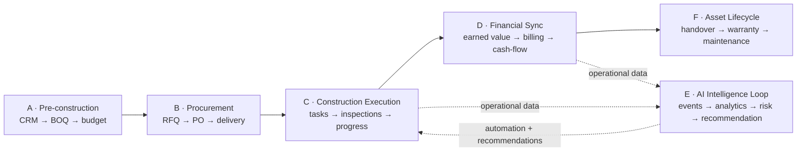

# 2. System-wide Integration View (End-to-End)

## Table of Contents

- [2.1 End-to-End Operational Lifecycle](#21-end-to-end-operational-lifecycle)
  - [Phase A — Pre-construction](#phase-a--pre-construction)
  - [Phase B — Procurement](#phase-b--procurement)
  - [Phase C — Construction Execution](#phase-c--construction-execution)
  - [Phase D — Financial Synchronization](#phase-d--financial-synchronization)
  - [Phase E — AI Intelligence Loop](#phase-e--ai-intelligence-loop)
  - [Phase F — Asset Lifecycle](#phase-f--asset-lifecycle)
- [2.2 Unified Enterprise Architecture](#22-unified-enterprise-architecture)
- [2.3 Strategic End-state](#23-strategic-end-state)

---

## 2.1 End-to-End Operational Lifecycle



### Phase A — Pre-construction

```text
CRM
→ opportunity management
→ estimation
→ BOQ generation
→ tendering
→ budget approval

```

---

### Phase B — Procurement

```text
BOQ
→ procurement planning
→ RFQ generation
→ vendor selection
→ purchase order
→ delivery scheduling

```

---

### Phase C — Construction Execution

```text
Material delivery
→ inventory update
→ task execution
→ workforce tracking
→ inspections
→ progress updates

```

---

### Phase D — Financial Synchronization

```text
Progress updates
→ earned value calculation
→ cost recognition
→ billing generation
→ cash-flow forecasting

```

---

### Phase E — AI Intelligence Loop

```text
Operational data
→ event stream
→ analytics pipeline
→ AI inference
→ risk prediction
→ recommendation generation
→ workflow automation

```

---

### Phase F — Asset Lifecycle

```text
Project completion
→ handover
→ warranty
→ facility management
→ maintenance analytics
→ lifecycle optimization

```

---

## 2.2 Unified Enterprise Architecture

The entire platform becomes :

- operational system
- financial system
- workflow system
- intelligence system
- ecosystem coordination system

all connected through :

- shared ontology
- shared identity layer
- shared event bus
- shared AI layer
- shared data architecture
- shared workflow engine

---

## 2.3 Strategic End-state

The final state is NOT :

- project management software
- ERP
- procurement software
- AI chatbot

The final state becomes:

> A unified AI-native Construction Operating System for the entire built-world lifecycle.

### Global Standards Governance Body (CIV-005)

**Decision:** Observe-and-align — participate in existing bodies; do not create a new one.
**Resolved:** 2026-06-10

- **Strategy:** Participate actively in existing international bodies; align platform to their outputs
- **Primary bodies:** buildingSMART International, ISO TC59/SC13 (IFC 5 / ISO 19650 DIS 2026),
  UN-Habitat Smart City working groups
- **Secondary bodies:** ASEAN Smart Cities Network, BCA Singapore, EIC Thailand
- **Platform alignment:** All data models, APIs, and interchange formats track published standards
- **Rationale:** Creating a new standards body requires decade-scale political capital;
  existing bodies (buildingSMART, ISO) already hold industry authority

**ISO 19650 update (2026):** DIS published March 10, 2026. Terminology shifting from "BIM" to
"Information Management". Final publication expected 2027 — monitor and align platform ontology.

> 📎 See also: [00-executive-overview](00-executive-overview.md) · [03-system-design](03-system-design.md) · [15-event-driven-workflow](15-event-driven-workflow.md) · [16-enterprise-event-flow](16-enterprise-event-flow.md)
