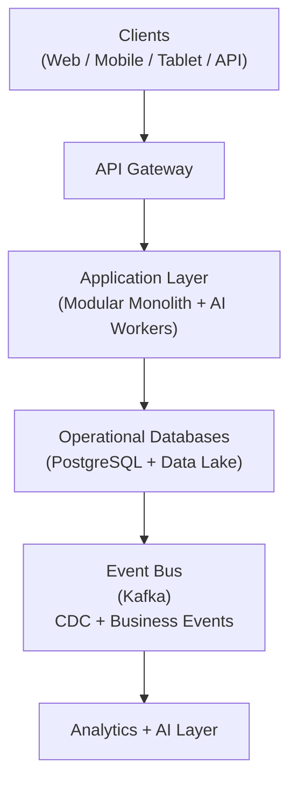
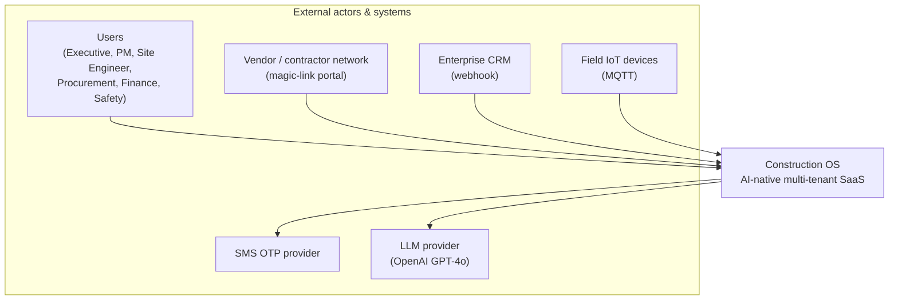
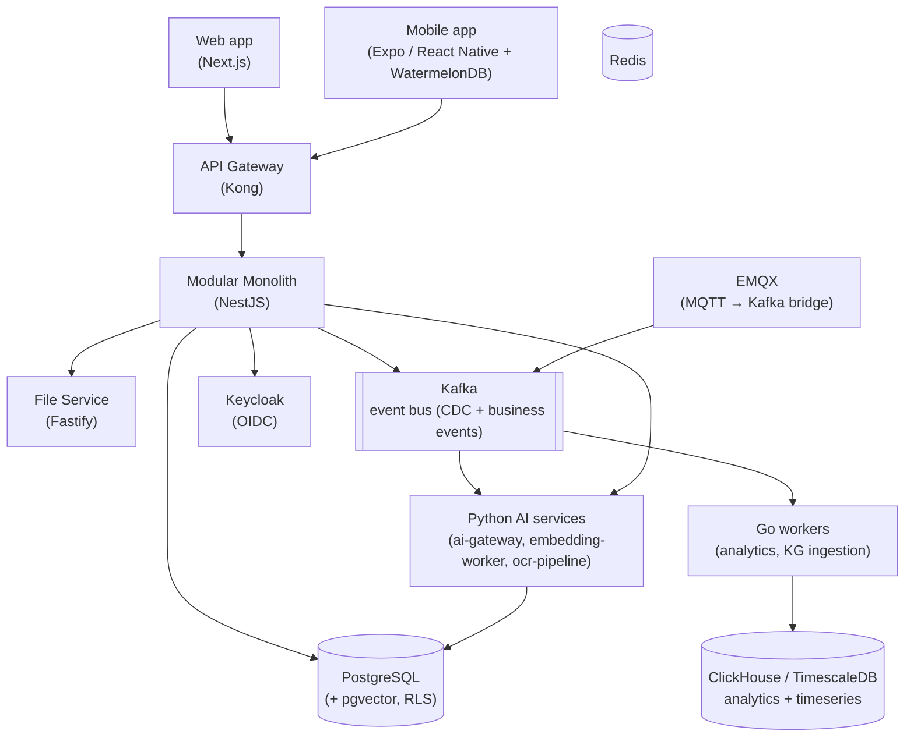

# 3. System Design

## Table of Contents

- [3.1 High-level Architecture](#31-high-level-architecture)
- [3.2 Service Decomposition](#32-service-decomposition)
- [3.3 Scalability](#33-scalability)
- [3.4 C4 Architecture Views](#34-c4-architecture-views)

---

## 3.1 High-level Architecture

> 📌 **Architecture note:** The Application Layer is a **Modular Monolith** (NestJS), not microservices.
> Independent Go workers handle analytics and KG ingestion; Python services handle AI/ML.
> **Write path:** Application writes to DB first (Outbox Pattern). Events flow from DB to Kafka
> via CDC (Debezium) and the Outbox Pattern — not between the Application Layer and DB.
> See [09-data-architecture](09-data-architecture.md) section 9.4 and [architecture/README.md](../architecture/README.md).

---

## 3.2 Service Decomposition

Core Services :

- Identity Service
- Tenant Service
- Workflow Service (implemented using Temporal.io — see 04-tech-stack section 4.4)
- Notification Service
- File Service (blob storage and S3 integration)
- Document Service (implements the "Document engine" capability defined in 13-product-architecture Layer 1; sits above File Service). MVP delivers OCR (Phase 11 AI OCR Pipeline) + file storage (Phase 9 File Service); version management, format conversion, and drawing viewer are post-MVP (not in §21.2 / the Phase plan) — see 13-product-architecture §13.1

Domain Services :

- CRM Service
- Project Service
- BOQ Service
- Procurement Service
- Finance Service
- Site Service
- Equipment Service
- Workforce Service
- Quality Control Service
- Safety Service
- Asset Management Service

Intelligence Services :

- Forecasting Service
- AI Copilot Service
- Knowledge Graph Service
- Analytics Service

---

## 3.3 Scalability

Principles :

- Stateless services
- Horizontal scaling
- Event-driven decoupling
- CQRS where necessary
- Read replicas
- CDN
- Queue-based async processing

---

## 3.4 C4 Architecture Views

Architecture is documented with the **C4 model** (Context → Container → Component → Code). §3.1 is
the informal overview; the levels below are the maintained views. Code-level (L4) is not hand-drawn —
it is read from the source. Diagram sources live in `architecture/` and are updated in the same PR as
a structural change.

### Level 1 — System Context

### Level 2 — Container

### Level 3 — Component

The component inventory of the Modular Monolith is the service decomposition in §3.2 (Core / Domain /
Intelligence services). Each is a NestJS module, not a separately deployed process (per the §3.1
architecture note).

### Acceptance criteria / gate

- [ ] Context + Container diagrams exist and are referenced from `architecture/README.md`
- [ ] A structural change (new container / external dependency) updates the relevant C4 view in the
      same PR

---

## References

| ID             | Title                                                              | Source                                                                               |
| -------------- | ------------------------------------------------------------------ | ------------------------------------------------------------------------------------ |
| [C4]           | The C4 model for visualising software architecture                 | [c4model.com](https://c4model.com/)                                                  |
| -------------- | ------------------------------------------------------------------ | ------------------------------------------------------------------------------------ |
| [IEEE 830]     | IEEE Recommended Practice for Software Requirements Specifications | IEEE Std 830-1998                                                                    |
| [NestJS]       | NestJS — A progressive Node.js framework                           | [docs.nestjs.com](https://docs.nestjs.com/)                                          |
| [Next.js]      | Next.js Documentation                                              | [nextjs.org/docs](https://nextjs.org/docs/)                                          |
| [React Native] | React Native Documentation                                         | [reactnative.dev/docs/getting-started](https://reactnative.dev/docs/getting-started) |
| [PostgreSQL]   | PostgreSQL Documentation                                           | [postgresql.org/docs](https://www.postgresql.org/docs/)                              |
| [Redis]        | Redis Documentation                                                | [redis.io/docs](https://redis.io/docs/)                                              |
| [Kafka]        | Apache Kafka Documentation                                         | [kafka.apache.org/documentation](https://kafka.apache.org/documentation/)            |
| [Keycloak]     | Keycloak Server Documentation                                      | [keycloak.org/documentation](https://www.keycloak.org/documentation)                 |

> 📎 See also: [02-system-wide-integration](02-system-wide-integration.md) · [04-tech-stack](04-tech-stack.md) · [13-product-architecture](13-product-architecture.md) · [14-api-architecture](14-api-architecture.md)
