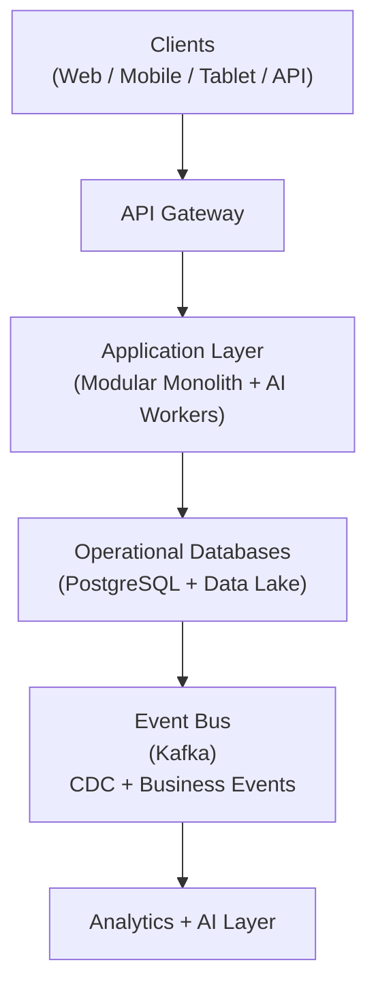

# 3. System Design

## Table of Contents

- [3.1 High-level Architecture](#31-high-level-architecture)
- [3.2 Service Decomposition](#32-service-decomposition)
- [3.3 Scalability](#33-scalability)

---

## 3.1 High-level Architecture

> 📌 **Architecture note:** The Application Layer is a **Modular Monolith** (NestJS), not microservices.
> Independent Go workers handle analytics and KG ingestion; Python services handle AI/ML.
> **Write path:** Application writes to DB first (Outbox Pattern). Events flow from DB to Kafka
> via CDC (Debezium) and the Outbox Pattern — not between the Application Layer and DB.
> See [09-data-architecture](09-data-architecture.md) section 9.4, [ADR-001](../architecture/adr/001-modular-monolith.md), and [architecture/README.md](../architecture/README.md).

---

## 3.2 Service Decomposition

Core Services :

- Identity Service
- Tenant Service
- Workflow Service      (implemented using Temporal.io — see 04-tech-stack section 4.4)
- Notification Service
- File Service          (blob storage and S3 integration)
- Document Service      (OCR, version management, format conversion, drawing viewer — implements the "Document engine" capability defined in 13-product-architecture Layer 1; sits above File Service)

Domain Services :

- CRM Service
- Project Service
- BOQ Service
- Procurement Service
- Finance Service
- Site Service
- Equipment Service
- Workforce Service
- Quality Control Service
- Safety Service
- Asset Management Service

Intelligence Services :

- Forecasting Service
- AI Copilot Service
- Knowledge Graph Service
- Analytics Service

---

## 3.3 Scalability

Principles :

- Stateless services
- Horizontal scaling
- Event-driven decoupling
- CQRS where necessary
- Read replicas
- CDN
- Queue-based async processing

---

## References

| ID | Title | Source |
| --- | --- | --- |
| [IEEE 830] | IEEE Recommended Practice for Software Requirements Specifications | IEEE Std 830-1998 |
| [NestJS] | NestJS — A progressive Node.js framework | [docs.nestjs.com](https://docs.nestjs.com/) |
| [Next.js] | Next.js Documentation | [nextjs.org/docs](https://nextjs.org/docs/) |
| [React Native] | React Native Documentation | [reactnative.dev/docs/getting-started](https://reactnative.dev/docs/getting-started) |
| [PostgreSQL] | PostgreSQL Documentation | [postgresql.org/docs](https://www.postgresql.org/docs/) |
| [Redis] | Redis Documentation | [redis.io/docs](https://redis.io/docs/) |
| [Kafka] | Apache Kafka Documentation | [kafka.apache.org/documentation](https://kafka.apache.org/documentation/) |
| [gRPC] | gRPC Protocol Documentation | [grpc.io/docs](https://grpc.io/docs/) |
| [Keycloak] | Keycloak Server Documentation | [keycloak.org/documentation](https://www.keycloak.org/documentation) |

> 📎 See also: [02-system-wide-integration](02-system-wide-integration.md) · [04-tech-stack](04-tech-stack.md) · [13-product-architecture](13-product-architecture.md) · [14-api-architecture](14-api-architecture.md)
