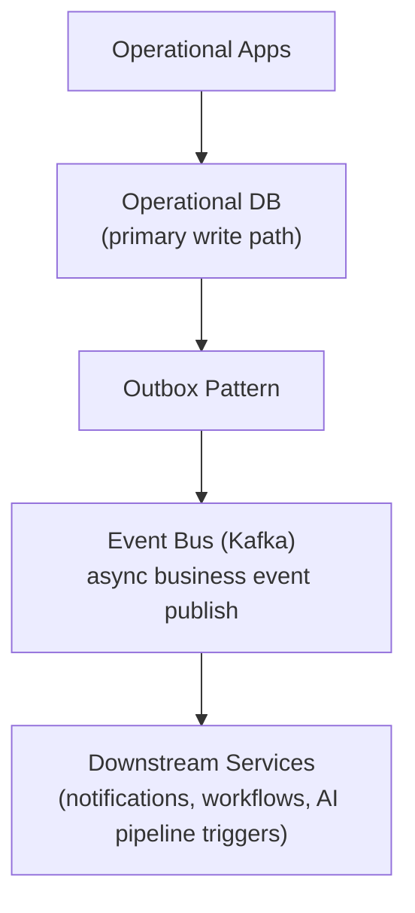
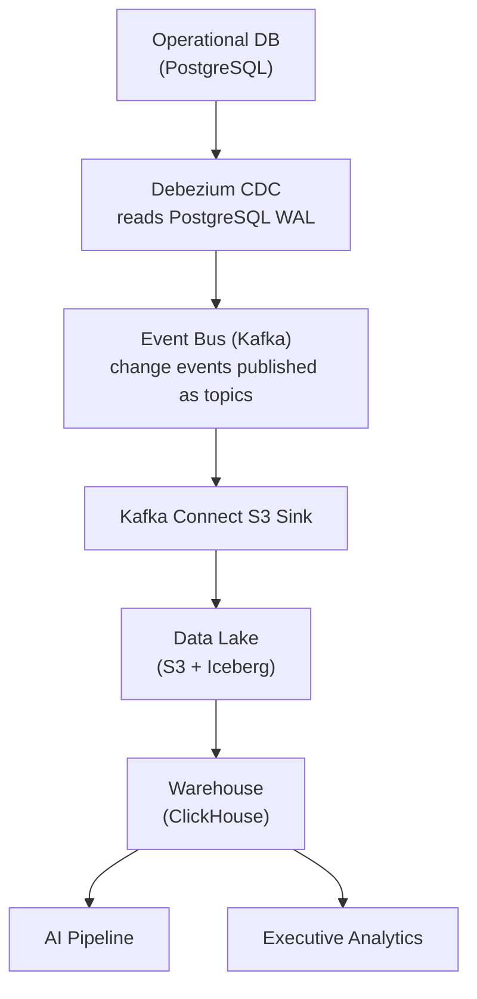

# 9. Data Architecture

## Table of Contents

- [9.1 Data Philosophy](#91-data-philosophy)
- [9.2 Core Data Domains](#92-core-data-domains)
- [9.3 Data Storage Architecture](#93-data-storage-architecture)
- [9.4 Data Flow](#94-data-flow)
- [9.5 Reporting and Analytics Architecture](#95-reporting-and-analytics-architecture)
- [9.6 Ecosystem Intelligence Decisions](#96-ecosystem-intelligence-decisions)
- [9.7 Database Migration Safety Rules](#97-database-migration-safety-rules)
- [9.8 Data Governance (MDM, Lineage, Catalog)](#98-data-governance-mdm-lineage-catalog)

---

## 9.1 Data Philosophy

The platform must become :

> The canonical operational dataset for construction lifecycle

Everything becomes structured operational data.

---

## 9.2 Core Data Domains

Master Data :

- Company
- Project
- Building
- Floor
- Room
- Unit
- Vendor
- Employee
- Equipment
- Material
- Customer
- Lead
- Opportunity
- Contact

Transactional Data :

- Purchase orders
- Vendor invoices
- Client billing
- AR receipts
- Payments
- Deliveries
- Site reports
- Inspections
- Progress updates
- Timesheets

Event Data :

- Material delivered
- Concrete poured
- Inspection failed
- Budget exceeded
- Worker checked in

Unstructured Data :

- Drawings
- PDFs
- Photos
- Videos (max 1 GB per file; MIME types: video/mp4, video/quicktime, video/webm, video/x-msvideo, video/x-ms-wmv)
- Voice notes
- Contracts
- BIM files

File Lifecycle Policy :

- Soft delete: `deleted_at` timestamp set on delete request — file remains in MinIO storage
- Hard delete: 30 days after soft delete (`deleted_at + 30 days`) — file purged from MinIO;
  implemented as a Temporal scheduled workflow running daily at 02:00 UTC
  (`workflow_id = file-hard-delete-{YYYY-MM-DD}`); retry policy: 3 attempts (60s / 120s / 240s backoff);
  on exhaustion: emit `file.hard_delete.failed.v1` → SYSTEM_ADMIN alert; no compensation
  (manual recovery required)
- Files with active project references are not hard-deleted regardless of soft delete timestamp

AI Data :

- Embeddings
- Knowledge graph
- Semantic chunks
- Model features
- Predictions
- Risk signals

---

## 9.3 Data Storage Architecture

| Data Type               | Storage                              |
| ----------------------- | ------------------------------------ |
| Relational transactions | PostgreSQL                           |
| Time-series telemetry   | TimescaleDB                          |
| Search/index            | OpenSearch                           |
| Blob storage            | S3-compatible                        |
| Data lake format        | Apache Iceberg (on S3)               |
| Analytics warehouse     | ClickHouse                           |
| Graph relations         | Neo4j                                |
| Cache                   | Redis                                |
| Vector embeddings       | pgvector (MVP) → Weaviate (at scale) |
| Streaming events        | Kafka                                |

> **TimescaleDB deployment posture:** TimescaleDB is a PostgreSQL extension (see `04-tech-stack` §4.3), so time-series
> telemetry is **co-located on the primary PostgreSQL instance** through Stages 1–3, then split to a dedicated TimescaleDB
> instance only when a measured volume trigger is crossed.

---

## 9.4 Data Flow

### Path 1 — Business Event Flow (Outbox Pattern)



### Path 2 — Data Replication to Data Lake (Debezium CDC)



Note : These are two independent data paths.

Path 1 (Outbox Pattern) publishes domain business events for real-time service
coordination. Debezium does NOT consume from Kafka — it reads directly from
the PostgreSQL WAL (Write-Ahead Log).

Path 2 (Debezium CDC) replicates row-level DB changes to the Data Lake independently
of whether a business event was published. This ensures full data fidelity in the lake
even for direct DB writes that bypass the business event bus.

Event Bus does NOT sit between App and Operational DB.
Writes go to DB first (Path 1). Path 2 operates as a separate CDC stream.

---

## 9.5 Reporting and Analytics Architecture

### Report Types

| Report                        | Frequency          | Primary Consumer    | Data Source               |
| ----------------------------- | ------------------ | ------------------- | ------------------------- |
| Daily site report             | Daily              | Site Engineer, PM   | PostgreSQL (same-day ops) |
| Project cost summary          | On-demand / weekly | PM, Finance         | ClickHouse                |
| Procurement status            | On-demand          | Procurement Officer | PostgreSQL                |
| Executive portfolio dashboard | Real-time          | Executive           | ClickHouse + Redis cache  |
| Cash flow forecast            | Daily              | Finance             | ClickHouse + AI Pipeline  |
| Safety compliance report      | Weekly             | Safety Officer      | PostgreSQL                |
| AI risk report                | Continuous         | Executive, PM       | AI Pipeline output        |

### Analytics Stack

- ClickHouse — OLAP queries for aggregation-heavy reports (cost, schedule, procurement)
- Redis — caches pre-computed dashboard metrics (TTL: 5 minutes for executive dashboard)
- OpenSearch — full-text search across site reports, inspections, documents
- Apache Iceberg — historical data lake for trend analysis beyond 90 days

### Dashboard Access

- Role-based dashboard views: each role (defined in 06-rbac-permission-matrix section 6.2) sees only the modules and
  metrics relevant to their function
- No external BI tool in MVP — dashboards are built directly in the Next.js frontend, querying the Analytics Service
- Post-MVP: evaluate embedded BI (e.g., Apache Superset self-hosted) for custom report builder capability

### Data Retention

- Operational DB (PostgreSQL): hot data, 2 years rolling
- Data Lake (S3 + Iceberg): cold archive, 10 years
- Time-series telemetry (TimescaleDB): 90 days hot, then compressed to Iceberg

Authoritative retention schedule per entity type: `docs/compliance/data-retention-policy.md`

---

## 9.6 Ecosystem Intelligence Decisions

### Industry Data Sharing Model (INT-002)

**Decision:** Opt-in with tiered incentive structure.
**Resolved:** 2026-06-10

- **Model:** Opt-in — tenant actively chooses to contribute anonymised project data
- **Incentive tier 1:** Contribute aggregate metrics → unlock industry benchmark reports
- **Incentive tier 2:** Contribute detailed data → unlock AI premium scoring tier
- **Anonymisation:** Project data anonymised before aggregation; no PII or tenant IDs shared
- **Legal basis:** Explicit consent per PDPA Thailand §21 and Vietnam Decree 13/2023
- **DPO requirement:** Data Processing Agreement required before data enters the benchmark pool
- **Withdrawal:** Any time; past anonymised aggregates retained in pool

**Industry precedent (2026):** Procore Benchmarking, Autodesk Construction IQ, Dodge Analytics —
all use opt-in contribution models with incentive tiers.

**PDPA enforcement context:** Thailand PDPA active enforcement since Aug 2025 — 8 fines totalling
THB 21.5M. Vietnam PDPA effective July 2026. Opt-out or mandatory models carry regulatory risk.

---

### Benchmark Data Ownership (ECO-003)

**Decision:** Platform stewardship with contributor attribution.
**Resolved:** 2026-06-10

| Scope                   | Ownership                                                         |
| ----------------------- | ----------------------------------------------------------------- |
| Individual project data | Tenant owns; platform is data processor under signed DPA          |
| Anonymised aggregate    | Platform stewards; contributors retain attribution credit         |
| Derived benchmarks      | Platform owns; available to all opted-in contributors as benefit  |
| Raw tenant data         | Never shared; only anonymised aggregates cross tenant boundaries  |

**Data Processing Agreement (DPA):** Required before tenant data enters the benchmark pool.
DPA specifies: legal basis, anonymisation method, retention period, and withdrawal rights
per PDPA §37.

---

### Market Intelligence Data Sources (COORD-004)

**Decision:** Multi-source with confidence-weighted scoring.
**Resolved:** 2026-06-10

| Source                                    | Type         | Weight |
| ----------------------------------------- | ------------ | ------ |
| Dodge Analytics                           | External API | 0.90   |
| RS Means (Gordian)                        | External API | 0.90   |
| Bank of Thailand (BoT) price indices      | External API | 0.85   |
| Building & Construction Authority (BCA)   | External API | 0.85   |
| DOST / national statistics (VN, SEA)      | External API | 0.80   |
| Platform tenant data (opt-in)             | Internal     | 1.00   |

Composite confidence: `weighted_avg(source_weight × recency_decay)`. Data older than 90 days
reduces source weight by 15% per additional 30-day period.

---

### Cross-Region Data Aggregation (GLOB-002)

**Decision:** Federated aggregation with differential privacy.
**Resolved:** 2026-06-10

- **Data residency:** Tenant data stays in its home region by default
- **Cross-region queries:** Aggregate-only; raw records never cross regional boundaries
- **Privacy mechanism:** Laplace noise added to aggregated metrics before cross-region exposure
- **Minimum cohort:** Aggregates published only when ≥ 5 tenants contribute (k-anonymity ≥ 5)
- **Legal basis:** Separate written consent per destination region; PDPA TH + PDPA VN + PDPA SG

---

### Knowledge Preservation Format (STEW-002)

**Decision:** Apache Iceberg v3 with temporal versioning.
**Resolved:** 2026-06-10

- **Format:** Apache Iceberg v3 (GA on Snowflake May 7, 2026; Iceberg 1.11 released June 2026)
- **Time-travel:** Point-in-time queries to any historical snapshot supported natively
- **Critical data retention:** Project lifecycle data — minimum 50-year retention
- **Audit log storage:** WORM (Write-Once Read-Many) for immutable compliance records
- **Schema evolution:** Backwards-compatible schema evolution without full table rewrite

**Rationale:** Open-format specification with time-travel and partition evolution — no vendor lock-in
for long-horizon knowledge preservation.

---

### Intergenerational Knowledge Transfer (BG-004)

**Decision:** Distributed knowledge graphs with semantic versioning.
**Resolved:** 2026-06-10

| Component             | Technology                                                     |
| --------------------- | -------------------------------------------------------------- |
| Operational graph     | Neo4j (existing — real-time queries)                           |
| Long-term archival    | Apache Jena (RDF triple store, open W3C standard)              |
| Ontology format       | OWL 2 extending buildingSMART Data Dictionary (bSDD) and IFC   |
| Versioning            | Semantic versioning; breaking changes require migration plan   |
| Preservation covenant | 100-year knowledge preservation commitment in platform charter |
| Export format         | RDF/Turtle for cross-system interoperability                   |

Construction domain ontology stored in `docs/ontology/` as OWL files.

---

## 9.7 Database Migration Safety Rules

Every PostgreSQL schema migration produced by this platform must satisfy all rules below.
These rules are the authoritative source of truth for migration practices.

### 9.7.1 Rollback Script Requirement

Every migration file committed to `backend/prisma/migrations/` **must** have a corresponding
rollback script committed in the **same PR** at:

```text
backend/prisma/rollbacks/<migration-timestamp-and-name>.rollback.sql
```

Naming convention — mirror the migration directory name exactly:

| Migration file path | Rollback file path |
| --- | --- |
| `migrations/<timestamp>_<name>/migration.sql` | `rollbacks/<timestamp>_<name>.rollback.sql` |

`<name>` **must** be `<action>_<subject>` describing the change (e.g. `add_phone_number_to_users`,
`workforce_service`). **Do NOT prefix with `phaseN_`** (build-phase numbers like `phase22_`) — phase
numbers are work-tracking metadata, not part of the schema's identity, and they made the migration
history harder to read. The directory name is also the value stored in `_prisma_migrations.migration_name`,
so renaming an already-applied migration requires a matching `UPDATE` on every environment — pick the
final name up front.

**Rollback script requirements:**

- Must restore the schema to the state it was in before the migration ran
- Must be verified (executed against a test database) before the PR merges
- Must be idempotent — safe to run more than once on the same database state
- Must not drop data that cannot be recovered (use `ALTER TABLE … SET NULL` or archival before drop)

A PR that adds a migration without a committed rollback script **must not merge** — enforced by a
CI gate.

### 9.7.2 Backward-Compatible Migration Rules

Migrations must never break the currently-deployed version of the application while running.
The following table defines allowed and prohibited operations:

| Operation | Rule |
| --- | --- |
| Add column | ✅ Allowed — add as `NULL` first; backfill; add `NOT NULL` constraint in a later migration |
| Rename column | ❌ Prohibited in a single migration — add new + copy data + drop old (3 separate migrations) |
| Change column type | ❌ Prohibited directly — create new column, migrate data, drop old in 3 separate migrations |
| Drop column | ❌ Prohibited while any deployed code references the column; requires deprecation period |
| Add index | ✅ Allowed — use `CREATE INDEX CONCURRENTLY` to avoid table lock |
| Drop index | ✅ Allowed — use `DROP INDEX CONCURRENTLY` |
| Add foreign key | ✅ Allowed — add as `NOT VALID` first; validate in a subsequent migration |
| Truncate table | ❌ Prohibited on any table with live data |
| Rename table | ❌ Prohibited — requires view + rename + view drop across 3 migrations |

### 9.7.3 RLS Migration Rules

Row-Level Security migrations have additional requirements:

- `ENABLE ROW LEVEL SECURITY` and `FORCE ROW LEVEL SECURITY` must be applied together
- Every new domain table added after Phase 2 must include RLS enablement in its creation migration
- The application role (`app_user`) must never be granted `BYPASSRLS`
- Rollback scripts for RLS migrations must `DISABLE ROW LEVEL SECURITY` and `DROP POLICY` for every policy created

---

## 9.8 Data Governance (MDM, Lineage, Catalog)

The platform's value is being "the canonical operational dataset" (§9.1). That claim requires the
master-data domains in §9.2 to be governed, not just stored.

### Master Data Management (MDM)

- **Single source of truth** — every transactional/event record references a master-data entity
  (§9.2) by key; free-text in a field that has a master-data domain is a defect (enforced in domain
  acceptance criteria, `context/02`).
- **Golden record** — for entities that arrive from multiple sources (e.g. Vendor via manual entry +
  CRM webhook), define match/merge + survivorship rules producing one golden record; duplicates are
  merged, not forked (duplicate-entity rate < 1% target).
- **Stewardship** — each master-data domain has a data-owner role accountable for its quality.

### Data Lineage

- Every derived/analytics dataset (§9.5) records its upstream source and transformation so a figure
  in a report can be traced to the operational rows that produced it.
- Lineage is captured across the CDC → Kafka → analytics path (§9.4) — not reconstructed manually.

### Data Catalog

- A catalog lists each dataset: owner, domain, classification (§9.6 / PDPA), freshness, and lineage
  link, so consumers can discover data without reading schemas.

Acceptance: [ ] match/merge + survivorship rules defined for multi-source master entities ·
[ ] lineage recorded for every analytics dataset · [ ] catalog entry exists per dataset with owner +
classification.

---

## References

| ID            | Title                                                              | Source                                                                                   |
| ------------- | ------------------------------------------------------------------ | ---------------------------------------------------------------------------------------- |
| [IEEE 830]    | IEEE Recommended Practice for Software Requirements Specifications | IEEE Std 830-1998                                                                        |
| [PostgreSQL]  | PostgreSQL Documentation                                           | [postgresql.org/docs](https://www.postgresql.org/docs/)                                  |
| [TimescaleDB] | TimescaleDB Documentation                                          | [docs.timescale.com](https://docs.timescale.com/)                                        |
| [Kafka]       | Apache Kafka Documentation                                         | [kafka.apache.org/documentation](https://kafka.apache.org/documentation/)                |
| [Avro]        | Apache Avro Specification                                          | [avro.apache.org/docs/current/spec.html](https://avro.apache.org/docs/current/spec.html) |
| [Iceberg]     | Apache Iceberg Table Specification                                 | [iceberg.apache.org/spec](https://iceberg.apache.org/spec/)                              |
| [Neo4j]       | Neo4j Graph Database Documentation                                 | [neo4j.com/docs](https://neo4j.com/docs/)                                                |
| [pgvector]    | pgvector: Vector Similarity Search for Postgres                    | [github.com/pgvector/pgvector](https://github.com/pgvector/pgvector)                     |
| [MinIO]       | MinIO Object Storage Documentation                                 | [min.io/docs/minio/linux/index.html](https://min.io/docs/minio/linux/index.html)         |

> 📎 See also: [04-tech-stack](04-tech-stack.md)
> · [10-construction-ontology](10-construction-ontology.md)
> · [11-database-schema](11-database-schema.md)
> · [15-event-driven-workflow](15-event-driven-workflow.md)
