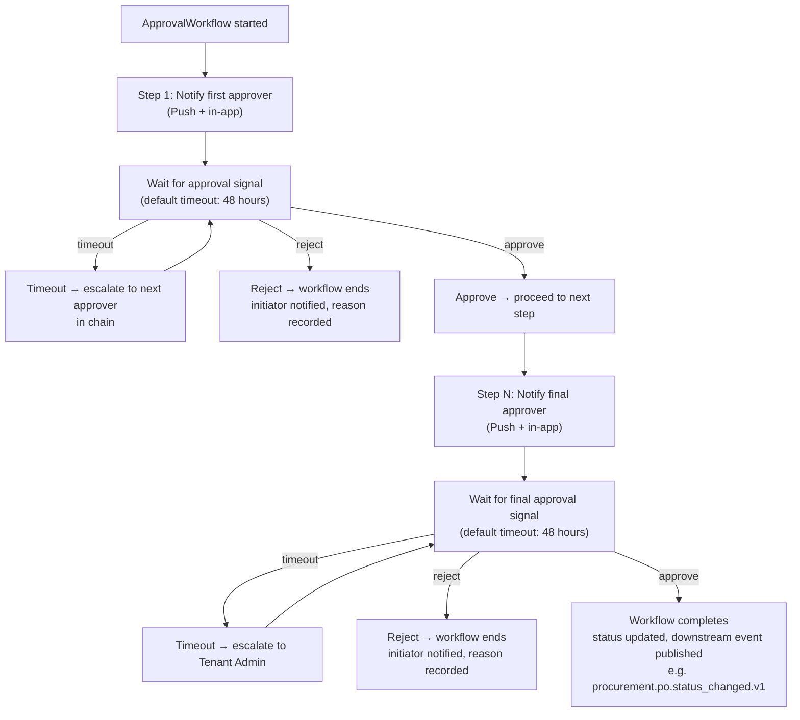

# 15. Event-driven Workflow

## Table of Contents

- [15.1 Core Principle](#151-core-principle)
- [15.2 Example Workflow](#152-example-workflow)
- [15.3 Infrastructure](#153-infrastructure)
- [15.4 Workflow Engine](#154-workflow-engine)
- [15.5 Approval Workflow Specification](#155-approval-workflow-specification)
- [15.6 Event Schema and Versioning](#156-event-schema-and-versioning)

---

## 15.1 Core Principle

Construction is naturally event-driven.

Examples :

- Material arrived
- Inspection failed
- Concrete poured
- Vendor invoice approved
- Client billing approved
- Budget exceeded

These events trigger workflows.

---

## 15.2 Example Workflow

Material delivery event :

1. Delivery received
2. Inventory updated
3. Procurement marked fulfilled
4. Cost updated
5. Site notified
6. AI recalculates delay risk (post-MVP — Layer B Analytical AI; see 21-mvp-scope section 21.4)

---

## 15.3 Infrastructure

Stack :

- Kafka
- Event sourcing for critical workflows
- Outbox pattern — guarantees event delivery atomically with the DB write
- Retry queues — failed processing retried with exponential backoff before dead-lettering
- Dead-letter queues — exhausted messages routed to a DLQ topic with an observability alert
- Consumer idempotency — consumers de-duplicate by `event_id`

---

## 15.4 Workflow Engine

Engine :

- Temporal.io (durable workflow orchestration)

Workflow Types :

- Approval workflows (RFQ → PO → Payment)
- Construction milestone workflows
- Safety incident escalation workflows
- AI-triggered remediation workflows (post-MVP — Layer B/C; see 22-ai-architecture section 22.3)

Characteristics :

- Durable execution — survives service crashes and restarts
- Human-in-the-loop steps with configurable timeouts
- Event-driven triggers from Kafka
- Retry and compensation logic built-in

---

## 15.5 Approval Workflow Specification

### Approval Chain Types

| Workflow                     | Initiator                           | Approver(s)                 | Final Authority                       |
| ---------------------------- | ----------------------------------- | --------------------------- | ------------------------------------- |
| Purchase Request → PO        | Site Engineer / Procurement Officer | PM (up to budget threshold) | Finance + Executive (above threshold) |
| Vendor Invoice (AP) approval | Procurement Officer                 | Finance                     | Executive (above approval limit)      |
| Client Billing (AR) approval | Finance                             | PM                          | Executive (above approval limit)      |
| Budget amendment             | PM                                  | Finance                     | Executive                             |
| Variation Order              | PM                                  | Finance                     | Executive                             |
| Safety permit                | Site Engineer                       | Safety Officer              | PM                                    |
| Work permit                  | Site Engineer                       | Safety Officer              | —                                     |
| Drawing approval             | Site Engineer                       | PM                          | —                                     |
| Contractor payment release   | Finance                             | Executive                   | —                                     |

### Approval Thresholds

Thresholds are configurable per tenant. Default values :

- PO up to 50,000 THB — PM can approve alone
- PO 50,001–500,000 THB — PM + Finance required
- PO above 500,000 THB — PM + Finance + Executive required
- Vendor Invoice (AP) — Finance approves up to configured limit; above limit requires Executive
- Client Billing (AR) — PM approves up to configured limit; above limit requires Executive

### Temporal.io Workflow Behavior

Each approval workflow runs as a durable Temporal.io workflow (see section 15.4) :

> **Note:** The diagram above shows a 2-step approval chain for clarity. Actual chains may have
> 1–3 approval steps depending on the workflow type and threshold (see section 15.5 Approval
> Chain Types). Each intermediate step repeats the same wait/timeout/reject/approve logic shown
> above. The final step publishes the completion event upon approval.

### Escalation Rules

- First approver does not respond within 48 hours → escalate to their manager
- After second escalation with no response → notify Tenant Admin
- Rejection at any step terminates the workflow (no silent failures)
- All approval decisions are recorded with approver_id, decision, timestamp, and comment

### Audit Requirements

Every approval event is immutably logged (see 05-security-compliance section 5.2) :

- approval_id
- workflow_type
- entity_id (FK to the PO, invoice, permit, etc.)
- approver_user_id
- decision (approved / rejected)
- comment
- decided_at
- tenant_id

---

## 15.6 Event Schema and Versioning

Envelope Standard :

- **Base Event Envelope** (authoritative — defined in `32-implementation-specifications` §32.4):
  custom fields `event_id`, `event_type`, `event_version`, `tenant_id`, `actor_id`, `occurred_at`,
  `correlation_id`, `trace_id`, `span_id`, `payload`. Implemented as an Avro schema in the shared
  events package (`@cos/shared`).
- The envelope is **CloudEvents v1.0-inspired** (id/type/time/source concepts) but uses the COS
  field names above — it is NOT a strict CloudEvents-compliant envelope. Where other specs say
  "CloudEvents envelope" they refer to this Base Event Envelope.
- Schema registry: Confluent Schema Registry (manages Avro/JSON schemas)

Event Naming Convention :

- Format: {domain}.{entity}.{action}.{version}
- Example: construction.task.completed.v1
- Example: procurement.po.status_changed.v1
- Example: finance.budget.exceeded.v1
- The trailing `.vN` increments on a breaking schema change (e.g. `...v1` → `...v2`). The
  authoritative event registry is the Avro schema set (`packages/@cos/shared/src/avro`, §15.6) —
  the examples above are real emitted events, not a placeholder catalogue.

Note — Kafka topic naming vs CloudEvents type field :

The CloudEvents `type` field uses the naming convention above (no tenant prefix).
Kafka topic names include a `{tenant_id}.` prefix for isolation (see 07-multi-tenant-architecture
section 7.3). These are distinct namespaces :

- Kafka topic name : `{tenant_id}.{domain}.{entity}.{action}.{version}`
  Example : `tenant_abc.construction.task.completed.v1`
- CloudEvents type : `{domain}.{entity}.{action}.{version}`
  Example : `construction.task.completed.v1`

The `tenant_id` is carried in the CloudEvents `source` field or message headers, not in
the `type` field. Consumers must validate the `tenant_id` header before processing.

Versioning Rules :

- Additive changes (new optional fields) — same version, backward compatible
- Breaking changes (remove or rename fields) — increment version, old version deprecated with 30-day notice to consumers
- Consumers must tolerate unknown fields (forward compatibility requirement)

### Event Schema Format (ECO-001)

**Decision:** Apache Avro with Confluent Schema Registry; AsyncAPI 3.1 for documentation.
**Resolved:** 2026-06-10

- **Serialisation format:** Apache Avro — binary, compact, schema-enforced
- **Schema registry:** Confluent Schema Registry — manages schema versions and compatibility
- **Compatibility mode:** BACKWARD_TRANSITIVE — consumers can read older schema versions
- **Documentation standard:** AsyncAPI 3.1 (stable as of January 31, 2026) for event catalogue
- **Envelope:** CloudEvents v1.0 (normative) wraps Avro payloads for metadata consistency
- **External delivery:** Avro deserialised to JSON at Kong Gateway layer for webhook subscribers
  who cannot consume Avro directly

**Schema location:** `packages/@cos/shared/src/avro/{domain}.{entity}.{action}.{version}.avsc`

**Industry precedent (2026):** Confluent + Avro + AsyncAPI is the standard adopted by
Autodesk Platform Services, Procore Event API, and SAP Event Mesh.

---

## 15.7 Platform-Level Events (Phase 25)

Platform-level events are emitted by the Construction OS platform itself (not by tenant domain
services). They use the `platform.` namespace and are NOT scoped to a single tenant's Kafka topic —
they are published to a shared `platform.events` topic consumed only by SYSTEM_ADMIN services.

### platform.enterprise.contract_signed.v1

Emitted when an Enterprise tenant's contract is marked as signed, triggering the
`EnterpriseProvisioningWorkflow`.

**Triggers:**

- `PATCH /api/v1/admin/tenants/:tenantId/mark-contracted` (SYSTEM_ADMIN via Admin Panel)
- `POST /api/v1/platform/webhooks/enterprise-contract-signed` (generic CRM webhook)

**Payload:**

| Field                | Type   | Required | Description                             |
| -------------------- | ------ | -------- | --------------------------------------- |
| `tenant_id`          | UUID   | Yes      | Tenant being provisioned                |
| `contract_reference` | string | No       | External contract ID from CRM or system |

**Avro schema:** `packages/@cos/shared/src/avro/platform.enterprise.contract_signed.v1.avsc`
**TypeScript interface:** `packages/@cos/shared/src/events/platform.enterprise.contract_signed.v1.ts`

---

### platform.enterprise.db_provisioned.v1

Emitted when `EnterpriseProvisioningWorkflow` completes successfully (after Activity 5 —
`verifyRoutingActivity` passes).

**Payload:**

| Field          | Type   | Required | Description                                    |
| -------------- | ------ | -------- | ---------------------------------------------- |
| `tenant_id`    | UUID   | Yes      | Tenant whose dedicated DB is now live          |
| `rds_endpoint` | string | Yes      | RDS hostname (e.g. `cos-tenant-acme-prod.xxx`) |

**Avro schema:** `packages/@cos/shared/src/avro/platform.enterprise.db_provisioned.v1.avsc`
**TypeScript interface:** `packages/@cos/shared/src/events/platform.enterprise.db_provisioned.v1.ts`

---

## References

| ID            | Title                                               | Source                                                                                   |
| ------------- | --------------------------------------------------- | ---------------------------------------------------------------------------------------- |
| [IEEE 830]    | IEEE Recommended Practice for Software Requirements | IEEE Std 830-1998                                                                        |
| [CloudEvents] | CloudEvents Specification v1.0.2                    | [cloudevents.io](https://cloudevents.io/)                                                |
| [Kafka]       | Apache Kafka Documentation                          | [kafka.apache.org/documentation](https://kafka.apache.org/documentation/)                |
| [Avro]        | Apache Avro Specification                           | [avro.apache.org/docs/current/spec.html](https://avro.apache.org/docs/current/spec.html) |
| [ConfluentSR] | Confluent Schema Registry Documentation             | [schema-registry](https://docs.confluent.io/platform/current/schema-registry/index.html) |
| [Temporal]    | Temporal Workflow Documentation                     | [docs.temporal.io](https://docs.temporal.io/)                                            |
| [MQTT5]       | MQTT Version 5.0                                    | OASIS Standard, 2019                                                                     |

> 📎 See also: [04-tech-stack](04-tech-stack.md) · [09-data-architecture](09-data-architecture.md) · [14-api-architecture](14-api-architecture.md) · [16-enterprise-event-flow](16-enterprise-event-flow.md) · [19-notification-architecture](19-notification-architecture.md)
