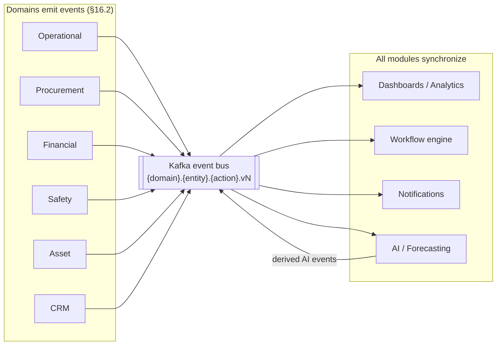
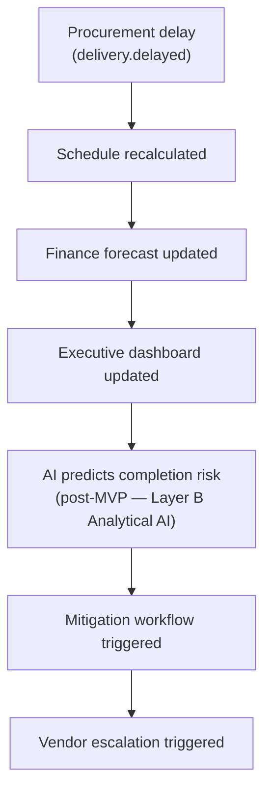

# 16. Enterprise Event Flow

## Table of Contents

- [16.1 Enterprise Event Topology](#161-enterprise-event-topology)
- [16.2 Core Enterprise Events](#162-core-enterprise-events)
- [16.3 Event Schema Standard](#163-event-schema-standard)
- [16.4 Cross-functional Enterprise Flow](#164-cross-functional-enterprise-flow)

---

## 16.1 Enterprise Event Topology

The entire system is designed as :

> Event-driven enterprise operating network

Every action in the organization is converted to an event
so that all modules synchronize in real-time.



---

## 16.2 Core Enterprise Events

> **Naming note:** Events below use PascalCase as **conceptual labels** for readability.
> The machine-readable event type strings use dot-notation format `{domain}.{entity}.{action}.v{N}`
> (e.g. `construction.task.created.v1`, `procurement.purchase_order.approved.v1`).
> See §16.3 and 15-event-driven-workflow §15.6 for the full canonical naming convention and
> 32-implementation-specifications §32.4 for all implemented event type strings.

Operational :

- TaskCreated
- TaskCompleted
- DelayDetected
- InspectionFailed
- WorkerCheckedIn
- MaterialConsumed

Procurement :

- RFQCreated
- VendorQuoted
- PurchaseApproved
- DeliveryReceived
- InventoryUpdated
- InventoryLow

Financial :

- BudgetExceeded
- VendorInvoiceApproved
- BillingApproved
- ARReceiptRecorded
- PaymentReleased
- CashFlowRiskDetected

AI :

- RiskPredictionGenerated
- CostAnomalyDetected
- ForecastUpdated
- AIRecommendationAccepted

Safety :

- SafetyIncidentReported
- SafetyChecklistCompleted
- SafetyViolationDetected

Asset :

- AssetHandedOver
- WarrantyActivated
- MaintenanceScheduled

CRM :

- LeadCreated
- OpportunityConverted
- ContractSigned

---

## 16.3 Event Schema Standard

All events follow the naming convention and versioning rules defined in
15-event-driven-workflow section 15.6. See that section for the full specification.

Examples of events in this topology :

- construction.task.created.v1
- procurement.purchase_order.approved.v1
- finance.budget.exceeded.v1
- ai.risk_prediction.generated.v1
- safety.incident.reported.v1

---

## 16.4 Cross-functional Enterprise Flow

Example :

```text
Procurement delay
→ schedule recalculated
→ finance forecast updated
→ executive dashboard updated
→ AI predicts completion risk  (post-MVP — Layer B Analytical AI; see 21-mvp-scope section 21.4)
→ mitigation workflow triggered
→ vendor escalation triggered

```



This creates :

> Organization-wide operational synchronization

instead of siloed departments.

---

## References

| ID            | Title                                                              | Source                                                                                                                      |
| ------------- | ------------------------------------------------------------------ | --------------------------------------------------------------------------------------------------------------------------- |
| [IEEE 830]    | IEEE Recommended Practice for Software Requirements Specifications | IEEE Std 830-1998                                                                                                           |
| [CloudEvents] | CloudEvents Specification v1.0.2                                   | [cloudevents.io](https://cloudevents.io/)                                                                                   |
| [Kafka]       | Apache Kafka Documentation                                         | [kafka.apache.org/documentation](https://kafka.apache.org/documentation/)                                                   |
| [Avro]        | Apache Avro Specification                                          | [avro.apache.org/docs/current/spec.html](https://avro.apache.org/docs/current/spec.html)                                    |
| [ConfluentSR] | Confluent Schema Registry Documentation                            | [docs.confluent.io/platform/current/schema-registry](https://docs.confluent.io/platform/current/schema-registry/index.html) |
| [Temporal]    | Temporal Workflow Documentation                                    | [docs.temporal.io](https://docs.temporal.io/)                                                                               |

> 📎 See also: [15-event-driven-workflow](15-event-driven-workflow.md)
> · [19-notification-architecture](19-notification-architecture.md) · [09-data-architecture](09-data-architecture.md)
