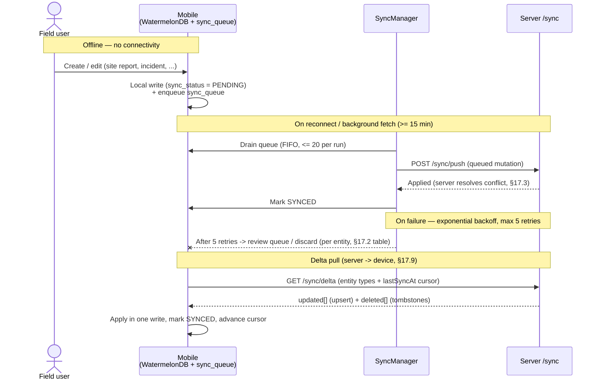

# 17. Offline-first Mobile Sync

## Table of Contents

- [17.1 Why Critical](#171-why-critical)
- [17.2 Offline Architecture](#172-offline-architecture)
- [17.3 Conflict Resolution](#173-conflict-resolution)
- [17.4 Entity Offline Scope](#174-entity-offline-scope)
- [17.5 Conflict Resolution Rules per Entity](#175-conflict-resolution-rules-per-entity)
- [17.6 Sync Priority Order](#176-sync-priority-order)
- [17.7 Data Size Limits](#177-data-size-limits)

---

## 17.1 Why Critical

Construction sites often have :

- Weak internet
- No connectivity
- Temporary outages

Offline capability is mandatory.

---

## 17.2 Offline Architecture

Mobile Local DB :

- WatermelonDB with a custom **ExpoSQLiteAdapter** (`expo-sqlite` WAL mode enabled).
  WatermelonDB is used for all main business entities (site_reports, issues, local_photos, etc.).
- `sync_queue` infrastructure table uses `expo-sqlite` directly (the only entity exempt from WatermelonDB).
- Local event queue
- Local media cache (`expo-file-system` for offline photo queue)

Sync Engine :

- Conflict resolution
- Delta sync
- Retry sync (FIFO queue, exponential backoff, max 5 retries)
- Background sync via `expo-background-fetch` + `expo-task-manager` (fires every 15 min minimum —
  OS-imposed limit); processes up to 20 queue items per run; skips if battery saver active / battery < 15%

Max Retry Exhaustion Behavior :

When the sync queue exhausts all 5 retries for a record, the behavior depends on entity type :

| Entity Type           | Behavior After Max Retries                                                                               |
| --------------------- | -------------------------------------------------------------------------------------------------------- |
| Safety incidents      | Moved to tenant admin review queue; push alert sent to PM and Safety Officer; record preserved on device |
| Workforce attendance  | Moved to tenant admin review queue; push alert sent to PM; record preserved on device                    |
| Inspection results    | Moved to tenant admin review queue; push alert sent to PM; record preserved on device                    |
| Task progress updates | Sync attempt discarded; user notified in-app; record preserved on device for manual retry                |
| Site report drafts    | Sync attempt discarded; user notified in-app; record preserved on device                                 |
| Material consumption  | Moved to tenant admin review queue; record preserved on device                                           |
| Equipment usage logs  | Sync attempt discarded; record preserved on device                                                       |

Manual review queue : a server-side queue visible to Tenant Admin where failed sync records
can be reviewed and manually imported. Records are never deleted from the device until
successfully synced or explicitly resolved by an admin.

---

## 17.3 Conflict Resolution

Strategies :

- Last-write-wins (simple)
- Field-level merge
- Human review queue

Depends on entity criticality.

---

## 17.4 Entity Offline Scope

### Offline-capable (full read/write offline)

These entities are critical for daily site operations and must work without connectivity :

- Tasks (progress_percent, status, notes)
- Site reports (daily report drafts)
- Inspections (checklist responses, photos)
- Workforce attendance (check-in/check-out)
- Material consumption records
- Safety checklists and incident reports
- Equipment usage logs

### Online-required (read cache only, no offline write)

These entities require server-side validation before mutation :

- Purchase orders (financial commitment — server approval required)
- Vendor Invoices (AP), Client Billing (AR), AR Receipts, and Payments (financial records — dual-write risk)
- Budget line mutations (cost accounting integrity)
- Vendor master data (shared reference data)
- User permissions and role changes

### Read-only cache (stale-while-revalidate)

These entities are cached for offline reference but not mutated offline :

- Project master data
- BOQ line items
- Room and floor reference data (required for offline task room assignment)
- Drawing files (cached on demand, size-limited)
- Vendor contact directory

---

## 17.5 Conflict Resolution Rules per Entity

| Entity                | Strategy                                                | Reason                                                                                                                                    |
| --------------------- | ------------------------------------------------------- | ----------------------------------------------------------------------------------------------------------------------------------------- |
| Task progress_percent | Max-wins                                                | Monotonic — progress never regresses; higher value always wins regardless of write order                                                  |
| Inspection checklist  | Field-level merge                                       | Multiple inspectors may fill different fields                                                                                             |
| Site report           | Last-write-wins on `client_submitted_at` (whole record) | One report per day per submitter; SITE_ENGINEER review if server `modified_at` ≠ client's `last_known_modified_at` (master Phase 6; QM-9) |
| Workforce attendance  | Server wins on check_in                                 | Prevents time manipulation                                                                                                                |
| Safety incident       | Human review queue                                      | Critical record — cannot auto-resolve                                                                                                     |
| Material consumption  | Append-only                                             | Each consumption record is a new row                                                                                                      |

---

## 17.6 Sync Priority Order

When connectivity is restored, the sync queue flushes in this priority order :

1. Safety incidents (critical — escalation may be time-sensitive)
2. Workforce attendance (payroll dependency)
3. Inspection results (QC gate may be blocking downstream tasks)
4. Task progress updates
5. Site report drafts
6. Material consumption logs
7. Equipment usage logs
8. Photo/media uploads (largest payload — deferred last)

---

## 17.7 Data Size Limits

Local cache constraints :

- Max local DB size per device: 500 MB
- Drawing cache: 200 MB maximum, LRU eviction when full
- Photo queue: max 100 photos pending upload; user warned at 80
- Sync batch size: max 500 records per sync cycle to avoid UI blocking

---

## 17.8 Expo Native Build Setup (WatermelonDB JSI)

WatermelonDB 0.28 ships native JSI code, so on Expo (SDK 56) it requires native wiring and a
**custom development client — it does NOT run in Expo Go**. Required setup in `apps/mobile`:

- **Config plugin (community-maintained):** `@morrowdigital/watermelondb-expo-plugin@^2.3.3` for Expo SDK 56.
  This plugin uses independent semver (2.x), not SDK-matched version numbers. The `@skam22` fork previously
  used for SDK 51 was abandoned at SDK 51 and is no longer viable for current SDKs, so the config plugin was
  switched to `@morrowdigital` (ADR-046). WatermelonDB's own docs give no Expo guidance — these plugins are
  community-maintained, not first-party.
- **`expo-build-properties`** in `app.json` `plugins`: Android `kotlinVersion 1.8.10`,
  `compileSdkVersion`/`targetSdkVersion 33`, `packagingOptions.pickFirst ["**/libc++_shared.so"]`; iOS
  `extraPods` entry for `simdjson` with `path: ../node_modules/@nozbe/simdjson` and `modular_headers: true`.
- **`@nozbe/simdjson`** (WatermelonDB's transitive dep) added as a **direct dependency** of `apps/mobile`,
  pinned to the version WatermelonDB requires (`3.9.4`), so pnpm symlinks it at
  `node_modules/@nozbe/simdjson` for the iOS pod `path` to resolve — pnpm keeps transitive deps under
  `.pnpm/`, so the README's `node_modules/...` path does not resolve otherwise.
- **`babel.config.js`:** `["@babel/plugin-proposal-decorators", { legacy: true }]` — required by
  WatermelonDB's `@field`/`@text`/`@date` model decorators.
- **Build / entry:** `app.json` `main` must be `expo-router/entry`; produce the dev client via
  `npx expo run:ios` / `run:android` (or EAS). The exact build-properties values differ per plugin
  version — copy them from the README of the version you install.

---

## 17.9 Delta Sync (server → device pull)

The push path (queued mutations → `POST /sync/push`) is complemented by a **delta pull** that brings
server-side changes down to the device:

- **Caller:** `runDeltaSync()` (`apps/mobile/src/sync/runDeltaSync.ts`) calls `GET /sync/delta` with the
  registered entity types and the last-sync cursor (`syncStore.lastSyncAt`, defaulting to epoch on first
  run). It applies the response's `updated[]` (upsert by server id) and `deleted[]` (remove across tables)
  inside a single WatermelonDB write, marks applied rows `sync_status = 'SYNCED'`, then advances the cursor
  to the response's `server_timestamp`.
- **Trigger:** invoked from `(app)/_layout` on entering the authenticated app (best-effort; offline is
  ignored, local cache is kept). The previously-unused `DeltaSyncClient` class is superseded by this caller.
- **Entity types applied → local tables** (all six the server's delta registry emits):

  | Server entity type | Local table                    | Schema |
  | ------------------ | ------------------------------ | ------ |
  | `task`             | `local_tasks`                  | v2     |
  | `site_report`      | `local_site_reports`           | v1     |
  | `issue`            | `local_issues`                 | v1     |
  | `attendance`       | `local_attendance`             | v2     |
  | `safety`           | `local_incidents`              | v4     |
  | `material`         | `local_material_consumptions`  | v4     |

- **Schema version:** `DB_VERSION = 4`. v3→v4 (`migrations.ts`) adds `local_incidents` and
  `local_material_consumptions` as read caches so the delta pull can apply `safety`/`material`.
- **Offline write UI (PO ruling D1–D4 + M1/M2):** `local_incidents` / `local_material_consumptions` are
  surfaced for read/write per §17.4:
  - **Incidents — SAFETY_OFFICER**, dedicated `incidents` tab (`(app)/incidents.tsx`). Create writes a
    `local_incidents` row (`sync_status = PENDING`, reactive list via `useCollection`) **and** enqueues a
    `'safety'` sync_queue item → SyncManager `/sync/push` → `SafetyService.createIncident`.
  - **Material — SITE_ENGINEER**, embedded in the engineer `reports` screen (material is a child of a
    site report; server `createMaterialConsumption(reportId, dto)`). Recording enqueues a `'material'`
    item carrying `report_id` → `/sync/push` → `SiteOpsService.createMaterialConsumption`. No local write
    on create (the delta cache keys on `project_id` while creation keys on `report_id`); the recorded row
    returns via the next delta pull.
  - Known limitation (same as the issues screen): `PENDING`→`SYNCED` reconciliation and delta-dedup of
    locally-created rows are not yet wired.
- **Deletion source:** `deleted[]` is read from `platform.sync_tombstones`; per-entity delete→tombstone
  wiring is deferred (today the list is empty until each entity records tombstones).

---

## References

| ID             | Title                                                              | Source                                                                                        |
| -------------- | ------------------------------------------------------------------ | --------------------------------------------------------------------------------------------- |
| [IEEE 830]     | IEEE Recommended Practice for Software Requirements Specifications | IEEE Std 830-1998                                                                             |
| [CRDT]         | Conflict-Free Replicated Data Types                                | Shapiro et al., INRIA Research Report RR-7687, 2011                                           |
| [WatermelonDB] | WatermelonDB — High-performance React Native Database              | [nozbe.github.io/WatermelonDB](https://nozbe.github.io/WatermelonDB/)                         |
| [IndexedDB]    | Indexed Database API 3.0                                           | W3C Recommendation — [w3.org/TR/IndexedDB](https://www.w3.org/TR/IndexedDB/)                  |
| [Expo SQLite]  | Expo SQLite Documentation                                          | [docs.expo.dev/versions/latest/sdk/sqlite](https://docs.expo.dev/versions/latest/sdk/sqlite/) |
| [JWT-RFC]      | JSON Web Token (JWT)                                               | RFC 7519                                                                                      |

> 📎 See also: [04-tech-stack](04-tech-stack.md) · [11-database-schema](11-database-schema.md) · [19-notification-architecture](19-notification-architecture.md)
