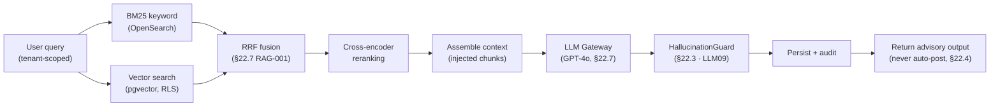

# 22. AI Architecture

## Table of Contents

- [22.1 AI Philosophy](#221-ai-philosophy)
- [22.2 AI Capability Layers](#222-ai-capability-layers)
- [22.3 AI System Components](#223-ai-system-components)
- [22.4 AI Use Cases](#224-ai-use-cases)
- [22.5 LLM Provider Strategy](#225-llm-provider-strategy)
- [22.6 LAYER-C-001 Evaluation Rubric](#226-layer-c-001-evaluation-rubric)
- [22.7 AI Integration Decisions](#227-ai-integration-decisions)
- [22.8 AI Security (OWASP LLM Top 10)](#228-ai-security-owasp-llm-top-10)
- [22.9 Model Governance](#229-model-governance)
- [22.10 AI Engineering Enhancements](#2210-ai-engineering-enhancements)

---

## 22.1 AI Philosophy

AI should act as :

- Operational copilot
- Risk analyst
- Knowledge engine
- Forecasting system
- Workflow automation layer

NOT just chatbot.

---

## 22.2 AI Capability Layers

Layer A — Assistive AI :

- Document summarization
- Voice transcription
- OCR
- Daily report generation
- Translation (post-MVP Layer A — not in MVP AI scope; see 21-mvp-scope section 21.4)

Layer B — Analytical AI :

- Delay prediction
- Budget overrun prediction
- Procurement forecasting
- Workforce optimization

Layer C — Autonomous AI :

- Auto-create RFQs
- Auto-detect risks
- Auto-generate schedules
- Auto-route approvals

---

## 22.3 AI System Components

| Component          | Responsibility                                                                                                                                                                        |
| ------------------ | ------------------------------------------------------------------------------------------------------------------------------------------------------------------------------------- |
| LLM Gateway        | Single entrypoint for all LLM calls — multi-model routing via `LLMProvider` (no direct SDK coupling); token tracking, Redis cache, Jinja2 prompts; resilience/budget per §22.7 GW-001 |
| RAG Engine         | Context retrieval                                                                                                                                                                     |
| Vector DB          | Embeddings                                                                                                                                                                            |
| Knowledge Graph    | Construction relationships                                                                                                                                                            |
| Feature Store      | ML features                                                                                                                                                                           |
| Training Pipeline  | Continuous learning                                                                                                                                                                   |
| Agent Orchestrator | Multi-step AI workflows — see note below                                                                                                                                              |
| HallucinationGuard | Output gate before persist — rejects an ungrounded report; source attribution per the note below (LLM09, §22.8)                                                                       |

Note on Agent Orchestrator :

The Agent Orchestrator is responsible for coordinating multi-step AI workflows where an AI
agent must plan, invoke tools, and act across multiple services.

- MVP scope (Layer A only) : no Agent Orchestrator required. Layer A features (report
  generation, summarization, OCR, voice transcription) use plain Python sequential
  pipelines — no Agent Orchestrator framework (LangGraph, CrewAI, etc.) needed.
  "No orchestration" means no Agent Orchestrator, not that the pipeline has one function.
  A 6-step sequential pipeline (RAG → context → LLM → guard → persist → return) is
  implemented as plain Python function calls.
- Post-MVP Layer B/C : durable multi-step AI workflows (e.g., AI-triggered procurement,
  auto-schedule generation) MUST be orchestrated via Temporal.io (see 15-event-driven-workflow
  section 15.4). Temporal.io provides durable execution, retries, and human-in-the-loop
  steps — the same engine used for approval workflows.
- Full autonomous multi-agent framework (Layer C) : framework selection deferred until
  post-Stage 2, when Layer B capabilities are validated in production.

Note on HallucinationGuard source attribution :

The `guard` step rejects an output that is not attributable to the retrieved context. Attribution is
checked against what the model actually cited, not against how confident it says it is:

- Every report output model carries **`sources: string[]`** — verbatim lines the model drew its
  claims from. The four report prompts (`ai/prompts/report-*-v1.j2`) instruct the model to copy them
  exactly and to return an empty list rather than invent one.
- The guard **fails** the output when `sources` is absent or empty, when any entry is blank, or when
  any entry is not found in the retrieval context after whitespace normalisation. A re-wrapped quote
  still counts as cited; a fabricated one does not.
- An empty retrieval context therefore **cannot** produce a passing narrative report. This is
  deliberate: a narrative written from no project data is fabrication by construction. The caller
  returns the low-confidence fallback with `raw_data_available`, and the client shows raw data.
- A confidence score is **not** an attribution signal and never was — a model that fabricates a
  narrative reports high confidence for it. Confidence is checked separately against the
  `AI_CONFIDENCE_THRESHOLD` (§22.7).

> 🟡 **PROVISIONALLY RESOLVED [LAYER-C-001]**:
> **Temporal.io is pre-selected as the provisional agent orchestration framework for
> Layer C** — it is already in use for approval workflows (15-event-driven-workflow
> §15.4) and provides durable execution + human-in-the-loop natively.
> **Final commitment is still gated:** when the trigger fires (Layer B deployed to
> production and first Analytical AI feature stable for ≥ 30 days), run the §22.6
> evaluation rubric — including the Thai construction benchmark (minimum pass 4/5) —
> against Temporal.io as a **validation gate**. If Temporal.io fails the benchmark,
> re-open the full candidate set (LangGraph, CrewAI, AutoGen).
> **Decision deadline (final commitment):** no later than 4 weeks after Layer B goes
> live in production (§22.6 Decision Output).
> **Action:** Open a spec issue tagged `layer-c-decision` when Layer B stabilises.

### Vector Store Tenant Isolation

The vector store (pgvector) must enforce tenant isolation consistent with the tiered model in
07-multi-tenant-architecture section 7.1. A data leak between tenants' embeddings is a
**security boundary violation**, not a data quality issue.

#### Embedding Table Schema

All embedding tables must include `tenant_id` as a non-nullable isolation key:

```sql
-- Shared table (SMB tier) — applied in the `public` schema or the relevant tenant schema
CREATE TABLE document_embeddings (
  id            UUID        PRIMARY KEY DEFAULT gen_random_uuid(),
  tenant_id     UUID        NOT NULL,           -- isolation key
  source_type   VARCHAR(50) NOT NULL,           -- 'document' | 'site_report' | 'boq' | 'rfq'
  source_id     UUID        NOT NULL,           -- FK to the source entity
  content_hash  VARCHAR(64) NOT NULL,           -- SHA-256 of chunked text (dedup guard)
  chunk_index   INTEGER     NOT NULL,           -- 0-based position within source
  embedding     VECTOR(1536) NOT NULL,          -- text-embedding-3-small output
  created_at    TIMESTAMPTZ NOT NULL DEFAULT now()
);

-- Index 1: HNSW approximate nearest neighbour search (covers all tenants in shared tier)
CREATE INDEX ON document_embeddings
  USING hnsw (embedding vector_cosine_ops)
  WITH (m = 16, ef_construction = 64);

-- Index 2: tenant + recency filter — applied before HNSW scan to reduce candidate set
CREATE INDEX ON document_embeddings (tenant_id, source_type, created_at DESC);
```

#### Tier-by-Tier Isolation Strategy

| Tenant Tier               | Isolation Method                                                                                         | pgvector Location                                         |
| ------------------------- | -------------------------------------------------------------------------------------------------------- | --------------------------------------------------------- |
| SMB (Shared DB)           | Row-level `WHERE tenant_id = $tenantId` on **every** query — enforced at application layer               | Shared `document_embeddings` table with `tenant_id` index |
| Mid-market (Shared DB)    | Row-level `WHERE tenant_id = $tenantId` — same as SMB; escalate to Dedicated DB if upgrade trigger fires | Shared `document_embeddings` table with `tenant_id` index |
| Enterprise (Dedicated DB) | Separate PostgreSQL instance with pgvector — no shared infrastructure                                    | Dedicated PostgreSQL database                             |

#### Enforcement Rules

1. **JWT-bound tenant_id:** Every RAG query binds `tenant_id` from the decoded JWT claim — never from a
   user-supplied body or query parameter (see `05-security-compliance` §5.4.1).
2. **No cross-tenant results:** Vector similarity search must never return rows from a different
   `tenant_id` than the requesting user's. A single mis-scoped query is a security incident.
3. **SMB shared HNSW index trade-off:** The shared HNSW index covers all tenants for write
   performance; `tenant_id` acts as a post-filter. Accepted risk: a very large SMB tenant
   inflating the shared index is the trigger to escalate that tenant to the Dedicated DB tier.
   **Upgrade trigger (quantified):** If any single SMB tenant's embedding row count exceeds
   **500,000 rows**, OR if RAG p95 query latency for that tenant exceeds **200 ms** measured
   over a 7-day rolling window, that tenant MUST be escalated to the Dedicated DB tier.
   Monitor via the metric `rag_retrieval_duration_seconds` per tenant
   (see 31-monitoring-observability section 31.3). Migration path: `pg_dump` the tenant's
   rows from the shared table → restore to a dedicated DB → update the tenant's isolation
   tier in the `tenants` table → rebuild the HNSW index.
4. **Content dedup is per-tenant:** `content_hash` dedup is scoped per `(tenant_id, source_id)`
   — two tenants storing identical documents is not a cross-tenant leak.
5. **Audit logging:** All embedding reads must emit a structured log entry with `tenant_id`,
   `actor_id`, `source_type`, `query_vector_hash` for compliance with 05-security-compliance §5.5.

---

## 22.4 AI Use Cases

Note : All use cases in this section are Layer B — Analytical AI. They are post-MVP.
MVP activates Layer A (Assistive AI) only — see 21-mvp-scope section 21.4 and
section 22.2 above for the full layer boundary.

### Delay Prediction

Inputs :

- Weather
- Workforce
- Procurement delays
- Historical productivity

Outputs :

- Delay probability
- Critical path risk
- Mitigation recommendation

### Cost Anomaly Detection

AI detects :

- Material cost spikes
- Fraud patterns
- Procurement inefficiency
- Abnormal labor productivity

---

## 22.5 LLM Provider Strategy

Provider Hierarchy :

| Provider             | Role                                                                                                                       |
| -------------------- | -------------------------------------------------------------------------------------------------------------------------- |
| GPT-4o (OpenAI)      | **Primary** — reasoning, vision tasks, Thai language                                                                       |
| gpt-4o-mini (OpenAI) | **Cost fallback** — same provider, lower cost for high-volume simple tasks                                                 |
| Additional providers | Optional — accessed via `LLMProvider` interface without code changes; provider switching is a configuration-only operation |

Routing :

- LLM Gateway selects model based on `model_hint` passed by caller — two-tier configurable routing table
  (stored in env/YAML, never hardcoded)
- All providers accessed via unified `LLMProvider` interface (LangChain abstraction) — no direct SDK
  coupling in domain services
- Provider switching does not require application code changes

| model_hint            | Model       | Rationale                      |
| --------------------- | ----------- | ------------------------------ |
| `report-generation`   | gpt-4o      | Complex reasoning, long output |
| `risk-analysis`       | gpt-4o      | Multi-factor reasoning         |
| `document-extraction` | gpt-4o      | Accuracy over throughput       |
| `summarization`       | gpt-4o-mini | High-volume, lower complexity  |
| `classification`      | gpt-4o-mini | Simple, latency-sensitive      |
| `autocomplete`        | gpt-4o-mini | Real-time, cost-sensitive      |

RAG Architecture :

- Documents ingested → text extracted (OCR for PDFs, photos)
- Text chunked: documents via recursive character splitter `chunk_size=500`, `chunk_overlap=100`
  (master Phase 11; site reports treated as a single chunk)
- Embedded via **text-embedding-3-small** (OpenAI, 1536 dimensions) via `EmbeddingProvider` interface
- Stored in pgvector (MVP) → Weaviate (at scale)
- Query-time: hybrid search — keyword BM25 (OpenSearch) + semantic vector (pgvector), fused via Reciprocal
  Rank Fusion (RRF), then cross-encoder reranking (see §22.7 RAG-001)
- Retrieved chunks injected into LLM prompt as context



The 6-step pipeline (§22.3): **retrieve → context → LLM → guard → persist → return** — retrieval is the
hybrid BM25 + vector → RRF → rerank path above; AI-security controls per §22.8.

Thai Language :

- Thai is first-class — all prompts, outputs, and UI support Thai
- Embedding model: text-embedding-3-small supports Thai adequately for construction domain queries
- LLM evaluation benchmarks include Thai construction terminology accuracy
- Fallback: if primary model Thai quality is insufficient, route to alternative provider via `LLMProvider` interface

---

## 22.6 LAYER-C-001 Evaluation Rubric

> This section activates when the trigger condition fires: _Layer B deployed to
> production and stable for ≥ 30 days._ Per §22.3, **Temporal.io is provisionally pre-selected**; when the trigger
> fires this rubric runs as a **validation gate** against Temporal.io first — the full candidate
> set below is re-opened only if Temporal.io fails the Thai benchmark (< 4/5).
> Do not treat the provisional selection as final before the trigger.

### Candidates

| Candidate       | Description                                                                                                                                                   |
| --------------- | ------------------------------------------------------------------------------------------------------------------------------------------------------------- |
| **Temporal.io** | Already deployed for approval workflows (15-event-driven-workflow §15.4). Durable execution, human-in-the-loop, retry semantics. Not an LLM-native framework. |
| **LangGraph**   | LangChain ecosystem. Stateful agent graphs, native tool-calling, compatible with `langchain>=0.3` already in use.                                             |
| **CrewAI**      | Role-based agent collaboration. Simple to prototype, limited enterprise durability features.                                                                  |
| **AutoGen**     | Microsoft multi-agent conversation framework. Good for reasoning chains; less proven for production durable workflows.                                        |

### Scoring Rubric (score 1–5 per axis, select highest total)

| Axis                                  | Weight | What to evaluate                                                                                                                      |
| ------------------------------------- | ------ | ------------------------------------------------------------------------------------------------------------------------------------- |
| LangChain compatibility (>=0.3)       | 25%    | Can agents use the existing `LLMProvider` / `EmbeddingProvider` interfaces without wrapping or replacing them?                        |
| Temporal.io co-existence              | 20%    | Can agent workflows be durably orchestrated via Temporal activities, or does the framework require its own persistence layer?         |
| Thai-language tool-calling accuracy   | 20%    | Run the standard Thai construction scenario benchmark (see below) — measure correct tool selection rate and output accuracy           |
| Durable execution + human-in-the-loop | 20%    | Does the framework natively support: retry on failure, pause-for-human-approval, resume from checkpoint?                              |
| Operational complexity                | 15%    | How many new infra components does this add? Does it require a dedicated process / database / broker beyond what is already deployed? |

### Thai Construction Benchmark (run before deciding)

Execute these 5 scenarios in Thai against each candidate. Score pass/fail per scenario.
Minimum pass rate for consideration: **4/5**.

1. `"สร้าง RFQ สำหรับวัสดุ rebar 50 ตัน โครงการ proj_001 ภายใน 3 วัน"`
   — agent must call procurement tool, not just answer text
2. `"ตรวจสอบ PO ที่รออนุมัติเกิน 48 ชั่วโมง และส่ง notification ให้ Finance"` — multi-step with notification tool
3. `"พยากรณ์ความล่าช้าของโครงการ proj_002 จากข้อมูล 30 วันล่าสุด"` — must retrieve data, not hallucinate
4. `"หยุดรอการอนุมัติจาก PM ก่อนดำเนินการต่อ"` — human-in-the-loop pause + resume
5. `"ถ้า cost variance > 15% ให้แจ้ง Executive และสร้าง risk report อัตโนมัติ"`
   — conditional branching with multiple tool calls

### Decision Output Required

When the decision is made, produce a one-page ADR (Architecture Decision Record) containing:

- **Date decided:**
- **Trigger met:** (confirm Layer B was stable for ≥ 30 days)
- **Candidates evaluated:** (list all scored)
- **Scores table:** (axis scores for each candidate)
- **Thai benchmark results:** (pass/fail per scenario per candidate)
- **Selected framework:**
- **Rationale:** (why this framework, what was ruled out and why)
- **Migration impact:** (any changes to existing Temporal.io approval workflows)
- **Owner:** (who is responsible for implementation in Phase C)

File the ADR as `docs/architecture/adr-layer-c-agent-framework.md` and update
[LAYER-C-001] decision documented in `docs/specifications/22-ai-architecture` §22.6.

---

## 22.7 AI Integration Decisions

### LLM Provider

**Decision:** OpenAI GPT-4o as primary LLM. Integration via `LLMProvider` interface in AI Gateway (FastAPI).
All LLM calls routed through the interface — never called directly.

| Attribute        | Value                                                           |
| ---------------- | --------------------------------------------------------------- |
| Primary provider | OpenAI GPT-4o (`gpt-4o`)                                        |
| API              | OpenAI REST API (`/v1/chat/completions`)                        |
| Auth             | API key stored per-tenant in AWS Secrets Manager / Vault        |
| Interface        | `LLMProvider.complete(messages, options): Promise<LLMResponse>` |

---

### Alternative LLM Provider

**Decision:** Two alternatives — Claude (Anthropic) for cloud fallback; Ollama for on-premise deployments.

| Scenario                                                | Provider                                              | Notes                                                  |
| ------------------------------------------------------- | ----------------------------------------------------- | ------------------------------------------------------ |
| Cloud fallback (OpenAI down or cost threshold exceeded) | Claude API (Anthropic) — `claude-sonnet-4-6` or later | Same `LLMProvider` interface; switch via tenant config |
| On-premise deployments (data sovereignty)               | Ollama (self-hosted open-source LLM)                  | Llama 3 or equivalent; deployed on-premise EKS node    |

---

### LLM Gateway Resilience (GW-001)

**Decision:** The LLM Gateway centralizes resilience and cost controls so they never leak into domain services.
**Resolved:** 2026-06-17

- **Provider fallback / failover:** on primary (OpenAI) error or cost-threshold breach, the gateway routes
  to the configured alternative provider (Claude — see Alternative LLM Provider) via the same `LLMProvider`
  interface. Failover policy lives in routing YAML, never hardcoded.
- **Budget enforcement:** per-tenant monthly token budget enforced at the gateway; on breach, alert
  FINANCE + TENANT_ADMIN per 31-monitoring-observability §31.3 (`AIHighTokenUsage`). Enforcement action
  (block vs. throttle) configurable per tenant tier.
- **Virtual keys:** domain services authenticate to the gateway with internal virtual keys; provider API
  keys live only in the gateway secret store (AWS Secrets Manager / Vault).

**Industry precedent (2026):** centralized AI/LLM gateways (LiteLLM, Portkey, Kong AI Gateway, MLflow AI
Gateway) consolidate fallback, budget enforcement, virtual keys, and observability at the gateway layer.

---

### OCR Provider

**Decision:** Two-tier OCR — open-source self-hosted for basic text extraction, AWS Textract for
structured invoice/form extraction.

| Tier                | Engine                                                 | Use case                                                                           | Auth / Deployment                                                                               | Interface                                                              |
| ------------------- | ------------------------------------------------------ | ---------------------------------------------------------------------------------- | ----------------------------------------------------------------------------------------------- | ---------------------------------------------------------------------- |
| Tier 1 — Basic      | `pytesseract` + `pdf2image` (open-source, self-hosted) | Scanned PDFs and image files (JPEG/PNG) → plain text for embedding / RAG ingestion | Runs in `ai-ocr-pipeline` container; requires system packages `tesseract-ocr` + `poppler-utils` | `process_file(file_id, bytes, mime_type): OCROutput`                   |
| Tier 2 — Structured | AWS Textract (`AnalyzeDocument` — FORMS feature)       | Extract vendor name, invoice number, amount, line items from invoice photos        | IAM role (EKS IRSA) — no separate credentials                                                   | `CloudOCRProvider.extract(imageUrl, documentType): Promise<OCRResult>` |

**Pipeline (Tier 1):** `pdf2image → pytesseract → extracted text → embedding worker` (00_master §Phase 11,
line 2805). Output: `{ file_id, extracted_text, confidence_score }`. Triggered by Kafka consumer on
`file.uploaded` (mime = PDF or image).

---

### OCR High-Accuracy Extraction Tier (OCR-001)

**Decision:** For high-value or layout-variable documents, route OCR text through the LLM Gateway
`document-extraction` model_hint (gpt-4o) for structured field extraction.
**Resolved:** 2026-06-17

- **Pipeline:** Tier-1 / Tier-2 OCR (raw text or blocks) → LLM Gateway `document-extraction` (gpt-4o, §22.5)
  → validated structured fields.
- **When to use:** invoices / drawings with high layout variance, handwriting, or non-standard formats
  where Textract FORMS confidence is low.
- **Guardrail:** extracted financial fields stay advisory — never auto-post; human review per Autonomous
  Workflow Executor (§22.7) and COORD-001 thresholds.

**Industry precedent (2026):** combining external OCR with an LLM extraction step (e.g. GPT-4o) yields the
highest field-level accuracy on complex / variable documents in invoice-extraction benchmarks.

---

### Embedding Provider

**Decision:** OpenAI `text-embedding-3-small` for vector embeddings.

| Attribute | Value                                                           |
| --------- | --------------------------------------------------------------- |
| Model     | OpenAI `text-embedding-3-small` (1,536 dimensions)              |
| API       | OpenAI REST API (`/v1/embeddings`)                              |
| Interface | `EmbeddingProvider.embed(texts: string[]): Promise<number[][]>` |

---

### LangChain Configuration

**Decision:** LangChain Python SDK (`langchain` + `langchain-openai`) configured with the LLMProvider wrapper.

| Attribute  | Value                                                                                                                                                                                                                                                                                                        |
| ---------- | ------------------------------------------------------------------------------------------------------------------------------------------------------------------------------------------------------------------------------------------------------------------------------------------------------------ |
| Library    | `langchain>=0.3`, `langchain-openai>=0.2`                                                                                                                                                                                                                                                                    |
| Chain type | RAG chain: retrievers (pgvector + OpenSearch) → RRF fusion → cross-encoder reranker → LLM (see §22.7 RAG-001)                                                                                                                                                                                                |
| Config     | Chain config stored in `services/ai-gateway/ai/chains/` as YAML per chain type — service-local, resolved via `providers.langchain_config.CHAINS_DIR` (override `AI_CHAINS_DIR`). NOT repo-root `ai/chains/`: that copy diverged onto a second schema and broke inside the container (PO decision 2026-07-21) |
| Interface  | `LangChainProviderConfig.buildChain(chainType, tenantId): Chain`                                                                                                                                                                                                                                             |

---

### Cross-Encoder Reranking

**Decision:** `sentence-transformers` cross-encoder for RAG result reranking.

| Attribute | Value                                                                       |
| --------- | --------------------------------------------------------------------------- |
| Library   | `sentence-transformers>=3.0` (Python)                                       |
| Model     | `cross-encoder/ms-marco-MiniLM-L-6-v2` (fast, construction-domain suitable) |
| Trigger   | Activate when RAG retrieval p95 relevance score < 0.7 over 7-day window     |
| Interface | `CrossEncoderReranking.rerank(query, passages): Promise<RankedPassage[]>`   |

---

### RAG Retrieval Fusion (RAG-001)

**Decision:** Fuse keyword (BM25) and vector results with Reciprocal Rank Fusion (RRF) before reranking.
**Resolved:** 2026-06-17

- **Why RRF:** BM25 scores and cosine similarities are on different scales; RRF combines them by rank
  position alone (no score normalization) and rewards documents both retrievers agree on.
- **Pipeline:** BM25 (OpenSearch) + vector (pgvector) → RRF merge → cross-encoder reranker (§22.7
  Cross-Encoder Reranking) → top-k = 5 context assembly.
- **Tuning:** RRF rank constant is tunable in chain config (`services/ai-gateway/ai/chains/`) — use the retriever library's
  documented default unless benchmark dictates otherwise.

**Industry precedent (2026):** most production hybrid-RAG systems fuse BM25 + vector with RRF, optionally
followed by cross-encoder reranking on the candidate set.

---

### Model Routing Evolution (RT-001)

**Decision:** MVP uses static task-type tiering (§22.5); evolve to cascade, then predictive routing.
Adoption is **eval-driven, not budget-percentage-driven** — adopt early once a representative eval set
exists, and **learn thresholds from data** rather than hardcoding magic numbers.
**Resolved:** 2026-06-17

- **MVP (current):** static two-tier routing by `model_hint` → POWERFUL (`gpt-4o`) / FAST (`gpt-4o-mini`);
  table in §22.5, config in routing YAML.
- **Stage 2 — cascade routing:** start at FAST tier; escalate to POWERFUL only when the cheap-model
  confidence score falls below threshold τ. **Adopt when:** (a) a representative labeled eval set exists
  (use the Thai construction benchmark, §22.6) AND (b) a quality/cost signal fires (`AIHighTokenUsage`,
  31-monitoring-observability §31.3). **τ is LEARNED on the eval set (FrugalGPT), never hardcoded.**
- **Stage 3 — predictive routing:** a lightweight classifier predicts the cheapest model that satisfies
  each request. **Adopt when:** an in-domain preference-data router (trained on cascade escalations +
  logged human overrides; bootstrap from public data per RouteLLM) beats static routing on a holdout set.
- **Guardrail:** never change routing without per-task cost/quality attribution
  (31-monitoring-observability §31.3); run the eval on real prompts before committing a savings figure
  to FINANCE.

**Industry precedent (2026):** leaders adopt routing early and choose eval-driven triggers, not magic
numbers — cascade thresholds are learned on a validation set (FrugalGPT, arXiv:2305.05176) and predictive
routers are trained on preference data (RouteLLM, arXiv:2406.18665).

---

### Model Registry

**Decision:** MLflow self-hosted on EKS for model versioning and registry.

| Attribute      | Value                                                            |
| -------------- | ---------------------------------------------------------------- |
| Service        | MLflow Server (`mlflow server`) — Kubernetes Deployment          |
| Backend store  | PostgreSQL (existing RDS)                                        |
| Artifact store | MinIO (existing S3-compatible)                                   |
| Interface      | `ModelRegistry.registerModel(name, version, artifactPath): void` |

---

### Feature Store

**Decision:** Feast (open-source) configured with Redis online store and PostgreSQL offline store.

| Attribute     | Value                                                                    |
| ------------- | ------------------------------------------------------------------------ |
| Library       | Feast (`feast>=0.40`)                                                    |
| Online store  | Redis (existing)                                                         |
| Offline store | PostgreSQL (existing RDS)                                                |
| Interface     | `FeatureStore.getOnlineFeatures(entityKeys, featureRefs): FeatureVector` |

---

### Experiment Monitoring & Evaluation

**Decision:** MLflow (experiment tracking) + Evidently AI (evaluation & drift) — both open-source,
self-hosted.

| Attribute | Value                                                                                                                        |
| --------- | ---------------------------------------------------------------------------------------------------------------------------- |
| Service   | MLflow Tracking (self-hosted, same server as Model Registry) + Evidently AI (OSS, self-hosted)                               |
| Auth      | In-cluster — no external SaaS / API key                                                                                      |
| Usage     | MLflow: log training runs, params, metrics, artifacts (Phase 23). Evidently AI: model/output evaluation + data/concept drift |
| Interface | `ExperimentMonitoring.logRun(config, metrics): void` (MLflow-backed)                                                         |

---

### Autonomous Workflow Executor

**Decision:** AI may act autonomously ONLY for notifications and report generation. All financial actions
and approvals require human approval.

| Action type           | Autonomous?        | Requires human?               |
| --------------------- | ------------------ | ----------------------------- |
| Send notification     | ✅ Yes             | —                             |
| Generate report draft | ✅ Yes             | PM reviews before publish     |
| Flag risk / delay     | ✅ Yes (flag only) | —                             |
| Approve PO / invoice  | ❌ No              | Always human                  |
| Adjust budget         | ❌ No              | Always FINANCE + EXECUTIVE    |
| Modify workflow state | ❌ No              | Always role-appropriate human |

**Implementation:** `AutonomousWorkflowExecutor.execute(action)` — checks action type against whitelist
before executing; throws `GovernanceViolationError` for disallowed actions.

> ⚠️ **NOT implemented in Phase 11–12.** Interface is specified here as a decision record only.
> Implementation deferred to Phase 13+ when Layer B (Analytical AI) is deployed and stable.

---

### ML Models (Phase 23)

**Decision:** Python `scikit-learn` + `XGBoost` as the primary ML framework for all Phase 23 models.

| Model              | Use case                   | Algorithm                                                                | Input features                                                                                        |
| ------------------ | -------------------------- | ------------------------------------------------------------------------ | ----------------------------------------------------------------------------------------------------- |
| DelayForecastModel | Delay forecast             | XGBoost regressor (days to delay)                                        | procurement delays, task completion %, weather history, workforce attendance                          |
| SafetyVisionModel  | Safety violation detection | XGBoost classifier on extracted image features (HOG + ViT embeddings)    | site photo embeddings, PPE label presence                                                             |
| GraphMLModel       | Supply chain risk          | XGBoost on graph-derived node features (PageRank, centrality) from Neo4j | vendor relationship graph features                                                                    |
| RiskClassifier     | Project risk score         | XGBoost multi-class (LOW/MEDIUM/HIGH/CRITICAL)                           | budget variance, schedule delay, procurement status, safety incidents                                 |
| DeviceTrustModel   | Device trust score         | XGBoost binary classifier; calibrated probability rendered 0–100         | attestation verdict, enrolment age, `last_seen_at` recency, revocation history, ingress ASN stability |
| CostAnomalyModel   | Cost anomaly detection — flags unusual cost entries and procurement patterns | **UNSPECIFIED** — algorithm to be decided when Layer B enters an active development sprint (owner: AI/Platform Lead) | **UNSPECIFIED** — candidate sources: `finance.cost_transactions`, `finance.project_budgets`, ClickHouse `project_cost_daily` |

All models trained on Phase 23 MLOps pipeline (MLflow + Feast). Minimum data thresholds before training:

- DelayForecastModel: 90+ days production data
- SafetyVisionModel: 10,000+ labeled site photos
- GraphMLModel: 6+ months Neo4j relationship data
- RiskClassifier: 50+ projects with full lifecycle
- CostAnomalyModel: **UNSPECIFIED** — minimum data threshold to be set with its algorithm

> **Added 2026-08-22 (product owner).** `CostAnomalyModel` had an evaluation threshold in
> `30-testing-strategy` §30.11 (Precision ≥ 0.85, secondary Recall) but was absent from this model
> table and from `00_master` Phase 23. It is a missing model, not a stale name: its use case and
> evaluation metric are recorded now; algorithm, input features and minimum training data stay
> `UNSPECIFIED` and must not be inferred. See docs/architecture/test-design/escalation-register.md §35.13 ESC-03.

- DeviceTrustModel: **no count threshold** — promotion is gated on beating the rule-based baseline on
  a held-out set, measured by **PR-AUC** (ADR-081). A count trigger is the wrong gate here: the
  positive class ("device later revoked as compromised") is rare by design, so a calendar- or
  volume-based trigger would promote a model that had learned almost nothing, and accuracy/ROC-AUC
  both stay flattering under that imbalance. Until the gate passes, a deterministic rule-based scorer
  serves behind the same interface, and the surface is **not** described as AI-derived while it does.
  The score is advisory only — it never revokes a device or blocks a login (§22.3).

---

### Procurement Intelligence Algorithm (INT-003)

**Decision:** Hybrid ML — gradient boosting for structured features + collaborative filtering
for supplier matching.
**Resolved:** 2026-06-10

- **Cost / delay forecasting:** XGBoost / LightGBM on structured project features —
  schedule variance, procurement lead times, workforce data, weather history
- **Supplier matching:** Neural collaborative filtering — learns affinity from historical
  PO-to-vendor assignments across the platform dataset
- **Benchmarking:** Gradient boosting on market price signals from COORD-004 data sources
  (Dodge Analytics, RS Means, BoT indices, platform opt-in data)
- **Data requirement:** Collaborative filtering requires ≥ 500 completed POs across
  ≥ 50 unique vendor relationships before activation

**Industry precedent (2026):** Procore AI, Oracle Construction Intelligence, Autodesk Build
use gradient boosting + collaborative filtering hybrid for procurement forecasting.

---

### Ecosystem Trust Scoring Algorithm (ECO-004)

**Decision:** Graph-based trust with behavioral analytics.
**Resolved:** 2026-06-10

- **Algorithm:** PageRank-inspired reputation on Neo4j vendor / contractor relationship graph
- **Behavioral signals:** On-time delivery rate, invoice dispute rate, quality score,
  response time to RFQs
- **Score range:** [0.0, 1.0] updated weekly; displayed on vendor and contractor profiles
- **Credential boost:** W3C Verifiable Credential (optional) adds +0.1 to trust score
- **Abuse detection:** Trust score increase > 0.3 within 7 days triggers human review flag

---

### Autonomous Coordination Governance (COORD-001)

**Decision:** Human-in-the-loop with financial escalation thresholds.
**Resolved:** 2026-06-10

| Action value            | Autonomy level  | Approval required        |
| ----------------------- | --------------- | ------------------------ |
| < THB 50,000            | Full autonomous | None (logged)            |
| THB 50,001 – 500,000    | Recommend only  | PM or Finance approval   |
| THB 500,001 – 5,000,000 | Flag and pause  | Finance + Executive      |
| > THB 5,000,000         | Block           | Executive + Board review |

**Audit trail:** All AI recommendations logged with confidence score and data sources.
**Override policy:** Any human may override; override reason must be recorded.
**Review:** Quarterly AI behavior audit per STEW-001 governance structure (see below).

---

### Cross-Industry Intelligence Scope (GLOB-004)

**Decision:** Modular intelligence layers with domain-specific fine-tuning.
**Resolved:** 2026-06-10

| Module                | Scope                                   | Activated      |
| --------------------- | --------------------------------------- | -------------- |
| Construction Core     | Project, procurement, finance AI models | Phase 1+       |
| Infrastructure Module | Civil, roads, utilities — specialised   | COORD-002 gate |
| Real Estate Module    | Property development, leasing, sales AI | COORD-002 gate |
| Shared Foundation     | Cross-domain embeddings, language, risk | With Core      |

Domain-specific modules fine-tune the shared foundation model on domain data.
Tenants subscribe to modules relevant to their business — no module lock-in.

---

### Constitutional AI Framework (CIV-002)

**Decision:** Anthropic Constitutional AI aligned; 4-tier safety hierarchy.
**Resolved:** 2026-06-10

- **Constitution basis:** Anthropic Constitutional AI — 80-page version, Jan 21, 2026 (CC0)
- **Safety hierarchy:** Safety > Ethics > Guidelines > Helpfulness (4-tier, non-negotiable)
- **RSP compliance:** Anthropic Responsible Scaling Policy v3.0 (effective Feb 24, 2026)
- **Construction constraints:** AI must never autonomously approve financial disbursements,
  safety permits, or structural design changes without human sign-off
- **Audit schedule:** Annual Constitutional AI compliance review; findings in `docs/ai-safety/`

---

### Infrastructure Intelligence Economy Model (CIV-004)

**Decision:** Transparent revenue sharing — platform, data contributors, ecosystem partners.
**Resolved:** 2026-06-10

| Participant        | Share | Mechanism                                   |
| ------------------ | ----- | ------------------------------------------- |
| Platform           | 60%   | API fees + SaaS subscription premium        |
| Data contributors  | 30%   | Pro-rata by contribution volume and quality |
| Ecosystem partners | 10%   | Referral and integration revenue pool       |

Applies to AI intelligence products sold as API (risk score, benchmark, forecasting APIs).
Base SaaS subscription revenue is not shared. Revenue distributed quarterly via tenant portal.

---

### Human-AI Governance Structure (STEW-001)

**Decision:** Rotating oversight committee with quarterly AI behavior audits.
**Resolved:** 2026-06-10

- **Committee:** Product owner + 2 construction domain experts + 1 AI safety lead (permanent)
- **Rotation:** Domain experts rotate annually
- **Quarterly audit scope:** AI recommendation accuracy, override rates, bias metrics,
  COORD-001 threshold compliance, COORD-004 data source confidence trends
- **Audit output:** Published in `docs/evidence/ai-quarterly-report-{YYYY}-Q{N}.md`
- **Certification path:** ISO/IEC 42001:2026 (AI Management System — EN version published 2026)
- **Escalation:** Any AI behavior anomaly triggers committee review within 48 hours
- **Operating structure:** the operating-model detail — ISO 42001 role mapping, tiered HITL/HOTL human
  oversight, and capability-scaled safeguards — is defined in
  [23-ai-native-operating-model §23.5](23-ai-native-operating-model.md). (Governance structure belongs
  in the operating-model spec; this block is the decision record in the §22.7 registry.)

---

### Long-Term Optimization Horizon (STEW-003)

**Decision:** 10-year strategic planning + rolling 2-year optimization + IPCC AR7 scenarios.
**Resolved:** 2026-06-10

- **Strategic horizon:** 10 years — construction project lifecycles require decade-scale planning
- **Optimization cycle:** Rolling 2-year window; models retrained on fresh data every 2 years
- **Climate integration:** IPCC AR7 (2026; SSP5-8.5 retired) applied to infrastructure risk
  models and long-term carbon forecasting
- **Extended horizon:** 2150 planning window for infrastructure assets with multi-decade lifespans
- **ML tagging:** Training pipelines tagged with horizon flag (`SHORT` / `MEDIUM` / `LONG`)

---

### Meta-Governance Evolution (BG-003)

**Decision:** Adaptive governance — AI proposes, humans decide; policy versioned as code.
**Resolved:** 2026-06-10

- **Governance model:** Constitutional constraints are immutable; operational rules adapt
- **Proposal mechanism:** AI may flag governance inefficiencies; humans vote to update rules
- **Versioning:** Governance policies in `docs/policies/` versioned with semver
- **Democratic input:** Annual stakeholder survey informs policy updates
- **Immutable constraints:** Safety hierarchy (CIV-002) and financial thresholds (COORD-001)
  may only be tightened, never relaxed, by automated systems

---

### Human Value Alignment (BG-005)

**Decision:** RLHF + Constitutional AI; alignment monitored with anomaly detection.
**Resolved:** 2026-06-10

- **Training method:** RLHF on construction domain expert annotations; Constitutional AI
  constraints (CIV-002) enforced at inference time
- **Value sources:** Product owner, construction domain experts, end users (PM, Site Engineer)
  — diverse stakeholder feedback corpus
- **Alignment monitoring:** Recommendation acceptance rate, override rate, and user correction
  rate tracked via OpenTelemetry; anomaly detection fires at > 20% deviation from baseline
- **RSP v3.0 compliance:** Capability evaluations required before each major model upgrade
- **Audit:** Annual alignment audit; results in `docs/evidence/ai-alignment-audit-{YYYY}.md`

---

## 22.8 AI Security (OWASP LLM Top 10)

Construction OS is AI-native (RAG over pgvector, LLM report generation, extraction). Every AI
surface is assessed against **OWASP Top 10 for LLM Applications 2025** (revised Nov 2025). Controls
below reference mechanisms elsewhere in this spec unless marked **[GAP]** (to build) / **[verify]**.

| # (OWASP LLM 2025)                                                             | Risk for Construction OS                                                  | Control                                                                                                                                                                                                                  |
| ------------------------------------------------------------------------------ | ------------------------------------------------------------------------- | ------------------------------------------------------------------------------------------------------------------------------------------------------------------------------------------------------------------------ |
| **LLM01 Prompt Injection** (direct + **indirect via RAG-retrieved site data**) | A malicious site note / document in the RAG corpus overrides instructions | Retrieved content wrapped in a data-only delimiter, never as instructions; system-prompt instruction hierarchy; input screening on user + retrieved text **[GAP]**; Constitutional 4-tier hierarchy at inference (§22.7) |
| **LLM02 Sensitive Information Disclosure**                                     | Cross-tenant / PII leakage through the model                              | Tenant-scoped RAG retrieval (RLS on `content_hash` store); PII minimization in prompts; output filter before return **[verify]**; PDPA controls ([05-security-compliance §5.3](05-security-compliance.md))               |
| **LLM03 Supply Chain**                                                         | Compromised model / SDK                                                   | Pinned LLM provider + model version (§22.5); dependency controls ([05 §5.10](05-security-compliance.md))                                                                                                                 |
| **LLM04 Data & Model Poisoning**                                               | Poisoned RAG corpus / fine-tune data                                      | Ingestion validation + `content_hash` dedup guard (§22.3); training-data governance ([24-ai-training-pipeline](24-ai-training-pipeline.md))                                                                              |
| **LLM05 Improper Output Handling**                                             | AI output auto-acted downstream                                           | Outputs **advisory only, never auto-post** (§22.4 guardrail); downstream sanitization before render **[verify]**                                                                                                         |
| **LLM06 Excessive Agency**                                                     | AI takes unauthorized action                                              | Human sign-off for safety / structural / financial (§22.7 4-tier); tool scope least-privilege **[GAP if agentic tools added]**                                                                                           |
| **LLM07 System Prompt Leakage**                                                | Prompt / config exposed                                                   | Prompt templates server-side only; **no secrets in prompts**; assert-no-leak test **[GAP]**                                                                                                                              |
| **LLM08 Vector & Embedding Weaknesses**                                        | Embedding store abused / cross-tenant vector read                         | pgvector store tenant-scoped via RLS; embedding-write authz **[verify]**; `content_hash` dedup (§22.3)                                                                                                                   |
| **LLM09 Misinformation**                                                       | Hallucinated construction facts                                           | HallucinationGuard `guard` step in the 6-step pipeline (§22.3); evaluation rubric (§22.6); alignment monitoring (§22.7)                                                                                                  |
| **LLM10 Unbounded Consumption**                                                | Token/cost DoS or bill spike                                              | Per-tenant/model token + cost cap (**§22.10 COST-001**); token usage per tenant/model monitored ([31-monitoring-observability](31-monitoring-observability.md))                                                          |

### Acceptance criteria / gate

- [ ] Every AI surface has an OWASP LLM row before it ships
- [ ] Prompt-injection screening (LLM01) + per-tenant token/cost cap (LLM10) implemented before AI GA
- [ ] All **[GAP]** / **[verify]** items resolved before enterprise AI GA (owner: AI Lead)
- [ ] Indirect-injection test: a crafted RAG document cannot alter model instructions

## 22.9 Model Governance

- **Model cards** — every deployed model (LLM provider model, SafetyVisionModel, RiskClassifier,
  DeviceTrustModel) has a card recording purpose, training/eval data, known limits, owner:
  `docs/evidence/model-cards/`. DeviceTrustModel's card additionally records the PR-AUC margin
  over the rule-based baseline that authorised its promotion (§22.6, ADR-081) — the model may not be
  deployed without it, and the surface must state which scorer is serving
- **Evaluation suite** — LAYER-C-001 rubric (§22.6) run as a gate before each model/prompt change;
  regression eval on a fixed construction-domain test set
- **AI red-teaming** — adversarial test of prompt injection + jailbreak + safety-bypass before each
  major model upgrade (RSP v3.0 capability evaluation, §22.7)
- **Provenance** — provider + model version pinned and logged per inference; model/prompt changes
  are audited (ties to §22.4 advisory guardrail)
- **Alignment audit** — annual, per §22.7 (`docs/evidence/ai-alignment-audit-{YYYY}.md`)

Acceptance: [ ] model card exists for every deployed model · [ ] eval gate blocks unreviewed
model/prompt changes · [ ] red-team performed before each major upgrade.

---

## 22.10 AI Engineering Enhancements

Refinements that bring the AI stack to best-practice parity beyond the core architecture.

### RAG Quality Evaluation (RAG-EVAL-001)

Beyond output-level HallucinationGuard (§22.3) and drift monitoring (Evidently AI, §22.7), RAG quality
is measured with **retrieval + generation metrics** on a fixed Thai construction eval set:

- **Faithfulness** — is the answer grounded in the retrieved context (no unsupported claims)?
- **Answer relevance** — does the answer address the query?
- **Context precision / recall** — are the retrieved chunks relevant, and is all needed context retrieved?
- **Citations** — report-generation output cites the source chunk (`source_type` + `source_id`) so a
  human can trace every claim.

Run as an offline gate before any change to chunking, embedding model, retrieval, or reranking; track
the same metrics online via Evidently AI. Tooling: RAGAS-style metric suite (or equivalent).
Acceptance: [ ] RAG eval set exists; [ ] the four metrics gate retrieval-pipeline changes in CI.

### Prompt Registry & Versioning (PROMPT-001)

Jinja2 prompt templates (§22.3) are managed as **versioned artifacts**, not inline strings:

- Each template has a semantic version + owner; changes are code-reviewed and git-tracked in
  `services/ai-gateway/templates/`.
- A prompt change is gated by the evaluation suite (§22.9) exactly like a model change — a prompt is a
  model input that changes behavior.
- The active template version is logged per inference (provenance, §22.9) so an output can be tied to
  the exact prompt that produced it.

Acceptance: [ ] every prompt template is versioned + owner-tagged; [ ] prompt changes pass the eval gate.

### Per-Tenant Token & Cost Cap (COST-001)

Closes the **LLM10 Unbounded Consumption** gap flagged in §22.8. Enforced at the LLM Gateway (GW-001):

- Per-tenant (and per-model) **token + cost budget** per billing period, tracked from the existing
  token metering; **soft alert** at 80%, **hard cap** at 100% (requests rejected with a clear error, or
  downgraded to `gpt-4o-mini`, per tier policy).
- Per-request output-token ceiling to bound worst-case cost.
- Cost attribution feeds the FinOps cost-per-tenant review (`08 §8.10`) and the AI SLO dashboard
  (`31 §31.6`).

Acceptance: [ ] per-tenant token/cost budget enforced at the gateway; [ ] 80% alert + 100% hard cap tested.

### Semantic Response Cache (CACHE-001)

Extends the existing Redis exact-match cache (§22.3) with a **semantic cache**:

- On a query, if a prior query's embedding is within a cosine-similarity threshold (tenant-scoped), the
  cached response may be reused — cutting cost + latency for near-duplicate questions.
- **Tenant-scoped only** — a cache hit must never cross `tenant_id` (same isolation rule as §22.3).
- Bypassed for time-sensitive or data-changing queries; TTL + invalidation on source-document update.

Acceptance: [ ] semantic cache is tenant-scoped (no cross-tenant hit); [ ] cache hit-rate + savings tracked.

---

## References

| ID          | Title                                                              | Source                                                                                    |
| ----------- | ------------------------------------------------------------------ | ----------------------------------------------------------------------------------------- |
| [OWASP-LLM] | OWASP Top 10 for LLM Applications 2025                             | [genai.owasp.org/llm-top-10](https://genai.owasp.org/llm-top-10/)                         |
| [IEEE 830]  | IEEE Recommended Practice for Software Requirements Specifications | IEEE Std 830-1998                                                                         |
| [RAG]       | Retrieval-Augmented Generation for Knowledge-Intensive NLP Tasks   | Lewis et al., NeurIPS 2020                                                                |
| [pgvector]  | pgvector: Open-source vector similarity search for Postgres        | [github.com/pgvector/pgvector](https://github.com/pgvector/pgvector)                      |
| [Whisper]   | Robust Speech Recognition via Large-Scale Weak Supervision         | Radford et al., OpenAI 2022                                                               |
| [OpenAI]    | OpenAI API Documentation                                           | [platform.openai.com/docs](https://platform.openai.com/docs/)                             |
| [LangChain] | LangChain Python Documentation                                     | [python.langchain.com/docs/introduction](https://python.langchain.com/docs/introduction/) |
| [LangGraph] | LangGraph Documentation                                            | [langchain-ai.github.io/langgraph](https://langchain-ai.github.io/langgraph/)             |
| [Temporal]  | Temporal Workflow Documentation                                    | [docs.temporal.io](https://docs.temporal.io/)                                             |
| [IFC4]      | Industry Foundation Classes IFC4                                   | buildingSMART International                                                               |

> 📎 See also: [09-data-architecture](09-data-architecture.md) ·
> [12-construction-knowledge-graph](12-construction-knowledge-graph.md) ·
> [21-mvp-scope](21-mvp-scope.md) · [23-ai-native-operating-model](23-ai-native-operating-model.md) ·
> [24-ai-training-pipeline](24-ai-training-pipeline.md)
