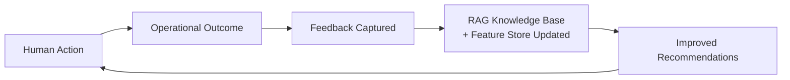

# 23. AI-native Operating Model

## Table of Contents

- [23.1 Philosophy](#231-philosophy)
- [23.2 Human + AI Collaboration Model](#232-human--ai-collaboration-model)
- [23.3 AI Operational Modes](#233-ai-operational-modes)
- [23.4 AI Feedback Loop](#234-ai-feedback-loop)

---

## 23.1 Philosophy

AI is NOT an add-on.

AI becomes :

- embedded into workflows
- embedded into approvals
- embedded into forecasting
- embedded into operations
- embedded into decision making

This creates:

> AI-native construction operations

---

## 23.2 Human + AI Collaboration Model

| Layer          | Human Role            | AI Role                       |
| -------------- | --------------------- | ----------------------------- |
| Executive      | Strategic decisions   | Forecasting & risk simulation |
| PM             | Coordination          | Schedule optimization         |
| Procurement    | Vendor negotiation    | Cost analysis                 |
| Site Engineer  | Validation            | Report generation             |
| Finance        | Approval              | Cash-flow prediction          |
| Safety Officer | Compliance validation | Safety compliance detection   |
| CRM / Sales    | Client relationship   | Proposal generation           |

---

## 23.3 AI Operational Modes

The three operational modes (Assistive, Analytical, Autonomous) are defined in full in
22-ai-architecture section 22.2. The modes map directly to the human collaboration model above :

- Assistive — AI reduces manual work for Site Engineer, Safety Officer, CRM/Sales
- Analytical — AI supports PM, Finance, Executive with predictions and forecasts
- Autonomous — AI executes low-risk routine workflows across all layers

MVP activates Assistive mode only. Analytical and Autonomous activate post-MVP.
See 21-mvp-scope section 21.4 for the MVP AI scope boundary.

---

## 23.4 AI Feedback Loop

This creates continuous operational intelligence improvement.

Note on "retraining" :

At MVP and early stages, AI improvement is driven by RAG knowledge base updates
(new documents, site reports, and domain content ingested into the vector store)
and feature store updates (operational metrics refined over time). LLM base model
fine-tuning is not performed until post-Stage 3 when operational data volume
justifies the cost. See 24-ai-training-pipeline section 24.5 for the full strategy.

---

## References

| ID         | Title                                                              | Source                                                        |
| ---------- | ------------------------------------------------------------------ | ------------------------------------------------------------- |
| [IEEE 830] | IEEE Recommended Practice for Software Requirements Specifications | IEEE Std 830-1998                                             |
| [OpenAI]   | OpenAI API Documentation                                           | [platform.openai.com/docs](https://platform.openai.com/docs/) |
| [Temporal] | Temporal Workflow Documentation                                    | [docs.temporal.io](https://docs.temporal.io/)                 |
| [HCI-AI]   | Human-AI Collaboration in Decision Support Systems                 | ACM CHI 2023                                                  |
| [ISO-9001] | Quality Management Systems — Requirements                          | ISO 9001:2015                                                 |

> 📎 See also: [22-ai-architecture](22-ai-architecture.md) · [24-ai-training-pipeline](24-ai-training-pipeline.md) · [21-mvp-scope](21-mvp-scope.md)
