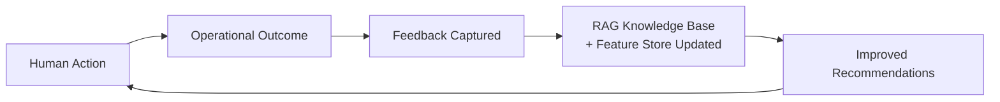

# 23. AI-native Operating Model

## Table of Contents

- [23.1 Philosophy](#231-philosophy)
- [23.2 Human + AI Collaboration Model](#232-human--ai-collaboration-model)
- [23.3 AI Operational Modes](#233-ai-operational-modes)
- [23.4 AI Feedback Loop](#234-ai-feedback-loop)
- [23.5 Human-AI Governance Structure (STEW-001)](#235-human-ai-governance-structure-stew-001)

---

## 23.1 Philosophy

AI is NOT an add-on.

AI becomes :

- embedded into workflows
- embedded into approvals
- embedded into forecasting
- embedded into operations
- embedded into decision making

This creates:

> AI-native construction operations

---

## 23.2 Human + AI Collaboration Model

| Layer          | Human Role            | AI Role                       |
| -------------- | --------------------- | ----------------------------- |
| Executive      | Strategic decisions   | Forecasting & risk simulation |
| PM             | Coordination          | Schedule optimization         |
| Procurement    | Vendor negotiation    | Cost analysis                 |
| Site Engineer  | Validation            | Report generation             |
| Finance        | Approval              | Cash-flow prediction          |
| Safety Officer | Compliance validation | Safety compliance detection   |
| CRM / Sales    | Client relationship   | Proposal generation           |

---

## 23.3 AI Operational Modes

The three operational modes (Assistive, Analytical, Autonomous) are defined in full in
22-ai-architecture section 22.2. The modes map directly to the human collaboration model above :

- Assistive — AI reduces manual work for Site Engineer, Safety Officer, CRM/Sales
- Analytical — AI supports PM, Finance, Executive with predictions and forecasts
- Autonomous — AI executes low-risk routine workflows across all layers

MVP activates Assistive mode only. Analytical and Autonomous activate post-MVP.
See 21-mvp-scope section 21.4 for the MVP AI scope boundary.

---

## 23.4 AI Feedback Loop

This creates continuous operational intelligence improvement.

Note on "retraining" :

At MVP and early stages, AI improvement is driven by RAG knowledge base updates
(new documents, site reports, and domain content ingested into the vector store)
and feature store updates (operational metrics refined over time). LLM base model
fine-tuning is not performed until post-Stage 3 when operational data volume
justifies the cost. See 24-ai-training-pipeline section 24.5 for the full strategy.

---

## 23.5 Human-AI Governance Structure (STEW-001)

> **Decision record:** the STEW-001 decision — _Rotating oversight committee + quarterly AI behavior
> audits_ — is logged in the decision registry at [22-ai-architecture §22.7](22-ai-architecture.md)
> (resolved 2026-06-10). This section is the **authoritative operating structure** that implements it:
> governance structure belongs in the operating-model spec, not the technical AI-architecture spec.

Extends the §23.2 collaboration model with an oversight layer. Grounded in world-class practice:
IBM AI Ethics Board (central board + business-unit focal points), ISO/IEC 42001 AIMS roles, EU AI Act
Article 14 + NIST AI RMF (GOVERN/MANAGE) human oversight, and Anthropic's Responsible Scaling Policy
(capability-scaled safeguards) — consistent with the platform's Constitutional-AI alignment (CIV-002)
and human-in-the-loop escalation (COORD-001).

### Structure (roles → ISO/IEC 42001)

Maps the oversight committee decided in `22 §22.7` (product owner + 2 construction domain experts +
1 AI safety lead; experts rotate annually) to ISO/IEC 42001 roles:

| Role | Who (per `22 §22.7`) | ISO 42001 mapping | Responsibility |
| ---- | -------------------- | ----------------- | -------------- |
| **Responsible AI Officer** | AI safety lead (permanent) | AIMS manager | Accountable to product owner; approves higher-autonomy features before ship; owns the AIMS |
| **Oversight committee** | the full committee (`22 §22.7`) | Top management | Sets AI policy; runs the quarterly AI behavior audit; reviews new AI capabilities; resolves escalations |
| **Domain focal points** | the rotating construction domain experts, per domain | Risk owners | First-line AI risk assessment; escalate to the committee |
| **Internal audit** | — | Internal auditors | Periodic AIMS conformance + control audit |

### Tiered human oversight (EU AI Act Art 14 / NIST AI RMF GOVERN 3.2)

- **Human-in-the-loop (HITL)** — a human decides _before_ execution for high-consequence actions:
  safety-critical, structural, and financial above the COORD-001 threshold. Consistent with the
  Constitutional 4-tier hierarchy (Safety > Ethics > Guidelines > Helpfulness, `22 §22.7` CIV-002).
- **Human-on-the-loop (HOTL)** — a human _monitors + audits after_ for routine advisory output
  (reports, suggestions), with sampling review + one-click override. Outputs stay advisory
  (never auto-post, `22 §22.4`).
- **Automation-bias mitigation** — oversight persons are trained on the AI's capabilities, limits, and
  override procedures before they are assigned oversight.

### Capability-scaled safeguards & escalation

- Safeguards **scale with AI autonomy** (Anthropic RSP model): raising a workflow Assistive →
  Analytical → Autonomous (§23.3) requires Responsible AI Officer sign-off + a model-governance review
  (`22 §22.9`).
- **AI incidents** run through the incident process (`31 §31.9`); **noncompliance reporting** is
  protected and escalates to the committee.
- **Certification path:** ISO/IEC 42001 AIMS certification (target cert per `05 §5.3`).

### Acceptance criteria / gate

- [ ] Responsible AI Officer + oversight committee chartered; domain focal points assigned
- [ ] Every AI workflow classified HITL or HOTL before it ships
- [ ] Autonomy-mode increase requires documented Officer sign-off + model-governance review
- [ ] AI-incident + noncompliance escalation paths documented and tested

---

## References

| ID         | Title                                                              | Source                                                        |
| ---------- | ------------------------------------------------------------------ | ------------------------------------------------------------- |
| [ISO42001] | AI management system (AIMS)                                        | ISO/IEC 42001:2023                                            |
| [EU-AI-14] | EU AI Act Article 14 - Human Oversight                             | Reg. (EU) 2024/1689 Art 14                                    |
| [NIST-AI]  | NIST AI Risk Management Framework (AI RMF 1.0)                     | NIST 2023                                                     |
| [IEEE 830] | IEEE Recommended Practice for Software Requirements Specifications | IEEE Std 830-1998                                             |
| [OpenAI]   | OpenAI API Documentation                                           | [platform.openai.com/docs](https://platform.openai.com/docs/) |
| [Temporal] | Temporal Workflow Documentation                                    | [docs.temporal.io](https://docs.temporal.io/)                 |
| [HCI-AI]   | Human-AI Collaboration in Decision Support Systems                 | ACM CHI 2023                                                  |
| [ISO-9001] | Quality Management Systems — Requirements                          | ISO 9001:2015                                                 |

> 📎 See also: [22-ai-architecture](22-ai-architecture.md) · [24-ai-training-pipeline](24-ai-training-pipeline.md) · [21-mvp-scope](21-mvp-scope.md)
