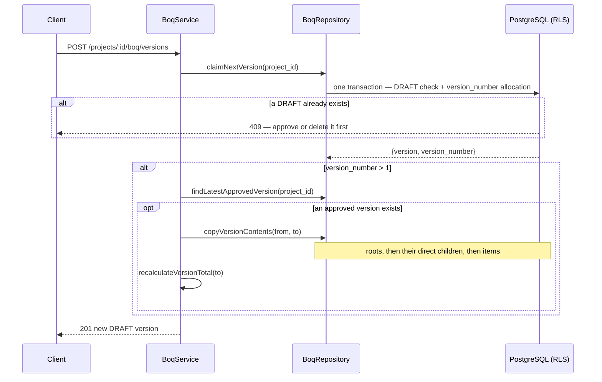

# Phase 4 — BOQ Service

> Compiled from `context/00_master_construction_os.md` § PHASE 4 — BOQ SERVICE COMMAND and the
> specification sections cited inline. `docs/specifications/` wins on any conflict; see
> [README § Authority](README.md).

---

## 1. Overview & goals

The Bill-of-Quantities engine — the priced, versioned estimate a project is built and billed against
(`00_master` § Phase Register: objective "Bill-of-Quantities engine", deps `Ph3, Ph8`, risk `R-02`).

Two properties define this phase, and everything else follows from them:

1. **Money is exact.** Every amount is `DECIMAL(19,4)` with an ISO 4217 currency code, and every
   arithmetic step runs through `decimal.js` with `ROUND_HALF_UP` — never a native JS float.
2. **Estimates are versioned and immutable once approved.** A project holds at most one `DRAFT`; a new
   version is seeded by copying the latest `APPROVED` one; approving supersedes the previous approval.

Exit condition: "BOQ calculations + financial-precision tests green; RLS enforced"
(`00_master` § Phase Register, Phase 4 exit).

---

## 2. Scope

### In scope

- `boq_versions`, `boq_categories`, `boq_items` in the `boq` schema
- The version state machine `DRAFT → APPROVED → SUPERSEDED`
- Synchronous recalculation on every item write
- Export as JSON and CSV
- Four Kafka events on the version lifecycle
- Carbon capture fields — nullable hooks, no engine

### Out of scope

- `CarbonCalculationEngine` — the two carbon columns are a forward-compatible data hook; the migration
  header dates the engine to "Phase 23+"
- BIM quantity import **behaviour** — a stub only, sharing the Phase 3 IFC parser
- Contract documents generated from an approved BOQ — Finance, ADR-058
- Actual-vs-estimate variance — Phase 7

---

## 3. Architecture

One NestJS module, one controller, one service, one repository — the BOQ module is structurally the
simplest of the domain phases, with all nine routes on a single controller.

```text
modules/boq/
  boq.{controller,service,repository,module}.ts
  boq-csv.util.ts                  — CSV export
  dto/                             — create-version, add-category, add-item, update-item
  ep/bim-boq-import.stub.ts        — IFC quantity import (stub)
```

The arithmetic does **not** live here. `@cos/financial` owns it — a shared workspace package that
configures `Decimal.set({ rounding: Decimal.ROUND_HALF_UP })` once at import and exports
`calculateLineTotal` and `sumDecimals`. That placement is what lets Finance (Phase 7) and Procurement
(Phase 5) compute money the same way rather than each re-deriving it.

---

## 4. Data model

Three tables in the `boq` schema, exactly as the phase command specifies.

| Table            | Key constraints                                                                        |
| ---------------- | -------------------------------------------------------------------------------------- |
| `boq_versions`   | `UNIQUE (project_id, version_number)`, `INDEX (project_id, tenant_id)`, status `CHECK` |
| `boq_categories` | self-referencing `parent_category_id … ON DELETE CASCADE`, `INDEX (version_id)`        |
| `boq_items`      | `INDEX (version_id, category_id)`; `estimated_total` stored, not derived at read       |

Money and quantity precision: `quantity DECIMAL(10,4)`, `unit_cost DECIMAL(19,4)`,
`estimated_total DECIMAL(19,4)`, `currency_code VARCHAR(3)` — see
[README § Financial precision](README.md#financial-precision).

**Carbon fields are nullable by design, from day one.** `carbon_factor_kg_co2e DECIMAL(10,6)` and
`carbon_total_kg_co2e DECIMAL(14,4)` carry the migration comment "NULL until engine activated". A NULL
here means _not yet known_, never _zero emissions_ — the distinction matters the moment anything
aggregates them.

**Same schema-move history as Phase 3.** `20260604000001_boq_service` creates the three tables
unqualified; `20260605000004_db_refactor_global_schemas` moves them into `boq`. Raw SQL, not
Prisma-modelled — the convention `11-database-schema` §11.6 states.

`finance.boq_line_snapshots` (`20260721000003`) is **not** part of this phase; it is Finance's
materialisation of an approved BOQ.

---

## 5. API contract

All nine endpoints in the phase command exist, with matching paths and verbs.

| Endpoint                                                    | Built | RBAC                              |
| ----------------------------------------------------------- | ----- | --------------------------------- |
| `POST /projects/:projectId/boq/versions`                    | ✅    | `PROJECT_MANAGER`, `TENANT_ADMIN` |
| `GET /projects/:projectId/boq/versions`                     | ✅    | any authenticated tenant user     |
| `GET /projects/:projectId/boq/versions/:versionId`          | ✅    | any authenticated tenant user     |
| `POST /projects/:projectId/boq/versions/:versionId/approve` | ✅    | `PROJECT_MANAGER`, `TENANT_ADMIN` |
| `POST /boq/versions/:versionId/categories`                  | ✅    | `PROJECT_MANAGER`, `TENANT_ADMIN` |
| `POST /boq/versions/:versionId/items`                       | ✅    | `PROJECT_MANAGER`, `TENANT_ADMIN` |
| `PATCH /boq/items/:itemId`                                  | ✅    | `PROJECT_MANAGER`, `TENANT_ADMIN` |
| `DELETE /boq/items/:itemId`                                 | ✅    | `PROJECT_MANAGER`, `TENANT_ADMIN` |
| `GET /boq/versions/:versionId/export`                       | ✅    | any authenticated tenant user     |

The controller is guarded by `JwtAuthGuard, RolesGuard, PolicyGuard` — the only Batch B controller
that carries `PolicyGuard` (ABAC) alongside role checks.

Export is keyed by `version_id` alone, on a flat route with no project segment; the code carries that
as a deliberate note.

---

## 6. Events

| Event type                             | Payload                                       | Trigger       |
| -------------------------------------- | --------------------------------------------- | ------------- |
| `construction.boq.created.v1`          | `{ project_id, version_id, version_number }`  | first version |
| `construction.boq.updated.v1`          | `{ version_id, changed_items_count }`         | item write    |
| `construction.boq.version_created.v1`  | version payload                               | new version   |
| `construction.boq.version_approved.v1` | `{ project_id, version_id, total_estimated }` | approval      |
| `construction.boq.items_published.v1`  | full itemised line set + total                | approval      |

All four command-named events exist. The fifth, `items_published`, is attributable: it publishes the
approved version's whole line set "so downstream services can materialize it (finance
contract-document generation, ADR-058 CT-2c-2)", snapshotted at approval because "a contract is
generated against an approved BOQ".

Published through `EventOutboxService` — durable, not atomic; see
[OQ-18](README.md#open-questions-register).

---

## 7. Sequence / flows

Version creation, where the copy-forward rule lives:



**Why the DRAFT check and the number allocation share one transaction** is recorded in the code and
worth preserving here: run separately, two concurrent creates both "see no DRAFT" and both claim the
same `version_number`, which the `UNIQUE (project_id, version_number)` constraint then rejects for one
of them at random. `claimNextVersion()` does both inside a single per-project transaction and returns
null when a DRAFT already exists.

---

## 8. Failure modes & rollback

| Failure                                       | Behaviour today                                                                                      |
| --------------------------------------------- | ---------------------------------------------------------------------------------------------------- |
| Second concurrent version create              | One caller gets null from `claimNextVersion` → 409, not a constraint error                           |
| Write to an `APPROVED` / `SUPERSEDED` version | Refused — "only DRAFT versions can be modified"                                                      |
| Approving a non-`DRAFT` version               | Refused with the current status named                                                                |
| Mid-recalculation failure                     | Category subtotals now written in **one** statement, so the version cannot be left half-recalculated |
| **Items in a child category**                 | **Excluded from the version total** — § 14 OQ-23                                                     |
| **Category hierarchy deeper than two levels** | **Silently dropped when a new version copies forward** — § 14 OQ-24                                  |

The single-statement subtotal update is a fix with its reasoning preserved in the code: it replaced a
loop issuing one UPDATE per category, "each in its own transaction, so a large BOQ re-cost meant
dozens of sequential round trips — and a mid-loop failure left the version half-recalculated with no
total written."

**Rollback:** both BOQ migrations have paired rollbacks under `backend/prisma/rollbacks/`, enforced by
`scripts/ci/check-migration-rollbacks.mjs`.

---

## 9. Security

Tenant isolation through `TenantPrismaService.run()` and RLS, as everywhere —
[README § Tenant isolation](README.md#tenant-isolation). Every raw query in the repository is a
parameterised tagged template, including the two copy-forward `INSERT … SELECT` statements, which also
carry an explicit `tenant_id = ${this.tenantId}` predicate rather than relying on RLS alone.

Write routes are `PROJECT_MANAGER` / `TENANT_ADMIN`; reads are open to any authenticated tenant user.
`PolicyGuard` adds the ABAC layer on top (`06-rbac-permission-matrix`).

Approval is the security-relevant transition — it makes a version immutable and emits the line set
that Finance generates contracts from. It is role-gated identically to the other writes; nothing
additional (no MFA step-up, no second approver) is specified or built.

---

## 10. Observability

Structured logging in `boq.service.ts` around version creation, approval and item writes. Metrics,
tracing and alerts are cross-cutting — [README § Observability baseline](README.md#observability-baseline).

---

## 11. Testing & acceptance

4 spec files in the module (`boq.service`, `boq.repository`, `boq.controller`, `boq-csv.util`), plus
the arithmetic's own suite in `packages/@cos/financial/src/__tests__/financial.spec.ts`.

The phase command singles out one test by name — the float trap — and it exists twice:

- `financial.spec.ts:21` — "classic float trap: 0.1 + 0.2 precision"
- `boq.service.spec.ts:150` — "calculateLineTotal: 0.1 + 0.2 does NOT equal 0.3 with float, but
  decimal.js gives exact 30.0000"

**A gap in the suite, not in the code alone.** No test places items in a child category and asserts the
resulting version total, and no test copies a version whose categories are three levels deep. Both
OQ-23 and OQ-24 below are invisible to the current tests — which is why they survived to be found by
reading.

Acceptance is the Phase Register exit: "BOQ calculations + financial-precision tests green; RLS
enforced."

---

## 12. Implementation status

Verified on **2026-08-22** against this working tree (Rule 36 — commands run, output summarised).

| Generate item                                     | Status     | Evidence                                                                                         |
| ------------------------------------------------- | ---------- | ------------------------------------------------------------------------------------------------ |
| Migrations with all constraints                   | ✅ present | `20260604000001_boq_service` — 3 tables, status CHECK, self-ref FK, indexes                      |
| NestJS module / service / repository / controller | ✅ present | `boq.{module,service,repository,controller}.ts`                                                  |
| Decimal.js calculation service, unit-tested       | ✅ present | `@cos/financial` — shared package, not BOQ-local; `ROUND_HALF_UP` set globally and per-operation |
| Versioning service with copy-on-create            | ✅ present | `claimNextVersion` + `copyVersionContents` — inside `BoqService`, not a separate service         |
| DTOs with financial validation                    | ✅ present | 4 DTOs; `currency_code` matched against `/^[A-Z]{3}$/`                                           |
| OpenAPI 3.1                                       | ✅ present | `@ApiOperation` / `@ApiParam` throughout the controller                                          |
| Unit tests — calculation accuracy                 | ✅ present | the two float-trap tests above                                                                   |
| Integration tests — full BOQ lifecycle            | —          | see `30-testing-strategy` § integration suite — not per-module                                   |
| `boq.created`                                     | ✅ present | `construction.boq.created.v1`                                                                    |
| `boq.updated`                                     | ✅ present | `construction.boq.updated.v1`                                                                    |
| `boq.version.created`                             | ✅ present | `construction.boq.version_created.v1`                                                            |
| `boq.version.approved`                            | ✅ present | `construction.boq.version_approved.v1`                                                           |
| BIM quantity-import stub                          | ✅ present | `ep/bim-boq-import.stub.ts`                                                                      |
| Export JSON / CSV                                 | ✅ present | `exportVersion` + `exportVersionCsv` via `boq-csv.util.ts`                                       |

**Naming note.** The command writes the last two events with a dot — `boq.version.created` — while the
wire name is `construction.boq.version_created.v1`. Under §32.4's
`{domain}.{entity}.{action}.v{N}` rule the action segment cannot itself contain a dot, so the
underscore form is the correct rendering, not a deviation.

---

## 13. Dependencies & risks

**Dependencies:** `Ph3, Ph8` (`00_master` § Phase Register). Phase 3 supplies `project_id`; Phase 8
supplies the outbox.

**Risks:** `R-02` — see `00_master` § Risk Register.

---

## 14. Open questions / NOT SPECIFIED

| #     | Question                                                                                                                                                                                                                                                                                                                                                                                                                                                                                                                                                                                                                                                                                                                                                                                                                                                                                                                                                                                        | Status                        |
| ----- | ----------------------------------------------------------------------------------------------------------------------------------------------------------------------------------------------------------------------------------------------------------------------------------------------------------------------------------------------------------------------------------------------------------------------------------------------------------------------------------------------------------------------------------------------------------------------------------------------------------------------------------------------------------------------------------------------------------------------------------------------------------------------------------------------------------------------------------------------------------------------------------------------------------------------------------------------------------------------------------------------- | ----------------------------- |
| OQ-23 | **Closed 2026-08-22 — a BOQ's total excluded every item in a child category.** `recalculateVersionTotal` summed, over root categories only, the items attached **directly** to each root. A BOQ with root "Structural" and child "Concrete" holding 5,000,000 THB reported `total_estimated_amount = 0` — the figure `version_approved` publishes and Finance generates contracts against. **Fix (product-owner decision):** the version total is now `SUM` of **every** category's subtotal. It cannot double-count, because `boq_items.category_id` is a single FK, so an item sits in exactly one subtotal. Category subtotals keep their meaning (own items, not rolled up) since nothing renders them hierarchically. Three regression tests added and shown to fail against the old code (`5,000,000 → 0.0000`, `1,250,000.50 → 1,000,000.00`). **Still open, separately:** versions already `APPROVED` carry the old total; whether to backfill them is a data decision, not a code one. | Closed — backfill outstanding |
| OQ-24 | **Copying a version forward drops any category deeper than two levels, silently.** `copyVersionContents` inserts root categories, then in a second statement inserts children by joining the new version's categories on `category_code`. In PostgreSQL that second `INSERT … SELECT` cannot see rows it is itself inserting, so a depth-3 category finds no new parent, the inner join drops it, and the items beneath it are dropped with it. The code names the limit ("simple 1-level hierarchy copy") but nothing enforces it: `parent_category_id` is an unconstrained self-reference and `addCategory` accepts any parent. Either the copy recurses, or category depth is capped at write time.                                                                                                                                                                                                                                                                                          | Open — needs a PO decision    |
