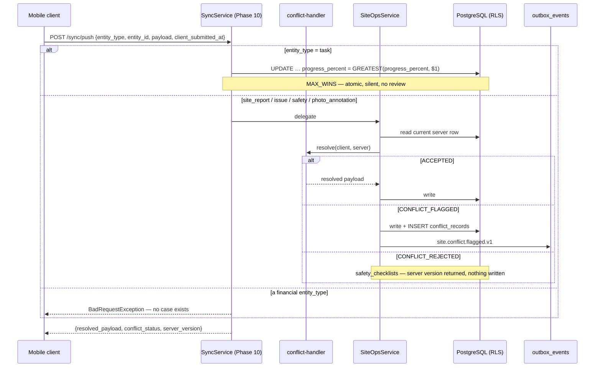
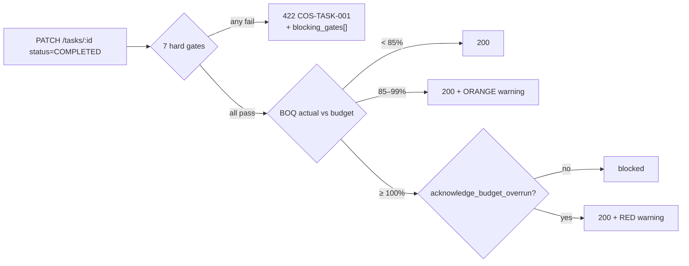

# Phase 6 — Site Operations

> Compiled from `context/00_master_construction_os.md` § PHASE 6 — SITE OPERATIONS COMMAND and the
> specification sections cited inline. `docs/specifications/` wins on any conflict; see
> [README § Authority](README.md).

---

## 1. Overview & goals

The site-operations domain — daily reports, issues, inspections, safety, tasks and material
consumption (`00_master` § Phase Register: objective "site operations + daily reporting domain", deps
`Ph3, Ph8`, risk `R-02`).

This is the **offline-first** phase. Every other domain assumes a connected client; this one assumes a
field worker on a shared handset with no signal, whose writes arrive minutes or hours later, possibly
twice, possibly conflicting with someone else's. Two mechanisms carry that weight:

1. **Per-entity conflict strategies** — five of them, one per entity class, each chosen for what the
   data means rather than for uniformity.
2. **Task completion gates** — seven hard blocks and two budget warnings, evaluated server-side
   because an offline client cannot see an inspection someone else failed.

Exit condition: "site-report APIs pass the isolation-test suite"
(`00_master` § Phase Register, Phase 6 exit).

---

## 2. Scope

### In scope

- Eight entities in `site_ops` plus `material_consumptions`, `tasks` and `permits`
- The five conflict-resolution strategies and `conflict_records`
- Task completion gates 1–7 and budget warnings 8–9
- The safety module — incidents, permits, checklists, compliance (ADR-027)
- OpenSearch full-text over site reports and issues
- Mobile-optimised responses via `?minimal=true`

### Out of scope

- The sync **transport** — `/sync/delta`, `/sync/push`, `/sync/resolve` belong to Phase 10; this
  phase owns the resolution _rules_ the transport calls into (see § 3)
- Financial entities — never offline-writable (§17.4); the push endpoint has no case for them
- `CarbonCalculationEngine` — a stub; the DECIDED standards are recorded, activation is trigger-based
- File storage — Phase 9

---

## 3. Architecture

Three backend modules cover this phase, and a fourth carries its writes:

```text
modules/site-ops/     site-ops.{controller,service,repository,module}.ts
                      conflict-handler.ts        — 4 of the 5 strategies
                      site-ops.rows.ts
                      ep/carbon-calculation.stub.ts
                      ep/file-service.stub.ts    — vestigial, see § 12
modules/safety/       safety.{controller,service,repository,module}.ts   (ADR-027)
modules/tasks/        tasks.{controller,service,repository,module}.ts    — the completion gates
modules/sync/         sync.service.ts            — the transport (Phase 10) + task MAX_WINS
```

**The conflict strategies live in two places, and that split is worth knowing before reading either.**
`conflict-handler.ts` implements the four strategies that need to compare payloads —
`LAST_WRITE_WINS`, `FIELD_LEVEL_MERGE`, `SERVER_WINS`, and photo-annotation `CONFLICT_FLAGGED`. The
fifth, task `MAX_WINS`, is not there: it is a single SQL expression in `sync.service.ts`
(`SET progress_percent = GREATEST(progress_percent, $1)`), because monotonic progress needs no payload
comparison — the database can decide it atomically. Searching the tree for `MAX_WINS` finds nothing;
the strategy is expressed, not named.

---

## 4. Data model

| Table                   | Schema     | Note                                                                                                                                 |
| ----------------------- | ---------- | ------------------------------------------------------------------------------------------------------------------------------------ |
| `site_reports`          | `site_ops` | `UNIQUE (project_id, report_date, submitted_by)` — one report per submitter per day, which is the premise `LAST_WRITE_WINS` rests on |
| `issues`                | `site_ops` | nullable `task_id` → `projects.tasks` (completion gate 2)                                                                            |
| `inspections`           | `site_ops` | nullable `task_id` → `projects.tasks` (completion gate 1)                                                                            |
| `safety_checklists`     | `site_ops` | `items JSONB`, versioned                                                                                                             |
| `manpower_logs`         | `site_ops` | child of `site_reports`                                                                                                              |
| `conflict_records`      | `site_ops` | `client_payload` + `server_payload` both retained as JSONB                                                                           |
| `incidents`             | `site_ops` | ADR-027                                                                                                                              |
| `material_consumptions` | `site_ops` | KD-SITE-001 resolved; `material_id` has its own identity pending a materials catalogue                                               |
| `tasks`, `permits`      | `projects` | `20260619000002_tasks_permits`                                                                                                       |

`site_reports` carries three timestamps for a reason the conflict rules depend on:
`client_submitted_at` (device clock — the ordering key), `server_received_at`, and `modified_at` (what
a client compares its `last_known_modified_at` against to detect a conflict).

**Photos are not a column here.** Neither `site_reports` nor `issues` holds a file reference. The link
runs the other way: `files.stored_files` carries `entity_type` / `entity_id`, so a photo taken offline
against a client-generated issue UUID attaches correctly once both sync. That is why
`create-issue.dto.ts` accepts a client-supplied id.

---

## 5. API contract

| Endpoint                                                      | Specified | Built |
| ------------------------------------------------------------- | --------- | ----- |
| `POST/GET /site/reports`, `GET /site/reports/:id`             | ✅        | ✅    |
| `POST /site/reports/sync`                                     | ✅        | ✅    |
| `POST /site/reports/:reportId/materials`                      | ✅        | ✅    |
| `POST/GET /site/issues`, `PATCH /site/issues/:id`             | ✅        | ✅    |
| `POST /site/issues/:issueId/escalate`                         | —         | ✅    |
| `POST/GET /site/inspections`, `GET`/`PATCH` by id             | ✅        | ✅    |
| `GET /site/conflict-records`                                  | ✅        | ✅    |
| `PATCH /site/conflict-records/:id/resolve`                    | ✅        | ✅    |
| 10 safety routes (`/safety/*`)                                | ✅        | ✅    |
| `GET/POST /projects/:projectId/tasks`, `PATCH /tasks/:taskId` | ✅        | ✅    |
| `GET /projects/:projectId/progress`                           | —         | ✅    |

Every route the command enumerates exists, including all ten safety routes — the command notes that
§14's Safety table and §21.2's MVP scope were reconciled, and the implementation matches both.

`?minimal=true` is honoured on the site-report list for mobile payload reduction, as the command
requires.

**One design note carried in the code:** the full-text search path is deliberately **unpaged**,
returning OpenSearch hits capped at 50, and an empty search box must fall back to the normal paged
list rather than making an OpenSearch round trip.

---

## 6. Events

| Event type                     | Specified | Built |
| ------------------------------ | --------- | ----- |
| `site.material.consumed.v1`    | ✅        | ✅    |
| `site.report.created.v1`       | ✅        | ✅    |
| `site.report.submitted.v1`     | ✅        | ✅    |
| `site.inspection.passed.v1`    | ✅        | ✅    |
| `site.inspection.failed.v1`    | ✅        | ✅    |
| `site.issue.created.v1`        | ✅        | ✅    |
| `site.issue.status_changed.v1` | ✅        | ✅    |
| `site.conflict.flagged.v1`     | ✅        | ✅    |
| `site.issue.escalated.v1`      | —         | ✅    |
| `safety.incident.created.v1`   | —         | ✅    |
| `carbon.record.created.v1`     | —         | ✅    |

All eight specified events exist. The command writes four of them without a domain prefix
(`inspection.passed`, `issue.created`); the wire names carry `site.` per §32.4's
`{domain}.{entity}.{action}.v{N}` rule.

`site.conflict.flagged.v1` is what satisfies the "ConflictRecord persistence **and** notification"
Generate item — `NotificationConsumer` routes it to `SITE_ENGINEER`, `PROJECT_MANAGER` and
`TENANT_ADMIN`, and `20260706000001_site_conflict_notification_template` seeds the template row it
renders through.

---

## 7. Sequence / flows

The sync path, with the branch each strategy takes:



The financial branch is an absence doing real work: `push()` has **no case** for a PO, invoice,
payment or budget line, so any such write falls through to the default and is rejected. §17.4's
online-required rule is therefore enforced by the shape of the switch rather than by a check that
could be forgotten.

Task completion, the phase's other decision point:



---

## 8. Failure modes & rollback

| Failure                                             | Behaviour today                                                                                  |
| --------------------------------------------------- | ------------------------------------------------------------------------------------------------ |
| Two offline edits of the same daily report          | `LAST_WRITE_WINS` on `client_submitted_at`; flagged if server `modified_at` moved                |
| Offline issue edit while status changed server-side | Fields merge independently; status is server-authoritative; `ConflictRecord` for `SITE_ENGINEER` |
| Two people annotate the same photo offline          | **Never auto-resolved** — `CONFLICT_FLAGGED`, both payloads retained (ADR-056)                   |
| Client submits a stale safety checklist             | `CONFLICT_REJECTED` — server version returned, client version discarded                          |
| Replayed offline create after a timeout             | Idempotent on the client-generated id (`ON CONFLICT DO NOTHING`)                                 |
| A financial write reaches the sync queue            | Rejected — no case in the switch                                                                 |
| Device clock wrong                                  | **`client_submitted_at` is the ordering key for `LAST_WRITE_WINS`** — see § 14 OQ-28             |
| Outbox insert lost                                  | durable, not atomic — [OQ-18](README.md#open-questions-register)                                 |

**Why photo annotation refuses to choose** is the clearest statement of this phase's philosophy, and
the command spells it out: merging strokes "would silently blend two readings of one defect";
last-write-wins "would silently discard one". On a record used to evidence site defects, a human
decides.

**Rollback:** all eight Phase 6 migrations have paired rollbacks, enforced by
`scripts/ci/check-migration-rollbacks.mjs`.

---

## 9. Security

Tenant isolation via RLS ([README § Tenant isolation](README.md#tenant-isolation)). The task sync path
is worth reading for how it treats that: the `UPDATE` carries an explicit `tenant_id` predicate the
code itself calls "defense-in-depth, not the control" — RLS is `FORCE`d on `projects.tasks` and the
connection is `app_user`, so an out-of-tenant `task_id` already matches nothing. The predicate is there
because "a write path that reads differently from its neighbours is the one a future reader trusts
least", and its `NULLIF` mirrors the RLS policy so an unset GUC matches no row rather than every row.

`RolesGuard` carries a special case for this phase's transport: `/sync/push` and `/sync/delta` carry
the entity type in the body or query rather than in the route, so role resolution cannot come from a
route decorator alone.

Object-level authorisation on annotations was a security-review finding (F7): `/sync/push` carries a
caller-chosen `file_id`, so `annotation.service.ts` authorises the file before any write.

---

## 10. Observability

Structured logging throughout the three modules. The metric this phase most needs and does not define
is unresolved `conflict_records` age — a flagged conflict that nobody reviews is indistinguishable, in
the data, from one that was resolved correctly.

Cross-cutting baseline: [README § Observability baseline](README.md#observability-baseline).

---

## 11. Testing & acceptance

17 spec files across the four modules — site-ops 4, safety 3, tasks 4, sync 6.

The command asks specifically for "unit tests: all three conflict resolution strategies" (written
before the count grew to five) and integration tests covering conflict scenarios.

Acceptance is the Phase Register exit: "site-report APIs pass the isolation-test suite."

---

## 12. Implementation status

Verified on **2026-08-22** against this working tree (Rule 36 — commands run, output summarised).

| Generate item                                             | Status           | Evidence                                                                                         |
| --------------------------------------------------------- | ---------------- | ------------------------------------------------------------------------------------------------ |
| Migrations for all entities incl. `material_consumptions` | ✅ present       | 8 migrations; `20260611000001_material_consumptions`                                             |
| NestJS module with offline sync controller                | ✅ present       | `site-ops` + `POST /site/reports/sync`; generic transport in `sync`                              |
| Conflict resolution service — all strategies              | ✅ present       | 4 in `conflict-handler.ts`; task `MAX_WINS` as `GREATEST()` in `sync.service.ts`                 |
| `ConflictRecord` persistence and notification             | ✅ present       | `conflict_records` + `site.conflict.flagged.v1` + seeded template                                |
| Photo upload via File Service API                         | ✅ present       | via `files.stored_files.entity_id` — **not** via the stub; see below                             |
| OpenSearch indexing — site reports and issues             | ✅ present       | `indexIssue` + report indexing; `site-issues` index                                              |
| Mobile `?minimal=true`                                    | ✅ present       | `site-ops.controller.ts`                                                                         |
| Unit tests — conflict strategies                          | ✅ present       | 17 spec files across the four modules                                                            |
| Task completion gates 1–7                                 | ✅ present       | `evaluateCompletionGates` returns all seven gate names                                           |
| Budget warnings 8–9                                       | ✅ present       | ORANGE at 85–99%; RED at ≥100% requires `acknowledge_budget_overrun`                             |
| 8 Kafka event producers                                   | ✅ present       | all 8, plus 3 extras — § 6                                                                       |
| `CarbonCalculationEngine` stub                            | ✅ present       | `ep/carbon-calculation.stub.ts`                                                                  |
| File Service integration stub                             | ⚠️ **dead code** | `ep/file-service.stub.ts` throws `NotImplementedException` and has **zero callers** — § 14 OQ-29 |

**On the budget gate.** The command files warnings 8–9 under "Warn only — HTTP 200 returned", then
says #9 "requires PM acknowledgement flag in request body". The implementation reads the second
sentence as binding: ≥100% without `acknowledge_budget_overrun: true` blocks. That is the only reading
under which the flag does anything, so the "Warn only" heading is the loose part, not the code.

---

## 13. Dependencies & risks

**Dependencies:** `Ph3, Ph8`. Phase 3 supplies `project_id` and hosts `projects.tasks`; Phase 8 the
outbox. In practice this phase also depends on Phase 10's sync transport for every offline path and on
Phase 9's File Service for photos — neither is in the register's dependency list.

**Risks:** `R-02` — `00_master` § Risk Register.

---

## 14. Open questions / NOT SPECIFIED

| #     | Question                                                                                                                                                                                                                                                                                                                                                                                                                                                                                                    | Status                  |
| ----- | ----------------------------------------------------------------------------------------------------------------------------------------------------------------------------------------------------------------------------------------------------------------------------------------------------------------------------------------------------------------------------------------------------------------------------------------------------------------------------------------------------------- | ----------------------- |
| OQ-28 | **Closed 2026-08-23 — capped at the server clock, forward only.** Nothing bounded `client_submitted_at`, so a handset running fast won every LAST_WRITE_WINS merge — and a phone offline on a site for a week is exactly the device whose clock has drifted. `clampClientTimestamp` caps it with 5 minutes of tolerance, the same window a signed platform webhook gets. The past is honoured however old: a report written Tuesday and synced Friday happened on Tuesday, and rewriting it would let a stale edit overwrite a server-side correction made in between. Only the impossible future is capped; an unparseable value orders oldest. Both raise `sync.clock_skew_clamped`. Documented in §17.5 and `00_master`. | Closed 2026-08-23 |
| OQ-29 | **Closed 2026-08-23 — deleted.** No importer anywhere, and the Phase 9 activation it promised never came because photo linkage was built the other way round: the mobile app uploads to the File Service directly with an `entity_type`/`entity_id` and the link lands in `files.file_metadata`. This module is not in that path, so its README's `FILE_SERVICE_URL` row went with it — nothing here ever read it. | Closed 2026-08-23 |
