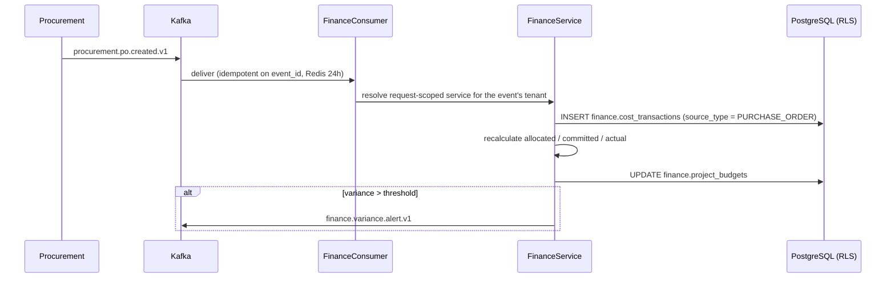

# Phase 7 — Finance Service

> Compiled from `context/00_master_construction_os.md` § PHASE 7 — FINANCE SERVICE COMMAND and the
> specification sections cited inline. `docs/specifications/` wins on any conflict; see
> [README § Authority](README.md).

---

## 1. Overview & goals

Project **cost tracking** — deliberately not accounting (`00_master` § Phase Register: objective
"finance domain (billing, AR, payments)", deps `Ph4, Ph5, Ph8`, risk `R-02`).

The command opens with a scope clarification that is unusually emphatic, and it is the most important
thing on this page: **no double-entry bookkeeping, no chart of accounts, no GL posting, no ERP
integration.** All four are marked `UNSPECIFIED` with an instruction not even to stub them. What the
service does instead is track budget against actual, consume procurement events, record payments and
receipts, and carry the AR side — billing, contracts, signatures, cash-flow forecast.

The second defining constraint: **all cross-service data arrives via Kafka.** Finance never queries
Procurement's tables. A cost transaction exists because an event said a PO was created, not because
Finance went looking.

Since 2026-08-23 that rule has exactly one exception, and it exists because of the rule rather than
in spite of it: `LedgerReconciliationService` reads Procurement hourly to ask whether the ledger
still agrees with it (OQ-31). A ledger derived from a stream cannot detect its own gaps — a dropped
event leaves a budget wrong with nothing anywhere disagreeing. The sweep is read-only, never answers
a request, and never writes a cost transaction; repair is re-publishing the event, so the ledger
keeps exactly one writer.

Exit condition: "finance calculations + precision tests green; RLS enforced"
(`00_master` § Phase Register, Phase 7 exit).

---

## 2. Scope

### In scope

- Budget tracking — allocated / committed / actual, with variance
- Cost transactions, inbound from procurement events
- Payments, AR receipts, AR billing, customers, contracts
- Contract e-signature — bilateral PKI/VC (ADR-058)
- 13-week direct-method cash-flow forecast (ADR-024)
- Withholding tax and multi-currency conversion, both through configured sources

### Out of scope — and explicitly so

| Not built                             | Status per the command                                                              |
| ------------------------------------- | ----------------------------------------------------------------------------------- |
| Double-entry bookkeeping              | `UNSPECIFIED` — escalate, do not stub                                               |
| Chart of accounts                     | `UNSPECIFIED` — escalate, do not stub                                               |
| GL posting                            | `UNSPECIFIED` — escalate, do not stub                                               |
| External ERP / accounting integration | `UNSPECIFIED` as behaviour; a 3-adapter **stub** is required by the Decisions block |
| Custom exchange-rate logic            | forbidden — Open Exchange Rates only                                                |
| Hardcoded tax rates                   | forbidden — `wht_rules` for every jurisdiction                                      |

The ERP line reads as a contradiction and is not one: the _integration_ is unspecified, while the
_strategy-pattern stub_ is a named deliverable. Nothing behind the interface is implemented.

---

## 3. Architecture

```text
modules/finance/
  finance.{controller,service,repository,module}.ts
  finance.consumer.ts               — the three procurement subscriptions
  finance.rows.ts
  wht.service.ts                    — withholding tax from wht_rules
  exchange-rate.service.ts          — Open Exchange Rates + Redis
  contract-sign-link.service.ts     — magic-link issuance (ADR-058/030)
  contract-sign-public.controller.ts — the one route outside tenant middleware
  contract-sign-token.guard.ts
  contract-document.util.ts
  ep/avatax.stub.ts  ep/erp-integration.stub.ts  ep/construction-financing.stub.ts
```

**`contract-sign-public.controller.ts` is its own controller for a reason.** `POST
/finance/contracts/sign/:token` is signed by an external client who has no COS account and no tenant
context, so it is excluded from tenant middleware and authorised by `contract-sign-token.guard.ts`
against the magic-link token instead. Keeping it in a separate controller makes that exclusion visible
rather than a conditional inside the main one.

Money arithmetic is `@cos/financial`, shared with Phases 4 and 5 —
[README § Financial precision](README.md#financial-precision).

---

## 4. Data model

Fourteen tables in `finance`. The five from the command:

| Table               | Note                                                                                                                         |
| ------------------- | ---------------------------------------------------------------------------------------------------------------------------- |
| `project_budgets`   | `project_id UNIQUE`; `allocated` / `committed` / `actual` maintained by aggregation; `variance_alert_threshold DECIMAL(5,2)` |
| `budget_lines`      | `boq_category_id` is a **loose reference — no FK** to BOQ                                                                    |
| `cost_transactions` | `source_type ENUM('PURCHASE_ORDER','INVOICE','ADJUSTMENT')`, `INDEX (project_id, tenant_id, transaction_date)`               |
| `payments`          | `invoice_id` points at Procurement's invoice; `wht_certificate_ref` added later                                              |
| `retention_records` | `retention_percentage` is **nullable with no system default** — TENANT_ADMIN enters it per PO, by decision                   |

Plus nine more that arrived with AR and contracts: `customers`, `contracts`, `contract_signatures`,
`contract_sign_tokens`, `billings`, `ar_receipts`, `boq_line_snapshots`, `cost_categories`,
`wht_rules`.

`boq_line_snapshots` is Finance's own materialisation of an approved BOQ, fed by
`construction.boq.items_published.v1` — the reason Phase 4 emits that event.

`wht_rules` carries the §13.3 shape — `jurisdiction_code`, `service_type`, `rate`, `is_active` —
with RLS and the Thailand defaults seeded at tenant creation. A second copy in the `procurement`
schema was dropped on 2026-08-22 (§ 14 OQ-30).

---

## 5. API contract

All 25 endpoints in the command exist under the canonical `/api/v1/finance/*` prefix (ADR-023), plus
three the command does not list: `PATCH /finance/payments/:paymentId/approve`,
`POST /finance/contracts/:id/activate` and `POST /finance/contracts/:id/terminate`.

The list/scope convention holds throughout: budget is project-scoped in the path; cost transactions,
payments, contracts and billings are tenant-wide lists filtered by `?project_id=`. There is **no
duplicate invoice store** — vendor invoices (AP) stay in `procurement`, and Finance views, approves
and pays them there.

---

## 6. Events

**Consumed** — the three the command names, all present in `finance.consumer.ts`:

| Event                                 | Effect                                                 |
| ------------------------------------- | ------------------------------------------------------ |
| `procurement.po.created.v1`           | cost transaction, `source_type = PURCHASE_ORDER`       |
| `procurement.invoice.received.v1`     | cost transaction, `source_type = INVOICE`              |
| `procurement.po.status_changed.v1`    | adjusts `committed_amount` when a PO is cancelled      |
| `construction.boq.items_published.v1` | materialises `boq_line_snapshots` (beyond the command) |

**Produced:**

| Event                                    | Specified | Built |
| ---------------------------------------- | --------- | ----- |
| `finance.budget.created.v1`              | ✅        | ✅    |
| `finance.payment.processed.v1`           | ✅        | ✅    |
| `finance.variance.alert.v1`              | ✅        | ✅    |
| `finance.billing.approved.v1`            | —         | ✅    |
| `finance.ar_receipt.recorded.v1`         | —         | ✅    |
| `finance.contract.document_attached.v1`  | ADR-058   | ✅    |
| `finance.contract.signature_recorded.v1` | ADR-058   | ✅    |
| `finance.contract.signed.v1`             | ADR-058   | ✅    |

The variance event's name is the subject of [OQ-16](README.md#open-questions-register) — §32.4 calls
it `finance.budget.variance_detected.v1`, the wire carries `finance.variance.alert.v1`, and aligning
to the spec would be a breaking `.v2` rather than a rename.

Default variance threshold is **10%**, overridable per project via
`project_budgets.variance_alert_threshold` — `DEFAULT_VARIANCE_THRESHOLD = new Decimal('10')`.

---

## 7. Sequence / flows

Cost arriving from Procurement, which is the whole inbound story:



Bilateral contract signing (ADR-058) — the flow that reaches outside the tenant boundary:

```mermaid
sequenceDiagram
    participant PM as Contractor (authorized role)
    participant API as Finance
    participant CS as CredentialService
    participant CL as Client (no account)

    PM->>API: POST /finance/contracts/:id/document (upload or generate)
    PM->>API: POST /finance/contracts/:id/sign
    API->>CS: PKI/VC signature — INTERNAL
    PM->>API: POST /finance/contracts/:id/sign-links
    API-->>CL: magic link
    CL->>API: POST /finance/contracts/sign/:token
    Note over API,CL: tenant middleware excluded; token guard authorises
    API->>CS: PKI/VC signature — CLIENT
    alt both signatures verify
        API->>API: status → signed, emit finance.contract.signed.v1
    end
```

Signature rows and the document hash go to the WORM audit store (§9); the data classification is
`RESTRICTED`.

---

## 8. Failure modes & rollback

| Failure                                            | Behaviour today                                                             |
| -------------------------------------------------- | --------------------------------------------------------------------------- |
| Duplicate procurement event delivered              | Consumer idempotency — Redis check on `event_id`, 24 h TTL                  |
| Open Exchange Rates unavailable                    | Last cached rate is served (stale-while-revalidate), per the command        |
| Magic-link token replayed or expired               | `contract-sign-token.guard.ts` refuses                                      |
| Only one side has signed                           | Contract stays unsigned; `contract.signed` is emitted only when both verify |
| Retention percentage never entered                 | Stays NULL — no system default, by decision; no retention is calculated     |
| **WHT rate configured in `procurement.wht_rules`** | **Has no effect** — the calculation reads `finance.wht_rules` — § 14 OQ-30  |
| Outbox insert lost                                 | durable, not atomic — [OQ-18](README.md#open-questions-register)            |

**A consequence of the Kafka-only rule worth stating.** Because Finance never queries Procurement, a
lost `po.created` event means the cost transaction simply never exists, and nothing downstream will
notice: the budget is quietly under-committed. There is no reconciliation sweep comparing
`finance.cost_transactions` against `procurement.purchase_orders` — by design, since such a sweep would
be the direct DB query the command forbids. That makes OQ-18's durability gap materially sharper here
than in phases where the event is a notification rather than the sole source of truth.

**Rollback:** the finance migrations have paired rollbacks, enforced by
`scripts/ci/check-migration-rollbacks.mjs`.

---

## 9. Security

Tenant isolation via RLS ([README § Tenant isolation](README.md#tenant-isolation)), with one route
deliberately outside tenant middleware — the client signing link, authorised by token instead.

Contract signatures are `RESTRICTED` data: signature rows plus the document hash are written to the
WORM audit store (`09-data-architecture` §9), so a signature cannot be altered after the fact.

`FINANCE` is one of the two privileged roles that MFA is mandatory for and that are refused on the SMS
OTP path entirely — see `05-security-compliance` §5.4.4 and
[phase-02 § 9](phase-02-auth-tenant-system.md).

---

## 10. Observability

Structured logging across the service and consumer. The gap this phase carries is the one named in
§ 8: nothing measures whether the event-derived ledger agrees with its source. A consumer-lag alert on
the finance consumer group is the closest available proxy and is not defined in
`infrastructure/monitoring/`.

---

## 11. Testing & acceptance

14 spec files in the module, covering aggregation, the consumer handlers, WHT, exchange rates, contract
signing and the cash-flow forecast.

Acceptance is the Phase Register exit: "finance calculations + precision tests green; RLS enforced."

---

## 12. Implementation status

Verified on **2026-08-22** against this working tree (Rule 36 — commands run, output summarised).

| Generate item                               | Status     | Evidence                                                                                 |
| ------------------------------------------- | ---------- | ---------------------------------------------------------------------------------------- |
| Migrations for all entities                 | ✅ present | `20260605000001_finance_service` — all 5 command entities; 14 tables in `finance` total  |
| NestJS module with Kafka consumer handlers  | ✅ present | `finance.consumer.ts` — all three procurement subscriptions                              |
| Budget aggregation service                  | ✅ present | recalculates allocated / committed / actual on each transaction                          |
| Variance calculation                        | ✅ present | default threshold `Decimal('10')`, per-project override                                  |
| Decimal.js for all calculations             | ✅ present | via `@cos/financial`                                                                     |
| DTOs with validation                        | ✅ present | budget, budget line, payment, AR billing                                                 |
| OpenAPI 3.1                                 | ✅ present | controller decorators                                                                    |
| Contract signing (ADR-058)                  | ✅ present | `contract_signatures`, `contract_sign_tokens`, 5 endpoints, public controller + guard    |
| Unit tests — aggregation, consumer handlers | ✅ present | 14 spec files                                                                            |
| `finance.budget.created`                    | ✅ present | `finance.budget.created.v1`                                                              |
| `finance.payment.processed`                 | ✅ present | `finance.payment.processed.v1`                                                           |
| `finance.variance.alert`                    | ✅ present | `finance.variance.alert.v1` — naming per [OQ-16](README.md#open-questions-register)      |
| ERP stubs — SAP / Oracle / Dynamics         | ✅ present | `ep/erp-integration.stub.ts` names all three adapters                                    |
| Avalara AvaTax                              | ✅ present | `ep/avatax.stub.ts`                                                                      |
| WHT via `wht_rules`, no hardcoded rates     | ✅ present | `wht.service.ts` reads `finance.wht_rules` — but see OQ-30                               |
| Multi-currency via Open Exchange Rates      | ✅ present | `exchange-rate.service.ts`; `CACHE_TTL_SECONDS = 86400`; stale-while-revalidate fallback |
| Construction financing / factoring stub     | ✅ present | `ep/construction-financing.stub.ts`                                                      |
| 13-week cash-flow forecast (ADR-024)        | ✅ present | `FORECAST_WEEKS = 13`; AR inflow from ISSUED billings − AP outflow                       |

---

## 13. Dependencies & risks

**Dependencies:** `Ph4, Ph5, Ph8`. Phase 4 supplies the approved BOQ this service snapshots, Phase 5
the events every cost transaction derives from, Phase 8 the transport. Note the transitive weight of
[OQ-25](README.md#open-questions-register): if the procurement worker never runs, no PO ever reaches
`APPROVED`, so no `po.status_changed` is emitted and Finance's committed figures never move.

**Risks:** `R-02` — `00_master` § Risk Register.

---

## 14. Open questions / NOT SPECIFIED

| #     | Question                                                                                                                                                                                                                                                                                                                                                                                                                                                                                                                                                                                                                                                                                                                                                                                                                                                                                                                                                                                                                                                                | Status                     |
| ----- | ----------------------------------------------------------------------------------------------------------------------------------------------------------------------------------------------------------------------------------------------------------------------------------------------------------------------------------------------------------------------------------------------------------------------------------------------------------------------------------------------------------------------------------------------------------------------------------------------------------------------------------------------------------------------------------------------------------------------------------------------------------------------------------------------------------------------------------------------------------------------------------------------------------------------------------------------------------------------------------------------------------------------------------------------------------------------- | -------------------------- |
| OQ-30 | **Closed 2026-08-22 — two `wht_rules` tables existed and the documentation named the one nothing read.** `finance.wht_rules` matches `13-product-architecture` §13.3 column for column; `procurement.wht_rules` used `jurisdiction` / `vendor_type` and had no `is_active`. **Fix (product-owner decision):** `20260822000001_wht_rules_consolidate` carries any procurement rows across (finance wins on conflict, so a TENANT_ADMIN override survives), drops the procurement table, and corrects all four references. Two further defects were found and fixed in the same migration: `finance.wht_rules` had **no row-level security** at all — §7.7 makes it mandatory and 20260623000001 grants `app_user` SELECT schema-wide, so only the `tenant_id` predicate in `findWhtRule` was isolating it — and the §13.3 Thailand defaults were **never seeded anywhere**, so `WhtService.calculate` threw `NotFoundException` for every tenant. Both migration and rollback were exercised against PostgreSQL, including tenant-isolation checks (unset GUC → 0 rows). | Closed                     |
| OQ-31 | **Closed 2026-08-23 — the no-direct-query rule now carries one narrow exception, and the reconciliation is built.** A ledger derived from a stream cannot detect its own gaps: the outbox is durable rather than transactional (ADR-094), so a dropped `procurement.po.created.v1` leaves the budget silently under-committed and nothing in the system disagrees with anything else. `LedgerReconciliationService` sweeps hourly and reports `missing` / `duplicate` / `orphan` drift against `procurement.purchase_orders` and `procurement.invoices`. The exception is bounded by the shape of the service — read-only, never feeds a request or a decision, and never writes a cost transaction, so `FinanceConsumer` remains the single writer. Repair is re-publishing the event; the runbook says so explicitly, because a hand-written row double-counts as soon as the real event is re-driven. | Closed |
| OQ-50 | **Closed 2026-08-23 — the specification now says which events are only declared.** `finance.budget.exceeded.v1` and `finance.cashflow_risk.detected.v1` were the only 2 of 62 committed `.avsc` schemas with no producer anywhere — while still getting a provisioned topic, a generated type, an `EVENT_AVSC_MAP` entry and a slot in a readiness gate that refuses to pass until they are registered. Indistinguishable from a live event at every layer. Neither producer is being written: `budget.exceeded` needs per-`cost_category` budgets and `finance.budget_lines` has no such column (the built, consumed overrun signal is `finance.variance.alert.v1`, per project against `allocated_amount`), and `cashflow_risk` needs risk thresholds and `RULE_ENGINE` rules that are `UNSPECIFIED`. Both §32.4 rows and `00_master`'s list now say **DECLARED, no producer** with the reason, and `scripts/ci/check-event-producers.mjs` fails any schema without a producer unless it is listed declared-only WITH a reason — and fails a listed one that has since grown a producer, so the list cannot rot either way. | Closed 2026-08-23 |
