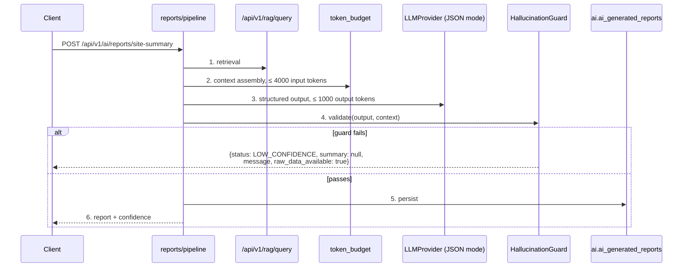

# Phase 12 — AI Report Assistant

> Compiled from `context/00_master_construction_os.md` § PHASE 12 — AI REPORT ASSISTANT COMMAND and
> the specification sections cited inline. `docs/specifications/` wins on any conflict; see
> [README § Authority](README.md).

---

## 1. Overview & goals

Four AI-generated report types, and the guard that decides whether any of them is fit to return.

Everything this phase produces is **advisory**. The command's constraints are unusually blunt about
it: no autonomous actions to other services, the hallucination guard is mandatory and never skipped, a
confidence score accompanies every report, and a failure must degrade gracefully rather than surface a
raw LLM error. Those four sentences are the design.

Depends on Phase 11 being complete — it runs inside `ai-gateway` and calls Phase 11's RAG API.

---

## 2. Scope

### In scope

- Daily site summary, procurement status, executive summary, delay-risk detection
- `HallucinationGuard` with five checks
- Structured Pydantic output per report type; prompts as versioned `.j2` files
- Report persistence and history
- Token budget: 4000 in, 1000 out

### Out of scope

- Autonomous action of any kind (Mode C — see [Phase 11 § 9](phase-11-ai-foundation.md))
- LangGraph — the command names a plain Python sequential pipeline, and Layer-C orchestration is
  provisionally Temporal (LAYER-C-001), gated on a §22.6 benchmark

---

## 3. Architecture

```text
services/ai-gateway/reports/
  pipeline.py      — the 6-step sequential chain
  guard.py         — HallucinationGuard
  models.py        — Pydantic structured output per report type
  persistence.py   — ai.ai_generated_reports
  token_budget.py  — MAX_INPUT_TOKENS = 4000, MAX_OUTPUT_TOKENS = 1000
  risk_event.py    — emits the AI-suggested risk consumed by Phase 3 (ADR-065)
ai/prompts/report-{daily-summary,procurement-status,executive,delay-risk}-v1.j2
```

The pipeline is deliberately plain — a sequential function, not an agent framework. That is the
command's instruction and it makes each of the six steps individually testable.

`risk_event.py` is the one outbound edge: a delay-risk report emits
`ai.risk_prediction.generated.v1`, which `RisksConsumer` in the project module turns into an
`AI_SUGGESTED` project risk for human triage. Advisory, and mediated by a human — consistent with the
no-autonomous-action constraint.

---

## 4. Data model

| Table                     | Note                                                                                                                                                                                                                     |
| ------------------------- | ------------------------------------------------------------------------------------------------------------------------------------------------------------------------------------------------------------------------ |
| `ai.ai_generated_reports` | `report_type ENUM('SITE_SUMMARY','PROCUREMENT_SUMMARY','EXECUTIVE_SUMMARY','DELAY_RISK')`, `content JSONB`, `confidence DECIMAL(4,3)`, `model_used`, `tokens_used`, `INDEX (project_id, report_type, generated_at DESC)` |

Storing `content` as JSONB rather than as columns is what lets the four report shapes share one table;
the Pydantic model is the schema, and it is versioned with the prompt.

`confidence DECIMAL(4,3)` — three decimal places, so `0.847` round-trips exactly. Not a money field,
but the same reasoning about float drift applies.

---

## 5. API contract

| Endpoint                                      | Built |
| --------------------------------------------- | ----- |
| `POST /api/v1/ai/reports/site-summary`        | ✅    |
| `POST /api/v1/ai/reports/procurement-summary` | ✅    |
| `POST /api/v1/ai/reports/executive-summary`   | ✅    |
| `POST /api/v1/ai/reports/delay-risk`          | ✅    |
| `GET /api/v1/ai/reports/history`              | ✅    |

All five exist on `ai-gateway`.

---

## 6. Events

Produced: `ai.risk_prediction.generated.v1` from the delay-risk path (`risk_event.py`), consumed by
`modules/project/risks/risks.consumer.ts`.

---

## 7. Sequence / flows



**The guard's five checks, in the order the code runs them:**

| #   | Check                        | Implementation                                               |
| --- | ---------------------------- | ------------------------------------------------------------ |
| 1   | Length                       | 50 ≤ words ≤ 500                                             |
| 3   | Confidence present and valid | present, numeric, within `[0.0, 1.0]`                        |
| 2   | Source attribution           | `confidence == 0.0` → fail                                   |
| 4   | Low-confidence threshold     | `confidence < 0.7` → `LOW_CONFIDENCE`                        |
| 5   | Contradiction                | numbers in the summary absent from context → flagged, logged |

Check 2 runs **after** check 3 and **before** check 4, and the code explains why: placed after the
threshold, `< 0.7` would swallow the zero case and check 2 would be dead code. That ordering is
deliberate and worth preserving through any refactor — but what check 2 actually verifies is narrower
than the specification asks; see § 14 OQ-41.

Check 5 is flag-only: a `POTENTIAL_HALLUCINATION` is logged and the report is still returned, exactly
as the command specifies ("logged, not returned to user").

---

## 8. Failure modes & rollback

| Failure                                           | Behaviour today                                                                 |
| ------------------------------------------------- | ------------------------------------------------------------------------------- |
| Summary shorter than 50 or longer than 500 words  | Guard fails with the word count named                                           |
| `confidence` missing, non-numeric or out of range | Guard fails with a specific reason                                              |
| `confidence < 0.7`                                | Fallback: `{status: "LOW_CONFIDENCE", summary: null, raw_data_available: true}` |
| Numbers in the summary not in the context         | Flagged and logged; the report is still returned                                |
| Context exceeds 4000 tokens                       | `token_budget` trims before the call                                            |
| No real LLM provider configured                   | `StubLLMProvider` raises — Phase 11's fail-fast                                 |

Every failure path returns a shaped response rather than an LLM error, which is the fourth constraint
discharged.

---

## 9. Security

All output is advisory and no path writes to another service's data. The single outbound event
produces a **suggestion** that a human triages — the AI cannot create a risk record that anyone must
act on.

Reports are tenant-scoped through the same RLS the rest of the `ai` schema uses, and retrieval runs
through Phase 11's RAG path, so [Phase 11 § 9](phase-11-ai-foundation.md)'s note about RLS being the
sole vector-store guard applies to every report generated here.

Prompts are files, not strings in source — so a prompt cannot be modified without a reviewable diff.

---

## 10. Observability

Every generation writes `ai_usage_logs` through Phase 11's token logger and
`ai_generated_reports.tokens_used` here, so cost is attributable per report as well as per call.

The signal with no home today is the `POTENTIAL_HALLUCINATION` flag: it is logged, but nothing
aggregates the rate, and a rising flag rate is the earliest evidence that a prompt or a model change
has degraded.

---

## 11. Testing & acceptance

Test files include `test_hallucination_guard.py`, `test_report_pipeline.py`,
`test_report_persistence_and_budget.py` and `test_integration_reports.py` — matching the command's
requirement that each guard check be tested independently and that the full pipeline run on
`StubLLMProvider` with no real API call.

---

## 12. Implementation status

Verified on **2026-08-22** against this working tree (Rule 36 — commands run, output summarised).

| Generate item                                  | Status                         | Evidence                                                              |
| ---------------------------------------------- | ------------------------------ | --------------------------------------------------------------------- |
| Sequential pipeline per report type            | ✅ present                     | `reports/pipeline.py` — plain Python, no LangGraph                    |
| `HallucinationGuard` with all 5 checks         | ✅ present                     | `reports/guard.py`; ordering documented in the source                 |
| Structured Pydantic models per report type     | ✅ present                     | `reports/models.py` — 4 output models + the fallback shape            |
| Prompt template per report type                | ✅ present                     | 4 `.j2` files under `ai/prompts/`                                     |
| Report persistence service                     | ✅ present                     | `reports/persistence.py`                                              |
| `ai_generated_reports` migration               | ✅ present                     | `ai.ai_generated_reports`                                             |
| 5 FastAPI routes                               | ✅ present                     | all five paths on `ai-gateway`                                        |
| Token budget 4000 / 1000                       | ✅ present                     | `MAX_INPUT_TOKENS = 4000`, `MAX_OUTPUT_TOKENS = 1000`                 |
| Delay-risk thresholds LOW/MEDIUM/HIGH/CRITICAL | ✅ present                     | day bands 1–2 / 3–6 / 7–13 / 14+ carried in `report-delay-risk-v1.j2` |
| Unit tests per guard check                     | ✅ present                     | `test_hallucination_guard.py`                                         |
| Integration tests on `StubLLMProvider`         | ✅ present                     | `test_integration_reports.py`                                         |
| `CrossEncoderReranking` stub                   | ✅ present                     | `providers/cross_encoder_reranking.py` (Phase 11 tree)                |
| Source attribution (guard check 2)             | ⚠️ **narrower than specified** | `confidence == 0.0` stands in for citation — OQ-41                    |

---

## 13. Dependencies & risks

**Dependencies:** Phase 11 (mandatory and stated), plus the domains the reports read — Phases 3, 5,
6 and 7.

The delay-risk report additionally needs `projects.estimated_completion_date`, the PM-entered
field Phase 3 added by `20260723000001`.

**Risks:** `R-03` — `00_master` § Risk Register.

---

## 14. Open questions / NOT SPECIFIED

| #     | Question                                                                                                                                                                                                                                                                                                                                                                                                                                                                                                                                                                                                                                                                                                                                                                                                                                                                                                                               | Status                     |
| ----- | -------------------------------------------------------------------------------------------------------------------------------------------------------------------------------------------------------------------------------------------------------------------------------------------------------------------------------------------------------------------------------------------------------------------------------------------------------------------------------------------------------------------------------------------------------------------------------------------------------------------------------------------------------------------------------------------------------------------------------------------------------------------------------------------------------------------------------------------------------------------------------------------------------------------------------------- | -------------------------- |
| OQ-41 | **The guard's source-attribution check does not check source attribution.** The command's check 2 is "every factual claim must be traceable to input context (implementation: **require LLM to cite source in structured output**)". `guard.py` implements it as `confidence == 0.0 → fail`, and its own docstring says so: "Source attribution: confidence > 0 confirms LLM cited context". No output model in `reports/models.py` carries a citation, source or reference field — the four shapes have `data_points_used` and `data_gaps`, which are counts and absences, not traceable references. So a confident, entirely fabricated summary passes check 2 by construction; only check 5's numeric contradiction test would catch it, and only if the fabrication contains numbers. Either the structured output gains a citations field the guard can verify against context, or check 2 should be renamed to what it measures. | Open — needs a PO decision |
