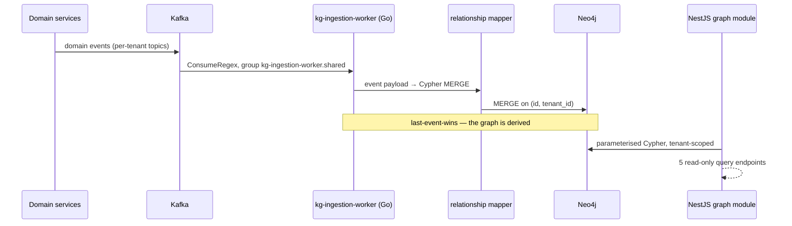

# Phase 13 — Knowledge Graph

> Compiled from `context/00_master_construction_os.md` § PHASE 13 — KNOWLEDGE GRAPH COMMAND and the
> specification sections cited inline. `docs/specifications/` wins on any conflict; see
> [README § Authority](README.md).

---

## 1. Overview & goals

A Neo4j graph derived from the event stream, for traversal and relationship queries that are awkward
in SQL — which vendors supply a project, which tasks a vendor's delay puts at risk, which vendors
share projects.

The single most important sentence in the command is a disclaimer: **the graph is not the source of
truth.** PostgreSQL is authoritative; the graph is eventually consistent, may lag by seconds to
minutes, and resolves conflicts by last-event-wins because it is derived. Every design choice below
follows from accepting that.

Sync is **event-driven via Kafka — explicitly not CDC and not batch ETL**.

---

## 2. Scope

### In scope

- `kg-ingestion-worker` (Go): Kafka consumer → Neo4j writer
- Eight event-backed node labels and the relationships between them
- Composite uniqueness constraints on `(id, tenant_id)`
- Five graph query APIs on the NestJS side
- Full-rebuild admin endpoint

### Out of scope — and stated as such

- **`Building`, `Floor`, `Room`, `Structure`** and the five relationships that touch them. The command
  documents the intended model and then rules them out (product-owner decision 2026-07-05): they are
  backing/reference data that emit **no Kafka events**, and since KG sync is event-driven only, "with
  no events these four labels cannot be materialised in Neo4j". They are "intentionally absent from
  the mapper and the constraints (8 event-backed labels only)".

That is the cleanest example in the whole spec set of a gap being documented rather than left to be
discovered.

---

## 3. Architecture

```text
services/kg-ingestion-worker/           (Go)
  cmd/kg-ingestion-worker/main.go       — consumer + Neo4j writer + POST /admin/rebuild
  internal/consumer/kafka_consumer.go   — franz-go, ConsumerGroupID = "kg-ingestion-worker.shared"
  internal/graph/constraints.go         — composite uniqueness for all 8 labels
  tests/integration/ingest_test.go      — Neo4j test container

backend/src/modules/graph/              (NestJS, thin)
  graph.{controller,service,module}.ts  graph.tokens.ts
```

**The Kafka client choice is a bug fix with its reasoning preserved.** `sarama` was replaced by
`github.com/twmb/franz-go` v1.21.5 through the shared `coskafka` pipeline because sarama "has no regex
topic subscription (which the pattern above requires) and it `json.Unmarshal`'d Avro-framed bytes;
both broke against a real broker". The analytics worker uses the same path.

Topic subscription is a cross-tenant regex —
`^[^.]+\.(construction|procurement|site|finance)\..*` — matching every tenant-scoped topic in those
four domains, under the `{service}.shared` group naming §7.3 requires.

---

## 4. Data model

Eight node labels, all event-backed:

| Label         | Key                                       | Note                                                                      |
| ------------- | ----------------------------------------- | ------------------------------------------------------------------------- |
| `:Project`    | `project_id`                              | —                                                                         |
| `:Task`       | `task_id` = `boq_item_id`                 | BOQ line items are the authoritative task source in this phase            |
| `:Material`   | `material_id` = `boq_item_id`             | —                                                                         |
| `:Vendor`     | `vendor_id`                               | —                                                                         |
| `:Inspection` | `inspection_id`                           | —                                                                         |
| `:Invoice`    | `invoice_id`                              | —                                                                         |
| `:Contract`   | `contract_id` = `po_id` of an APPROVED PO | "APPROVED PO = contractual agreement; no separate Contract module needed" |
| `:Delay`      | `delay_id` = the envelope's `event_id`    | the MERGE key; severity bands match Phase 12's day thresholds             |

**Uniqueness is composite, and that is the tenant-isolation control.** `constraints.go` creates
`REQUIRE (n.<id>, n.tenant_id) IS UNIQUE` for each of the eight — so two tenants may legitimately hold
the same business id, and a MERGE cannot collapse them into one node. Neo4j has no RLS; this
constraint plus a `tenant_id` predicate in every query is what stands in for it.

Relationships materialised: `HAS_MATERIAL`, `SUPPLIED_BY`, `DELIVERED_BY`, `SUBMITTED`, `BELONGS_TO`,
`VALIDATES`, `HAS_INSPECTION`, and `IMPACTS` to both `:Project` and `:Task`. `DEPENDS_ON` and `USES`
for tasks derive from the BOQ parent–child hierarchy rather than from an event.

---

## 5. API contract

All five specified query endpoints exist on the NestJS side, which is deliberately thin — it delegates
to Neo4j and holds no logic of its own.

| Endpoint                                      | Query it answers                   |
| --------------------------------------------- | ---------------------------------- |
| `GET /graph/projects/:projectId/vendors`      | vendors supplying a project        |
| `GET /graph/projects/:projectId/supply-chain` | material supply chain              |
| `GET /graph/projects/:projectId/inspections`  | inspections, pass/fail             |
| `GET /graph/vendors/:vendorId/projects`       | vendor relationship map            |
| `GET /graph/vendors/:vendorId/invoices`       | invoices for a vendor on a project |

`POST /admin/rebuild` lives on the **worker**, not the backend — it resets offsets and re-consumes
from the beginning, which is the recovery path after a mapper bug or a schema change.

---

## 6. Events

Consumed only; this phase produces none. The regex subscription means it receives every
`construction.*`, `procurement.*`, `site.*` and `finance.*` event across all tenants, and the mapper
decides which produce nodes.

The dependency runs the other way from most phases: anything Phases 3–7 stop emitting simply stops
appearing in the graph, silently, because a derived store has no way to notice an absence.

---

## 7. Sequence / flows



Restart replays from the last committed offset. A full rebuild resets offsets to the beginning and
re-consumes — which is safe precisely because every write is a MERGE on a composite key.

---

## 8. Failure modes & rollback

| Failure                                | Behaviour today                                                      |
| -------------------------------------- | -------------------------------------------------------------------- |
| Worker restarts                        | Replays from last committed offset                                   |
| Mapper bug corrupts nodes              | `POST /admin/rebuild` → offset reset + full re-consume               |
| Same event delivered twice             | MERGE on `(id, tenant_id)` is idempotent                             |
| Two tenants share a business id        | Composite constraint keeps them distinct                             |
| Neo4j unavailable                      | Consumption stalls; offsets uncommitted, so nothing is lost          |
| **An upstream service stops emitting** | The graph silently stops reflecting that domain — nothing detects it |
| Graph read during lag                  | Stale by design — the graph is not authoritative                     |

The last two are properties of the eventual-consistency choice rather than defects, but they belong in
any operational reading of this phase: a graph query is never proof, and a missing edge is
indistinguishable from an edge that has not arrived yet.

**Rollback:** no schema migration to reverse. Neo4j constraints are `IF NOT EXISTS`, so re-applying
them is safe.

---

## 9. Security

**Neo4j has no row-level security**, so tenant isolation here is different in kind from the PostgreSQL
story ([README § Tenant isolation](README.md#tenant-isolation)). Two mechanisms carry it: the
composite `(id, tenant_id)` uniqueness constraint on all eight labels, and a `tenant_id` predicate in
every query the NestJS module issues. Neither is enforced by the database on a query that forgets it —
which makes the thin-API design load-bearing: all Cypher lives in one module, so there is one place to
audit.

The worker's cross-tenant regex subscription is intentional and is why the `tenant_id` on each node
must come from the event envelope rather than from anything ambient.

---

## 10. Observability

Consumer lag on `kg-ingestion-worker.shared` is the phase's defining metric — it is literally how
stale the graph is. Nothing in `infrastructure/monitoring/` defines an alert on it.

---

## 11. Testing & acceptance

| Surface               | Tests                                                           |
| --------------------- | --------------------------------------------------------------- |
| `kg-ingestion-worker` | 3 Go test files, incl. a Neo4j test container integration suite |
| `modules/graph`       | 2 spec files                                                    |

The command asks for exactly these two: unit tests on the Kafka-event → Cypher transformation, and an
integration test of the full ingest pipeline against a Neo4j test container.

---

## 12. Implementation status

Verified on **2026-08-22** against this working tree (Rule 36 — commands run, output summarised).

| Generate item                                  | Status     | Evidence                                                          |
| ---------------------------------------------- | ---------- | ----------------------------------------------------------------- |
| `kg-ingestion-worker` (Go) — consumer + writer | ✅ present | `services/kg-ingestion-worker/`                                   |
| franz-go via coskafka, `ConsumeRegex`          | ✅ present | `franz-go v1.21.5`; `internal/consumer/kafka_consumer.go`         |
| Consumer group `kg-ingestion-worker.shared`    | ✅ present | `ConsumerGroupID = "kg-ingestion-worker.shared"`                  |
| Cypher for all node/relationship types         | ✅ present | 8 event-backed labels — matching the command's own exclusion note |
| Relationship mapper                            | ✅ present | event payload → MERGE                                             |
| Graph query service (NestJS)                   | ✅ present | `modules/graph/` — 5 endpoints, thin                              |
| Neo4j constraints on `{label}.{id}` + tenant   | ✅ present | `internal/graph/constraints.go` — composite uniqueness × 8        |
| Full rebuild admin endpoint                    | ✅ present | `POST /admin/rebuild` on the worker                               |
| Unit tests — event → Cypher                    | ✅ present | Go tests                                                          |
| Integration tests — Neo4j test container       | ✅ present | `tests/integration/ingest_test.go`                                |
| `docs/api/graph.openapi.yaml`                  | ✅ present | —                                                                 |
| Building/Floor/Room/Structure absent           | ✅ correct | intentional, per the command's PO decision 2026-07-05             |

Every Generate item is present, and the one apparent gap — four missing node labels — is the command's
own documented decision rather than a shortfall.

---

## 13. Dependencies & risks

**Dependencies:** Phases 3–8 as event producers; Phase 8 for the transport. Runtime: Neo4j, Kafka.

Note the transitive weight of [OQ-32](README.md#open-questions-register): procurement's state
transitions run in Temporal activities, so with no worker running, no
`procurement.po.status_changed.v1` is emitted and the graph's `:Contract` nodes — keyed on APPROVED
POs — never appear.

---

## 14. Open questions / NOT SPECIFIED

None raised by this page. The physical-hierarchy exclusion that would otherwise be the obvious question
is answered in the command itself, with the mechanism (no events), the decision-maker (product owner)
and the date (2026-07-05) all recorded.
