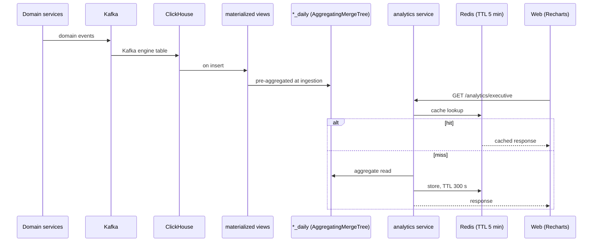

# Phase 14 — Analytics + Dashboard

> Compiled from `context/00_master_construction_os.md` § PHASE 14 — ANALYTICS + DASHBOARD COMMAND and
> the specification sections cited inline. `docs/specifications/` wins on any conflict; see
> [README § Authority](README.md).

---

## 1. Overview & goals

Dashboards backed by ClickHouse, with a performance SLA that dictates the architecture rather than
following from it.

The SLA is the requirement: Executive p95 < 3 s, PM p95 < 2 s, data freshness 15 minutes, real-time
alerts under 30 s. Meeting that at query time over transactional data is not possible, so the command
mandates **pre-aggregation at ingestion** — materialized views over Kafka engine tables, "NOT
query-time aggregation — ensures P95 SLA is met".

---

## 2. Scope

### In scope

- ClickHouse Gold layer: three daily aggregate tables + the Kafka engine tables and MVs that fill them
- A NestJS analytics service with a Redis cache in front
- Five APIs across two dashboards
- Recharts dashboard components on the web app

### Out of scope

- The **Bronze layer** — raw event retention in S3 + Apache Iceberg via Debezium CDC. Architected for
  Phase 17 and currently deferred (§9.4). This absence has a consequence spelled out in § 8.
- Query-time aggregation of any kind

---

## 3. Architecture

The medallion split is explicit in the command: **Iceberg lake = Bronze/raw, ClickHouse =
Gold/aggregates.** ClickHouse holds no raw fact table at all.

```text
infrastructure/clickhouse/initdb.d/
  01-database.sql
  02-kafka-tables.sql        — 8 Kafka engine tables
  03-aggregation-tables.sql  — 3 AggregatingMergeTree, PARTITION BY toYYYYMM(event_date)
  04-materialized-views.sql  — 10 MVs, Kafka → aggregate
  05-carbon-tables.sql       — ReplacingMergeTree (Phase 24)

backend/src/modules/analytics/
  analytics.service.ts                  — ClickHouse client + Redis cache + invalidate()
  analytics.executive.controller.ts
  analytics.pm.controller.ts
  analytics.trends.controller.ts
  analytics-project-scope.service.ts

services/analytics-worker/  (Go)        — §32.2 deployable, franz-go/coskafka
apps/web/                               — Recharts components
```

Two caching layers, as specified: Redis with a 5-minute TTL over the API response, and the ClickHouse
materialized views under it. The Redis key format matches the command exactly —
`analytics:{tenant_id}:{dashboard_type}:{project_id}:{date_range}`.

---

## 4. Data model

Three aggregate tables, all `AggregatingMergeTree`, all partitioned by `toYYYYMM(event_date)`:

| Table                        | Aggregates                                                                        |
| ---------------------------- | --------------------------------------------------------------------------------- |
| `project_cost_daily`         | `sum` of committed and actual; `budget_amount` snapshotted from `project_budgets` |
| `procurement_activity_daily` | counts of PO, RFQ, invoice, overdue invoice                                       |
| `site_activity_daily`        | report count, open issues, failed inspections, manpower total                     |

Fed by eight Kafka engine tables — project created, PO created, RFQ created, invoice approved, site
report submitted, issue created, inspection failed, workforce check-in — through ten materialized
views.

**No TTL on the aggregate tables, by design.** Raw-event retention (2 years operational, 10 years cold)
belongs to PostgreSQL and the deferred Iceberg lake, not to ClickHouse.

`analytics.carbon_records` uses `ReplacingMergeTree` and belongs to Phase 24, not here.

---

## 5. API contract

| Endpoint                                               | Dashboard |
| ------------------------------------------------------ | --------- |
| `GET /analytics/executive?projectIds[]=&dateRange=`    | Executive |
| `GET /analytics/pm/:projectId?dateRange=`              | PM        |
| `GET /analytics/projects/:projectId/cost-trend`        | trend     |
| `GET /analytics/projects/:projectId/procurement-trend` | trend     |
| `GET /analytics/projects/:projectId/site-trend`        | trend     |

All five exist, split across three controllers.

---

## 6. Events

Consumed by ClickHouse **directly** through Kafka engine tables — not by application code. That is
what makes the ingestion path cheap enough to pre-aggregate, and it also means the eight event types
wired into `02-kafka-tables.sql` are the entire analytics surface: an event with no engine table
contributes nothing.

---

## 7. Sequence / flows



---

## 8. Failure modes & rollback

| Failure                              | Behaviour today                                                           |
| ------------------------------------ | ------------------------------------------------------------------------- |
| ClickHouse unavailable               | `ServiceUnavailableException` — "Analytics query failed"                  |
| Redis unavailable                    | Falls through to ClickHouse                                               |
| **Underlying data changes**          | **Cache is not invalidated** — the 5-minute TTL is the only bound — OQ-42 |
| A new metric is added                | Aggregates only from go-live forward — see below                          |
| A materialized view needs rebuilding | Limited to the Kafka retention window                                     |

**Backfill is bounded, and the command says so.** Until the Iceberg lake lands (Phase 17+, deferred
per §9.4), "raw events persist only for the Kafka retention window, so rebuilding a materialized view
or backfilling a new metric is limited until then — a new metric aggregates from go-live forward, and
PostgreSQL remains the authoritative rebuild source via event re-emission." Any new dashboard metric
therefore starts with no history, and that is a known, documented consequence of deferring Path 2.

**Rollback:** ClickHouse DDL is `IF NOT EXISTS` and initdb-driven; there is no migration to reverse.

---

## 9. Security

Tenant scoping is a query predicate here, not RLS — ClickHouse has no row-level security. Every
aggregate table carries `tenant_id` as its leading dimension and
`analytics-project-scope.service.ts` exists to resolve which projects a caller may see before any
query is built.

The Redis key is tenant-prefixed, so a cache hit cannot cross tenants even if a query were malformed.

---

## 10. Observability

The SLA itself is the observability requirement: p95 < 3 s and < 2 s are only meaningful if measured.
`tests/load/dashboard-sla.js` is the k6 script that checks them, run weekly against staging per §30.9
(advisory, not a merge gate).

The signal with no owner is cache hit rate — with invalidation unwired (OQ-42), hit rate and staleness
are the same number.

---

## 11. Testing & acceptance

4 spec files in the analytics module, plus `tests/load/dashboard-sla.js` for the load requirement
("verify P95 < 3s SLA under 100 concurrent dashboard loads").

---

## 12. Implementation status

Verified on **2026-08-22** against this working tree (Rule 36 — commands run, output summarised).

| Generate item                                 | Status         | Evidence                                                        |
| --------------------------------------------- | -------------- | --------------------------------------------------------------- |
| ClickHouse Docker Compose service             | ✅ present     | `docker-compose.yml`                                            |
| Kafka engine table definitions                | ✅ present     | 8 tables, `ENGINE = Kafka`                                      |
| Materialized view DDL                         | ✅ present     | 10 MVs in `04-materialized-views.sql`                           |
| Aggregate tables                              | ✅ present     | 3 × `AggregatingMergeTree`, `PARTITION BY toYYYYMM(event_date)` |
| Analytics NestJS service with `clickhouse-js` | ✅ present     | `@clickhouse/client ^1.8.0`                                     |
| Redis cache layer                             | ✅ present     | TTL 300 s; key format matches the command exactly               |
| **Event-driven cache invalidation**           | ⚠️ **unwired** | `invalidate()` is correct and has no production caller — OQ-42  |
| Dashboard API controllers                     | ✅ present     | executive / pm / trends                                         |
| Recharts dashboard components                 | ✅ present     | `recharts ^3.9.1` in `apps/web`                                 |
| Unit tests — cache logic, query building      | ✅ present     | 4 spec files                                                    |
| Load test for the p95 SLA                     | ✅ present     | `tests/load/dashboard-sla.js`                                   |
| `docs/api/analytics.openapi.yaml`             | ✅ present     | —                                                               |

---

## 13. Dependencies & risks

**Dependencies:** Phases 3–8 as event producers, Phase 8 for the transport. Runtime: ClickHouse 26.x,
Kafka, Redis.

As with Phase 13, [OQ-32](README.md#open-questions-register) propagates: procurement counts derive
from events emitted inside Temporal activities.

---

## 14. Open questions / NOT SPECIFIED

| #     | Question                                                                                                                                                                                                                                                                                                                                                                                                                                                                                                                                                                                                                                                                                                                                                                                                                                                                                                                            | Status                     |
| ----- | ----------------------------------------------------------------------------------------------------------------------------------------------------------------------------------------------------------------------------------------------------------------------------------------------------------------------------------------------------------------------------------------------------------------------------------------------------------------------------------------------------------------------------------------------------------------------------------------------------------------------------------------------------------------------------------------------------------------------------------------------------------------------------------------------------------------------------------------------------------------------------------------------------------------------------------- | -------------------------- |
| OQ-42 | **Event-driven cache invalidation is built and connected to nothing.** The command requires "Cache invalidation: event-driven (on relevant Kafka event, clear Redis cache key)". `AnalyticsService.invalidate()` implements it correctly — SCAN over `analytics:{tenant}:*{projectId}*` then UNLINK, with a comment recording that the previous `cache.del()` version could never have matched anything because `del` has no glob support and the executive key joins sorted project ids. But its own docstring says: "**NOT yet wired to a Kafka consumer** — call it from whatever mutates project cost/procurement/site data. Until then the 5-minute TTL is the only bound on staleness." The only callers in the tree are its unit tests. The practical effect is bounded (5 minutes, not indefinite), so this is a smaller gap than [OQ-40](README.md#open-questions-register) — but the deliverable as specified is not met. | Open — needs a PO decision |
