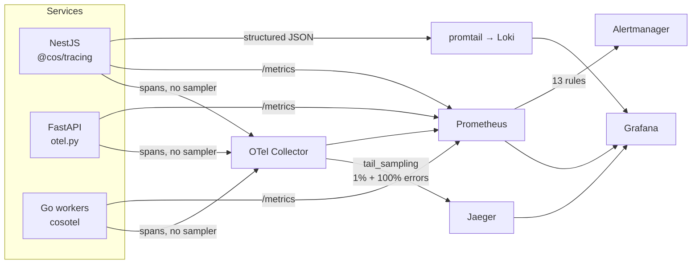

# Phase 15 — Observability

> Compiled from `context/00_master_construction_os.md` § PHASE 15 — OBSERVABILITY COMMAND and the
> specification sections cited inline. `docs/specifications/` wins on any conflict; see
> [README § Authority](README.md).

---

## 1. Overview & goals

Metrics, logs and traces for a system written in four languages and deployed as thirteen processes.

Prometheus + Grafana for metrics, Loki for logs, Jaeger + an OpenTelemetry Collector for traces. The
command specifies 24 mandatory metrics, 13 alert rules and 9 dashboards by name — it is the most
enumerated phase in the register, and the verification below is correspondingly literal.

---

## 2. Scope

### In scope

- OpenTelemetry SDK setup for NestJS, FastAPI and Go
- Prometheus scrape configs, alert rules, Grafana dashboards, Loki pipeline, Jaeger, OTel Collector
- HTTP metrics interceptor and Kafka producer/consumer metrics
- Log retention policy and synthetic probes

### Out of scope

- SLO definitions themselves — `docs/slo/dashboard-registry.md` holds dashboard ids and targets
- Per-phase alerts for domain behaviour; this phase provides the platform metrics

---

## 3. Architecture

```text
infrastructure/monitoring/
  prometheus/prometheus.yml            — 12 scrape jobs
  prometheus/rules/cos-alerts.yml      — 13 alert rules
  grafana/dashboards/                  — 10 dashboard JSON files
  loki/{loki-config,promtail-config}.yml
  jaeger/jaeger-deployment.yml
  otel-collector/otel-collector-config.yml + overlays per environment
  isolation-probe/                     — CronJob, RBAC, probe script
infrastructure/synthetics/health-probes.yaml

packages/@cos/tracing/src/            — NestJS/Node
libs/go/cosotel/                      — Go workers
services/ai-gateway/otel.py           — FastAPI
backend/src/shared/interceptors/http-metrics.interceptor.ts
backend/src/shared/kafka/kafka-metrics.ts
```

**Sampling happens in exactly one place, and all three SDKs are written to enforce that.** ADR-075
puts tail sampling at the Collector — 1% baseline in production, 100% for errors — and forbids any
SDK-level sampler, because head sampling discards spans before the Collector can apply its
error/AI/financial policies.

Both SDKs carry the prohibition as a comment rather than leaving it implicit, and the Node one records
a specific correction: a `samplingRatio?: number` field "was declared here and documented as reading
`OTEL_SAMPLING_RATIO`, but nothing ever read it; the claim was false." That is the same class of defect
as § 14 OQ-43 below — a control that reads as present and does nothing — caught one layer up.

The Collector reads `${env:OTEL_SAMPLING_PERCENTAGE}` (a percent, not a ratio); Collector 0.103.0
accepts only that form, and the older `${VAR:-default}` syntax makes it refuse to start.

---

## 4. Data model

None. This phase's persistence is Prometheus TSDB, Loki chunks and Jaeger spans, all outside the
platform's databases.

Log retention is policy, not schema: application logs 30-day hot / 1-year cold; audit logs indefinite
with a 7-year WORM window (§31.4), recorded in `docs/compliance/log-retention-policy.md`.

---

## 5. API contract

No public API. The surfaces are `/metrics` scrape endpoints per service and the Grafana/Jaeger UIs.

Twelve Prometheus scrape jobs: `cos-backend`, `file-service`, `ai-gateway`, `ai-embedding-worker`,
`ai-ocr-pipeline`, `ai-transcription-pipeline`, `analytics-worker`, `kg-ingestion-worker`, `kafka`,
`node-exporter`, `otel-collector`, `kubernetes-pods`.

---

## 6. Events

None produced or consumed. Kafka is instrumented, not subscribed to.

---

## 7. Sequence / flows



Trace propagation is W3C TraceContext over HTTP and Kafka headers for async —
`packages/@cos/tracing/src/kafka-propagation.ts` is the piece that carries a trace across the outbox
into a consumer.

---

## 8. Failure modes & rollback

| Failure                                             | Behaviour today                                                                                                 |
| --------------------------------------------------- | --------------------------------------------------------------------------------------------------------------- |
| An SDK adds a sampler                               | Spans dropped before the Collector; the "100% for errors" guarantee fails silently — hence the ADR-075 comments |
| Collector env var in the old `${VAR:-default}` form | Collector refuses to start                                                                                      |
| A service exposes no `/metrics`                     | Prometheus target down; `ServiceDown` fires on pod readiness instead                                            |
| **`kafka_dlq_depth` never emitted**                 | **`KafkaDLQNonEmpty` never fires** — § 14 OQ-43                                                                 |
| **`kafka_consumer_lag` never emitted**              | **`KafkaConsumerLagCritical` never fires** — § 14 OQ-43                                                         |

**An alert on an absent series is worse than no alert**, because the dashboard panel and the rule file
both read as coverage. That is what OQ-43 is about, and it is the reason this page's § 12 checks
whether each metric has a _producer_, not merely a _name_.

**Rollback:** configuration only — Kubernetes manifests and ConfigMaps, reverted by redeploy.

---

## 9. Security

Two of the thirteen alerts are security controls rather than reliability ones:

- **`TenantIsolationBreach`** — `tenant_isolation_check_result == 0`, fed by the synthetic probe
  CronJob in `infrastructure/monitoring/isolation-probe/` running every 5 minutes (§30.6). Pages the
  security lead immediately. This is the platform's continuous proof that RLS is holding.
- **`SafetyNotificationFailed`** — `notification_pending_total{notification_type="safety"} > 0`,
  paging security. It is the runtime counterpart to
  [OQ-34](README.md#open-questions-register): the alert covers a safety notification that fails to
  _deliver_, while OQ-34 is about one a user is allowed to _disable_.

Audit logs are retained indefinitely with a 7-year WORM window — a compliance obligation, not a
retention preference.

Synthetic health probes run from ≥ 2 AWS regions at 60 s intervals, and §31.10 requires a probe
definition in the same PR as any new endpoint.

---

## 10. Observability

Self-referential, and the interesting part is the audience split §31.8 draws: five
**implementation** dashboards organised by technology (per-service, Kafka, database, AI,
infrastructure) and four **audience** dashboards organised by who is asking (Platform Overview,
Tenant Operations, Business Metrics, SLO Burn Rate). The tree has all nine plus `adoption-gates.json`.

---

## 11. Testing & acceptance

The command asks for unit tests on metric collection and trace propagation;
`http-metrics.interceptor.spec.ts`, `kafka-metrics.spec.ts` (backend) and
`packages/@cos/shared/src/kafka/__tests__/metrics.spec.ts` cover them.

Worth noting against OQ-43: those tests pass. They verify that `registerConsumerLagGauge` and
`setDlqDepth` behave correctly **when called**, which is exactly the property that stays true when
nothing calls them.

---

## 12. Implementation status

Verified on **2026-08-22** against this working tree (Rule 36 — commands run, output summarised).

| Generate item                              | Status        | Evidence                                                               |
| ------------------------------------------ | ------------- | ---------------------------------------------------------------------- |
| OTel setup — NestJS, FastAPI, Go           | ✅ present    | `@cos/tracing`, `services/ai-gateway/otel.py`, `libs/go/cosotel`       |
| No SDK-level sampler (ADR-075)             | ✅ enforced   | prohibition documented in both SDKs; prior false claim removed         |
| Prometheus scrape configs                  | ✅ present    | 12 jobs                                                                |
| Alert rule YAML — all 13                   | ✅ present    | `cos-alerts.yml`: every rule name in the command                       |
| Grafana dashboards                         | ✅ present    | 10 JSON files, covering all 9 required                                 |
| Loki log pipeline                          | ✅ present    | `loki-config.yml` + `promtail-config.yml`                              |
| Jaeger deployment                          | ✅ present    | `jaeger-deployment.yml`                                                |
| OTel Collector config                      | ✅ present    | `tail_sampling` + `${env:OTEL_SAMPLING_PERCENTAGE}` + per-env overlays |
| NestJS HTTP metrics interceptor            | ✅ present    | `http-metrics.interceptor.ts`                                          |
| Kafka producer/consumer metrics middleware | ✅ present    | `kafka-metrics.ts`, `libs/go/coskafka/metrics.go`                      |
| 22 of 24 mandatory metrics have a producer | ✅ present    | names verified in the TS/Go metric definitions                         |
| **`kafka_consumer_lag` producer**          | ❌ **absent** | gauge registration has no production caller — OQ-43                    |
| **`kafka_dlq_depth` producer**             | ❌ **absent** | same — OQ-43                                                           |
| `docs/compliance/log-retention-policy.md`  | ✅ present    | —                                                                      |
| `infrastructure/synthetics/`               | ✅ present    | `health-probes.yaml`                                                   |
| Tenant-isolation probe CronJob             | ✅ present    | `isolation-probe/` — cronjob, configmap, rbac, probe script            |
| `docs/slo/dashboard-registry.md`           | ✅ present    | —                                                                      |

---

## 13. Dependencies & risks

**Dependencies:** Phase 1 (the `@cos/tracing` package) and every service that must expose `/metrics`.

**Risks:** QM-8 is the standard this phase discharges — every new service, module or background job
must ship metrics, logs and traces from day one.

---

## 14. Open questions / NOT SPECIFIED

| #     | Question                                                                                                                                                                                                                                                                                                                                                                                                                                                                                                                                                                                                                                                                                                                                                                                                                                                                                                                                                                                                                                                                                                                                                                                                                                                                                                                                                    | Status                 |
| ----- | ----------------------------------------------------------------------------------------------------------------------------------------------------------------------------------------------------------------------------------------------------------------------------------------------------------------------------------------------------------------------------------------------------------------------------------------------------------------------------------------------------------------------------------------------------------------------------------------------------------------------------------------------------------------------------------------------------------------------------------------------------------------------------------------------------------------------------------------------------------------------------------------------------------------------------------------------------------------------------------------------------------------------------------------------------------------------------------------------------------------------------------------------------------------------------------------------------------------------------------------------------------------------------------------------------------------------------------------------------------- | ---------------------- |
| OQ-43 | **Two page-on-call alerts fire on metrics nothing emits.** `KafkaDLQNonEmpty` (`kafka_dlq_depth > 0`, severity critical) and `KafkaConsumerLagCritical` (`kafka_consumer_lag > 50000`, severity critical, page on-call) are both defined in `cos-alerts.yml` and both charted in `kafka.json` and `platform-overview.json`. Neither series has a producer: `backend/src/shared/kafka/kafka-metrics.ts` exports `registerConsumerLagGauge` and `registerDlqDepthGauge`, `packages/@cos/shared/src/kafka/metrics.ts` exports `setConsumerLag` and `setDlqDepth`, and **every reference to all four is a test or a barrel export** — no production caller in the tree. The Go side declines to define them on purpose and says why, naming the other side as the owner: "kafka_consumer_lag — requires querying group offsets via the admin API… **The TypeScript side publishes it**", and for DLQ depth, that reporting a producer's write count as a queue depth "would make the KafkaDLQNonEmpty alert lie". **Failure scenario:** a poison message fills the DLQ, or a consumer group falls a million messages behind, and no alert fires — Prometheus evaluates the rule against an absent series, which never satisfies `> 0`. The rule file and the dashboards both read as coverage. Someone must call the registration functions at service startup. | Open — operational gap |
