# Phase 16 — Security

> Compiled from `context/00_master_construction_os.md` § PHASE 16 — SECURITY COMMAND and the
> specification sections cited inline. `docs/specifications/` wins on any conflict; see
> [README § Authority](README.md).

---

## 1. Overview & goals

The platform-wide security controls, and the compliance evidence that they exist.

Two things distinguish this phase from the others. First, most of what it "builds" was already built
into earlier phases — RLS in Phase 2, MIME validation in Phase 9, throttling in Phase 5 — so its job
is to make those controls **systematic and provable** rather than to add new behaviour. Second, its
deliverables include documents: SOC 2 control tracking, a PDPA data-flow map, a retention policy, a
CORS policy, a CSP policy, and external pentest findings.

Compliance targets: ISO 27001 (24 months), SOC 2 Type II (18 months), PDPA (mandatory for Thailand),
GDPR (mandatory for EU tenant data).

---

## 2. Scope

### In scope

- RLS policies across every domain table, plus audit-log immutability
- Cloudflare WAF, origin protection, and the middleware that trusts it
- Secure headers, sealed secrets, cert-manager TLS, Kong declarative config
- Trivy and OWASP dependency scanning in CI
- The compliance document set

### Out of scope

- Cloudflare WAF for **on-premise** deployments — not applicable; Kong handles rate limiting and the
  customer must supply their own WAF at OWASP CRS paranoia level 2 (§8.7)

---

## 3. Architecture

```text
backend/src/shared/middleware/
  secure-headers.middleware.ts       — the five response headers
  cloudflare-waf.middleware.ts       — CF-Ray / CF-Connecting-IP
backend/src/shared/interceptors/
  audit.interceptor.ts               — auto-logs mutating operations
  tenant-context.interceptor.ts      — secondary to JWT-time CLS publication (ADR-031)
backend/src/modules/compliance/
  compliance-audit.{service,exception}.ts
  workflows/compliance-audit.workflow.ts

infrastructure/terraform/cloudflare/    main.tf · waf.tf · variables.tf · outputs.tf
infrastructure/terraform/aws/kms.tf     — CMK per storage type per environment
infrastructure/kubernetes/
  security/cloudflare-origin-protection.yaml
  sealed-secrets/cos-sealed-secrets.yml
  cert-manager/cert-manager.yml
  kong/kong-declarative.yml
```

**Tenant context is established at JWT validation, not by a pre-auth middleware** (ADR-031):
`KeycloakJwtStrategy.validate` → `JwtAuthGuard` publishes to CLS, with `TenantContextInterceptor` as
secondary. The ordering matters — a middleware running before authentication has no user to derive a
tenant from.

**RLS is primary, not defence in depth.** §7.7 makes it mandatory from MVP, and the note is explicit:
"Application-layer `WHERE tenant_id = $1` is SECONDARY defense-in-depth." It works only because the
connection is the non-superuser `app_user`; connecting as the owner would bypass every policy.

---

## 4. Data model

No new tables. Two policy changes on existing ones:

| Object                | Policy                                                                                                          |
| --------------------- | --------------------------------------------------------------------------------------------------------------- |
| every domain table    | `rls_tenant_isolation` — `USING (tenant_id = NULLIF(current_setting('app.current_tenant_id', TRUE), '')::uuid)` |
| `platform.audit_logs` | `rls_audit_no_update` and `rls_audit_no_delete` — **immutable to `app_user`**                                   |

`20260608000004_rls_policies` is the migration that carries both, and it cites the command by name for
the audit rule. The audit log is the one table the application can only ever append to, which is what
makes it admissible as evidence in the compliance work this phase exists to support.

---

## 5. API contract

None added. What changes is what every existing endpoint carries:

**Response headers**, all five verified in `secure-headers.middleware.ts`:
`Strict-Transport-Security: max-age=31536000; includeSubDomains`, `X-Content-Type-Options: nosniff`,
`X-Frame-Options: DENY`, `Content-Security-Policy: default-src 'self'`,
`Referrer-Policy: strict-origin-when-cross-origin`.

**Rate limits** (§5.5, and the same table QM-7 states): auth 10 req/min per IP, general 100 req/min per
user, file upload 20 req/min per user, health/metrics 60 req/min per IP. See
[OQ-17](README.md#open-questions-register) for the one QM-7 clause with no implementation.

---

## 6. Events

None. Audit records are written to PostgreSQL directly by the interceptor — deliberately not through
Kafka, since an audit trail that depends on a message bus inherits the bus's delivery semantics.

---

## 7. Sequence / flows

```mermaid
flowchart LR
    I["Internet"] --> CF["Cloudflare Edge<br/>Managed + OWASP CRS PL2 + custom"]
    CF --> ALB["AWS ALB<br/>SG: 443 from Cloudflare IPs only"]
    ALB --> IN["EKS Ingress<br/>TLS 1.3, cert-manager"]
    IN --> KO["Kong Gateway<br/>rate limits, JWT, tenant routing"]
    KO --> N["NestJS"]
    N --> M1["cloudflare-waf.middleware<br/>CF-Ray present? CF-Connecting-IP = client"]
    M1 --> M2["secure-headers.middleware"]
    M2 --> G["JwtAuthGuard → CLS tenant<br/>RolesGuard · PolicyGuard · Throttler"]
    G --> A["audit.interceptor"]
    A --> DB["PostgreSQL as app_user<br/>RLS FORCE on every domain table"]
```



**The CF-Ray check is honest about being weak, and that honesty is the design.** The middleware's own
comment: "`CF-Ray` is just a request HEADER. Anyone who can reach the origin directly sends
`CF-Ray: anything` and passes." It is a signal, not a control. The actual control is the layer above
it — the ALB security group restricting port 443 to Cloudflare IP ranges, which the command marks
MANDATORY and which `cloudflare-origin-protection.yaml` and the Cloudflare Terraform module
implement. Reading the middleware alone would overstate the protection; reading both gives the right
picture.

---

## 8. Failure modes & rollback

| Failure                                               | Behaviour today                                                                                            |
| ----------------------------------------------------- | ---------------------------------------------------------------------------------------------------------- |
| Application bypassed entirely (SQL access)            | RLS still denies — it is enforced at the database, on `app_user`                                           |
| Connection made as the `cos` owner role               | **RLS is bypassed** — which is why the runtime connects as `app_user`                                      |
| An attempt to alter or delete an audit row            | Denied by `rls_audit_no_update` / `rls_audit_no_delete`                                                    |
| Request reaches the origin without traversing the WAF | Logged as "WAF bypass detected"; blocked in production by CF-Ray, but see § 7 — the SG is the real control |
| A new origin added to CORS without policy update      | Nothing enforces this — `docs/security/cors-policy.md` is the control, and it is a document                |
| Secret committed in plaintext                         | sealed-secrets is the mechanism; no scanner in CI enforces the prohibition                                 |

**Rollback:** `20260608000004_rls_policies` has a paired rollback. Reversing it removes tenant
isolation, so it is the single most dangerous rollback in the tree — worth an explicit operator
confirmation step that the runbook does not currently describe.

---

## 9. Security

This section is the phase, so rather than restate it: the controls verified present are listed in
§ 12, and the ones that are **documents rather than mechanisms** are called out there too. Three
observations that do not fit elsewhere:

**Encryption.** AES-256 minimum at rest; SSE-KMS with a customer-managed key per storage type per
environment (`cos/{env}/rds`, `cos/{env}/s3`, `cos/{env}/elasticache`), annual automatic rotation, key
policy limited to the app service role and `SYSTEM_ADMIN`. Defined as Terraform in
`infrastructure/terraform/aws/kms.tf`. On-premise uses Vault Transit envelope encryption instead.
ElastiCache gets an AWS-managed key rather than a CMK — a deliberate asymmetry, since the cache holds
no durable record.

**SQL injection.** The command says it is "impossible via Prisma parameterized queries". That is true
of Prisma model access, but the platform's domain layer is `$queryRaw` tagged templates
([README § Data access](README.md#data-access)) — also parameterised, and every repository header says
so, but the mechanism is different from the one the command names.

**The compliance documents are deliverables, and they exist**: `soc2-controls.md`, `data-flow-map.md`,
`data-retention-policy.md`, plus `iso27001-controls.md`, `pdpa-controls.md`,
`data-residency-policy.md` and this session's `sms-otp-restricted-authenticator.md`.

---

## 10. Observability

Two of Phase 15's thirteen alerts belong to this phase in substance — `TenantIsolationBreach` from the
synthetic probe CronJob, and `SafetyNotificationFailed`. See
[phase-15 § 9](phase-15-observability.md).

`CF-Ray` is logged in structured logs for end-to-end tracing, as the command requires.

---

## 11. Testing & acceptance

`backend/test/tenant-isolation.integration.spec.ts` is the cross-tenant leak test the command
requires ("integration tests: cross-tenant isolation — must not leak data"), and the isolation-probe
CronJob is its continuous counterpart in production.

CI carries both scanners: OWASP/pnpm dependency audit (`ci.yml` step 5a) and Trivy container scanning
(step 5c, matrixed per service).

---

## 12. Implementation status

Verified on **2026-08-22** against this working tree (Rule 36 — commands run, output summarised).

| Generate item                                     | Status     | Evidence                                                                                 |
| ------------------------------------------------- | ---------- | ---------------------------------------------------------------------------------------- |
| RLS policies for all tables                       | ✅ present | `20260608000004_rls_policies`                                                            |
| `audit_logs` immutable — no UPDATE/DELETE         | ✅ present | `rls_audit_no_update`, `rls_audit_no_delete`                                             |
| sealed-secrets manifests                          | ✅ present | `infrastructure/kubernetes/sealed-secrets/`                                              |
| Kong declarative config                           | ✅ present | `infrastructure/kubernetes/kong/kong-declarative.yml`                                    |
| Secure headers middleware                         | ✅ present | all five headers, values matching the command                                            |
| Audit log interceptor                             | ✅ present | `shared/interceptors/audit.interceptor.ts`                                               |
| cert-manager manifests                            | ✅ present | `infrastructure/kubernetes/cert-manager/`                                                |
| Cloudflare WAF Terraform                          | ✅ present | `main.tf`, `waf.tf`, `variables.tf`, `outputs.tf`                                        |
| Cloudflare WAF middleware                         | ✅ present | `cloudflare-waf.middleware.ts` — CF-Ray + CF-Connecting-IP                               |
| Origin protection manifest                        | ✅ present | `security/cloudflare-origin-protection.yaml`                                             |
| KMS CMK definitions                               | ✅ present | `infrastructure/terraform/aws/kms.tf`                                                    |
| Trivy in GitHub Actions                           | ✅ present | `ci.yml` step 5c                                                                         |
| OWASP dependency check in CI                      | ✅ present | `ci.yml` step 5a                                                                         |
| `ComplianceAuditWorkflow` stub (Type A fail-fast) | ✅ present | `modules/compliance/workflows/compliance-audit.workflow.ts` + a dedicated exception type |
| Integration test — cross-tenant isolation         | ✅ present | `backend/test/tenant-isolation.integration.spec.ts`                                      |
| `docs/compliance/soc2-controls.md`                | ✅ present | plus ISO 27001 and PDPA control docs                                                     |
| `docs/compliance/data-flow-map.md`                | ✅ present | —                                                                                        |
| `docs/compliance/data-retention-policy.md`        | ✅ present | —                                                                                        |
| `docs/security/cors-policy.md`                    | ✅ present | —                                                                                        |
| `docs/security/csp-policy.md`                     | ✅ present | —                                                                                        |
| `docs/security/pentest-findings.md`               | ✅ present | required before Stage 1→2                                                                |

Every Generate item in this phase is present on disk. Note that `ComplianceAuditWorkflow` is a Temporal
workflow, so [OQ-32](README.md#open-questions-register) applies to it as it does to the other four.

---

## 13. Dependencies & risks

**Dependencies:** Phase 2 (Keycloak, roles, `audit_logs`), Phase 9 (upload validation), Phase 15 (the
alerts that observe these controls).

---

## 14. Open questions / NOT SPECIFIED

None new. Three existing entries land squarely in this phase and are tracked in the register rather
than duplicated here:

- [OQ-17](README.md#open-questions-register) — QM-7's account lockout has no implementation on any
  authentication path.
- [OQ-32](README.md#open-questions-register) — `ComplianceAuditWorkflow` is a fifth Temporal workflow
  whose worker is never launched.
- [OQ-10](README.md#open-questions-register) — `MFA_ENFORCE` still defaults to `false`, so Layer 2 of
  the privileged-role MFA gate is inactive until an ops step turns it on.
