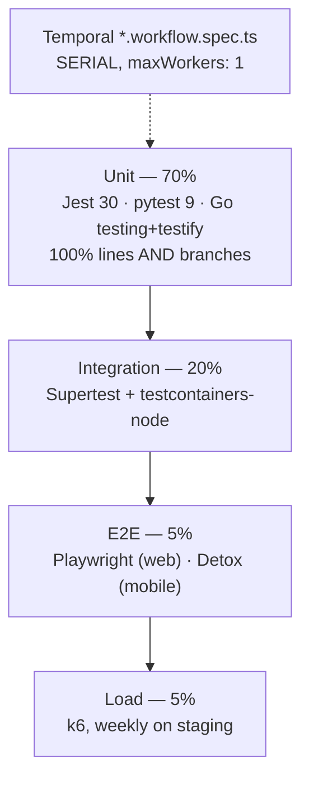

# Phase 18 — Testing

> Compiled from `context/00_master_construction_os.md` § PHASE 18 — TESTING COMMAND and the
> specification sections cited inline. `docs/specifications/` wins on any conflict; see
> [README § Authority](README.md).

---

## 1. Overview & goals

The testing strategy, and the shared machinery every other phase's tests depend on.

The coverage bar is the phase's defining constraint: **100% line coverage AND 100% branch coverage**
for all NestJS services (§30.3, QM-1). That is not a typical target, and it shapes how the rest of the
platform is written — every guard clause needs a test that reaches it, which is why so many of the
findings on other pages take the form "the code is correct and nothing calls it": a function with full
branch coverage from its unit tests looks complete whether or not production uses it.

Pyramid: 70% unit, 20% integration, 5% E2E, 5% load.

---

## 2. Scope

### In scope

- `@cos/test-utils`: testcontainers setup, database reset, entity factories
- k6 load scripts for four scenarios
- Playwright web E2E and Detox mobile E2E
- Pact consumer-driven contract tests
- The serial Temporal workflow test configuration

### Out of scope

- `jest.config.js` per package — a Phase 1 deliverable; this phase adds testcontainers and
  `@cos/test-utils` only

---

## 3. Architecture

```text
packages/@cos/test-utils/src/
  containers.ts   — shared testcontainers setup
  db-reset.ts     — truncate + reseed for integration tests
  factories.ts    — build<EntityName>Dto, factory_bot pattern
  README.md       — required by QM-11 / Rule 31

tests/e2e/        playwright.config.ts · fixtures.ts · helpers/ · specs/ (11)
tests/contract/   finance-procurement.pact.spec.ts · analytics-all-services.pact.spec.ts
tests/load/       dashboard-sla · file-upload · api-baseline · ai-report
apps/mobile/e2e/  offline-inspection · sync-conflict · benchmark · capture · helpers
backend/jest.workflows.config.js   — maxWorkers: 1
```

**Two test patterns are recorded as rules because both produced flaky failures before they were
understood**, and both are worth carrying into any new test:

- **Async fake timers (Rule 30).** Use `jest.runAllTimersAsync()`, never `jest.runAllTimers()`, for
  async functions that sleep internally. Consecutive synchronous calls do not drain the microtask
  queue between them, which hangs multi-step retries. Applies to `withRetry`, `OutboxPoller`, and any
  class using `setTimeout`/`setInterval`.
- **Temporal workflow tests run serially.** Parallel `TestWorkflowEnvironment` time-skipping servers
  starve each other. `*.workflow.spec.ts` run through `jest.workflows.config.js` with `maxWorkers: 1`
  as a separate CI gate after `test:cov`, and are excluded from both the parallel run and
  `collectCoverageFrom`. The symptom when this is violated: "Exceeded timeout for a hook" plus
  "WorkflowFailedError: Workflow execution timed out".

The exclusion is coverage-neutral — `*.workflow.ts` is already coverage-excluded, and activities are
covered by their own `*.activities.spec.ts`.

---

## 4. Data model

None. `db-reset.ts` truncates and reseeds; `factories.ts` builds DTOs with minimal required fields and
spread overrides.

Testcontainers per suite: PostgreSQL (the **`timescale/timescaledb` image**, because migrations call
`create_hypertable` — ADR-032), Redis, Kafka + Schema Registry, plus MinIO, Neo4j or ClickHouse for the
suites that need them.

One operational detail §30.4 records and that is easy to lose: point `APP_DATABASE_URL` **and**
`DIRECT_DATABASE_URL` at the container and migrate from a working directory with no `.env` — the
Prisma CLI gives `.env` precedence and will otherwise migrate the wrong database.

---

## 5. API contract

None. The contract this phase owns is between services, expressed as Pact pairs:

| Consumer  | Provider     | Contract                |
| --------- | ------------ | ----------------------- |
| Finance   | Procurement  | invoice received event  |
| Analytics | all services | event schema validation |
| Mobile    | all services | API response shape      |

---

## 6. Events

None produced. Kafka event testing runs through the testcontainers Kafka module.

---

## 7. Sequence / flows



Mandatory coverage is named per subject rather than left to the global threshold: every state-machine
transition (Phases 3, 5), every financial calculation including decimal edge cases (Phases 4, 7),
every RBAC guard (Phase 2), `HallucinationGuard` (Phase 12), `SyncManager` conflict resolution
(Phase 10), and Kafka consumer idempotency (Phase 8).

---

## 8. Failure modes & rollback

| Failure                                           | Behaviour today                                               |
| ------------------------------------------------- | ------------------------------------------------------------- |
| Workflow specs run in the parallel pool           | Flaky hook timeouts — prevented by the separate serial config |
| `jest.runAllTimers()` used on an async sleep      | Test hangs — Rule 30                                          |
| Prisma migrates the wrong DB in integration tests | Prevented by running from a cwd with no `.env`                |
| Coverage drops below 100/100                      | `ci-coverage-guard.yml` blocks the merge                      |
| A dependency has a High/Critical advisory         | `pnpm audit` + `pip-audit` + `govulncheck` block              |

**A limit worth stating plainly**, because several findings in this TDD turn on it: 100/100 coverage
proves every line and branch is _exercised_, not that it is _reached in production_. OQ-25, OQ-32,
OQ-38, OQ-40, OQ-42 and OQ-43 are all cases where fully covered code has no production caller. Coverage
is not a wiring check, and nothing in the current gate set is.

---

## 9. Security

OWASP ZAP runs in the CI pipeline against staging (`dast.yml`), alongside CodeQL (`codeql.yml`) and
Semgrep (`semgrep.yml`) — three static/dynamic analyses beyond the command's list.

Isolation tests are a distinct CI step from integration tests: a cross-tenant query must return zero
rows (§30.6).

**One historical correction is preserved in the spec itself.** §30.10 carries a ⚠️ note that an earlier
version of its tooling list "also claimed an ESLint security plugin" that was never installed. The
claim has been removed rather than quietly fixed, which is the right precedent — and the same
precedent [OQ-17](README.md#open-questions-register) and
[OQ-37](README.md#open-questions-register) follow.

---

## 10. Observability

Mutation testing (`mutation-tests.yml`) and Lighthouse (`lighthouse.yml`) run as their own workflows —
the first measures whether the 100% coverage is meaningful, the second measures web performance
budgets.

---

## 11. Testing & acceptance

Self-referential. The gates §30.12 defines run on every PR: lint, type-check, build, unit (with the
serial Temporal step), integration, isolation, contract and dependency audit. Load tests are weekly on
staging, not per-deploy (§30.9).

Two of those gates were added during this TDD work and are recorded in §30.12: the migration-rollback
pairing check and the Keycloak MFA realm check.

---

## 12. Implementation status

Verified on **2026-08-22** against this working tree (Rule 36 — commands run, output summarised).

| Generate item                                 | Status              | Evidence                                                    |
| --------------------------------------------- | ------------------- | ----------------------------------------------------------- |
| Coverage thresholds 100% lines + branches     | ✅ present          | `backend/jest.config.js` — `lines: 100, branches: 100`      |
| pytest config for Python services             | ✅ present          | per AI service                                              |
| `@cos/test-utils` testcontainers setup        | ✅ present          | `containers.ts`                                             |
| `@cos/test-utils/README.md` (QM-11, Rule 31)  | ✅ present          | —                                                           |
| Test data factories                           | ✅ present          | `factories.ts` — `build<EntityName>Dto`                     |
| Database reset utility                        | ✅ present          | `db-reset.ts`                                               |
| k6 scripts — all 4 scenarios                  | ✅ present          | `dashboard-sla`, `file-upload`, `api-baseline`, `ai-report` |
| Playwright E2E — 10 scenarios                 | ✅ present          | 11 specs incl. `a11y.spec.ts` beyond the list               |
| Detox E2E — offline inspection, sync conflict | ✅ present          | `offline-inspection.spec.ts`, `sync-conflict.spec.ts`       |
| Detox offline check-in scenario               | ✅ correctly absent | retired 2026-08-21 with self check-in                       |
| Pact — Finance ← Procurement                  | ✅ present          | `tests/contract/finance-procurement.pact.spec.ts`           |
| Pact — Analytics ← all services               | ✅ present          | `tests/contract/analytics-all-services.pact.spec.ts`        |
| Serial Temporal workflow gate                 | ✅ present          | `jest.workflows.config.js` + `pnpm test:workflows`          |
| GitHub Actions integration of all gates       | ✅ present          | `ci.yml` + 7 more workflows                                 |
| `docs/api/deprecation-schedule.md`            | ✅ present          | 90-day minimum notice per §14.4                             |

Every Generate item is present.

---

## 13. Dependencies & risks

**Dependencies:** Phase 1 (jest configs, coverage setup), Phase 17 (the CI pipeline these gates run
in), and every phase that has tests.

---

## 14. Open questions / NOT SPECIFIED

None new. One cross-cutting observation belongs here rather than as a question, because it is a
property of the gate set rather than a defect in it: **no CI gate checks that a built component is
wired into a running process.** Six of this TDD's open questions are instances of that —
[OQ-25](README.md#open-questions-register), [OQ-32](README.md#open-questions-register),
[OQ-38](README.md#open-questions-register), [OQ-40](README.md#open-questions-register),
[OQ-42](README.md#open-questions-register) and [OQ-43](README.md#open-questions-register). If the
product owner wants that class caught automatically, this is the phase where such a gate would live.
