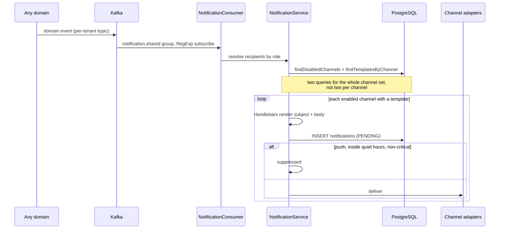

# Phase 20 — Notification Service

> Compiled from `context/00_master_construction_os.md` § PHASE 20 — NOTIFICATION SERVICE COMMAND and
> the specification sections cited inline. `docs/specifications/` wins on any conflict; see
> [README § Authority](README.md).

---

## 1. Overview & goals

Centralised multi-channel delivery (`00_master` § Phase Register: objective "notification/SSE
service", deps `Ph2, Ph3`, risk `R-09`).

The rule that shapes everything: **no service sends notifications directly.** Every domain emits an
event; this module consumes and delivers. That is why it is the only backend module that subscribes to
events from every other domain, and why its failure surface is different from theirs — a broken
notification does not corrupt data, it just means nobody was told.

Exit condition: "notification delivery + safety-alert path verified; excluded from maintenance
windows" (`00_master` § Phase Register, Phase 20 exit). The exclusion is deliberate: a maintenance
window that silences safety alerts defeats the point of having them.

---

## 2. Scope

### In scope

- Four delivery channels: in-app SSE, Expo push, SendGrid email, LINE
- Template rendering, per-user per-channel preferences, quiet hours
- Scheduled digests and unacknowledged-notification escalation
- One Kafka consumer group over every domain's events

### Out of scope

- **SMS** — deleted from the channel set; the enum value survives with no adapter
- AWS SES — the SendGrid successor, due before Stage 2 go-live (§19.7)
- WebSocket — explicitly prohibited for notifications; SSE is unidirectional and that is the point

---

## 3. Architecture

The module directory is `modules/notification` (singular), while the database schema is
`notifications` (plural) — a small trap when grepping.

```text
modules/notification/
  notification.{controller,service,repository,module}.ts
  notification.consumer.ts            — one consumer group, RegExp over per-tenant topics
  notification.sse.service.ts         — @Sse stream per authenticated session
  notification.digest.service.ts      — @Cron, tenant-local scheduling
  notification.escalation.service.ts  — 5-minute sweep for unacknowledged notifications
  notification-prisma.service.ts
  adapters/  expo-push · sendgrid · line-messaging
```

**Channel choices are constrained, not preferences.** Expo rather than direct FCM, because direct FCM
misses every iOS user. SSE rather than WebSocket, because §19.2 prohibits WebSocket here. Both are
recorded in the command as corrections of an obvious-looking wrong answer.

---

## 4. Data model

Four tables in the `notifications` schema.

| Table                        | Note                                                                                 |
| ---------------------------- | ------------------------------------------------------------------------------------ |
| `notification_templates`     | `tenant_id` **nullable** — NULL means a system template; Handlebars body             |
| `notifications`              | `INDEX (tenant_id, recipient_id, status)`; `escalated_at` added by `20260723000003`  |
| `notification_preferences`   | `UNIQUE (user_id, event_type, channel)`; `quiet_hours_start/end` default 22:00–07:00 |
| `notification_device_tokens` | beyond the command — Expo push tokens per device                                     |

The `channel` enum carries `SMS` in all three tables with no adapter behind it. `20260723000003`
added `PUSH` to the same enum, which is why its rollback is the one migration that needs a guard
before dropping a value (see `backend/prisma/rollbacks/20260723000003_notification_delivery_rules.rollback.sql`).

---

## 5. API contract

| Endpoint                           | Specified                         | Built |
| ---------------------------------- | --------------------------------- | ----- |
| `GET /notifications`               | ✅                                | ✅    |
| `PATCH /notifications/:id/read`    | ✅                                | ✅    |
| `PATCH /notifications/read-all`    | ✅                                | ✅    |
| `GET /notifications/preferences`   | ✅                                | ✅    |
| `PATCH /notifications/preferences` | ✅                                | ✅    |
| `POST /notifications/device-token` | —                                 | ✅    |
| `@Sse /notifications/stream`       | ✅ (as a requirement, not a path) | ✅    |

---

## 6. Events

Consumed under the group `notification.shared` — the `{service}.shared` shared-cluster naming §7.3
requires — subscribing to per-tenant topics by RegExp with the `tenant_id` header validated by
`KafkaConsumer`.

All six triggers the command names are consumed:

| Trigger                            | Notifies                           |
| ---------------------------------- | ---------------------------------- |
| `site.inspection.failed.v1`        | `SITE_ENGINEER`, `PROJECT_MANAGER` |
| `site.issue.created.v1` (CRITICAL) | `SITE_ENGINEER`, `PROJECT_MANAGER` |
| `procurement.po.status_changed.v1` | `PROCUREMENT_OFFICER`              |
| `finance.variance.alert.v1`        | `FINANCE`, `TENANT_ADMIN`          |
| `site.report.created.v1`           | `PROJECT_MANAGER`                  |
| `procurement.invoice.received.v1`  | `FINANCE`                          |

Plus nine the command does not list, each traceable to the phase that emits it:
`safety.incident.created.v1`, `site.conflict.flagged.v1` (Phase 6),
`site.issue.escalated.v1`, `procurement.po.approval_requested.v1` (Phase 5),
`file.document.quarantined.v1` (Phase 9), `ai.risk_prediction.generated.v1` (Phase 11/12),
`platform.enterprise.contract_signed.v1` and `platform.enterprise.db_provisioned.v1` (Phase 25, §19.8),
and `notification.escalated.v1` — which this module both emits and consumes.

---

## 7. Sequence / flows



Two scheduled paths run alongside:

- **Digest** — a single hourly `@Cron` fans out per tenant and fires only those whose _local_
  wall-clock matches: daily site summary 18:00 to PMs; weekly project cost and procurement summaries
  Monday 08:00. A lease in `platform.scheduled_job_locks` (1800 s) keeps one replica from
  double-sending.
- **Escalation** — every 5 minutes, cross-tenant. A notification still unread past its timeout
  escalates once, marked by `escalated_at`. The matrix matches §19.3 exactly: safety incident 30 min →
  `PROJECT_MANAGER`; budget alert 2 h → `EXECUTIVE`; AI risk prediction 24 h → `PROJECT_MANAGER`.

---

## 8. Failure modes & rollback

| Failure                                            | Behaviour today                                              |
| -------------------------------------------------- | ------------------------------------------------------------ |
| No template for an event/channel pair              | That channel is skipped silently (`if (!template) continue`) |
| Preference row absent                              | Treated as enabled — `?? true`                               |
| Two replicas reach a digest window                 | Lease in `platform.scheduled_job_locks` admits one           |
| Notification already escalated                     | `escalated_at` marker makes escalation exactly-once          |
| Push inside quiet hours                            | Suppressed, unless the event is in `CRITICAL_EVENT_TYPES`    |
| **A user disables a critical safety notification** | **It is not delivered** — § 14 OQ-34                         |

**Silent template skipping is worth flagging even though it is not a defect.** If a tenant has no
`EMAIL` template for `safety.incident.created.v1`, that channel produces nothing and logs nothing at
the skip site. Combined with per-tenant templates being optional, the absence of a notification and
the absence of a template look identical from the outside.

**Rollback:** all four notification migrations have paired rollbacks. `20260723000003` is the
guarded one — it added `PUSH` to a Postgres enum, and its rollback aborts with a row count rather
than dropping a value still in use.

---

## 9. Security

Notifications are tenant-scoped and recipient-scoped; the SSE stream is per authenticated session, so
a subscriber receives only their own.

The consumer validates the `tenant_id` header on every message rather than trusting the topic name —
necessary because a RegExp subscription matches topics by pattern.

Notification bodies are Handlebars-rendered from event payloads. Those payloads carry user-entered
text (issue titles, report summaries), so the rendering path is the boundary where domain content
reaches email and push. Handlebars escapes by default in `{{ }}` expressions.

---

## 10. Observability

§19.9 defines this phase's observability requirements. The scheduled paths carry the most operational
risk and the least visibility: a digest that stops firing, or an escalation sweep that stops running,
produces no error — only an absence.

---

## 11. Testing & acceptance

9 spec files, covering adapters, service, repository and consumer routing.

The command asks for unit tests on template rendering, consumer routing and preference filtering, and
integration tests end-to-end from event to delivery.

Acceptance: "notification delivery + safety-alert path verified; excluded from maintenance windows."

---

## 12. Implementation status

Verified on **2026-08-22** against this working tree (Rule 36 — commands run, output summarised).

| Generate item                              | Status        | Evidence                                                                    |
| ------------------------------------------ | ------------- | --------------------------------------------------------------------------- |
| Kafka consumer group `notification.shared` | ✅ present    | `groupId: 'notification.shared'`; RegExp subscribe; tenant header validated |
| Template rendering (Handlebars)            | ✅ present    | `handlebars ^4.7.0`; `render()` in the service                              |
| SSE endpoint per session                   | ✅ present    | `@Sse('notifications/stream')` + `notification.sse.service.ts`              |
| Expo Push via `expo-server-sdk`            | ✅ present    | `expo-server-sdk ^3.3.0`; `adapters/expo-push.adapter.ts`                   |
| SendGrid email adapter                     | ✅ present    | `@sendgrid/mail ^8.1.0`; `adapters/sendgrid.adapter.ts`                     |
| LINE Messaging adapter                     | ✅ present    | `@line/bot-sdk ^9.4.0`; `adapters/line-messaging.adapter.ts`                |
| SMS **not** included                       | ✅ correct    | no adapter; enum value only                                                 |
| PostgreSQL migrations                      | ✅ present    | 4 migrations; 4 tables                                                      |
| OpenAPI 3.1                                | ✅ present    | controller decorators                                                       |
| Unit tests                                 | ✅ present    | 9 spec files                                                                |
| Quiet hours (§19.6)                        | ✅ present    | overnight-wrap handled; evaluated in tenant timezone                        |
| Digests (§19.3)                            | ✅ present    | 18:00 daily + Monday 08:00 weekly, tenant-local, leased                     |
| Escalation timeouts (§19.3)                | ✅ present    | 30 min / 2 h / 24 h — exact spec values                                     |
| Critical safety cannot be **quieted**      | ✅ present    | `CRITICAL_EVENT_TYPES` bypasses the quiet window                            |
| Critical safety cannot be **disabled**     | ❌ **absent** | no exemption in the preference filter — § 14 OQ-34                          |

---

## 13. Dependencies & risks

**Dependencies:** `Ph2, Ph3` per the register — but in practice this module consumes events from
Phases 5, 6, 7, 9, 11 and 25, so every one of those is an upstream producer.

**Risks:** `R-09` — `00_master` § Risk Register.

---

## 14. Open questions / NOT SPECIFIED

| #     | Question                                                                                                                                                                                                                                                                                                                                                                                                                                                                                                                                                                                                                                                                                                          | Status                 |
| ----- | ----------------------------------------------------------------------------------------------------------------------------------------------------------------------------------------------------------------------------------------------------------------------------------------------------------------------------------------------------------------------------------------------------------------------------------------------------------------------------------------------------------------------------------------------------------------------------------------------------------------------------------------------------------------------------------------------------------------- | ---------------------- |
| OQ-34 | **A critical safety notification can be switched off, which §19.6 says it cannot.** §19.6: "Critical safety notifications (SafetyIncidentReported, SafetyViolationDetected) **cannot be disabled**." The implementation applies its critical-event exemption only to quiet hours; the delivery path's preference filter is an unconditional `if (disabledChannels.has(channel)) continue`, and `updatePreferences` accepts any `event_type` with `is_enabled: false`. **Failure scenario:** a user turns off `safety.incident.created.v1` on every channel and stops receiving safety incidents entirely — through a supported API call, with no warning. The exemption belongs in the same place for both rules. | Open — safety-relevant |
| OQ-35 | **`SafetyViolationDetected` is named in two specifications and exists nowhere else.** §19.6 lists it as one of the two critical safety notifications, and `16-enterprise-event-flow` §16 lists it under Safety events. It has no canonical name in `32-implementation-specifications` §32.4's event catalogue, no producer, and no consumer. Either it is a real event that was never built, or the two spec references should be removed — and until that is settled, "critical safety notifications" is a set of unknown size.                                                                                                                                                                                  | Open — `UNSPECIFIED`   |
