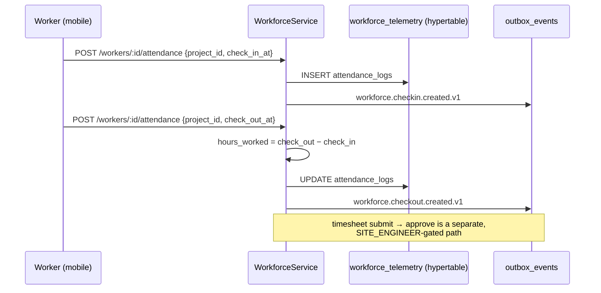

# Phase 22 — Workforce Service

> Compiled from `context/00_master_construction_os.md` § PHASE 22 — WORKFORCE SERVICE COMMAND and the
> specification sections cited inline. `docs/specifications/` wins on any conflict; see
> [README § Authority](README.md).

---

## 1. Overview & goals

Workers, their allocation to projects, their attendance and their timesheets
(`00_master` § Phase Register: objective "workforce domain", deps `Ph2, Ph3`, risk `R-02`).

Structurally the twin of Phase 21: a small relational register plus time-series data in TimescaleDB.
Where equipment records utilisation, workforce records attendance and timesheets — **two** hypertables,
partitioned on different grains (attendance daily by `recorded_at`, timesheets monthly by
`period_date`).

Exit condition: "workforce APIs pass the isolation-test suite"
(`00_master` § Phase Register, Phase 22 exit).

---

## 2. Scope

### In scope

- Worker register and project allocation with daily rate
- Attendance check-in / check-out into a hypertable
- Timesheets with a `DRAFT → SUBMITTED → APPROVED` status
- Manpower summary for analytics
- Three Kafka events

### Out of scope

- Biometric / QR check-in — the command says "deferred — do not implement until spec defines it".
  It is correctly unimplemented; see § 14 OQ-37 for what the module README claims instead.
- Payroll — nothing in this phase computes pay from `daily_rate` and hours

---

## 3. Architecture

```text
modules/workforce/
  workforce.{controller,service,repository,module}.ts
  dto/  create-worker · allocate-worker · attendance · timesheet
```

Three controllers on one module — `workers`, `projects/:projectId/workforce`, and `timesheets` —
because the three resources are addressed at different scopes rather than nested under one another.

---

## 4. Data model

| Table               | Schema                | Note                                                                                              |
| ------------------- | --------------------- | ------------------------------------------------------------------------------------------------- |
| `workers`           | `workforce`           | `UNIQUE (tenant_id, employee_code)`; `employment_type ENUM('PERMANENT','CONTRACT','SUBCONTRACT')` |
| `project_workforce` | `workforce`           | `daily_rate DECIMAL(19,4)` + `currency_code`                                                      |
| `attendance_logs`   | `workforce_telemetry` | hypertable on `recorded_at`; indexes by worker and by project                                     |
| `timesheets`        | `workforce_telemetry` | hypertable on `period_date`, **1-month chunks**; `UNIQUE (worker_id, project_id, period_date)`    |

The timesheet hypertable is the more interesting of the two: it partitions on a `DATE` rather than a
`TIMESTAMPTZ`, at monthly granularity, and carries a unique index across worker, project and period —
so a worker cannot hold two timesheets for the same project in the same period, which is what makes
approval idempotent.

`hours_worked DECIMAL(5,2)` on attendance and `regular_hours` / `overtime_hours DECIMAL(6,2)` on
timesheets are the phase's only numeric precision decisions; neither is money, so neither goes through
`@cos/financial`.

---

## 5. API contract

All ten endpoints in the command exist, plus two.

| Endpoint                                       | Specified | Built |
| ---------------------------------------------- | --------- | ----- |
| `POST /workers`                                | ✅        | ✅    |
| `GET /workers`                                 | ✅        | ✅    |
| `GET /workers/:id`                             | ✅        | ✅    |
| `POST /projects/:projectId/workforce`          | ✅        | ✅    |
| `GET /projects/:projectId/workforce`           | ✅        | ✅    |
| `POST /workers/:id/attendance`                 | ✅        | ✅    |
| `GET /workers/:id/attendance`                  | ✅        | ✅    |
| `POST /timesheets`                             | ✅        | ✅    |
| `PATCH /timesheets/:id/approve`                | ✅        | ✅    |
| `GET /projects/:projectId/workforce/summary`   | ✅        | ✅    |
| `GET /workers/me`                              | —         | ✅    |
| `GET /projects/:projectId/workforce/directory` | —         | ✅    |

Both extras are documented outside the phase command: the directory route is in
`docs/api/workforce.openapi.yaml` and is the source behind a screen described in
`docs/screens/android/README.md`.

`GET /workers/me` is declared before `@Get(':id')` so the literal segment is not captured as a UUID —
the same ordering care Phase 3 takes.

---

## 6. Events

| Event type                        | Built |
| --------------------------------- | ----- |
| `workforce.checkin.created.v1`    | ✅    |
| `workforce.checkout.created.v1`   | ✅    |
| `workforce.timesheet.approved.v1` | ✅    |

All three specified events are emitted. **The check-in payload does not match `32-implementation-
specifications` §32.4** — see § 14 OQ-36.

Check-in and check-out are distinguished by the shape of the request rather than by separate
endpoints: `POST /workers/:id/attendance` emits `checkin.created` when `check_in_at` is present
without `check_out_at`, and `checkout.created` otherwise.

---

## 7. Sequence / flows



---

## 8. Failure modes & rollback

| Failure                                      | Behaviour today                                                                       |
| -------------------------------------------- | ------------------------------------------------------------------------------------- |
| Duplicate `employee_code` within a tenant    | Rejected by `UNIQUE (tenant_id, employee_code)`                                       |
| Two timesheets for one worker/project/period | Rejected by `idx_timesheet_worker_period`                                             |
| Check-out with no prior check-in             | `hours_worked` cannot be derived — handled in the service                             |
| Attendance replayed from an offline queue    | `/sync/push` case `attendance` exists (Phase 6/10) and is idempotent on the client id |
| Outbox insert lost                           | durable, not atomic — [OQ-18](README.md#open-questions-register)                      |

Attendance is one of the offline-writable entity types — `sync.service.ts` carries a `case
'attendance'` — so this phase inherits Phase 6's conflict-resolution and replay guarantees rather than
defining its own.

**Rollback:** `20260608000006_workforce_service` has a paired rollback, enforced by
`scripts/ci/check-migration-rollbacks.mjs`.

---

## 9. Security

Tenant isolation via RLS on both schemas, with the `workforce_telemetry` grant to `app_user` matching
the pattern Phase 21 uses for its hypertable —
[README § Tenant isolation](README.md#tenant-isolation).

Timesheet approval is role-gated to `SITE_ENGINEER` per the command.

**Worker records are PII.** `full_name` and `contact_phone` sit in `workforce.workers`, so §11.4's
`pii_erased_at` obligation applies to this table as it does to `platform.users` — see
[README § Record lifecycle](README.md#record-lifecycle--soft-delete-and-pii-erasure) and
[OQ-15](README.md#open-questions-register), which is about exactly that rule's uneven application.

---

## 10. Observability

Two hypertables with different chunk intervals means two different growth profiles to watch. Nothing
phase-specific is defined in `infrastructure/monitoring/`.

---

## 11. Testing & acceptance

3 spec files. The command asks for unit tests on attendance calculation and timesheet aggregation, and
integration tests over the check-in/out cycle.

Acceptance is the Phase Register exit: "workforce APIs pass the isolation-test suite."

---

## 12. Implementation status

Verified on **2026-08-22** against this working tree (Rule 36 — commands run, output summarised).

| Generate item                                     | Status                        | Evidence                                                            |
| ------------------------------------------------- | ----------------------------- | ------------------------------------------------------------------- |
| NestJS module / service / repository / controller | ✅ present                    | `workforce.{module,service,repository,controller}.ts`               |
| TimescaleDB hypertables — attendance, timesheets  | ✅ present                    | two `create_hypertable` calls in `20260608000006_workforce_service` |
| Biometric check-in **not** implemented            | ✅ correct                    | no implementation — as the command requires                         |
| OpenAPI 3.1                                       | ✅ present                    | `docs/api/workforce.openapi.yaml` + decorators                      |
| Unit tests — attendance, timesheet aggregation    | ✅ present                    | 3 spec files                                                        |
| `workforce.checkin.created.v1`                    | ⚠️ **payload short of §32.4** | emitted with 3 of the 6 specified fields — OQ-36                    |
| `workforce.checkout.created.v1`                   | ✅ present                    | `{ worker_id, project_id, hours_worked }` — matches the command     |
| `workforce.timesheet.approved.v1`                 | ✅ present                    | —                                                                   |

---

## 13. Dependencies & risks

**Dependencies:** `Ph2, Ph3`. TimescaleDB is a runtime prerequisite, already in the Phase 1 stack.

**Risks:** `R-02` — `00_master` § Risk Register.

---

## 14. Open questions / NOT SPECIFIED

| #     | Question                                                                                                                                                                                                                                                                                                                                                                                                                                                                                                                                                                                                                                                                                                                                                                      | Status                     |
| ----- | ----------------------------------------------------------------------------------------------------------------------------------------------------------------------------------------------------------------------------------------------------------------------------------------------------------------------------------------------------------------------------------------------------------------------------------------------------------------------------------------------------------------------------------------------------------------------------------------------------------------------------------------------------------------------------------------------------------------------------------------------------------------------------- | -------------------------- |
| OQ-36 | **`workforce.checkin.created.v1` carries half the payload §32.4 specifies, and misnames a field.** §32.4 row 9 defines `checkin_id`, `worker_id`, `project_id`, `checkin_at`, `method` (enum QR_CODE/GPS/BIOMETRIC/MANUAL) and nullable `location {lat,lng}`. The service emits `{ worker_id, project_id, checked_in_at }` — no `checkin_id`, no `method`, no `location`, and `checked_in_at` rather than `checkin_at`. The Phase 22 command's own payload line matches the code, so the two authorities disagree and §32.4 is the one that wins within `docs/specifications/`. `RecordAttendanceDto` has no `method` or `location` field either, so the API cannot capture them even if the event were widened. Consumers written against §32.4 will find the fields absent. | Open — needs a PO decision |
| OQ-37 | **The module README advertises a `BiometricCheckIn` stub that does not exist.** `backend/src/modules/workforce/README.md` says "Biometric / QR check-in available via EP-DOMAIN-008" and lists "EP-DOMAIN-008 `BiometricCheckIn` stub" among the module's extension points. `EP-DOMAIN-008` appears nowhere else in the repository — no stub file, no interface, no other reference. Not implementing it is correct (the command defers it); the README claiming otherwise is the drift, and it is the kind of claim that has twice been mistaken for a built control on this project.                                                                                                                                                                                        | Open — documentation drift |
