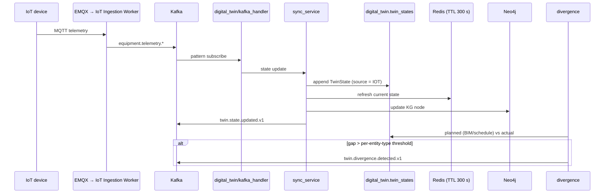

# Phase 24 — Digital Twin

> Compiled from `context/00_master_construction_os.md` § PHASE 24 — DIGITAL TWIN COMMAND and the
> specification sections cited inline. `docs/specifications/` wins on any conflict; see
> [README § Authority](README.md).

---

## 1. Overview & goals

The command opens by ruling out the obvious reading, and the whole phase follows from it:

> A digital twin in construction context is **NOT a 3D visualization tool** — it is a real-time data
> synchronization layer.

What it synchronises is three things that normally live apart: the **physical site** (IoT sensors,
GPS, inspections), the **digital model** (BIM geometry, WBS, schedule), and **operational
intelligence** (KG relationships, ML predictions). Its output is not a picture; it is a divergence
score — how far actual has drifted from planned, and with what confidence.

Prerequisites are unusually strict: Phase 13, Phase 21, Phase 23, plus BIM and IoT integrations that
are still extension-point stubs.

---

## 2. Scope

### In scope

- `twin_entities` and `twin_states` in TimescaleDB
- State synchronisation from IoT telemetry, divergence detection, AI-inferred state
- Twin query API on `ai-gateway`
- Carbon analytics in `analytics-worker` (§33.3 service assignment)

### Out of scope — by constraint

- **Any write path.** "Digital Twin is READ-OPTIMIZED — do not use as write-path for operational
  data." All writes originate in source systems and arrive via Kafka.
- Transactional guarantees — twin state is eventually consistent by design
- Blocking Phases 15–19: "Phase 24 MUST NOT block Phase 15–19 (deploy as post-production layer)"

---

## 3. Architecture

The twin lives **inside `ai-gateway`**, not as its own service — because inference (Phase 23 models
filling gaps in IoT coverage) is a first-class part of its state, and the command specifies "FastAPI —
ai-gateway service, Python for ML integration".

```text
services/ai-gateway/digital_twin/
  models.py         — TwinEntity · TwinState · TwinSnapshot · Divergence
  sync_service.py   — write path from Kafka; Redis cache on the read path
  divergence.py     — planned vs actual, per-entity-type thresholds
  kafka_handler.py  — equipment.telemetry.* consumer; twin.* producer
  router.py         — /api/v1/twin
  tests/            — 6 test modules

services/analytics-worker/internal/carbon/  — carbon.record.created.v1 → ClickHouse
```

Storage is co-located deliberately: TimescaleDB **on the primary PostgreSQL instance** through Stages
1–3, split to a dedicated instance only on a volume trigger (ADR-032) — the same instance Phases 21
and 22 use. Neo4j is the same instance as Phase 13. Nothing new is provisioned for this phase.

---

## 4. Data model

| Table                        | Note                                                                                                                                 |
| ---------------------------- | ------------------------------------------------------------------------------------------------------------------------------------ |
| `digital_twin.twin_entities` | `entityType ENUM(STRUCTURE, EQUIPMENT, MATERIAL_STOCK, WORKFORCE_ZONE, INSPECTION_ZONE)`; `physicalRef` + `digitalRef`; `confidence` |
| `digital_twin.twin_states`   | **hypertable** — `attributes` per timestamp, `source ENUM(IOT, MANUAL, AI_INFERRED)`                                                 |

`analytics.carbon_records` (`20260718000001_carbon_analytics`) uses `ReplacingMergeTree`, the one
exception to Phase 14's `AggregatingMergeTree` rule.

**`source` is the field that makes the model honest.** A twin state is tagged `IOT`, `MANUAL` or
`AI_INFERRED`, so a consumer can always tell whether it is reading a measurement or a guess — and the
command makes the corollary mandatory: "Confidence score mandatory on every inferred state."

---

## 5. API contract

`/api/v1/twin` on `ai-gateway`, serving the three operations the command names:

| Operation                                        | Returns                                                           |
| ------------------------------------------------ | ----------------------------------------------------------------- |
| `getTwinState(projectId, entityType, timestamp)` | `TwinSnapshot` — entities, `overallConfidence`, `divergenceScore` |
| `getDivergenceReport(projectId)`                 | `DivergenceReport` — divergences, `riskLevel`                     |
| `subscribeToStateChanges(projectId)`             | `AsyncIterable<TwinStateEvent>`                                   |

---

## 6. Events

| Direction | Event                                           |
| --------- | ----------------------------------------------- |
| consumed  | `equipment.telemetry.*` (pattern subscription)  |
| produced  | `twin.state.updated.v1`                         |
| produced  | `twin.divergence.detected.v1`                   |
| consumed  | `carbon.record.created.v1` → `analytics-worker` |

Consumers of `twin.state.updated` are the AI Gateway itself and Analytics.

---

## 7. Sequence / flows



Synchronisation frequency is split: **real-time for critical assets, 15-minute batch for others** —
the same freshness budget Phase 14's dashboards use.

Where IoT coverage is incomplete, Phase 23's `DelayForecastModel` fills the gap, and that state is
written with `source = AI_INFERRED` plus a confidence score rather than being blended into measured
data.

---

## 8. Failure modes & rollback

| Failure                                      | Behaviour today                                                     |
| -------------------------------------------- | ------------------------------------------------------------------- |
| Telemetry stops for an entity                | State goes stale; `lastSyncedAt` is the detectable signal           |
| IoT coverage is incomplete                   | ML inference fills in, tagged `AI_INFERRED` with confidence         |
| Someone writes operational data via the twin | Prohibited by constraint — there is no write path to source systems |
| Redis cache is cold                          | Read falls through to the hypertable                                |
| Twin read during lag                         | Eventually consistent by design — not transactional                 |
| **No IoT fleet is onboarded**                | The consumer has nothing to consume — see § 13                      |

**Rollback:** `20260608000007_digital_twin` and `20260718000001_carbon_analytics` both have paired
rollbacks, enforced by `scripts/ci/check-migration-rollbacks.mjs`.

---

## 9. Security

Tenant isolation follows the hypertable pattern Phases 21 and 22 established — `tenant_id` on
`TwinEntity`, RLS on the `digital_twin` schema, `app_user` connection.

The twin is **read-only with respect to operational data**, which is a security property as much as an
architectural one: a compromised twin cannot alter a purchase order, a schedule or an inspection
result. It can only misreport.

`source` and `confidence` are the integrity controls on the read side. An `AI_INFERRED` state
presented as measured would be the failure mode that matters here, and the model prevents it
structurally by making the distinction a column rather than a convention.

---

## 10. Observability

`divergenceScore` and `overallConfidence` are the phase's own health metrics — a twin whose confidence
is falling is one whose IoT coverage is degrading.

The operational gap: nothing distinguishes "no divergence" from "no data", because both produce an
empty `DivergenceReport`. `lastSyncedAt` is the field that separates them and nothing alerts on it.

---

## 11. Testing & acceptance

6 test modules under `digital_twin/tests/`: divergence, kafka handler, router, state read path, sync
service integration, and a full twin integration test — matching the command's request for unit tests
on divergence calculation and state merge, plus end-to-end IoT event → twin state → divergence alert.

---

## 12. Implementation status

Verified on **2026-08-22** against this working tree (Rule 36 — commands run, output summarised).

| Generate item                                  | Status     | Evidence                                                          |
| ---------------------------------------------- | ---------- | ----------------------------------------------------------------- |
| `TwinEntity` / `TwinState` schema + hypertable | ✅ present | `digital_twin.twin_entities`, `twin_states` + `create_hypertable` |
| State synchronisation service                  | ✅ present | `sync_service.py` — hypertable + Redis + Neo4j                    |
| Divergence detection engine                    | ✅ present | `divergence.py` — per-entity-type thresholds, LOW/MEDIUM/HIGH     |
| Twin query API (FastAPI on ai-gateway)         | ✅ present | `router.py` → `/api/v1/twin`                                      |
| Kafka consumer `equipment.telemetry.*`         | ✅ present | `kafka_handler.py` — pattern subscription                         |
| Producer `twin.state.updated`                  | ✅ present | `twin.state.updated.v1`                                           |
| Producer `twin.divergence.detected`            | ✅ present | `twin.divergence.detected.v1`                                     |
| Redis cache TTL 5 min                          | ✅ present | `_REDIS_TTL_SECS = 300`                                           |
| Confidence on inferred state                   | ✅ present | `models.py` — `confidence` on `TwinEntity` and `TwinSnapshot`     |
| Unit + integration tests                       | ✅ present | 6 test modules                                                    |
| Carbon analytics in `analytics-worker`         | ✅ present | `internal/carbon/consumer.go` + test                              |
| OpenAPI 3.1 for twin endpoints                 | ✅ present | FastAPI-generated on `ai-gateway`                                 |

Every Generate item is present.

---

## 13. Dependencies & risks

**Prerequisites, and their real status** — this is the phase's most important caveat:

| Prerequisite               | Status                                                                                                    |
| -------------------------- | --------------------------------------------------------------------------------------------------------- |
| Phase 13 — Knowledge Graph | ✅ built                                                                                                  |
| Phase 21 — Equipment       | ✅ built; **IoT telemetry itself is a stub** — EMQX and the ingestion worker exist, no fleet is onboarded |
| Phase 23 — MLOps           | ✅ pipeline built; **no model is trained** — every threshold is unmet                                     |
| BIM Integration (IFC.js)   | ⚠️ **stub** — `ep/bim-integration.stub.ts` (Phase 3), `ep/bim-boq-import.stub.ts` (Phase 4)               |
| IoT Integration            | ⚠️ **stub** — `iot-integration.stub.ts` (Phase 21)                                                        |

So the twin's machinery is complete and its **three inputs are not yet flowing**: no BIM geometry to
compare against, no live telemetry to compare with, and no trained model to infer from. That is
consistent with the command — every one of those is trigger-gated on a business condition — but it
means "Phase 24 is built" and "the digital twin is producing meaningful divergence scores" are
different statements, and only the first is true today.

**Risks:** `R-03` — `00_master` § Risk Register.

---

## 14. Open questions / NOT SPECIFIED

None new. The prerequisite status in § 13 is a consequence of trigger-gated extension points working
as designed, not a gap — but it is the fact a reader most needs before treating a divergence report as
evidence.
