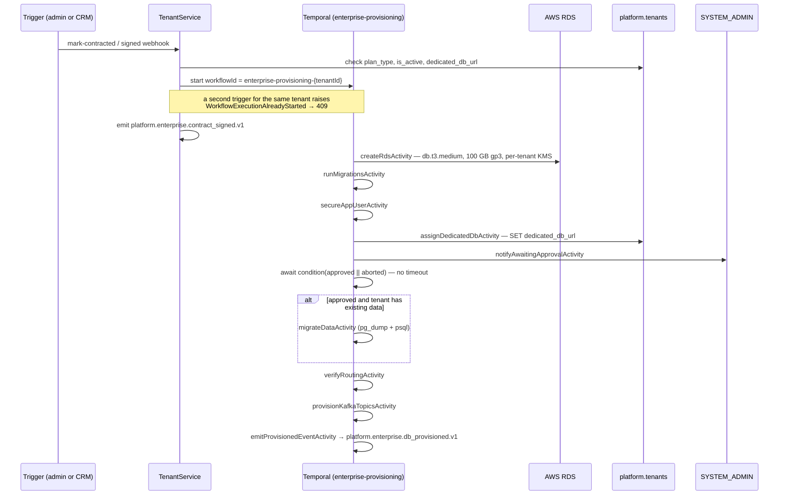

# Phase 25 — Enterprise Provisioning

> Compiled from `context/00_master_construction_os.md` § PHASE 25 — ENTERPRISE PROVISIONING COMMAND
> and the specification sections cited inline. `docs/specifications/` wins on any conflict; see
> [README § Authority](README.md).

---

## 1. Overview & goals

Automated end-to-end provisioning of a **dedicated database** for an Enterprise tenant, triggered by
contract signature (`00_master` § Phase Register: objective "enterprise tenant provisioning", deps
`Ph2, Ph3, Ph20`, risks `R-02, R-08`).

Every other phase writes into the shared database behind RLS. This one is the escape hatch from that
model: an Enterprise tenant gets its own RDS instance, its own KMS key, and a `dedicated_db_url` that
routes its domain traffic away from the shared cluster — while `platform.*` tables **stay shared,
always**. That constraint is what keeps identity, tenancy and audit in one place no matter how many
dedicated databases exist.

It is also the only phase with a **human gate**: a Temporal workflow that stops and waits
indefinitely for a `SYSTEM_ADMIN` to approve or abort before it moves live data.

Exit condition: "dedicated-DB provisioning + SSO/SAML (Keycloak); INT-004 interop conformance"
(`00_master` § Phase Register, Phase 25 exit).

---

## 2. Scope

### In scope

- Two trigger paths — admin action and CRM webhook — converging on one workflow
- `EnterpriseProvisioningWorkflow` with activities, compensation and a human gate
- HMAC-SHA256 webhook authentication
- Terraform module for the per-tenant RDS instance
- Two platform-level events

### Out of scope

- CRM-specific adapters — the webhook takes a generic payload only, by constraint
- Moving `platform.*` data — forbidden outright
- Automatic rollback of a data migration — explicitly a manual `SYSTEM_ADMIN` coordination

---

## 3. Architecture

```text
modules/tenant/
  tenant.controller.ts  @Controller('admin/tenants') → PATCH :tenantId/mark-contracted
  tenant.service.ts     starts the workflow, emits contract_signed
  workflows/
    enterprise-provisioning.workflow.ts     — orchestration + human gate
    enterprise-provisioning.activities.ts   — 11 activities incl. compensation
    enterprise-provisioning.worker.ts       — task queue "enterprise-provisioning"

modules/platform-webhook/
  platform-webhook.{controller,service,module}.ts   @Controller('platform/webhooks')

packages/@cos/shared/src/
  events/platform.enterprise.{contract_signed,db_provisioned}.v1.ts
  avro/platform.enterprise.{contract_signed,db_provisioned}.v1.avsc

infrastructure/terraform/modules/rds-tenant/  main.tf · variables.tf · outputs.tf · README.md
```

Both trigger paths reach the same `startEnterpriseProvisioning` in `TenantService`, so the workflow
has one entry point regardless of who pulled the trigger.

---

## 4. Data model

This phase adds no tables. It writes one column — `platform.tenants.dedicated_db_url` — and creates
an entire database elsewhere.

The routing rule is the design: a tenant with `dedicated_db_url` set has its **domain** schemas served
from that instance, while `platform.*` continues to be read from the shared cluster. That split is why
the column lives on `platform.tenants` and why the compensation path sets it back to `NULL` rather
than deleting anything.

---

## 5. API contract

| Endpoint                                             | Auth                         | Built |
| ---------------------------------------------------- | ---------------------------- | ----- |
| `PATCH /admin/tenants/:tenantId/mark-contracted`     | `SYSTEM_ADMIN` (JWT + roles) | ✅    |
| `POST /platform/webhooks/enterprise-contract-signed` | HMAC-SHA256, no JWT          | ✅    |

The webhook is the platform's second unauthenticated-by-JWT surface (the first being Phase 7's client
signing link). Its authentication is entirely the signature — see § 9.

---

## 6. Events

| Event type                               | Payload                              | Built |
| ---------------------------------------- | ------------------------------------ | ----- |
| `platform.enterprise.contract_signed.v1` | `{ tenant_id, contract_reference? }` | ✅    |
| `platform.enterprise.db_provisioned.v1`  | `{ tenant_id, rds_endpoint }`        | ✅    |

Both have a TypeScript interface **and** an Avro schema in `packages/@cos/shared/src/`, satisfying
Global Execution Rule 9 ("always use typed contracts — TypeScript interfaces + Avro schemas"). Both
are consumed by Phase 20 under §19.8's platform-level routing, which is why Phase 25 depends on
`Ph20`.

---

## 7. Sequence / flows



**Idempotency is enforced at the right layer.** The command's hard constraint is "re-triggering for
the same `tenant_id` must not create duplicate RDS". `createRdsActivity` itself has no
existence check — but it never gets the chance: the workflow id is deterministic
(`enterprise-provisioning-${tenantId}`), so Temporal refuses a second start and `TenantService`
translates `WorkflowExecutionAlreadyStartedError` into a `409 Conflict`. A pre-flight read of
`dedicated_db_url` guards the case where provisioning already finished.

**The human gate is unbounded on purpose.** `await condition(() => approved || aborted)` has no timer.
The command requires exactly that — a provisioning run that timed out mid-way and proceeded on its own
would move customer data without anyone deciding to.

---

## 8. Failure modes & rollback

| Failure                                              | Behaviour today                                                                                      |
| ---------------------------------------------------- | ---------------------------------------------------------------------------------------------------- |
| Second trigger for the same tenant                   | `409 Conflict` — Temporal rejects the duplicate workflow id                                          |
| RDS creation fails                                   | `compensateCreateRdsActivity` → `DeleteDBInstance`                                                   |
| Assignment succeeds, later step fails                | `compensateAssignDedicatedDbActivity` → `dedicated_db_url = NULL`                                    |
| Data migration fails                                 | **No auto-rollback** — `SYSTEM_ADMIN` coordinates manually, by design                                |
| Tenant has no existing data                          | `migrateDataActivity` skips — `migrate_data.skipped.no_existing_data`                                |
| Webhook signature missing or wrong                   | `401`                                                                                                |
| `PLATFORM_WEBHOOK_SECRET` or raw body missing        | `500` — a configuration fault, not an authentication one                                             |
| **No worker on the `enterprise-provisioning` queue** | **The workflow never advances past the first activity** — [OQ-32](README.md#open-questions-register) |

The 401/500 split is worth preserving: a missing secret is the operator's mistake and must not read as
"the caller sent a bad signature", because the two demand different responses.

**Rollback** for this phase is compensation, not migration rollback — there is no schema change to
reverse. The one deliberate hole is data migration, which the command marks "no auto-rollback" rather
than pretending a `pg_dump` restore can be safely automated.

---

## 9. Security

**The webhook signature is the whole authentication.** The implementation follows the mandatory §34.6
procedure exactly: raw body captured as a Buffer, `expectedSig = "sha256=" + HMAC-SHA256(secret,
rawBody).hex()`, compared with `timingSafeEqual` after a length check — because `timingSafeEqual`
throws on unequal lengths and a length mismatch must be a rejection, not an exception.

**The master password is never held by the platform.** `ManageMasterUserPassword: true` makes AWS
generate it into Secrets Manager, and downstream activities carry the secret ARN. The code records why:
`TENANT_DB_MASTER_PASSWORD` "never held the real value (security review F4)".

**Encryption and key isolation:** `StorageEncrypted: true` with a per-tenant KMS key
(`TENANT_KMS_KEY_<CODE>`, falling back to `DEFAULT_TENANT_KMS_KEY`). Multi-AZ is on only in
production.

**`secureAppUserActivity`** runs before anything writes: the dedicated database gets the same
non-superuser `app_user` the shared cluster uses, so RLS is enforced identically on both sides of the
split.

**`platform.*` never moves.** The isolation rule is what keeps audit logs, identity and tenancy in one
place; a dedicated database that also held them would make cross-tenant administration impossible to
audit.

---

## 10. Observability

The activities log at each step (`tenant.dedicated_db_url.assigned`,
`tenant.dedicated_db_url.compensated_to_null`, `migrate_data.skipped.no_existing_data`), which makes a
provisioning run reconstructable from logs alone.

Given § 8, the operational signal that matters most is a workflow sitting at its first activity — the
symptom of OQ-32 — which looks identical to a slow RDS creation unless the task queue is watched.

---

## 11. Testing & acceptance

18 spec files across `tenant` and `platform-webhook`, including
`enterprise-provisioning.workflow.spec.ts` (against `TestWorkflowEnvironment`) and
`enterprise-provisioning.activities.guard.spec.ts`.

Global Execution Rule 11 requires 100% line **and** branch coverage; the coverage configuration is
Phase 1's.

---

## 12. Implementation status

Verified on **2026-08-22** against this working tree (Rule 36 — commands run, output summarised).

| Generate item                                             | Status           | Evidence                                                                                                                            |
| --------------------------------------------------------- | ---------------- | ----------------------------------------------------------------------------------------------------------------------------------- |
| `PATCH /admin/tenants/:tenantId/mark-contracted`          | ✅ present       | `tenant.controller.ts:62`, `@Controller('admin/tenants')`                                                                           |
| `POST /platform/webhooks/enterprise-contract-signed`      | ✅ present       | new `platform-webhook` module                                                                                                       |
| HMAC-SHA256 verification per §34.6                        | ✅ present       | `sha256=` prefix, `timingSafeEqual`, length pre-check, 401/500 split                                                                |
| `EnterpriseProvisioningWorkflow` + 5 activities           | ✅ present       | 11 exported activities — the 5 specified plus compensation, notify, `secureAppUser`, `provisionKafkaTopics`, `emitProvisionedEvent` |
| Compensation activities                                   | ✅ present       | `compensateCreateRdsActivity`, `compensateAssignDedicatedDbActivity`                                                                |
| Human gate, no timeout                                    | ✅ present       | `await condition(() => approved \|\| aborted)`                                                                                      |
| Worker (`enterprise-provisioning` queue)                  | ⚠️ **code only** | `enterprise-provisioning.worker.ts` exists and self-starts; nothing launches it — [OQ-32](README.md#open-questions-register)        |
| TypeScript interfaces for both events                     | ✅ present       | `packages/@cos/shared/src/events/`                                                                                                  |
| Avro schemas for both events                              | ✅ present       | `packages/@cos/shared/src/avro/`                                                                                                    |
| Terraform module `rds-tenant`                             | ✅ present       | `main.tf`, `variables.tf`, `outputs.tf`, `README.md`                                                                                |
| `@aws-sdk/client-rds` in `backend/package.json` (Rule 26) | ✅ present       | `^3.600.0`                                                                                                                          |
| Idempotency constraint                                    | ✅ present       | deterministic workflow id + `dedicated_db_url` pre-check → 409                                                                      |
| `platform.*` stays shared                                 | ✅ present       | nothing in the activities moves a `platform` table                                                                                  |
| Generic CRM payload only                                  | ✅ present       | `{ tenant_id, contract_reference? }`, no adapter                                                                                    |
| Unit tests                                                | ✅ present       | 18 spec files                                                                                                                       |

Every Generate item exists. The single qualification is the worker's launch, which is the
platform-wide issue in OQ-32 rather than anything this phase did differently.

---

## 13. Dependencies & risks

**Dependencies:** `Ph2` (tenants, roles), `Ph3`, `Ph20` (this phase's events are routed by §19.8).
Runtime: Temporal, AWS RDS, AWS Secrets Manager, AWS KMS.

**Risks:** `R-02`, `R-08` — `00_master` § Risk Register.

---

## 14. Open questions / NOT SPECIFIED

None specific to this phase. The one qualification on its implementation status —
that the `enterprise-provisioning` worker is never launched — is
[OQ-32](README.md#open-questions-register), which spans Phases 5, 9 and 25 and is recorded there
rather than duplicated here.
